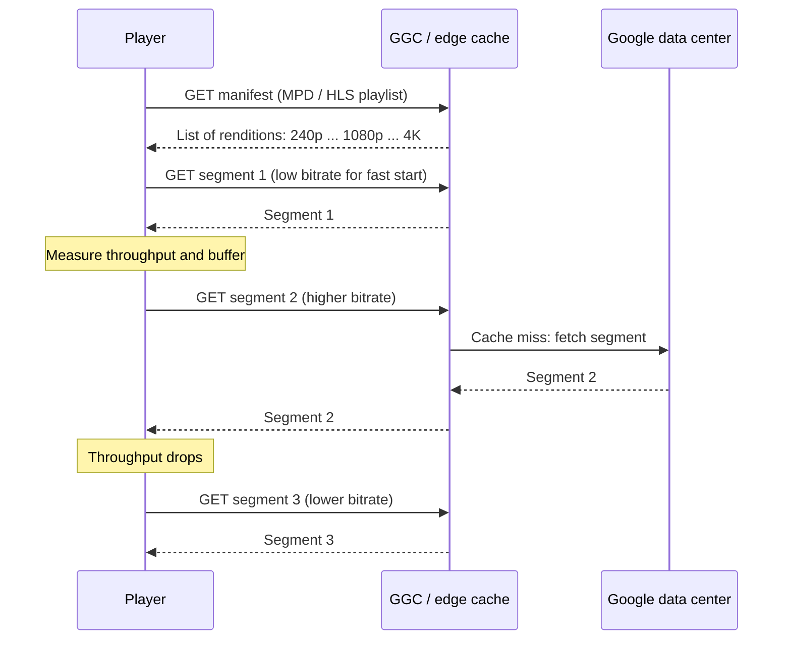
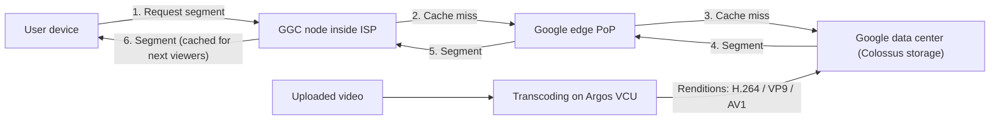

[Русский](./Readme.md) | **English**

# Chapter 14: Design YouTube

## Introduction
YouTube is a massive video streaming platform supporting video uploads, playback, and various interactions. This chapter focuses on designing a scalable video streaming system with the following core features:
- **Fast video uploads**
- **Smooth video streaming**
- **Ability to change video quality**
- **Low infrastructure cost**
- **High availability and reliability**

### Key Statistics (2020)
- **2 billion monthly active users**
- **5 billion videos watched per day**
- **37% of mobile internet traffic comes from YouTube**
- Available in **80 languages**
- **$15.1 billion ad revenue** in 2019

---

## Step 1: Understand the Problem and Scope

### Core Functionalities
1. Upload videos
2. Watch videos

### Supported Platforms
- Mobile apps, web browsers, and smart TVs

### Assumptions
- **Daily Active Users (DAU):** 5 million
- **Average Video Size:** 300 MB
- **Upload Limits:** Max 1 GB per video
- **Daily Storage Need:** 150 TB
- **CDN Costs:** 5 million * 5 videos * 0.3GB * $0.02 =  $150,000/day (using Amazon CloudFront)

---

## Step 2: High-Level Design

### Components

    

1. **Client:** Devices like smartphones, computers, and TVs.
2. **CDN (Content Delivery Network):** Stores and streams videos.
3. **API Servers:** Handles all user interactions except video streaming (e.g., uploads, metadata updates).
4. **Metadata Database:** Stores video metadata (e.g., title, description, size).
5. **Original Storage:** Blob storage for uploaded videos.
6. **Transcoding Servers:** Convert videos into multiple resolutions and formats.
7. **Transcoded Storage:** Blob storage for transcoded videos.

---

### Core Workflows
#### 1. Video Uploading Flow
- **Parallel Processes:**
  1. Upload video to original storage.
  2. Update video metadata in the database.

- **Video Upload (Steps):**

    

        
    

    - [1] Videos are uploaded to blob storage. 
    - [2] Transcoding servers convert videos to multiple formats.
    - [3] One trasncoding is complete, following two steps are exectued in parallel.
        - [3a] Transcoded videos are sent to transcoded storage.
        - [3b] Transcoding completion events are queued in the completion queue. 
    - [3a.1] Videos are distributed to the CDN. 
    - [3b.1] Completion handlers update metadata and inform users. 

- **Metadata Upload (Steps):**

    

        
    

    - The client in parallel sends a request to update the video metadata 
    - The request contains video metadata, including file name, size, format, etc.
    
       

#### 2. Video Streaming Flow

  

- Videos are streamed directly from the CDN using edge servers to minimize latency.
- Some of te popular streaming protocols are MPEG_DASH, Apple HLS, Adobe HDS.
-  *Different streaming protocols support different video encodings and playback players.*

---

## Step 3: Design Deep Dive

### Video Transcoding
#### Importance
1. Raw video consumes large amounts of storage space. It Reduces storage space.
2. Ensures compatibility across devices and browsers.
3. Adapts video quality to network conditions.

#### Components
- **Container:** Encapsulates video, audio, and metadata (e.g., MP4, AVI).
- **Codecs:** Compression and Decompression algorithms (e.g., H.264, VP9).

#### Directed Acyclic Graph (DAG) Model

    

- Transcoding a video is computationally expensive and time-consuming.
- DAG Model defines tasks like encoding, thumbnail generation, and watermarking.
- Allows high parallelism in video processing.

- The original video is split into video, audio, and metadata. 
    - Video encodings: Videos are converted to support different resolutions, codec, bitrates.
    - Thumbnail: It can either be uploaded by a user or automatically generated bythe system.
    - Watermark: Image overlay on top of your video contains identifying information about the video.

---

### Video Transcoding Architecture

1. **Preprocessor:** Splits videos into smaller chunks (GOP alignment). It has 4 responsibilities.

    

        
    

    - Video splitting: Video stream is split or further split into smaller Group of Pictures (GOP) alignment.
    - It split videos by GOP alignment for old clients.
    - It generates DAG based on configuration files client programmers write. 
    - It stores GOPs and metadata in temporary storage in case the encoding fails, the system could use persisted data for retry operations.

2. **DAG Scheduler:** Organizes tasks into sequential or parallel stages.
    

        
    

    - It splits a DAG graph into stages of tasks and puts them in the task queue in the resource manager. 
    - Stage 1: video, audio, and metadata.
    - The video file is further split into two tasks in stage 2: video encoding and thumbnail. 

3. **Resource Manager:** Responsible for managing the efficiency of resource allocation.It
contains 3 queues and a task scheduler.
    

        
    

    - Task queue: priority queue that contains tasks to be executed.
    - Worker queue: priority queue that contains worker utilization info.
    - Running queue: contains  currently running tasks and workers running the tasks.
    - Task scheduler: picks the optimal task/worker, and instructs the chosen task worker to execute the job.

4. **Task Workers:** Perform transcoding and other operations.
    

        
   

    - Different task workers may run different tasks 

5. **Temporary Storage:** Stores intermediate data for retries.
    - The choice of storage system depends on factors like data type, data size, access frequency, data life span, etc. 
6. **Output:** Transcoded videos ready for distribution.

---

## System Optimizations

### Speed Optimizations
1. **Parallel Video Uploads:** Split videos into smaller chunks for faster, resumable uploads.

    

2. **Distributed Upload Centers:** Use CDNs as upload hubs close to users.
3. **Parallel Processing:** Decouple modules using message queues for high parallelism.

    
    

### Safety Optimizations
1. **Pre-Signed URLs:** Restrict video uploads to authorized users.

    

2. **Protect Videos:**
   - **DRM Systems** (e.g., Apple FairPlay, Google Widevine).
   - **AES Encryption.**
   - **Watermarking.**

### Cost-Saving Optimizations
1. Serve only popular videos via CDN; less popular ones from high-capacity servers.
2. Encode on-demand for rarely accessed videos.
3. Regionalize video distribution based on popularity.
4. Build custom CDNs and partner with ISPs to reduce bandwidth costs.

---

## Error Handling
### Recoverable Errors
- Retry failed uploads, transcoding, or resource allocation tasks.

### Non-Recoverable Errors
- Stop malformed video processing and return error codes.

---

## Real-World YouTube Architecture

The design above is a textbook answer. This section looks at what YouTube actually built, based on public sources: the early architecture, the database layer that grew into Vitess, and the modern delivery and transcoding stack on Google infrastructure. Many book recommendations map directly to real decisions YouTube made.

### Early Architecture (2005–2007)

The best-known description of early YouTube is the highscalability.com article "YouTube Architecture" (2008). At that time YouTube served **over 100 million videos per day**, growing from 30 million views/day in March 2006 to 100 million in July 2006. The team was very small: 2 sysadmins, 2 scalability architects, 2 feature developers, 2 network engineers and 1 DBA.

#### Stack
- **OS:** Linux (SuSE).
- **Web tier:** Apache with mod_fast_cgi in front of Python application servers; **NetScaler** for load balancing.
- **Language:** Python. The Python web code was usually not the bottleneck: it spent most of its time blocked on RPCs, and page service times were usually **under 100 ms**.
- **psyco**, a dynamic Python-to-C JIT compiler, and C extensions were used for CPU-intensive parts.
- **Video serving:** **lighttpd** replaced Apache because Apache had too much overhead for serving large media files.
- **Database:** MySQL.

#### Serving Video
- Each video was hosted by a **mini-cluster** of several machines, which gave redundancy and let more than one machine serve the same video.
- **Popular content was moved to a CDN** (third-party content delivery networks), which replicate content in many places close to users.
- **Less popular content** (roughly 1–20 views per day) was served from YouTube's own servers in colocation sites. Such requests cause a lot of random disk access, so the team tuned RAID controllers and the amount of memory on each machine.
- In total YouTube ran **5 or 6 data centers plus the CDN**.

This is exactly the book's "serve only popular videos via CDN" optimization.

#### Thumbnails
Thumbnails turned out to be surprisingly hard to scale:
- There are about **4 thumbnails per video**, each a tiny file.
- Serving a huge number of small files causes many disk seeks and problems with **inode caches and page caches** in the OS.
- They also hit the **per-directory file limit** (ext3 in particular) and had to move to a more hierarchical directory layout.
- **Squid** was placed as a reverse proxy in front of Apache; it worked for a while, but performance degraded as load grew. **lighttpd** was tried too, but in single-threaded mode it stalled, and in multi-process mode each process kept a separate cache.
- The final solution was Google's **BigTable**: it clumps small files together, avoids the small-file problem, provides a distributed multilevel cache and works across several colocation sites.

#### Databases
The database layer went through three stages:
1. **Monolithic MySQL** on a single RAID 10 volume with 10 disks. MySQL stored only metadata (users, tags, descriptions), not the videos themselves.
2. **Master–slave replication**: one master for writes and read replicas (slaves). Replication was asynchronous and slaves were single-threaded and usually ran on weaker machines, so they could **lag significantly behind** the master. Updates caused cache misses, and slow disk I/O made replication even slower. The team split replicas into pools: watching videos got the most resources, while less important social features were routed to a less capable cluster.
3. **Sharding (partitioning) by user**: users were assigned to different shards. This spread writes and reads, gave much better cache locality (less I/O), eliminated replica lag and, according to the article, reduced hardware by **30%**.

#### Lessons Learned
- **Keep it simple**: simple code is easy to rearchitect when the next bottleneck appears.
- **Prioritize**: know what is essential to the service (watching videos) and give it the best resources.
- **Outsource** when it makes sense (e.g. a CDN for popular content).
- **Iterate on bottlenecks** at every level: software, OS, hardware.

### Scaling MySQL with Vitess

Manual sharding solved the capacity problem but pushed database routing logic into the application code. To fix this, YouTube created **Vitess** in **2010**. According to the Vitess documentation, YouTube went through the classic path: primary + replica → more replicas as reads grew → sharding when writes outgrew a single primary. Vitess replaced routing logic in the app with **a proxy between the application and the database**.

Vitess solves several problems at once:
- **Connection pooling:** multiplexes many front-end application queries onto a pool of MySQL connections, protecting MySQL from connection storms.
- **Query routing:** the **VTGate** proxy speaks the MySQL protocol, so the app works as if with one database, while VTGate routes each query to the right shard.
- **Resharding:** supports several sharding schemes, vertical and horizontal sharding, and "virtually seamless dynamic re-sharding" — the number of shards can be scaled up or down without rewriting the application.
- **Database protection and cluster management:** rewrites problematic queries, enforces limits, and handles failovers, backups and topology changes.

With Vitess, YouTube "scaled its user base by a factor of more than 50", and older docs state that Vitess "served all YouTube database traffic for over five years". Vitess became open source; it was accepted into the **CNCF** as an incubating project in **February 2018** and became the **eighth CNCF project to graduate** in **November 2019**.

### Modern Video Delivery

#### Adaptive Bitrate Streaming
A modern player does not download one big file. The video is transcoded into a **bitrate ladder** — several renditions of the same video at different resolutions and bitrates — and each rendition is cut into short **segments**. A **manifest** (MPD in DASH, playlist in HLS) lists the available renditions and segments. The player measures throughput and buffer level and, **segment by segment**, requests the rendition that the network can sustain. This is **adaptive bitrate (ABR)** streaming over plain HTTP, so it works through ordinary caches.

YouTube's own developer documentation for DASH (live ingestion) gives a feel for the parameters: media segments **between 1 and 5 seconds**, GOP size **about 2 seconds**, MP4 with H.264/AAC or WebM with VP8/VP9 and Vorbis/Opus. The GOP alignment from the book's preprocessor matters here: a segment must start with a key frame so the player can switch renditions at segment boundaries.

#### Codecs: H.264 → VP9 → AV1
- **H.264 (AVC)** is the legacy codec supported by almost every device.
- **VP9** gives better quality at the same bitrate, but according to YouTube it "uses 5x more computer resources to encode" than H.264.
- **AV1** "compresses more efficiently than VP9, and has an even higher computation load to encode".

Since better codecs are much more expensive to encode, encoding every video in every codec does not pay off. Independent observations (Jan Ozer, Streaming Learning Center) show that YouTube chooses codecs by popularity: low-view videos are served in H.264, more popular ones in VP9, and AV1 was first observed on the most-viewed videos (millions of views); by 2022 the same author noted that AV1 had spread to much less popular videos. This is the book's "encode on demand for rarely accessed videos" idea applied to codecs: expensive encoding is spent where it saves the most bandwidth.

#### Google Global Cache
YouTube runs on Google's edge network, which has three tiers:
- **Data centers** in the Americas, Europe and Asia for computation and backend storage.
- **Edge Points of Presence (PoPs)**, where Google's network peers with the rest of the internet — at **over 100 interconnection facilities** worldwide.
- **Edge nodes — Google Global Cache (GGC)**: Google-supplied servers deployed **inside ISP networks**, the tier closest to users. Popular static content such as YouTube and Google Play is cached there, and Google's traffic management directs each request to the best location.

According to Google, **typically 70–90% of cacheable traffic** can be served from GGC, which reduces the ISP's external traffic and congestion; GGC is transparent to users and fails over automatically. This is the book's "build custom CDNs and partner with ISPs" optimization at planetary scale.

### Transcoding at Scale: Argos VCU

The book's transcoding servers are generic CPU workers. YouTube went further and built its own hardware. More than **500 hours of video** are uploaded to YouTube every minute on average, and each upload must be transcoded into many formats and resolutions for different devices and networks.

In 2021 YouTube publicly described **Argos**, its **Video (trans)Coding Unit (VCU)**: a custom chip (ASIC) for transcoding video, plus software that coordinates these chips. Key facts:
- The project started in **2015**; the design was presented at the **ASPLOS 2021** conference in the paper "Warehouse-Scale Video Acceleration: Co-design and Deployment in the Wild".
- Compared with the previous optimized system running software encoders on traditional servers, VCUs give **up to 20–33x improvement in compute efficiency**.
- Each Argos chip has **10 video-processing cores**, and **two chips** are placed on each board.
- Processing a 4K video takes **hours instead of days**.
- The first generation focuses on **VP9**; a follow-up chip adds **AV1**.
- The accelerator was **co-designed with the distributed software system** around it, which, per the paper, helps adapt to changing bottlenecks and handle errors.

Why this matters: VP9 and AV1 are several times more expensive to encode than H.264. Hardware transcoding makes it affordable to encode more videos in efficient codecs, and to do it faster.

### Storage on Google Infrastructure

Public information about YouTube's current storage internals is limited. What Google has confirmed:
- **Colossus**, Google's cluster-level file system and the successor to GFS, "underpins Google's most popular products, supporting globally available services like YouTube, Drive, and Gmail". A single Colossus cluster scales to exabytes of storage and tens of thousands of machines.
- Colossus stores its **file system metadata in Bigtable**; this let it scale over 100x beyond the largest GFS clusters.
- **Bigtable** was used for YouTube thumbnails already in the early days (see above).
- Google describes **Spanner** as one of the core building blocks of its storage stack, but no official source opened for this section describes how YouTube uses it, so we do not make claims about it here.

### Book Design vs. YouTube

| Book design (this chapter) | How YouTube did it |
|---|---|
| Metadata DB with replication and sharding | MySQL master–slave → sharding by user → Vitess (connection pooling, VTGate routing, resharding) |
| Blob storage for original and transcoded videos | Early: mini-clusters in own colocation sites; today: Google storage built on Colossus |
| Transcoding servers with DAG and task workers | Transcoding on custom Argos VCU chips, 20–33x more efficient than the previous CPU-based system |
| Thumbnails generated in the DAG and stored in blob storage | Tiny files caused inode/directory problems; moved to BigTable |
| CDN for streaming | Early: third-party CDN for popular videos; today: Google edge network + GGC inside ISPs |
| Serve only popular videos via CDN | Exactly this: videos with 1–20 views/day served from own servers |
| Build custom CDN and partner with ISPs | GGC: Google servers in ISP networks, 70–90% of cacheable traffic served locally |
| Encode on demand for rarely accessed videos | Codec choice by popularity: H.264 for the long tail, VP9/AV1 for popular videos |
| Streaming protocols (MPEG-DASH, HLS) | DASH/HLS with adaptive bitrate: segments, manifest, bitrate ladder |

### References

* [YouTube Architecture (High Scalability)](http://highscalability.com/youtube-architecture)
* [Vitess: History](https://vitess.io/docs/overview/history/)
* [Vitess: What Is Vitess](https://vitess.io/docs/overview/whatisvitess/)
* [Vitess: What Is Vitess (v12.0 docs archive)](https://vitess.io/docs/archive/12.0/overview/whatisvitess/)
* [Reimagining video infrastructure to empower YouTube (YouTube Official Blog)](https://blog.youtube/inside-youtube/new-era-video-infrastructure/)
* [Warehouse-Scale Video Acceleration: Co-design and Deployment in the Wild (Google Research, ASPLOS 2021)](https://research.google/pubs/warehouse-scale-video-acceleration-co-design-and-deployment-in-the-wild/)
* [Delivering Live YouTube Content via DASH (YouTube Live Streaming API)](https://developers.google.com/youtube/v3/live/guides/encoding-with-dash)
* [Which Codecs Does YouTube Use? (Streaming Learning Center)](https://streaminglearningcenter.com/codecs/which-codecs-does-youtube-use.html)
* [Google-developed 'Argos' VCU chip helps YouTube process videos (9to5Google)](https://9to5google.com/2021/04/22/youtube-google-custom-chip/)
* [Google Edge Network: Infrastructure (peering.google.com)](https://peering.google.com/#/infrastructure)
* [Introduction to GGC (Google Interconnect Help)](https://support.google.com/interconnect/answer/9058809)
* [A peek behind Colossus, Google's file system (Google Cloud Blog)](https://cloud.google.com/blog/products/storage-data-transfer/a-peek-behind-colossus-googles-file-system)
