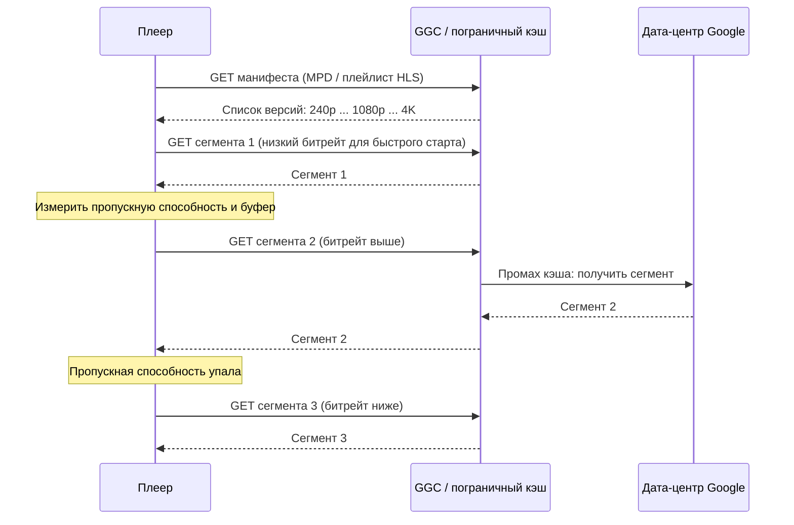
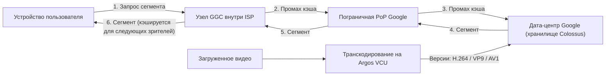

**Русский** | [English](./Readme.en.md)

# Глава 14: Проектирование YouTube

## Введение
YouTube — огромная платформа потокового видео, поддерживающая загрузку и воспроизведение видео, а также различные виды взаимодействия. В этой главе мы спроектируем масштабируемую систему потокового видео со следующими ключевыми возможностями:
- **Быстрая загрузка видео**
- **Плавное потоковое воспроизведение**
- **Возможность менять качество видео**
- **Низкая стоимость инфраструктуры**
- **Высокая доступность и надёжность**

### Ключевая статистика (2020)
- **2 миллиарда активных пользователей в месяц**
- **5 миллиардов просмотров видео в день**
- **37% мобильного интернет-трафика приходится на YouTube**
- Доступен на **80 языках**
- **$15.1 млрд доходов от рекламы** в 2019 году

---

## Шаг 1: Понимание задачи и определение границ

### Основная функциональность
1. Загрузка видео
2. Просмотр видео

### Поддерживаемые платформы
- Мобильные приложения, веб-браузеры и смарт-ТВ

### Допущения
- **Активные пользователи в день — DAU (Daily Active Users — число уникальных пользователей за день):** 5 миллионов
- **Средний размер видео:** 300 МБ
- **Ограничения на загрузку:** не более 1 ГБ на видео
- **Ежедневная потребность в хранилище:** 150 ТБ
- **Стоимость CDN (Content Delivery Network — сеть доставки контента, географически распределённые серверы, отдающие контент ближе к пользователю):** 5 million * 5 videos * 0.3GB * $0.02 =  $150,000/day (при использовании Amazon CloudFront)

---

## Шаг 2: Высокоуровневый дизайн

### Компоненты

    

1. **Клиент:** устройства — смартфоны, компьютеры и телевизоры.
2. **CDN:** хранит видео и транслирует их.
3. **API-серверы (API — Application Programming Interface, программный интерфейс приложения):** обрабатывают все действия пользователей, кроме потоковой передачи видео (например, загрузку, обновление метаданных).
4. **База данных метаданных:** хранит метаданные видео (например, название, описание, размер).
5. **Хранилище оригиналов (original storage):** blob-хранилище для загруженных видео.
6. **Серверы транскодирования (transcoding servers):** преобразуют видео в различные разрешения и форматы.
7. **Хранилище транскодированных видео (transcoded storage):** blob-хранилище для транскодированных видео.

---

### Основные процессы
#### 1. Процесс загрузки видео
- **Параллельные процессы:**
  1. Загрузка видео в хранилище оригиналов.
  2. Обновление метаданных видео в базе данных.

- **Загрузка видео (шаги):**

    

        
    

    - [1] Видео загружаются в blob-хранилище. 
    - [2] Серверы транскодирования преобразуют видео в различные форматы.
    - [3] После завершения транскодирования параллельно выполняются два шага.
        - [3a] Транскодированные видео отправляются в хранилище транскодированных видео.
        - [3b] События о завершении транскодирования помещаются в очередь завершения (completion queue). 
    - [3a.1] Видео распространяются в CDN. 
    - [3b.1] Обработчики завершения (completion handlers) обновляют метаданные и уведомляют пользователей. 

- **Загрузка метаданных (шаги):**

    

        
    

    - Параллельно клиент отправляет запрос на обновление метаданных видео. 
    - Запрос содержит метаданные видео, включая имя файла, размер, формат и т. д.
    
       

#### 2. Процесс потокового воспроизведения видео

  

- Видео транслируются напрямую из CDN через пограничные серверы (edge servers), чтобы минимизировать задержку.
- Среди популярных протоколов потоковой передачи — MPEG_DASH (MPEG Dynamic Adaptive Streaming over HTTP — динамическая адаптивная потоковая передача по HTTP; HTTP — HyperText Transfer Protocol, протокол передачи гипертекста), Apple HLS (HTTP Live Streaming — потоковая передача по HTTP), Adobe HDS (HTTP Dynamic Streaming — динамическая потоковая передача по HTTP).
-  *Разные протоколы потоковой передачи поддерживают разные кодировки видео и разные плееры.*

---

## Шаг 3: Детальный разбор дизайна

### Транскодирование видео
#### Зачем оно нужно
1. Необработанное видео занимает много места в хранилище. Транскодирование сокращает требуемый объём.
2. Обеспечивает совместимость с разными устройствами и браузерами.
3. Адаптирует качество видео к условиям сети.

#### Составляющие
- **Контейнер (container):** объединяет видео, аудио и метаданные (например, MP4, AVI).
- **Кодеки (codecs):** алгоритмы сжатия и распаковки (например, H.264, VP9).

#### Модель ориентированного ациклического графа (Directed Acyclic Graph, DAG)

    

- Транскодирование видео требует больших вычислительных ресурсов и времени.
- Модель DAG описывает такие задачи, как кодирование, генерация миниатюр и наложение водяных знаков.
- Обеспечивает высокую степень параллелизма при обработке видео.

- Исходное видео разделяется на видео, аудио и метаданные. 
    - Кодирование видео: видео преобразуются для поддержки разных разрешений, кодеков и битрейтов.
    - Миниатюра (thumbnail): может быть загружена пользователем или автоматически сгенерирована системой.
    - Водяной знак (watermark): изображение, накладываемое поверх видео и содержащее идентифицирующую информацию о нём.

---

### Архитектура транскодирования видео

1. **Препроцессор (preprocessor):** разбивает видео на более мелкие фрагменты (с выравниванием по GOP — Group of Pictures, группа кадров, которая может декодироваться независимо от остальных). У него 4 обязанности.

    

        
    

    - Разбиение видео: видеопоток разбивается или дополнительно дробится на более мелкие фрагменты с выравниванием по GOP.
    - Для старых клиентов препроцессор разбивает видео с выравниванием по GOP.
    - Генерирует DAG на основе конфигурационных файлов, которые пишут программисты на стороне клиента. 
    - Сохраняет GOP и метаданные во временное хранилище, чтобы при сбое кодирования система могла использовать сохранённые данные для повторных попыток.

2. **Планировщик DAG (DAG scheduler):** организует задачи в последовательные или параллельные этапы.
    

        
    

    - Разбивает граф DAG на этапы задач и помещает их в очередь задач менеджера ресурсов. 
    - Этап 1: видео, аудио и метаданные.
    - На этапе 2 видеофайл дополнительно разбивается на две задачи: кодирование видео и генерацию миниатюры. 

3. **Менеджер ресурсов (resource manager):** отвечает за эффективное распределение ресурсов.
Он содержит 3 очереди и планировщик задач.
    

        
    

    - Очередь задач (task queue): очередь с приоритетами, содержащая задачи к выполнению.
    - Очередь воркеров (worker queue): очередь с приоритетами, содержащая информацию о загрузке воркеров.
    - Очередь выполнения (running queue): содержит выполняющиеся в данный момент задачи и воркеры, которые их выполняют.
    - Планировщик задач (task scheduler): выбирает оптимальную пару задача/воркер и поручает выбранному воркеру выполнить задание.

4. **Воркеры задач (task workers):** выполняют транскодирование и другие операции.
    

        
   

    - Разные воркеры могут выполнять разные задачи. 

5. **Временное хранилище (temporary storage):** хранит промежуточные данные для повторных попыток.
    - Выбор системы хранения зависит от таких факторов, как тип данных, их объём, частота доступа, срок жизни данных и т. д. 
6. **Результат (output):** транскодированные видео, готовые к распространению.

---

## Оптимизации системы

### Оптимизация скорости
1. **Параллельная загрузка видео:** разбиение видео на небольшие фрагменты для более быстрой загрузки с возможностью её возобновления.

    

2. **Распределённые центры загрузки:** использование CDN в качестве узлов загрузки, расположенных близко к пользователям.
3. **Параллельная обработка:** развязка модулей с помощью очередей сообщений для достижения высокой степени параллелизма.

    
    

### Оптимизация безопасности
1. **Предподписанные URL (pre-signed URLs; URL — Uniform Resource Locator, адрес ресурса):** загружать видео могут только авторизованные пользователи.

    

2. **Защита видео:**
   - **DRM-системы** (DRM — Digital Rights Management, управление цифровыми правами; например, Apple FairPlay, Google Widevine).
   - **Шифрование AES** (Advanced Encryption Standard — стандарт симметричного блочного шифрования).
   - **Водяные знаки.**

### Оптимизация затрат
1. Раздавать через CDN только популярные видео, а менее популярные — с высокоёмких серверов.
2. Кодировать редко запрашиваемые видео по требованию.
3. Регионализировать распространение видео в зависимости от популярности.
4. Строить собственные CDN и сотрудничать с интернет-провайдерами — ISP (Internet Service Provider — поставщик интернет-услуг) — для снижения затрат на трафик.

---

## Обработка ошибок
### Восстановимые ошибки
- Повторять неудавшиеся загрузки, транскодирование или задачи выделения ресурсов.

### Невосстановимые ошибки
- Прекращать обработку повреждённого видео и возвращать коды ошибок.

---

## Реальная архитектура YouTube

Дизайн выше — учебный ответ. В этом разделе разберём, что YouTube построил на самом деле, по публичным источникам: раннюю архитектуру, слой баз данных, из которого вырос Vitess, и современный стек доставки и транскодирования на инфраструктуре Google. Многие рекомендации книги напрямую соответствуют реальным решениям YouTube.

### Ранняя архитектура (2005–2007)

Самое известное описание раннего YouTube — статья «YouTube Architecture» на highscalability.com (2008). В то время YouTube отдавал **более 100 миллионов видео в день**: рост с 30 миллионов просмотров в день в марте 2006 года до 100 миллионов в июле 2006 года. Команда была очень маленькой: 2 системных администратора, 2 архитектора по масштабируемости, 2 разработчика функциональности, 2 сетевых инженера и 1 DBA (Database Administrator — администратор баз данных).

#### Стек
- **ОС (операционная система):** Linux (SuSE).
- **Веб-уровень:** Apache с модулем mod_fast_cgi перед серверами приложений на Python; **NetScaler** для балансировки нагрузки.
- **Язык:** Python. Веб-код на Python обычно не был узким местом: большую часть времени он ждал ответов на RPC (Remote Procedure Call — удалённый вызов процедур), а время обслуживания страницы обычно было **меньше 100 мс**.
- **psyco** — динамический JIT-компилятор (Just-In-Time — компиляция «на лету») из Python в C — и расширения на C использовались для частей, нагружающих процессор.
- **Раздача видео:** **lighttpd** заменил Apache, потому что у Apache были слишком большие накладные расходы при раздаче больших медиафайлов.
- **База данных:** MySQL (реляционная СУБД с открытым исходным кодом; СУБД — система управления базами данных).

#### Раздача видео
- Каждое видео размещалось на **мини-кластере (mini-cluster)** из нескольких машин: это давало избыточность и позволяло отдавать одно видео с нескольких машин.
- **Популярный контент переносили в CDN** (сторонние сети доставки контента), которые реплицируют контент во множество мест рядом с пользователями.
- **Менее популярный контент** (примерно 1–20 просмотров в день) отдавался с собственных серверов YouTube в колокейшн-площадках (colocation). Такие запросы порождают много случайных обращений к диску, поэтому команда настраивала RAID-контроллеры (RAID — Redundant Array of Independent Disks, избыточный массив независимых дисков) и объём памяти на каждой машине.
- Всего у YouTube было **5 или 6 дата-центров плюс CDN**.

Это ровно та оптимизация из книги: «раздавать через CDN только популярные видео».

#### Миниатюры
Масштабировать миниатюры (thumbnails) оказалось на удивление сложно:
- На каждое видео приходится около **4 миниатюр**, и каждая — крошечный файл.
- Раздача огромного числа мелких файлов вызывает множество перемещений головки диска (disk seeks) и проблемы с **кэшем inode и страничным кэшем (page cache)** ОС.
- Команда также упёрлась в **ограничение на число файлов в каталоге** (особенно в ext3) и перешла к более иерархической структуре каталогов.
- Перед Apache поставили **Squid** в роли обратного прокси (reverse proxy); какое-то время это работало, но с ростом нагрузки производительность падала. Пробовали и **lighttpd**, но в однопоточном режиме он зависал, а в многопроцессном каждый процесс держал отдельный кэш.
- Итоговым решением стал **BigTable** от Google: он группирует мелкие файлы вместе, избавляя от проблемы мелких файлов, предоставляет распределённый многоуровневый кэш и работает между несколькими колокейшн-площадками.

#### Базы данных
Слой баз данных прошёл три стадии:
1. **Монолитный MySQL** на одном томе RAID 10 из 10 дисков. MySQL хранил только метаданные (пользователи, теги, описания), но не сами видео.
2. **Репликация master–slave (ведущий–ведомый)**: один master для записи и реплики (slaves) для чтения. Репликация была асинхронной, реплики обрабатывали её в один поток и обычно работали на более слабых машинах, поэтому могли **сильно отставать** от master. Обновления вызывали промахи кэша, и медленный дисковый ввод-вывод — I/O (Input/Output) — ещё больше замедлял репликацию. Команда разделила реплики на пулы: просмотр видео получал больше всего ресурсов, а менее важные социальные функции направлялись в менее мощный кластер.
3. **Шардирование (sharding, partitioning) по пользователям**: пользователи распределялись по разным шардам. Это разнесло запись и чтение, дало гораздо лучшую локальность кэша (меньше I/O), устранило отставание реплик и, по данным статьи, сократило количество оборудования на **30%**.

#### Извлечённые уроки
- **Сохраняйте простоту**: простой код легко перепроектировать, когда появляется очередное узкое место.
- **Расставляйте приоритеты**: понимайте, что для сервиса главное (просмотр видео), и отдавайте этому лучшие ресурсы.
- **Используйте внешние сервисы (outsourcing)**, когда это оправдано (например, CDN для популярного контента).
- **Итеративно устраняйте узкие места** на всех уровнях: ПО, ОС, оборудование.

### Масштабирование MySQL с помощью Vitess

Ручное шардирование решило проблему ёмкости, но перенесло логику маршрутизации запросов к базе данных в код приложения. Чтобы исправить это, YouTube в **2010 году** создал **Vitess**. Согласно документации Vitess, YouTube прошёл классический путь: primary + реплика → больше реплик по мере роста чтения → шардирование, когда запись перестала помещаться на один primary. Vitess заменил логику маршрутизации в приложении на **прокси между приложением и базой данных**.

Vitess решает сразу несколько задач:
- **Пул соединений (connection pooling):** мультиплексирует множество запросов фронтенд-приложений на пул соединений MySQL, защищая MySQL от лавины подключений.
- **Маршрутизация запросов (query routing):** прокси **VTGate** говорит по протоколу MySQL, поэтому приложение работает как будто с одной базой, а VTGate направляет каждый запрос в нужный шард.
- **Решардинг (resharding):** поддержка разных схем шардирования, вертикального и горизонтального шардирования и «практически бесшовного динамического решардинга» (virtually seamless dynamic re-sharding) — число шардов можно увеличивать или уменьшать без переписывания приложения.
- **Защита базы данных и управление кластером:** переписывание проблемных запросов, соблюдение лимитов, а также обработка отказов (failover), резервных копий и изменений топологии.

С Vitess YouTube «увеличил пользовательскую базу более чем в 50 раз», а в более старой документации сказано, что Vitess «обслуживал весь трафик баз данных YouTube более пяти лет». Vitess стал проектом с открытым исходным кодом; в **феврале 2018 года** его приняли в CNCF (Cloud Native Computing Foundation — фонд облачных нативных вычислений) как инкубационный проект, а в **ноябре 2019 года** он стал **восьмым выпустившимся (graduated) проектом CNCF**.

### Современная доставка видео

#### Потоковая передача с адаптивным битрейтом
Современный плеер не скачивает один большой файл. Видео транскодируется в **лестницу битрейтов (bitrate ladder)** — несколько версий (renditions) одного видео с разными разрешениями и битрейтами, — и каждая версия нарезается на короткие **сегменты (segments)**. **Манифест (manifest)** — MPD (Media Presentation Description — описание медиапрезентации) в DASH, плейлист в HLS — перечисляет доступные версии и сегменты. Плеер измеряет пропускную способность и заполненность буфера и **для каждого сегмента** запрашивает ту версию, которую выдержит сеть. Это потоковая передача с **адаптивным битрейтом — ABR (Adaptive Bitrate)** — поверх обычного HTTP, поэтому она работает через обычные кэши.

Собственная документация YouTube для разработчиков по DASH (приём прямых трансляций) даёт представление о параметрах: медиасегменты **от 1 до 5 секунд**, размер GOP **около 2 секунд**, MP4 с H.264/AAC (Advanced Audio Coding — аудиокодек) или WebM с VP8/VP9 и Vorbis/Opus. Здесь важно выравнивание по GOP из препроцессора книги: сегмент должен начинаться с ключевого кадра, чтобы плеер мог переключать версии на границах сегментов.

#### Кодеки: H.264 → VP9 → AV1
- **H.264 (AVC — Advanced Video Coding)** — устаревший кодек, который поддерживает почти любое устройство.
- **VP9** даёт лучшее качество при том же битрейте, но, по словам YouTube, «требует в 5 раз больше вычислительных ресурсов для кодирования», чем H.264.
- **AV1** «сжимает эффективнее VP9 и требует ещё больше вычислений для кодирования».

Поскольку более совершенные кодеки гораздо дороже в кодировании, кодировать каждое видео в каждом кодеке невыгодно. Независимые наблюдения (Jan Ozer, Streaming Learning Center) показывают, что YouTube выбирает кодек в зависимости от популярности: видео с малым числом просмотров отдаются в H.264, более популярные — в VP9, а AV1 сначала наблюдался на самых просматриваемых видео (миллионы просмотров); к 2022 году тот же автор отметил, что AV1 распространился и на гораздо менее популярные видео. Это идея книги «кодировать редко запрашиваемые видео по требованию», применённая к кодекам: дорогое кодирование тратится там, где оно экономит больше всего трафика.

#### Google Global Cache
YouTube работает на пограничной сети (edge network) Google, у которой три уровня:
- **Дата-центры** в Северной и Южной Америке, Европе и Азии для вычислений и серверного хранения данных.
- **Пограничные точки присутствия — PoP (Points of Presence)**, где сеть Google стыкуется (peering) с остальным интернетом, — более чем на **100 площадках межсетевого взаимодействия** по всему миру.
- **Пограничные узлы — GGC (Google Global Cache)**: серверы, которые Google поставляет и которые размещаются **внутри сетей ISP**, — ближайший к пользователям уровень. Там кэшируется популярный статический контент, например YouTube и Google Play, а система управления трафиком Google направляет каждый запрос в наилучшее место.

По данным Google, **обычно 70–90% кэшируемого трафика** можно отдавать из GGC, что снижает внешний трафик провайдера и перегрузку сети; GGC прозрачен для пользователей и автоматически переключается при сбоях. Это оптимизация из книги «строить собственные CDN и сотрудничать с интернет-провайдерами» в планетарном масштабе.

### Транскодирование в масштабе: Argos VCU

Серверы транскодирования в книге — это обычные воркеры на CPU (Central Processing Unit — центральный процессор). YouTube пошёл дальше и построил собственное оборудование. На YouTube в среднем загружается **более 500 часов видео каждую минуту**, и каждую загрузку нужно транскодировать во множество форматов и разрешений для разных устройств и сетей.

В 2021 году YouTube публично рассказал об **Argos** — своём **VCU (Video (trans)Coding Unit — блок (транс)кодирования видео)**: собственном чипе — ASIC (Application-Specific Integrated Circuit — специализированная интегральная схема) — для транскодирования видео и программном обеспечении, координирующем работу этих чипов. Ключевые факты:
- Проект начат в **2015 году**; архитектура представлена на конференции **ASPLOS 2021** (Architectural Support for Programming Languages and Operating Systems) в статье «Warehouse-Scale Video Acceleration: Co-design and Deployment in the Wild».
- По сравнению с предыдущей оптимизированной системой, где программные кодировщики работали на обычных серверах, VCU дают **до 20–33-кратного роста вычислительной эффективности**.
- В каждом чипе Argos **10 ядер для обработки видео**, на каждой плате — **два чипа**.
- Обработка 4K-видео занимает **часы вместо дней**.
- Первое поколение ориентировано на **VP9**; следующий чип добавляет **AV1**.
- Ускоритель **проектировался совместно (co-design) с окружающей его распределённой программной системой**, что, согласно статье, помогает адаптироваться к меняющимся узким местам и обрабатывать ошибки.

Почему это важно: VP9 и AV1 в разы дороже в кодировании, чем H.264. Аппаратное транскодирование делает экономически оправданным кодирование большего числа видео в эффективных кодеках, причём быстрее.

### Хранилище на инфраструктуре Google

Публичной информации о внутреннем устройстве хранилища YouTube сегодня немного. Что Google подтвердил:
- **Colossus** — кластерная файловая система Google и преемник GFS (Google File System) — «лежит в основе самых популярных продуктов Google, поддерживая глобально доступные сервисы, такие как YouTube, Drive и Gmail». Один кластер Colossus масштабируется до эксабайт хранения и десятков тысяч машин.
- Colossus хранит **метаданные файловой системы в Bigtable**; это позволило ему масштабироваться более чем в 100 раз по сравнению с крупнейшими кластерами GFS.
- **Bigtable** использовался для миниатюр YouTube ещё в ранние годы (см. выше).
- Google называет **Spanner** одним из базовых строительных блоков своего стека хранения, но ни один из открытых для этого раздела официальных источников не описывает, как его использует YouTube, поэтому здесь мы не делаем утверждений на этот счёт.

### Дизайн из книги и YouTube

| Дизайн из книги (эта глава) | Как это сделано в YouTube |
|---|---|
| База данных метаданных с репликацией и шардированием | MySQL master–slave → шардирование по пользователям → Vitess (пул соединений, маршрутизация через VTGate, решардинг) |
| Blob-хранилище для оригинальных и транскодированных видео | Раньше: мини-кластеры на собственных колокейшн-площадках; сейчас: хранилище Google на основе Colossus |
| Серверы транскодирования с DAG и воркерами задач | Транскодирование на собственных чипах Argos VCU, в 20–33 раза эффективнее предыдущей системы на CPU |
| Миниатюры генерируются в DAG и хранятся в blob-хранилище | Мелкие файлы вызвали проблемы с inode и каталогами; переход на BigTable |
| CDN для потокового воспроизведения | Раньше: сторонний CDN для популярных видео; сейчас: пограничная сеть Google + GGC внутри ISP |
| Раздавать через CDN только популярные видео | Именно так: видео с 1–20 просмотрами в день отдавались с собственных серверов |
| Строить собственные CDN и сотрудничать с ISP | GGC: серверы Google в сетях провайдеров, 70–90% кэшируемого трафика отдаётся локально |
| Кодировать редко запрашиваемые видео по требованию | Выбор кодека по популярности: H.264 для «длинного хвоста», VP9/AV1 для популярных видео |
| Протоколы потоковой передачи (MPEG-DASH, HLS) | DASH/HLS с адаптивным битрейтом: сегменты, манифест, лестница битрейтов |

### Источники

* [YouTube Architecture (High Scalability)](http://highscalability.com/youtube-architecture)
* [Vitess: History](https://vitess.io/docs/overview/history/)
* [Vitess: What Is Vitess](https://vitess.io/docs/overview/whatisvitess/)
* [Vitess: What Is Vitess (v12.0 docs archive)](https://vitess.io/docs/archive/12.0/overview/whatisvitess/)
* [Reimagining video infrastructure to empower YouTube (YouTube Official Blog)](https://blog.youtube/inside-youtube/new-era-video-infrastructure/)
* [Warehouse-Scale Video Acceleration: Co-design and Deployment in the Wild (Google Research, ASPLOS 2021)](https://research.google/pubs/warehouse-scale-video-acceleration-co-design-and-deployment-in-the-wild/)
* [Delivering Live YouTube Content via DASH (YouTube Live Streaming API)](https://developers.google.com/youtube/v3/live/guides/encoding-with-dash)
* [Which Codecs Does YouTube Use? (Streaming Learning Center)](https://streaminglearningcenter.com/codecs/which-codecs-does-youtube-use.html)
* [Google-developed 'Argos' VCU chip helps YouTube process videos (9to5Google)](https://9to5google.com/2021/04/22/youtube-google-custom-chip/)
* [Google Edge Network: Infrastructure (peering.google.com)](https://peering.google.com/#/infrastructure)
* [Introduction to GGC (Google Interconnect Help)](https://support.google.com/interconnect/answer/9058809)
* [A peek behind Colossus, Google's file system (Google Cloud Blog)](https://cloud.google.com/blog/products/storage-data-transfer/a-peek-behind-colossus-googles-file-system)
