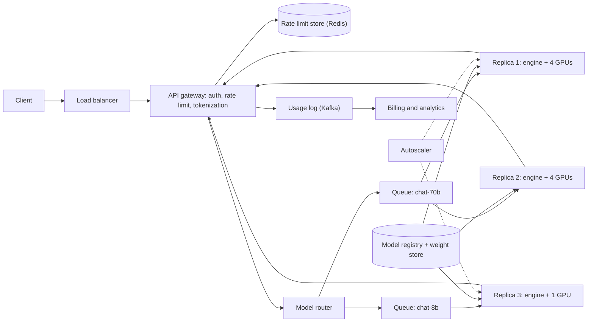
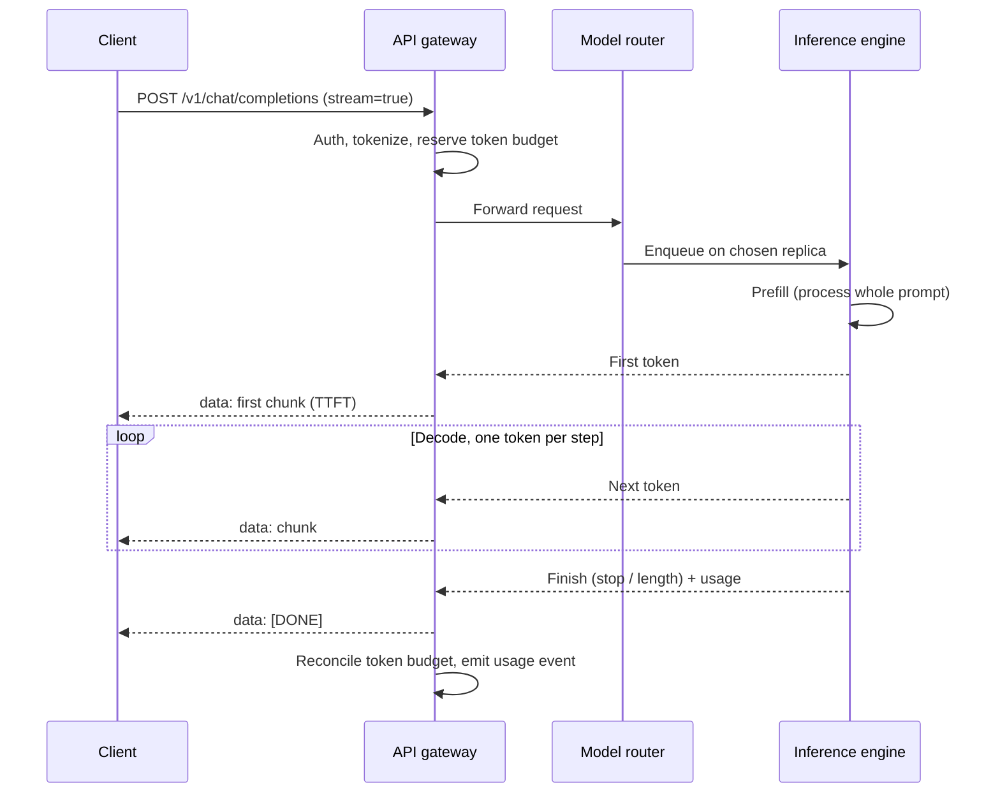
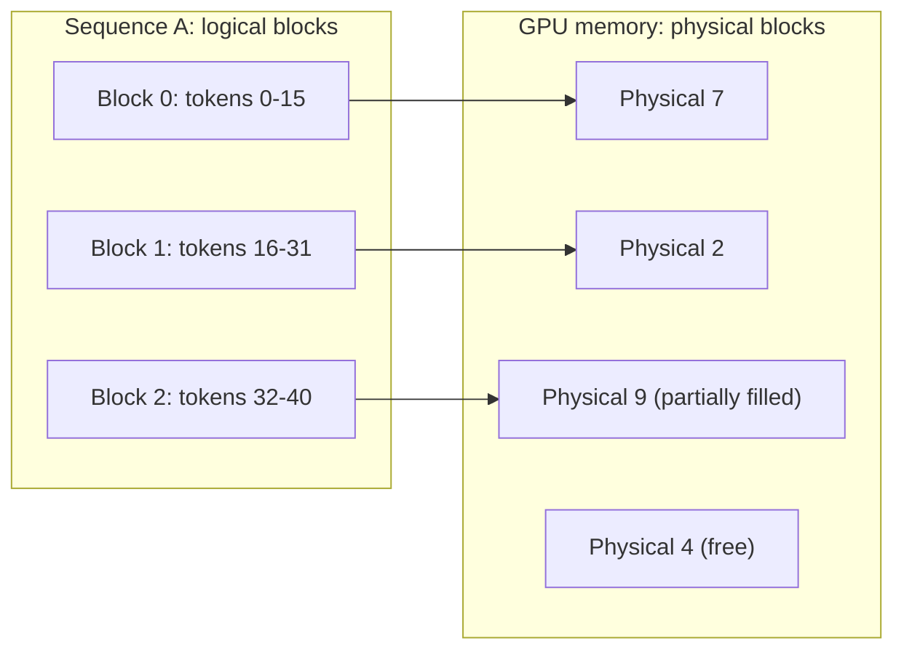
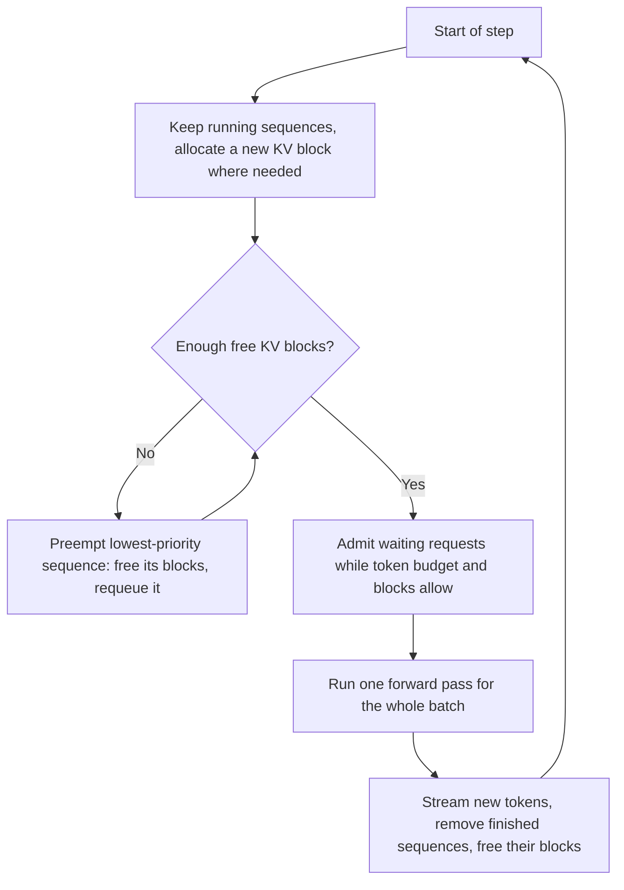

[Русский](./README.md) | **English**

# Chapter 29: Design an LLM Inference Serving System

## Introduction

In this chapter we design the backend of a ChatGPT-like API: a client sends a list of chat messages and receives the model's answer, token by token, as it is being generated.

Serving a large language model (LLM) differs from serving a typical web API in several ways:
 * **Requests are expensive and long-lived** - a single request may keep a GPU busy for tens of seconds while it generates hundreds of tokens.
 * **Output length is unknown upfront** - the model stops when it emits an end-of-sequence token or hits a limit, so we can't predict how long a request will take.
 * **The bottleneck is GPU memory**, not CPU. Model weights and per-request state (the KV cache) compete for a fixed amount of high-bandwidth memory (HBM).
 * **The hardware is scarce and costly**, so utilization directly translates into cost per token.

Most of the interesting design work is therefore not in the stateless API layer, but in how we schedule requests on GPUs.

---

## Step 1: Understand the Problem and Establish Design Scope

 * C: What does the API look like? Text completion, chat, embeddings?
 * I: Focus on chat completions. Text in, text out.
 * C: Should responses be streamed?
 * I: Yes, users should start seeing the answer as soon as possible.
 * C: Do we serve a single model or several?
 * I: Several models of different sizes. Assume the largest is a 70B-parameter model.
 * C: Is conversation history stored on the server?
 * I: No, the API is stateless - the client sends the full conversation each time.
 * C: Do we train models?
 * I: No, only inference. Models arrive from a training team as versioned checkpoints.
 * C: What about billing and rate limiting?
 * I: Customers are billed per token, and limits are expressed in tokens per minute as well as requests per minute.
 * C: What scale are we talking about?
 * I: 10 million daily active users.
 * C: Are latency targets different for interactive and batch workloads?
 * I: Good question. Interactive chat is the priority; offline batch jobs can wait.

### **Functional requirements**

 * Accept a chat request (model, messages, sampling parameters) and return generated text.
 * Stream generated tokens to the client as they are produced.
 * Support multiple models and model versions.
 * Enforce per-customer rate limits in requests and tokens.
 * Record token usage for billing.

### **Non-functional requirements**

 * **Low latency**: short time to first token (TTFT) and a steady rate of subsequent tokens (low time per output token, TPOT).
 * **High throughput / low cost**: maximize tokens generated per GPU-second.
 * **High availability**: failure of a GPU or node must not take the service down.
 * **Fairness**: one heavy customer should not starve others.
 * **Scalability**: handle daily traffic peaks by adding and removing GPU capacity.

### **Back-of-the-envelope estimation**

All numbers below are **assumptions** chosen for the exercise, not measurements of any real service.

Traffic:
 * 10M DAU, each sends 20 requests per day -> 200M requests/day
 * Average QPS = 200M / 86,400 = **~2,300 requests/s**; peak (2x) = **~4,600 requests/s**
 * Average prompt = 1,000 tokens (a chat history grows quickly), average output = 300 tokens
 * Output tokens at peak = 4,600 * 300 = **~1.4M tokens/s**
 * Input (prefill) tokens at peak = 4,600 * 1,000 = **~4.6M tokens/s**

Model memory (70B model, 16-bit weights):
 * Weights = 70B * 2 bytes = **140 GB**, more than one 80 GB GPU -> we need to shard the model, e.g. over 4 GPUs (320 GB total).
 * KV cache per token = 2 (K and V) * layers * kv_heads * head_dim * 2 bytes. For a Llama-2-70B-like architecture (80 layers, 8 KV heads with grouped-query attention, head_dim 128): 2 * 80 * 8 * 128 * 2 = **~320 KB per token**.
 * Leaving ~10% headroom for activations: 320 * 0.9 - 140 = ~148 GB, say **~140 GB for KV cache**, i.e. 140 GB / 320 KB = **~430k tokens** per 4-GPU replica.
 * With an average context of ~2k tokens (prompt + output, rounded up) -> at most **~200 concurrent sequences** per replica.

Throughput and fleet size:
 * Assume a target TPOT of 50 ms -> each sequence produces 20 tokens/s.
 * Assume a replica sustains ~150 concurrent sequences (below the ~200 memory bound) -> 150 * 20 = **~3,000 output tokens/s per replica**.
 * Replicas needed at peak = 1.4M / 3,000 = **~470 replicas** = **~1,900 GPUs** for the largest model alone.

A quick sanity check on why decode is memory-bound: every decode step must read all weights from HBM. Each GPU holds 140 / 4 = 35 GB; at ~3.35 TB/s of HBM bandwidth (H100 SXM spec) that's 35 / 3,350 = **~10 ms per step**, regardless of whether the batch has 1 or 100 sequences. Batching is what turns this fixed cost into useful throughput.

Cost per token (assumption: $2.50 per GPU-hour):
 * One replica = 4 * $2.50 = $10/hour
 * Output tokens per hour = 3,000 * 3,600 = 10.8M
 * **~$0.93 per 1M output tokens** at 100% utilization. At a realistic 50% average utilization, cost doubles. This is why batching efficiency and autoscaling are the core of the design.

---

## Step 2: Propose High-Level Design and Get Buy-In

### **API design**

We follow the widely-used OpenAI-compatible format.

```
POST /v1/chat/completions
Authorization: Bearer <api_key>

{
  "model": "chat-70b",
  "messages": [
    {"role": "system", "content": "You are a helpful assistant."},
    {"role": "user", "content": "Explain KV cache in one paragraph."}
  ],
  "max_tokens": 512,
  "temperature": 0.7,
  "stream": true
}
```

With `stream: true`, the response uses **Server-Sent Events (SSE)**: a regular HTTP response with `Content-Type: text/event-stream`, where each generated chunk is sent as a `data:` line:

```
data: {"id":"req_123","choices":[{"delta":{"content":"KV"}}]}

data: {"id":"req_123","choices":[{"delta":{"content":" cache"}}]}

data: {"id":"req_123","choices":[{"delta":{},"finish_reason":"stop"}],"usage":{"prompt_tokens":27,"completion_tokens":96}}

data: [DONE]
```

Why SSE rather than WebSockets? The traffic is one-directional (server to client) after the request is sent, SSE works over plain HTTP through existing load balancers and proxies, and it is trivial to consume from any HTTP client. If the client disconnects, the server must detect it and **cancel the generation** to free the GPU.

Supporting endpoints:
 * `GET /v1/models` - list available models.
 * `GET /v1/usage?from=..&to=..` - token usage for billing dashboards.

### **High-level design**



 * **API gateway**: stateless; authenticates API keys, validates the request, counts prompt tokens with the model's tokenizer, applies rate limits, holds the SSE connection to the client.
 * **Model router**: maps the requested model name to a pool of replicas and picks a replica (least-loaded, or with cache affinity - see deep dive).
 * **Request queue**: per-model queue with priorities (interactive vs batch) that buffers requests when all replicas are busy.
 * **Inference replica**: a group of GPUs that together hold one copy of a model, plus an **inference engine** (e.g. vLLM, TensorRT-LLM) that runs the scheduler, KV cache manager and model kernels.
 * **Model registry and weight store**: versioned checkpoints in object storage, with metadata about required GPU type and parallelism.
 * **Usage log**: every finished request emits a usage event (prompt and completion tokens) to Kafka for billing, which decouples billing from the hot path.
 * **Autoscaler**: adds/removes replicas based on queue depth and GPU-level metrics.

### **Request flow**



### **Data model**

The serving path is mostly stateless; the main persistent data is:

**Model registry** (relational DB):

| Field | Example |
|---|---|
| model_id | chat-70b |
| version | 2024-06-01 |
| weights_uri | s3://models/chat-70b/2024-06-01/ |
| gpu_type | H100-80GB |
| tensor_parallel | 4 |
| max_context | 8192 |
| status | active / canary / retired |

**Usage record** (append-only, Kafka -> data warehouse):

| Field | Description |
|---|---|
| request_id | unique id, also returned to the client |
| api_key_id | customer |
| model_id, version | what served the request |
| prompt_tokens, completion_tokens | billable counts |
| ttft_ms, total_ms | latency metrics |
| finish_reason | stop / length / cancelled / error |
| timestamp | |

**Rate limit counters** (Redis): per API key, per model, sliding-window counters of requests and tokens.

Prompt and completion *content* is not needed for serving; whether it is logged is a privacy/compliance decision.

---

## Step 3: Design Deep Dive

### **Prefill vs decode**

Generation happens in two phases with very different performance profiles:
 * **Prefill**: the model processes all prompt tokens in a single forward pass, fills the KV cache for them and produces the first output token. Many tokens are processed at once, so this is matrix-matrix math - **compute-bound**. It determines TTFT.
 * **Decode**: each subsequent step processes one new token per sequence, reading all weights and the sequence's KV cache from memory. This is matrix-vector math - **memory-bandwidth-bound**. Each step produces one token, so step time is TPOT.

End-to-end latency is roughly: `latency = TTFT + TPOT * (output_tokens - 1)`.

This split drives most of the design: decode can only be made efficient by batching many sequences into each step, and a long prefill inserted into a batch stalls every decoding sequence in it.

### **KV cache**

In a transformer, every new token attends to the keys and values of all previous tokens. Recomputing them at every step would be quadratic, so the engine caches them: the **KV cache**. Its size grows linearly with context length and number of concurrent sequences - in our estimate, ~320 KB per token, i.e. ~640 MB for a single 2k-token conversation.

GPU memory on a replica is split as: model weights (fixed) + activations/workspace (small) + KV cache (everything else). The number of sequences we can batch - and therefore throughput - is bounded by how efficiently we use the KV cache space.

### **Static vs continuous batching**

**Static (request-level) batching** groups N requests, runs them together until *all* have finished, then takes the next N. Because output lengths differ, sequences that finish early leave their slot idle until the longest one completes, and new requests wait in the queue even though capacity is free.

**Continuous batching** (iteration-level scheduling, introduced by the Orca paper) makes the scheduling decision at **every decode step**: finished sequences leave the batch immediately and waiting requests join it in the next iteration.

```mermaid
flowchart TB
    subgraph Static["Static batching"]
        S1["Step 1: A B C D"] --> S2["Step 2: A B C D"]
        S2 --> S3["Step 3: A done, B C D running, slot idle"]
        S3 --> S4["Step 4: A B done, C D running, 2 slots idle"]
        S4 --> S5["Step 5: all done, E F G H start"]
    end
    subgraph Continuous["Continuous batching"]
        C1["Step 1: A B C D"] --> C2["Step 2: A B C D"]
        C2 --> C3["Step 3: A done, E joins: E B C D"]
        C3 --> C4["Step 4: B done, F joins: E F C D"]
        C4 --> C5["Step 5: no idle slots"]
    end
```



The Anyscale benchmark reported up to 23x throughput over naive static batching when continuous batching is combined with vLLM's memory management. The exact gain depends on the spread of output lengths, but continuous batching is the default in all modern engines.

### **PagedAttention**

Early engines reserved a **contiguous** KV cache region per request sized for its maximum possible length (e.g. `max_tokens`). Since most requests stop early, this wastes memory through over-reservation and fragmentation - the vLLM authors measured that existing systems wasted **60-80%** of KV cache memory.

**PagedAttention** (vLLM) applies the operating-system idea of virtual memory paging:
 * The KV cache is divided into fixed-size **blocks** (e.g. 16 tokens each).
 * Each sequence has a **block table** mapping its logical blocks to physical blocks, which can be anywhere in GPU memory.
 * Blocks are allocated on demand as the sequence grows, so waste is limited to the last, partially-filled block (under 4% per vLLM).
 * Blocks can be **shared** between sequences with reference counting and **copy-on-write** - e.g. parallel samples of one prompt share the prompt's blocks.



The same mechanism enables **prefix caching**: blocks are indexed by a hash of their token content, so requests sharing a prefix (the same system prompt, or earlier turns of the same chat) reuse cached blocks and skip that part of prefill. This is very effective for a stateless chat API where every turn resends the whole history.

### **Scheduler and preemption**

Each engine runs a loop, once per step:



When memory runs out mid-generation (because output lengths aren't known in advance), the engine **preempts** a sequence. It either swaps its KV blocks to CPU memory or drops them and **recomputes** them later via prefill; vLLM uses recompute by default. Frequent preemption is a signal that the replica is overloaded and should feed autoscaling.

The scheduler is also where priorities live: interactive requests are admitted before batch requests, and per-customer fair-share limits prevent one customer from filling every batch.

### **Chunked prefill and prefill/decode disaggregation**

An 8k-token prompt entering a batch makes that step much slower for every sequence that is decoding, causing visible stalls in their streams (TPOT spikes). Two solutions:
 * **Chunked prefill**: split long prefills into chunks and mix them with decode steps under a per-step token budget (`max_num_batched_tokens` in vLLM). The scheduler serves decodes first and fills the remaining budget with prefill chunks. A smaller budget favors TPOT, a larger one favors TTFT.
 * **Disaggregated serving** (DistServe, Splitwise): run prefill and decode on separate GPU pools, each sized and parallelized for its phase, and transfer the KV cache from the prefill pool to the decode pool over a fast interconnect. This removes interference at the cost of KV transfer and more complex orchestration.

### **Speculative decoding**

Decode is memory-bound: verifying 5 tokens in one forward pass costs about the same as generating 1. **Speculative decoding** exploits this:
 1. A small, fast **draft model** (or extra prediction heads, or n-gram lookup in the prompt) proposes k tokens.
 2. The large **target model** checks all k in a single forward pass.
 3. The longest accepted prefix is kept, plus one token from the target model; the rest is discarded.

With the rejection-sampling scheme from Leviathan et al., the output distribution is **exactly** that of the target model; the paper reports 2-3x speedups on T5-XXL. The gain depends on the acceptance rate, and it shrinks at large batch sizes, where the GPU is no longer idle - so engines typically enable it for latency-sensitive, lightly-loaded pools.

### **Model parallelism and GPU allocation**

A 70B model doesn't fit on one GPU, and even if it did, there would be no room left for KV cache.
 * **Tensor parallelism (TP)**: split each layer's matrices across GPUs (Megatron-LM style); every layer needs an all-reduce, so it requires a fast interconnect (NVLink) and is used **within a node**. It also lowers per-token latency, because each GPU reads only its slice of the weights.
 * **Pipeline parallelism (PP)**: place consecutive groups of layers on different GPUs or nodes. Communication is lighter (only activations between stages), so it works **across nodes**, but it creates pipeline bubbles and does not reduce single-request latency.
 * **Data parallelism (replicas)**: multiple independent copies of the model to scale throughput.

A typical layout: TP within a node for the model, PP only if one node is not enough, and replicas for throughput. GPU allocation is done in whole topology-aware units - a 4-GPU replica must be on 4 NVLink-connected GPUs of the same node. **Quantization** (e.g. FP8/INT8 weights, or an 8-bit KV cache) is another lever: halving weight size can let the same model run on fewer GPUs and leaves more room for KV cache, at some accuracy cost that must be evaluated per model.

### **Multi-model routing**

The router holds a table of model -> replica pools. Within a pool, it chooses a replica using signals the engines report: queue length, running sequences, and KV cache utilization. Two refinements:
 * **Prefix/cache-aware routing**: send requests with the same prefix (same conversation or system prompt) to the same replica to maximize prefix cache hits, falling back to the least-loaded replica when the preferred one is hot. Consistent hashing on a prefix hash works well here.
 * **Adapter multiplexing**: many fine-tuned variants that are LoRA adapters on the same base model can share one replica pool, with the adapter loaded per request, instead of dedicating GPUs to each variant.

Model versions roll out as canaries: the router sends a small fraction of traffic to the new version and compares error rates, latency and quality metrics before shifting all traffic.

### **Rate limiting per token**

A request-count limit alone is unfair: a 100-token request and a 30k-token request cost very different amounts. We limit both **requests per minute** and **tokens per minute** (see the rate limiter chapter for the algorithms):
 1. At admission, the gateway counts prompt tokens and **reserves** `prompt_tokens + max_tokens` from the customer's token bucket in Redis.
 2. If the reservation fails, respond `429 Too Many Requests` with a `Retry-After` header.
 3. When the request finishes, **reconcile**: refund the unused part of `max_tokens`.

Overestimating at admission is safer than underestimating, because a request that's already running on a GPU is expensive to cancel. Separate queues and quotas for interactive and batch traffic provide isolation.

### **Autoscaling on GPU**

CPU utilization is meaningless here, and GPU "utilization" as reported by drivers only tells whether a kernel is running. Better scaling signals:
 * queue depth and time spent in queue per model,
 * KV cache utilization and preemption rate,
 * observed TTFT/TPOT against their SLOs.

Scaling up is slow: provisioning a GPU node, pulling a container, and loading 140 GB of weights can take minutes. Mitigations:
 * keep a **warm pool** of spare replicas and scale on predicted load (traffic has strong daily cycles);
 * cache weights on local NVMe and load them in parallel;
 * shed or defer batch traffic during spikes, since it is latency-tolerant;
 * scale down gently - drain a replica (stop admitting, let running sequences finish) before removing it.

### **Latency metrics and SLOs**

 * **TTFT**: queueing time + prefill time. Dominated by load and prompt length.
 * **TPOT** (inter-token latency): time per decode step. Dominated by batch size and model size.
 * **End-to-end latency** and **throughput** (output tokens/s per replica and per GPU).

Measure percentiles (p50/p99) per model and prompt-length bucket. Higher batch sizes improve throughput and cost but worsen TPOT, so the batch size limit is effectively a knob between cost and latency, tuned against the SLO.

### **Fault tolerance**

 * **Replica health**: engines expose health checks; a watchdog detects hung steps (e.g. a stuck collective operation between GPUs) and GPU hardware errors, and the node is drained and replaced. A failure of one GPU takes down its whole TP group, i.e. the entire replica.
 * **Retries**: if a replica fails *before* the first token is streamed, the gateway transparently retries on another replica. If it fails mid-stream, the gateway can either return an error chunk, or resubmit `prompt + tokens generated so far` to another replica and continue the stream (recomputing the KV cache via prefill).
 * **Client disconnects**: the gateway propagates cancellation so the engine frees the sequence's KV blocks immediately.
 * **Timeouts and limits**: cap `max_tokens` and total request time to avoid runaway generations.
 * **Graceful degradation**: under overload, reject early with 429/503 rather than letting queues grow unbounded; optionally route to a smaller model when the customer allows it.
 * **Multi-region**: replica pools in several regions behind global load balancing; model weights replicated to each region's object storage.

---

## Step 4: Wrap Up

In this chapter we designed an LLM serving system. The key ideas:
 * The API is stateless and streams tokens over SSE; the gateway handles auth, token counting, token-based rate limiting and usage metering.
 * Generation has a compute-bound prefill phase (drives TTFT) and a memory-bound decode phase (drives TPOT).
 * Throughput comes from batching; continuous batching with PagedAttention keeps GPUs full while keeping KV cache waste small.
 * Chunked prefill or prefill/decode disaggregation isolate long prompts from decoding streams; speculative decoding reduces latency when there is spare compute.
 * Large models are sharded with tensor (and, if needed, pipeline) parallelism; replicas scale throughput.
 * Autoscaling uses queue and KV-cache signals and has to cope with slow cold starts.

Additional talking points:
 * **Structured output and tool calling**: constrained decoding to guarantee valid JSON.
 * **Safety**: input/output moderation as extra pipeline stages.
 * **Batch API**: a cheaper asynchronous endpoint that fills idle GPU capacity at night.
 * **Heterogeneous hardware**: running small models on cheaper GPUs, and choosing GPU type per model by cost per token.
 * **Semantic/response caching** for identical requests with deterministic parameters.

---

## References

 * [Efficient Memory Management for Large Language Model Serving with PagedAttention (Kwon et al., SOSP 2023)](https://arxiv.org/abs/2309.06180)
 * [vLLM: Easy, Fast, and Cheap LLM Serving with PagedAttention (vLLM blog)](https://vllm.ai/blog/2023-06-20-vllm)
 * [vLLM docs: Optimization and Tuning (preemption, chunked prefill, parallelism)](https://docs.vllm.ai/en/stable/configuration/optimization.html)
 * [How continuous batching enables 23x throughput in LLM inference (Anyscale)](https://www.anyscale.com/blog/continuous-batching-llm-inference)
 * [Orca: A Distributed Serving System for Transformer-Based Generative Models (OSDI 2022)](https://www.usenix.org/conference/osdi22/presentation/yu)
 * [LLM Inference Performance Engineering: Best Practices (Databricks)](https://www.databricks.com/blog/llm-inference-performance-engineering-best-practices)
 * [Mastering LLM Techniques: Inference Optimization (NVIDIA Technical Blog)](https://developer.nvidia.com/blog/mastering-llm-techniques-inference-optimization/)
 * [Fast Inference from Transformers via Speculative Decoding (Leviathan et al., 2022)](https://arxiv.org/abs/2211.17192)
 * [DistServe: Disaggregating Prefill and Decoding for Goodput-optimized LLM Serving (2024)](https://arxiv.org/abs/2401.09670)
 * [Megatron-LM: Training Multi-Billion Parameter Language Models Using Model Parallelism](https://arxiv.org/abs/1909.08053)
 * [Server-sent events (MDN)](https://developer.mozilla.org/en-US/docs/Web/API/Server-sent_events/Using_server-sent_events)
