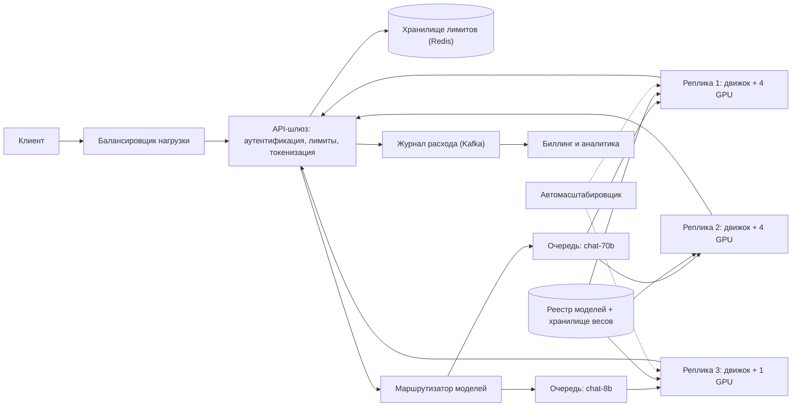
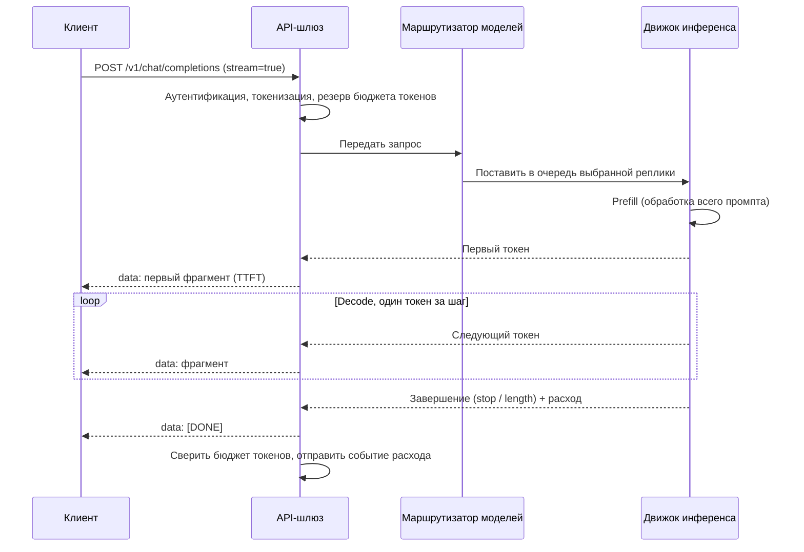
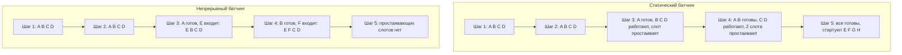
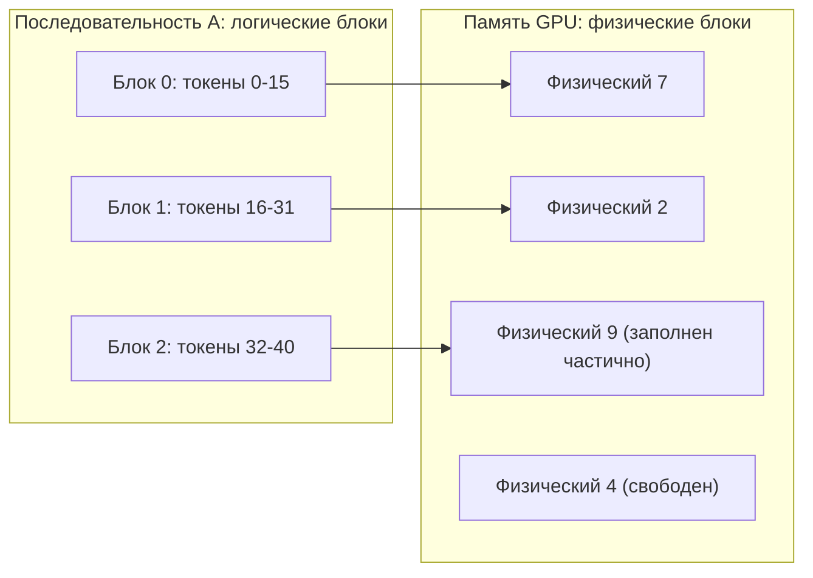
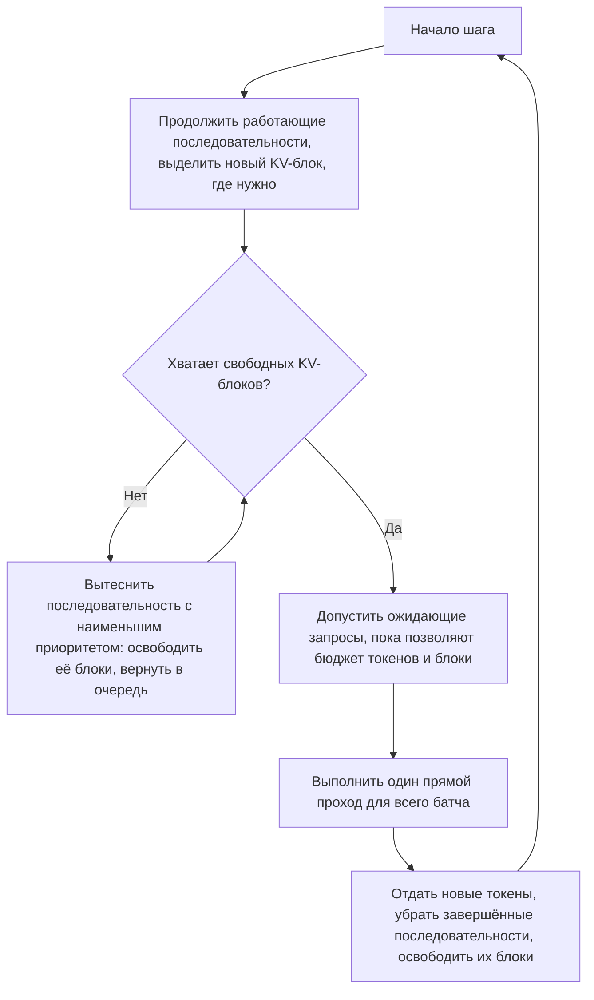

**Русский** | [English](./README.en.md)

# Глава 29: Проектирование системы инференса LLM

## Введение

В этой главе мы спроектируем бэкенд для API в стиле ChatGPT: клиент отправляет список сообщений чата и получает ответ модели токен за токеном, по мере его генерации.

Обслуживание большой языковой модели — LLM (Large Language Model — большая языковая модель) — отличается от обслуживания обычного веб-API (Application Programming Interface — программный интерфейс приложения) по нескольким причинам:
 * **Запросы дорогие и долгие** — один запрос может занимать GPU (Graphics Processing Unit — графический процессор) на десятки секунд, пока генерируются сотни токенов.
 * **Длина ответа заранее неизвестна** — модель останавливается, когда выдаёт токен конца последовательности или упирается в лимит, поэтому нельзя предсказать, сколько времени займёт запрос.
 * **Узкое место — память GPU**, а не CPU (Central Processing Unit — центральный процессор). Веса модели и состояние каждого запроса — KV cache (Key-Value cache — кэш ключей и значений внимания, подробнее ниже) — конкурируют за фиксированный объём HBM (High Bandwidth Memory — память с высокой пропускной способностью).
 * **Оборудование дефицитное и дорогое**, поэтому степень утилизации напрямую определяет стоимость одного токена.

Поэтому самая интересная часть проектирования — не stateless-слой API, а то, как запросы планируются на GPU.

---

## Шаг 1: Понять задачу и определить рамки проектирования

 * К: Как выглядит API? Автодополнение текста, чат, эмбеддинги?
 * И: Сосредоточимся на chat completions. Текст на входе, текст на выходе.
 * К: Нужно ли стримить ответы?
 * И: Да, пользователь должен начать видеть ответ как можно раньше.
 * К: Мы обслуживаем одну модель или несколько?
 * И: Несколько моделей разного размера. Будем считать, что самая большая — на 70 млрд параметров.
 * К: Хранится ли история диалога на сервере?
 * И: Нет, API stateless — клиент каждый раз отправляет весь диалог целиком.
 * К: Обучаем ли мы модели?
 * И: Нет, только инференс. Модели приходят от команды обучения в виде версионированных чекпоинтов.
 * К: Что с биллингом и ограничением частоты запросов?
 * И: Клиенты платят за токены, а лимиты задаются в токенах в минуту, а также в запросах в минуту.
 * К: О каком масштабе идёт речь?
 * И: 10 миллионов DAU (Daily Active Users — активных пользователей в день).
 * К: Отличаются ли требования к задержке для интерактивной и пакетной нагрузки?
 * И: Хороший вопрос. Приоритет — интерактивный чат; офлайн-задачи могут подождать.

### **Функциональные требования**

 * Принимать запрос чата (модель, сообщения, параметры сэмплирования) и возвращать сгенерированный текст.
 * Стримить сгенерированные токены клиенту по мере их появления.
 * Поддерживать несколько моделей и версий моделей.
 * Применять лимиты для каждого клиента по числу запросов и токенов.
 * Учитывать расход токенов для биллинга.

### **Нефункциональные требования**

 * **Низкая задержка**: короткое TTFT (Time To First Token — время до первого токена) и равномерная скорость выдачи последующих токенов (малое TPOT, Time Per Output Token — время на один выходной токен).
 * **Высокая пропускная способность / низкая стоимость**: максимизировать число токенов, сгенерированных за GPU-секунду.
 * **Высокая доступность**: отказ GPU или узла не должен ронять сервис.
 * **Справедливость**: один «тяжёлый» клиент не должен вытеснять остальных.
 * **Масштабируемость**: справляться с суточными пиками, добавляя и убирая GPU-мощности.

### **Оценка «на салфетке» (back-of-the-envelope)**

Все числа ниже — **допущения**, выбранные для упражнения, а не измерения какого-либо реального сервиса.

Трафик:
 * 10 млн DAU, каждый отправляет 20 запросов в день -> 200 млн запросов в день
 * Средний QPS (Queries Per Second — запросов в секунду) = 200 млн / 86 400 = **~2 300 запросов/с**; пиковый (x2) = **~4 600 запросов/с**
 * Средний промпт — 1 000 токенов (история чата быстро растёт), средний ответ — 300 токенов
 * Выходных токенов в пике = 4 600 * 300 = **~1,4 млн токенов/с**
 * Входных (prefill) токенов в пике = 4 600 * 1 000 = **~4,6 млн токенов/с**

Память под модель (модель на 70 млрд параметров, 16-битные веса):
 * Веса = 70 млрд * 2 байта = **140 ГБ** — больше, чем помещается в один GPU на 80 ГБ -> модель нужно шардировать, например, на 4 GPU (320 ГБ суммарно).
 * KV cache на токен = 2 (K и V) * слои * kv_heads * head_dim * 2 байта. Для архитектуры, подобной Llama-2-70B (80 слоёв, 8 KV-голов благодаря grouped-query attention, head_dim 128): 2 * 80 * 8 * 128 * 2 = **~320 КБ на токен**.
 * Оставляя ~10% запаса под активации: 320 * 0,9 - 140 = ~148 ГБ, округлим до **~140 ГБ под KV cache**, т. е. 140 ГБ / 320 КБ = **~430 тыс. токенов** на реплику из 4 GPU.
 * При среднем контексте ~2 тыс. токенов (промпт + ответ, с округлением вверх) -> не более **~200 одновременных последовательностей** на реплику.

Пропускная способность и размер парка:
 * Допустим, целевое TPOT — 50 мс -> каждая последовательность выдаёт 20 токенов/с.
 * Допустим, реплика стабильно держит ~150 одновременных последовательностей (ниже предела по памяти ~200) -> 150 * 20 = **~3 000 выходных токенов/с на реплику**.
 * Реплик в пике = 1,4 млн / 3 000 = **~470 реплик** = **~1 900 GPU** только для самой большой модели.

Быстрая проверка того, почему декодирование упирается в память: на каждом шаге декодирования нужно прочитать из HBM все веса. На каждом GPU лежит 140 / 4 = 35 ГБ; при пропускной способности HBM ~3,35 ТБ/с (спецификация H100 SXM) это 35 / 3 350 = **~10 мс на шаг** — независимо от того, 1 последовательность в батче или 100. Именно батчинг превращает эту фиксированную стоимость в полезную пропускную способность.

Стоимость токена (допущение: $2,50 за GPU-час):
 * Одна реплика = 4 * $2,50 = $10/час
 * Выходных токенов в час = 3 000 * 3 600 = 10,8 млн
 * **~$0,93 за 1 млн выходных токенов** при 100% утилизации. При реалистичной средней утилизации 50% стоимость удваивается. Поэтому эффективность батчинга и автомасштабирование — ядро всего дизайна.

---

## Шаг 2: Предложить высокоуровневый дизайн и получить одобрение

### **Проектирование API**

Используем широко распространённый формат, совместимый с OpenAI.

```
POST /v1/chat/completions
Authorization: Bearer <api_key>

{
  "model": "chat-70b",
  "messages": [
    {"role": "system", "content": "You are a helpful assistant."},
    {"role": "user", "content": "Explain KV cache in one paragraph."}
  ],
  "max_tokens": 512,
  "temperature": 0.7,
  "stream": true
}
```

При `stream: true` ответ использует SSE (Server-Sent Events — события, отправляемые сервером): обычный ответ по HTTP (HyperText Transfer Protocol — протокол передачи гипертекста) с `Content-Type: text/event-stream`, в котором каждый сгенерированный фрагмент отправляется строкой `data:`:

```
data: {"id":"req_123","choices":[{"delta":{"content":"KV"}}]}

data: {"id":"req_123","choices":[{"delta":{"content":" cache"}}]}

data: {"id":"req_123","choices":[{"delta":{},"finish_reason":"stop"}],"usage":{"prompt_tokens":27,"completion_tokens":96}}

data: [DONE]
```

Почему SSE, а не WebSocket? После отправки запроса трафик идёт в одну сторону (от сервера к клиенту), SSE работает поверх обычного HTTP через существующие балансировщики и прокси, и его тривиально читать любым HTTP-клиентом. Если клиент отключился, сервер должен это обнаружить и **отменить генерацию**, чтобы освободить GPU.

Вспомогательные эндпоинты:
 * `GET /v1/models` — список доступных моделей.
 * `GET /v1/usage?from=..&to=..` — расход токенов для дашбордов биллинга.

### **Высокоуровневый дизайн**



 * **API-шлюз (API gateway)**: stateless; аутентифицирует API-ключи, валидирует запрос, считает токены промпта токенизатором модели, применяет лимиты, держит SSE-соединение с клиентом.
 * **Маршрутизатор моделей (model router)**: сопоставляет имя модели с пулом реплик и выбирает реплику (наименее загруженную или с учётом кэша — см. глубокое погружение).
 * **Очередь запросов (request queue)**: очередь на каждую модель с приоритетами (интерактивные и пакетные запросы), буферизующая запросы, когда все реплики заняты.
 * **Реплика инференса (inference replica)**: группа GPU, которые вместе хранят одну копию модели, плюс **движок инференса (inference engine)** — например, vLLM или TensorRT-LLM, — который содержит планировщик, менеджер KV cache и вычислительные ядра модели.
 * **Реестр моделей и хранилище весов**: версионированные чекпоинты в объектном хранилище с метаданными о нужном типе GPU и схеме параллелизма.
 * **Журнал расхода**: каждый завершённый запрос отправляет событие расхода (токены промпта и ответа) в Kafka для биллинга — это отвязывает биллинг от горячего пути.
 * **Автомасштабировщик (autoscaler)**: добавляет и убирает реплики на основе длины очереди и метрик уровня GPU.

### **Поток запроса**



### **Модель данных**

Путь обслуживания в основном stateless; основные персистентные данные:

**Реестр моделей** (реляционная БД):

| Поле | Пример |
|---|---|
| model_id | chat-70b |
| version | 2024-06-01 |
| weights_uri | s3://models/chat-70b/2024-06-01/ |
| gpu_type | H100-80GB |
| tensor_parallel | 4 |
| max_context | 8192 |
| status | active / canary / retired |

**Запись о расходе** (только добавление, Kafka -> хранилище данных):

| Поле | Описание |
|---|---|
| request_id | уникальный идентификатор, также возвращается клиенту |
| api_key_id | клиент |
| model_id, version | что обслужило запрос |
| prompt_tokens, completion_tokens | тарифицируемые количества |
| ttft_ms, total_ms | метрики задержки |
| finish_reason | stop / length / cancelled / error |
| timestamp | |

**Счётчики лимитов** (Redis): по каждому API-ключу и модели — счётчики запросов и токенов в скользящем окне.

*Содержимое* промптов и ответов для обслуживания не нужно; логировать ли его — вопрос приватности и комплаенса.

---

## Шаг 3: Глубокое погружение в дизайн

### **Prefill и decode**

Генерация проходит в две фазы с очень разными профилями производительности:
 * **Предзаполнение (prefill)**: модель обрабатывает все токены промпта за один прямой проход, заполняет для них KV cache и выдаёт первый выходной токен. Одновременно обрабатывается много токенов, поэтому это матрично-матричные вычисления — фаза **ограничена вычислениями (compute-bound)**. Она определяет TTFT.
 * **Декодирование (decode)**: каждый следующий шаг обрабатывает по одному новому токену на последовательность, читая из памяти все веса и KV cache последовательности. Это матрично-векторные вычисления — фаза **ограничена пропускной способностью памяти (memory-bandwidth-bound)**. Каждый шаг даёт один токен, поэтому время шага и есть TPOT.

Сквозная задержка примерно равна: `latency = TTFT + TPOT * (output_tokens - 1)`.

Это разделение определяет большую часть дизайна: декодирование можно сделать эффективным только объединением многих последовательностей в каждом шаге, а длинный prefill, попавший в батч, тормозит все декодирующиеся в нём последовательности.

### **KV cache**

В трансформере каждый новый токен обращается (attention) к ключам и значениям всех предыдущих токенов. Пересчитывать их на каждом шаге — квадратичная сложность, поэтому движок кэширует их: это **кэш ключей и значений (KV cache, Key-Value cache)**. Его размер растёт линейно с длиной контекста и числом одновременных последовательностей — в нашей оценке ~320 КБ на токен, т. е. ~640 МБ на один диалог длиной 2 тыс. токенов.

Память GPU на реплике делится так: веса модели (фиксированно) + активации/рабочая область (немного) + KV cache (всё остальное). Число последовательностей, которые можно объединить в батч, — а значит, и пропускная способность — ограничено тем, насколько эффективно используется место под KV cache.

### **Статический и непрерывный батчинг**

**Статический батчинг (static batching, на уровне запросов)** группирует N запросов, выполняет их вместе, пока не завершатся *все*, и только потом берёт следующие N. Поскольку длины ответов различаются, рано завершившиеся последовательности оставляют свой слот пустым до окончания самой длинной, а новые запросы ждут в очереди, хотя мощность свободна.

**Непрерывный батчинг (continuous batching)** — планирование на уровне итераций (iteration-level scheduling), предложенное в статье об Orca, — принимает решение **на каждом шаге декодирования**: завершённые последовательности сразу покидают батч, а ожидающие запросы присоединяются к нему на следующей итерации.



Бенчмарк Anyscale показал до 23-кратного роста пропускной способности по сравнению с наивным статическим батчингом при сочетании непрерывного батчинга с управлением памятью vLLM. Точный выигрыш зависит от разброса длин ответов, но непрерывный батчинг используется по умолчанию во всех современных движках.

### **PagedAttention**

Ранние движки резервировали для каждого запроса **непрерывную** область KV cache под его максимально возможную длину (например, `max_tokens`). Поскольку большинство запросов завершаются раньше, память тратится впустую из-за избыточного резервирования и фрагментации — авторы vLLM измерили, что существующие системы теряли **60–80%** памяти KV cache.

**PagedAttention** (vLLM) применяет идею страничной виртуальной памяти из операционных систем:
 * KV cache делится на **блоки** фиксированного размера (например, по 16 токенов).
 * У каждой последовательности есть **таблица блоков (block table)**, отображающая её логические блоки на физические, которые могут находиться где угодно в памяти GPU.
 * Блоки выделяются по мере роста последовательности, поэтому потери ограничены последним, частично заполненным блоком (по данным vLLM — менее 4%).
 * Блоки могут **разделяться** между последовательностями с подсчётом ссылок и **копированием при записи (copy-on-write)** — например, параллельные сэмплы одного промпта разделяют блоки этого промпта.



Тот же механизм даёт **кэширование префиксов (prefix caching)**: блоки индексируются хэшем их токенов, поэтому запросы с общим префиксом (тот же системный промпт или предыдущие реплики того же чата) переиспользуют закэшированные блоки и пропускают эту часть prefill. Это очень эффективно для stateless API чата, где каждый ход заново отправляет всю историю.

### **Планировщик и вытеснение**

Каждый движок выполняет цикл — по одному проходу на шаг:



Когда память заканчивается посреди генерации (ведь длины ответов заранее неизвестны), движок **вытесняет (preempts)** последовательность. Он либо выгружает её KV-блоки в память CPU (swap), либо отбрасывает их и позже **пересчитывает (recompute)** через prefill; в vLLM по умолчанию используется пересчёт. Частое вытеснение — признак перегрузки реплики и должно учитываться в автомасштабировании.

В планировщике же живут приоритеты: интерактивные запросы допускаются раньше пакетных, а лимиты справедливой доли (fair share) для каждого клиента не дают одному клиенту занять все батчи.

### **Chunked prefill и разделение prefill/decode**

Промпт на 8 тыс. токенов, попавший в батч, сильно замедляет этот шаг для всех декодирующихся последовательностей, вызывая заметные подвисания в их стримах (всплески TPOT). Два решения:
 * **Порционный prefill (chunked prefill)**: длинный prefill делится на части, которые смешиваются с шагами декодирования в пределах бюджета токенов на шаг (`max_num_batched_tokens` в vLLM). Планировщик сначала обслуживает декодирование, а оставшийся бюджет заполняет частями prefill. Меньший бюджет выгоден для TPOT, больший — для TTFT.
 * **Раздельное обслуживание (disaggregated serving)** (DistServe, Splitwise): prefill и decode выполняются на разных пулах GPU, каждый из которых подобран по размеру и схеме параллелизма под свою фазу, а KV cache передаётся из пула prefill в пул decode по быстрому интерконнекту. Это устраняет взаимное влияние фаз ценой передачи KV и более сложной оркестрации.

### **Спекулятивное декодирование**

Декодирование ограничено памятью: проверка 5 токенов за один прямой проход стоит примерно столько же, сколько генерация одного. **Спекулятивное декодирование (speculative decoding)** использует это:
 1. Небольшая быстрая **черновая модель (draft model)** (или дополнительные головы предсказания, или поиск n-грамм в промпте) предлагает k токенов.
 2. Большая **целевая модель (target model)** проверяет все k за один прямой проход.
 3. Сохраняется самый длинный принятый префикс плюс один токен от целевой модели; остальное отбрасывается.

Со схемой rejection sampling из работы Leviathan et al. распределение выхода **в точности** совпадает с распределением целевой модели; в статье сообщается об ускорении в 2–3 раза на T5-XXL. Выигрыш зависит от доли принятых токенов и уменьшается при больших батчах, когда GPU уже не простаивает, — поэтому движки обычно включают его для чувствительных к задержке, слабо нагруженных пулов.

### **Параллелизм модели и выделение GPU**

Модель на 70 млрд параметров не помещается в один GPU, а если бы и помещалась, для KV cache не осталось бы места.
 * **Тензорный параллелизм (tensor parallelism, TP)**: матрицы каждого слоя делятся между GPU (в стиле Megatron-LM); каждому слою нужен all-reduce, поэтому требуется быстрый интерконнект (NVLink), и TP используют **внутри узла**. Он также снижает задержку на токен, поскольку каждый GPU читает только свою часть весов.
 * **Конвейерный параллелизм (pipeline parallelism, PP)**: последовательные группы слоёв размещаются на разных GPU или узлах. Коммуникация легче (между стадиями передаются только активации), поэтому он работает **между узлами**, но создаёт «пузыри» конвейера (pipeline bubbles) и не снижает задержку отдельного запроса.
 * **Параллелизм по данным (data parallelism, реплики)**: несколько независимых копий модели для масштабирования пропускной способности.

Типичная схема: TP внутри узла для модели, PP — только если одного узла недостаточно, и реплики для пропускной способности. GPU выделяются целыми единицами с учётом топологии: реплика на 4 GPU должна занимать 4 связанных по NVLink GPU одного узла. **Квантизация (quantization)** (например, веса в форматах FP8 и INT8 — 8-битных числах с плавающей точкой (floating point) и целых (integer) соответственно, — или 8-битный KV cache) — ещё один рычаг: уменьшение весов вдвое позволяет запустить ту же модель на меньшем числе GPU и освобождает место под KV cache ценой некоторой потери точности, которую нужно оценивать для каждой модели.

### **Маршрутизация между моделями**

Маршрутизатор хранит таблицу «модель -> пул реплик». Внутри пула он выбирает реплику по сигналам, которые сообщают движки: длина очереди, число выполняющихся последовательностей и заполненность KV cache. Два улучшения:
 * **Маршрутизация с учётом префикса/кэша**: запросы с одинаковым префиксом (тот же диалог или системный промпт) направляются на одну реплику, чтобы максимизировать попадания в кэш префиксов; если предпочтительная реплика перегружена, запрос уходит на наименее загруженную. Здесь хорошо работает консистентное хеширование по хэшу префикса.
 * **Мультиплексирование адаптеров**: множество дообученных вариантов, являющихся LoRA-адаптерами (Low-Rank Adaptation — низкоранговая адаптация) одной базовой модели, могут разделять один пул реплик, подгружая адаптер под запрос, вместо выделения отдельных GPU под каждый вариант.

Новые версии моделей выкатываются канареечно: маршрутизатор направляет небольшую долю трафика на новую версию и сравнивает частоту ошибок, задержку и метрики качества, прежде чем переключить весь трафик.

### **Ограничение частоты по токенам**

Лимит только по числу запросов несправедлив: запрос на 100 токенов и запрос на 30 тыс. токенов стоят совершенно по-разному. Мы ограничиваем и **запросы в минуту**, и **токены в минуту** (алгоритмы см. в главе про rate limiter):
 1. При приёме шлюз считает токены промпта и **резервирует** `prompt_tokens + max_tokens` из токен-бакета клиента в Redis.
 2. Если резерв не удался, возвращается `429 Too Many Requests` с заголовком `Retry-After`.
 3. Когда запрос завершён, выполняется **сверка**: неиспользованная часть `max_tokens` возвращается.

Переоценить расход при приёме безопаснее, чем недооценить, потому что отменять запрос, уже выполняющийся на GPU, дорого. Отдельные очереди и квоты для интерактивного и пакетного трафика обеспечивают изоляцию.

### **Автомасштабирование на GPU**

Утилизация CPU здесь бессмысленна, а «утилизация» GPU, которую сообщает драйвер, показывает лишь, выполняется ли в данный момент какое-то ядро. Лучшие сигналы для масштабирования:
 * длина очереди и время ожидания в очереди для каждой модели;
 * заполненность KV cache и частота вытеснений;
 * наблюдаемые TTFT/TPOT относительно их SLO (Service Level Objective — целевой уровень качества сервиса).

Масштабирование вверх медленное: выделение GPU-узла, загрузка контейнера и загрузка 140 ГБ весов могут занимать минуты. Способы смягчения:
 * держать **тёплый пул (warm pool)** запасных реплик и масштабироваться по прогнозу нагрузки (у трафика выраженные суточные циклы);
 * кэшировать веса на локальных NVMe-дисках (Non-Volatile Memory Express — протокол доступа к быстрым твердотельным накопителям) и загружать их параллельно;
 * во время всплесков отбрасывать или откладывать пакетный трафик, т. к. он терпим к задержке;
 * масштабироваться вниз аккуратно — сначала «осушить» (drain) реплику (перестать принимать запросы и дать завершиться текущим последовательностям), затем удалить её.

### **Метрики задержки и SLO**

 * **TTFT**: время в очереди + время prefill. Зависит в основном от нагрузки и длины промпта.
 * **TPOT** (задержка между токенами): время на шаг декодирования. Зависит в основном от размера батча и размера модели.
 * **Сквозная задержка** и **пропускная способность** (выходных токенов/с на реплику и на GPU).

Измеряйте перцентили (p50/p99) по каждой модели и диапазону длины промпта. Бо́льшие батчи улучшают пропускную способность и стоимость, но ухудшают TPOT, поэтому лимит размера батча фактически служит регулятором между стоимостью и задержкой, настраиваемым под SLO.

### **Отказоустойчивость**

 * **Здоровье реплик**: движки предоставляют health checks; watchdog обнаруживает зависшие шаги (например, застрявшую коллективную операцию между GPU) и аппаратные ошибки GPU, после чего узел выводится из работы и заменяется. Отказ одного GPU выводит из строя всю его TP-группу, т. е. всю реплику.
 * **Повторы**: если реплика отказала *до* отправки первого токена, шлюз прозрачно повторяет запрос на другой реплике. Если отказ произошёл посреди стрима, шлюз может либо вернуть фрагмент с ошибкой, либо отправить `prompt + уже сгенерированные токены` на другую реплику и продолжить стрим (KV cache пересчитается через prefill).
 * **Отключение клиентов**: шлюз передаёт отмену дальше, чтобы движок сразу освободил KV-блоки последовательности.
 * **Таймауты и лимиты**: ограничивать `max_tokens` и общее время запроса, чтобы избежать бесконечной генерации.
 * **Плавная деградация**: при перегрузке отклонять запросы заранее с 429/503, а не давать очередям расти без ограничений; при согласии клиента можно направлять запросы на меньшую модель.
 * **Мультирегиональность**: пулы реплик в нескольких регионах за глобальной балансировкой нагрузки; веса моделей реплицируются в объектное хранилище каждого региона.

---

## Шаг 4: Подведение итогов

В этой главе мы спроектировали систему обслуживания LLM. Ключевые идеи:
 * API stateless и стримит токены через SSE; шлюз отвечает за аутентификацию, подсчёт токенов, ограничение частоты по токенам и учёт расхода.
 * Генерация состоит из фазы prefill, ограниченной вычислениями (определяет TTFT), и фазы decode, ограниченной памятью (определяет TPOT).
 * Пропускная способность достигается батчингом; непрерывный батчинг с PagedAttention держит GPU загруженными при малых потерях памяти KV cache.
 * Chunked prefill или разделение prefill/decode изолируют длинные промпты от декодирующихся стримов; спекулятивное декодирование снижает задержку при наличии свободных вычислительных ресурсов.
 * Большие модели шардируются тензорным (а при необходимости и конвейерным) параллелизмом; реплики масштабируют пропускную способность.
 * Автомасштабирование опирается на сигналы очереди и KV cache и должно учитывать медленный холодный старт.

Дополнительные темы для обсуждения:
 * **Структурированный вывод и вызов инструментов (tool calling)**: ограниченное декодирование (constrained decoding), гарантирующее валидный JSON (JavaScript Object Notation — текстовый формат обмена данными).
 * **Безопасность**: модерация входа и выхода как дополнительные стадии конвейера.
 * **Пакетный API (Batch API)**: более дешёвый асинхронный эндпоинт, заполняющий простаивающие GPU ночью.
 * **Разнородное оборудование**: запуск малых моделей на более дешёвых GPU и выбор типа GPU для каждой модели по стоимости токена.
 * **Семантическое кэширование / кэширование ответов** для идентичных запросов с детерминированными параметрами.

---

## Источники

 * [Efficient Memory Management for Large Language Model Serving with PagedAttention (Kwon et al., SOSP 2023)](https://arxiv.org/abs/2309.06180)
 * [vLLM: Easy, Fast, and Cheap LLM Serving with PagedAttention (vLLM blog)](https://vllm.ai/blog/2023-06-20-vllm)
 * [vLLM docs: Optimization and Tuning (preemption, chunked prefill, parallelism)](https://docs.vllm.ai/en/stable/configuration/optimization.html)
 * [How continuous batching enables 23x throughput in LLM inference (Anyscale)](https://www.anyscale.com/blog/continuous-batching-llm-inference)
 * [Orca: A Distributed Serving System for Transformer-Based Generative Models (OSDI 2022)](https://www.usenix.org/conference/osdi22/presentation/yu)
 * [LLM Inference Performance Engineering: Best Practices (Databricks)](https://www.databricks.com/blog/llm-inference-performance-engineering-best-practices)
 * [Mastering LLM Techniques: Inference Optimization (NVIDIA Technical Blog)](https://developer.nvidia.com/blog/mastering-llm-techniques-inference-optimization/)
 * [Fast Inference from Transformers via Speculative Decoding (Leviathan et al., 2022)](https://arxiv.org/abs/2211.17192)
 * [DistServe: Disaggregating Prefill and Decoding for Goodput-optimized LLM Serving (2024)](https://arxiv.org/abs/2401.09670)
 * [Megatron-LM: Training Multi-Billion Parameter Language Models Using Model Parallelism](https://arxiv.org/abs/1909.08053)
 * [Server-sent events (MDN)](https://developer.mozilla.org/en-US/docs/Web/API/Server-sent_events/Using_server-sent_events)
