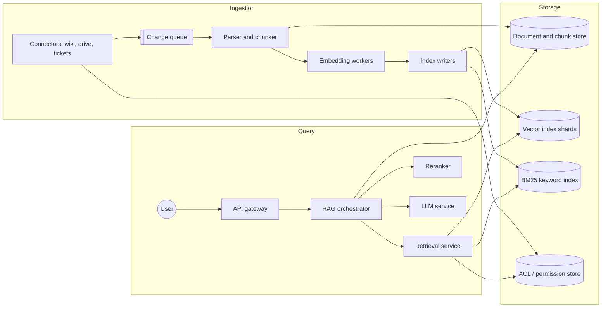
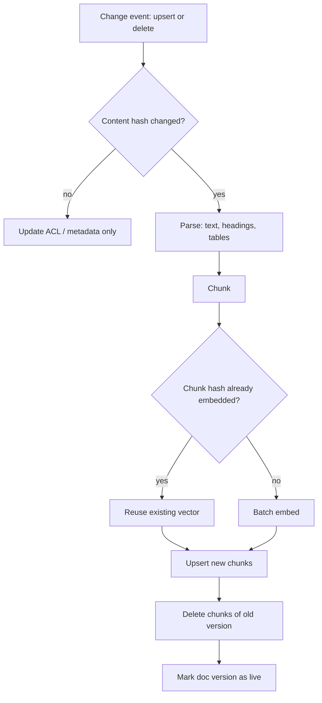
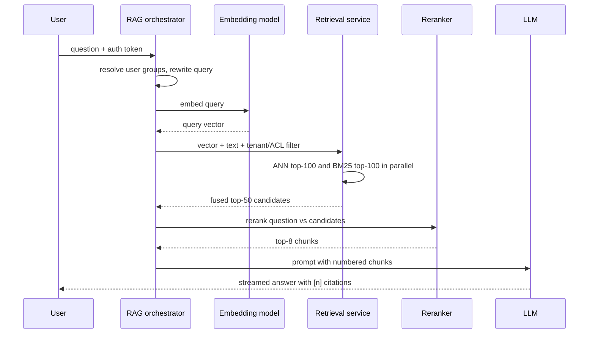
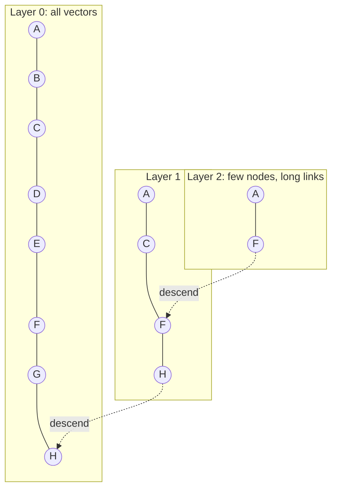
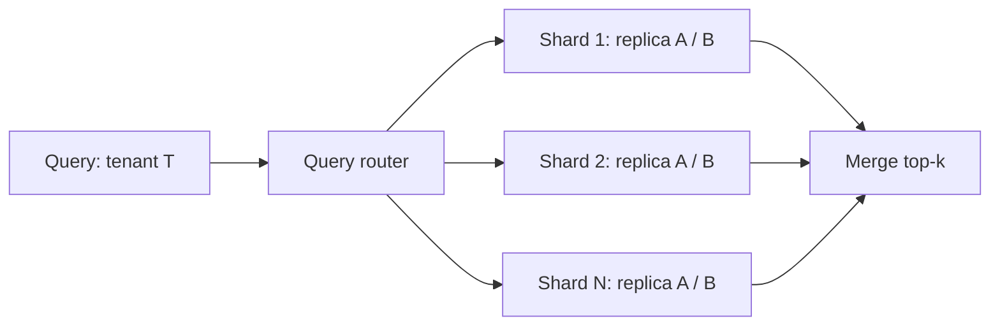

[Русский](./README.md) | **English**

# Chapter 30: Design a Vector Search Service for RAG

## Introduction

Large language models (LLMs) are trained on public data up to a cutoff date. They know nothing about a company's internal wiki, yesterday's support tickets or a customer's private contracts, and when asked about such things they tend to "hallucinate" confident but wrong answers.

**Retrieval-Augmented Generation (RAG)** addresses this: before calling the LLM, the system *retrieves* relevant passages from an external knowledge base and puts them into the prompt, so the model *generates* an answer grounded in those passages and can cite them. The term comes from the paper by Lewis et al. (2020), which combined a dense retriever with a seq2seq generator.

The heart of a RAG system is a **vector search service**: documents are split into chunks, each chunk is converted into an embedding (a dense vector of floats), and at query time we look for the chunks whose vectors are closest to the query vector. Exact nearest-neighbor search over hundreds of millions of vectors is too slow, so we use **approximate nearest neighbor (ANN)** indexes such as HNSW, IVF and PQ.

In this chapter we design a multi-tenant "chat with your documents" platform and focus on the retrieval backend: the ingestion path, the query path, ANN indexes, sharding, access control, caching, freshness and evaluation.

---

## Step 1: Understand the Problem and Establish Design Scope

 * C: Who are the users and what data are we searching?
 * I: A SaaS product for businesses. Each customer (tenant) connects its sources: PDFs, wiki pages, tickets, Google Drive-like folders. Employees ask questions in natural language and get an answer with citations.
 * C: Do we train or host the LLM and the embedding model ourselves?
 * I: No, treat both as external services behind an API. We design everything around them.
 * C: How much data?
 * I: Around 25 million documents across all tenants. Tenants range from a few hundred documents to several million.
 * C: Do documents change?
 * I: Yes. Documents get edited and deleted. A change should be searchable within minutes.
 * C: Do different users within a tenant see different documents?
 * I: Yes. A user must never get an answer based on a document they cannot open in the source system. This is a hard requirement.
 * C: What latency is acceptable?
 * I: Retrieval should be fast, say under 200 ms at p99. The full answer is streamed; the first token should appear within ~2 seconds.
 * C: Should we support keyword queries, like error codes or product SKUs?
 * I: Yes, pure semantic search struggles with those.
 * C: Languages?
 * I: Multilingual, but let's not go deep into it.

### **Functional requirements**

 * Ingest documents from connectors: parse, chunk, embed and index them; propagate updates and deletes.
 * Answer a natural-language question: retrieve relevant chunks, generate an answer with the LLM, and return citations to the source chunks.
 * Enforce per-tenant isolation and per-document access control.
 * Provide a raw search API (top-k chunks) for customers who want to build their own prompts.

### **Non-functional requirements**

 * **Low latency**: retrieval p99 < 200 ms; time to first token < 2 s.
 * **High recall**: ANN should find most of the true nearest neighbors (e.g. recall@10 ≥ 0.95 relative to exact search).
 * **Freshness**: updates and deletes are reflected in search within a few minutes.
 * **Security**: zero cross-tenant leaks; ACLs respected on every query.
 * **Scalability and availability**: horizontal scaling of the index; no single point of failure.
 * **Cost efficiency**: embeddings, index memory and LLM tokens are the dominant costs.

### **Back-of-the-envelope estimation**

All numbers below are **assumptions** chosen for the exercise, not measurements.

 * Documents: 25M; average of 20 chunks per document (~500 tokens each) → **500M chunks**.
 * Embedding dimension: 768, stored as float32 → 768 × 4 = **3,072 bytes per vector**.
 * Raw vectors: 500M × 3,072 B ≈ **1.5 TB**.
 * HNSW graph overhead (FAISS estimates roughly `M * 2 * 4` bytes per vector for links); with M = 32 → 256 B × 500M ≈ **128 GB**.
 * So an in-memory HNSW with full-precision vectors needs ~1.7 TB of RAM per copy, ~5 TB with 3 replicas. That drives the need for sharding and/or compression.
 * With PQ compression to 96 bytes per vector (+8 B id): 500M × 104 B ≈ **52 GB** per copy — a 30x reduction, paid for with lower recall, which we recover by re-ranking with full vectors.
 * Chunk text + metadata: 500M × ~2.5 KB ≈ **1.25 TB** in a document store (can live on disk).
 * Queries: 5M daily active users × 10 questions/day = 50M queries/day → 50M / 86,400 ≈ **~580 QPS** average, **~1,700 QPS** at a 3x peak.
 * Updates: 2% of documents change per day → 500K documents × 20 chunks = **10M chunks re-embedded per day** ≈ 116 chunks/s, i.e. 10M × 500 = **5B embedding tokens/day**.
 * Generation: 8 chunks × 500 tokens + question + instructions ≈ 4.5K input tokens per query → 50M × 4.5K ≈ **225B LLM input tokens/day**. The LLM, not the vector index, is usually the biggest cost, which makes caching and good top-k selection important.

---

## Step 2: Propose High-Level Design and Get Buy-In

The system splits naturally into two paths:

 * **Ingestion (offline / near-real-time)**: sources → parse → chunk → embed → index.
 * **Query (online)**: question → embed → hybrid retrieve → rerank → assemble prompt → generate → cite.

### **High-level design**



 * **Connectors** pull or receive webhooks from source systems and emit change events (upsert/delete) with the document's ACL.
 * **Change queue** (e.g. Kafka, see Chapter 19) decouples connectors from the heavy processing and absorbs bursts such as initial imports.
 * **Parser and chunker** extracts text and structure (headings, tables, pages) and splits it into chunks.
 * **Embedding workers** call the embedding model in batches.
 * **Index writers** upsert vectors into the vector index and text into the BM25 index.
 * **Document and chunk store** keeps chunk text, source URL, offsets and metadata — used to build prompts and citations.
 * **Retrieval service** runs vector and keyword search in parallel, applies tenant/ACL filters and fuses results.
 * **Reranker** is a cross-encoder model that re-scores the top candidates more precisely.
 * **RAG orchestrator** assembles the prompt, calls the LLM, streams the answer and attaches citations.

### **API design**

**Ingest a document**

```
PUT /v1/tenants/{tenant_id}/documents/{doc_id}
{
  "source_url": "https://wiki.example.com/page/42",
  "content_type": "text/html",
  "content": "...",               // or a pointer to object storage
  "acl": { "groups": ["eng", "sre"], "users": ["u_17"] },
  "metadata": { "lang": "en", "updated_at": "2026-09-01T10:00:00Z" },
  "version": 7
}
```

`DELETE /v1/tenants/{tenant_id}/documents/{doc_id}` removes all chunks of a document.

**Search (raw retrieval)**

```
POST /v1/tenants/{tenant_id}/search
{ "query": "how do I rotate the API key?", "top_k": 10,
  "filters": { "lang": "en" }, "mode": "hybrid" }
→ { "results": [ { "chunk_id": "...", "doc_id": "...", "score": 0.83,
                    "text": "...", "source_url": "..." } ] }
```

**Ask (full RAG)**

```
POST /v1/tenants/{tenant_id}/answers        (response streamed via SSE)
{ "question": "...", "conversation_id": "..." }
→ { "answer": "... [1] ... [2]", "citations": [ { "id": 1, "doc_id": "...",
     "chunk_id": "...", "source_url": "...", "quote": "..." } ] }
```

The user identity comes from the auth token, never from the request body — ACL filtering depends on it.

### **Data model**

**Chunk record** (document store, e.g. a sharded relational DB or a wide-column store keyed by `tenant_id`):

| Field | Description |
|---|---|
| tenant_id, chunk_id | Primary key; `chunk_id = hash(doc_id, doc_version, position)` |
| doc_id, doc_version | Parent document and its version |
| text | Chunk text (what goes into the prompt) |
| position, char_start, char_end, page | Location in the source, used for citations |
| heading_path | E.g. "Setup > Auth > API keys" |
| acl_groups, acl_users | Denormalized permissions |
| embedding_model | E.g. `emb-v3-768` — which model produced the vector |
| updated_at | For freshness filters and recency boosting |

**Vector index entry**: `(internal_id, vector, tenant_id, acl_groups, doc_id, lang, updated_at)`. Filterable attributes are stored next to the vector so the ANN search can filter without a round trip to another database.

---

## Step 3: Design Deep Dive

### **Ingestion path**



**Parsing.** PDFs, slides and HTML must be turned into clean text while preserving structure: headings, list boundaries, tables and page numbers. Bad parsing (merged columns, headers repeated on every page) silently ruins retrieval quality, so it deserves its own team-level attention.

**Chunking strategies.** The chunk is the unit of retrieval and citation. Common options:

 * **Fixed-size** windows (e.g. 300–800 tokens) with overlap (10–20%) so a sentence split at a boundary still appears whole in one chunk. Simple and predictable.
 * **Structure-aware**: split on headings, paragraphs and list items; merge small sections, split large ones. Produces more coherent chunks.
 * **Semantic**: split where the embedding similarity between consecutive sentences drops.
 * **Contextual chunks**: prepend a short description of where the chunk lives ("From the 2025 security policy, section on API keys: ...") before embedding and BM25 indexing. Anthropic reported that contextual embeddings plus contextual BM25 reduced top-20 retrieval failures by 49%, and by 67% with reranking, on their benchmarks.

Chunks that are too small lose context; chunks that are too large dilute the embedding and waste prompt tokens. A common compromise is "small to big": retrieve small chunks, but pass the surrounding section to the LLM.

**Embedding generation.** Embedding workers batch chunks to amortize per-request overhead and handle rate limits with retries and backoff. The same model must be used for documents and queries — vectors from different models live in different spaces and are not comparable.

**Embedding versioning.** Sooner or later we will switch to a better embedding model. Since old and new vectors are incompatible, we cannot mix them in one index. The approach is a **blue/green re-index**: build a new index (`emb-v4`) in the background from the chunk store (no re-parsing needed), dual-write new changes into both indexes, evaluate the new one offline, then switch query traffic and drop the old index. Every chunk and every index records its `embedding_model` so a mismatch is detected rather than silently producing garbage.

**Incremental updates and deletes.**

 * Content hashes at the document and chunk level mean an edit of one paragraph re-embeds only the affected chunks.
 * Chunk ids include `doc_version`, so a new version is written first and the old version's chunks are removed afterwards. Queries briefly may see both, but never neither.
 * Deletes are critical for correctness and compliance: a deleted document must stop appearing in answers. Most ANN indexes (HNSW in particular) do not physically remove nodes cheaply; they use **tombstones** — the id is marked deleted and filtered at query time — and a background compaction rebuilds segments later. Milvus and similar systems use this segment + compaction model.
 * ACL changes (someone removed from a group) must propagate quickly too; storing ACLs as metadata lets us update them without re-embedding.

### **Query path**



1. **Query understanding.** In a conversation, "and what about for admins?" must be rewritten into a standalone question using chat history (an LLM call, or a cheaper small model). The user's groups are resolved from the identity provider and cached.
2. **Query embedding** with the same model and version as the index.
3. **Hybrid search.** Dense vectors capture meaning ("reset credentials" ≈ "rotate API key") but are weak at exact tokens: error codes, SKUs, names. **BM25** keyword search is strong there. We run both in parallel and fuse the result lists. Two popular fusion methods:
    * **Reciprocal Rank Fusion (RRF)**: `score(d) = Σ 1 / (k + rank_i(d))` with k ≈ 60. It uses only ranks, so we do not have to calibrate BM25 scores against cosine similarities.
    * **Weighted score fusion**: normalize both scores and combine as `alpha * dense + (1 - alpha) * sparse`. Pinecone and Weaviate both expose such an `alpha` parameter (1.0 = pure vector, 0.0 = pure keyword).
4. **Reranking.** Bi-encoder embeddings compress a chunk into one vector independently of the question. A **cross-encoder reranker** reads the question and a chunk together and scores relevance much more accurately, but it is too expensive to run over millions of chunks. So we use it on ~50 candidates: cheap recall first, expensive precision second.
5. **Prompt assembly.** Select the top chunks within a token budget, deduplicate near-identical chunks, order them, and number them `[1]..[n]` along with title and source. The system instructions tell the model to answer only from the provided context, to cite chunk numbers, and to say "I don't know" when the context is insufficient.
6. **Generation and citations.** The answer is streamed. The orchestrator maps `[n]` markers back to `chunk_id → doc_id, source_url, char offsets`, so the UI can link to and highlight the exact passage. A post-check can verify each cited chunk actually exists in the context and drop invalid citations.

### **ANN indexes**

Exact (brute-force) search compares the query with every vector: 500M × 768 multiply-adds per query is far too slow at 1,700 QPS. ANN indexes trade a little recall for orders of magnitude speed.

**HNSW (Hierarchical Navigable Small World)** — a multi-layer proximity graph (Malkov & Yashunin). Upper layers are sparse and allow long jumps; the bottom layer contains every vector. Search starts at the top, greedily moves to the neighbor closest to the query, and descends layer by layer.



 * Parameters: `M` (links per node — more memory, better recall), `efConstruction` (build quality), `efSearch` (query-time breadth — higher is slower but more accurate).
 * Pros: excellent recall/latency, supports incremental inserts.
 * Cons: memory-hungry (full vectors + graph in RAM), deletes are awkward, filtered search needs special handling.

**IVF (Inverted File index)** — k-means clusters the vectors into `nlist` cells; each vector goes into the list of its nearest centroid. A query compares itself against the centroids and scans only the `nprobe` closest lists.

 * Pros: less memory overhead than HNSW, simple to shard and to store on disk.
 * Cons: recall depends on `nprobe`; centroids trained on old data can drift, so periodic retraining is needed.

**PQ (Product Quantization)** — Jégou et al. Split a vector into m sub-vectors, run k-means with 256 centroids in each subspace, and store only the 1-byte centroid id per sub-vector. A 768-d float32 vector (3,072 B) becomes e.g. 96 bytes. Distances are computed with lookup tables.

 * Pros: massive memory savings; combined as **IVF-PQ** it is the classic billion-scale setup in FAISS.
 * Cons: lossy — recall drops. The standard fix is **re-ranking**: fetch e.g. top-200 by PQ distance, then recompute exact distances using full vectors from SSD.

| Index | Memory | Latency | Recall | Updates |
|---|---|---|---|---|
| Flat (exact) | 1x | very high | 100% | trivial |
| HNSW | 1x + graph | lowest | very high | good inserts, tombstone deletes |
| IVF-Flat | ~1x | low | tunable via nprobe | easy, needs retraining |
| IVF-PQ | ~0.03x | low | lower; fix with rerank | easy, needs retraining |

For our scale a reasonable choice is **HNSW on compressed (PQ or scalar-quantized) vectors in RAM, with full-precision vectors on SSD for re-scoring**. Small tenants (a few thousand chunks) can simply use flat search — it is exact and fast enough.

### **Sharding and replication**

A 1.7 TB index does not fit on one machine, and even 52 GB of PQ codes benefits from being spread out for throughput.



 * **Shard by tenant.** Most queries touch one tenant, so routing by `tenant_id` (consistent hashing, see Chapter 5) means a query hits one shard instead of all of them. Small tenants are packed together; a very large tenant gets its own shards.
 * **Shard by vector within a large tenant.** Vectors are spread randomly across N shards; the query is scattered to all N, each returns its local top-k, and the router merges them (scatter-gather). The latency is that of the slowest shard, so tail latency matters.
 * **Clustering-based sharding** (put each IVF cluster on a shard) lets a query visit only a few shards, but creates hot shards when popular topics land together.
 * **Replication.** Each shard has 2–3 replicas for availability and read throughput. Writes go through a log (the change queue), and replicas apply it in order, which gives eventual consistency within seconds.
 * **Segments.** New vectors go into a small, mutable in-memory segment (flat or small HNSW); background jobs seal it and build an optimized index, merging segments and purging tombstones. This is the same LSM-like idea used by Milvus and by Lucene-based engines.

### **Multi-tenancy and access control**

Leaking one customer's data to another is the worst possible failure, so isolation must be enforced by the retrieval layer, not by the LLM prompt.

 * **Tenant isolation.** Options range from a separate index/collection per tenant (strongest isolation, higher overhead with many small tenants) to a shared index with a mandatory `tenant_id` partition key (scales to millions of tenants, weaker physical isolation). Milvus documents exactly this spectrum: database, collection, partition and partition-key level multi-tenancy. A hybrid is common: dedicated indexes for big tenants, partition keys for the long tail. The tenant filter is injected by the server from the auth token.
 * **Document-level ACLs.** Each chunk carries `acl_groups`/`acl_users`; the query includes the user's groups as a filter.
 * **Pre-filtering vs post-filtering.** Post-filtering (search top-k, then drop disallowed results) can return too few or zero results when the user can see only a small fraction of documents. Pre-filtering restricts the search to allowed candidates. Weaviate, for example, builds an allow-list from an inverted index and traverses HNSW considering only those entries, and switches to brute force over the allowed set when the filter is very restrictive. Our design uses pre-filtering, with flat search as the fallback for highly selective filters.
 * **Defense in depth.** Before building the prompt, the orchestrator re-checks every chunk's ACL against the permission store, which also covers ACL changes that have not yet reached the index.

### **Caching**

 * **Query embedding cache**: key = `(model_version, normalized query text)`. Popular questions repeat.
 * **Retrieval result cache**: key must include `tenant_id` and the user's **ACL fingerprint** (e.g. hash of sorted group ids) plus an index version, otherwise one user's cached results leak to another. Invalidate on index version bump or keep a short TTL.
 * **Answer cache**: the most expensive to miss, but also the riskiest; use only for identical question + identical retrieved chunk set + same permissions.
 * **Semantic cache**: reuse an answer when a new question's embedding is very close to a cached one. It saves LLM cost but can return subtly wrong answers; use a high similarity threshold.
 * **LLM prompt caching**: providers can cache a stable prompt prefix (system instructions), which reduces cost and latency.
 * **Embedding cache on ingestion**: keyed by chunk content hash, it makes re-ingesting unchanged content free.

### **Freshness**

 * Connectors use webhooks where available and fall back to periodic polling with change tokens.
 * The mutable in-memory segment makes new vectors searchable immediately after the index writer commits, without waiting for a full index rebuild.
 * End-to-end freshness (source change → searchable) is a monitored SLO, e.g. p95 < 5 minutes; queue lag is the main alert signal.
 * Deletes and ACL revocations get priority lanes in the queue, since serving stale permissions is a security issue, while serving a slightly stale paragraph is merely a quality issue.
 * Recency can be a ranking feature (boost newer `updated_at`) for questions like "latest policy on ...".

### **Evaluation**

A RAG system can fail in three separate places, so we measure them separately:

 * **Retrieval quality**: given a labeled set of (question, relevant chunks), measure recall@k, precision@k, MRR and nDCG. Also measure **ANN recall** against exact search to tune `efSearch`/`nprobe` — this isolates index approximation from embedding-model quality.
 * **Generation quality**: is the answer correct, relevant and **faithful** (every claim supported by the retrieved context)? Measured with human review plus LLM-as-a-judge. The RAGAS framework, for example, defines faithfulness, answer relevance and context relevance metrics.
 * **Citation quality**: does each cited chunk actually support the sentence it is attached to (citation precision), and is every claim cited (citation recall)?

Every change — chunk size, embedding model, `alpha`, reranker, prompt — is evaluated offline on a golden set before rollout, then A/B-tested online using signals such as thumbs up/down, citation click-through and "no answer" rate.

---

## Step 4: Wrap Up

We designed a vector search service for RAG with a clear split between the ingestion path (parse → chunk → embed → index, with hashing, versioning and tombstones) and the query path (embed → hybrid retrieve → rerank → prompt → generate → cite). We chose HNSW over quantized vectors with full-precision re-scoring, sharded by tenant with scatter-gather for large tenants, and enforced tenant and ACL filters inside the retrieval layer.

Additional talking points:
 * **Agentic / multi-step retrieval**: the LLM decides to issue several searches, e.g. for comparison questions.
 * **Disk-based ANN** (e.g. DiskANN-style graphs on SSD) to cut RAM cost further.
 * **GPU acceleration** for index building and high-throughput search (FAISS supports GPUs).
 * **Guardrails**: prompt injection hidden inside indexed documents, PII redaction.
 * **Cost controls**: per-tenant quotas, smaller models for query rewriting, adaptive top-k.
 * **Observability**: trace every answer back to the query, retrieved chunks, scores and prompt — essential for debugging bad answers.

---

## References

 * [Lewis et al. — Retrieval-Augmented Generation for Knowledge-Intensive NLP Tasks (2020)](https://arxiv.org/abs/2005.11401)
 * [Malkov, Yashunin — Efficient and robust approximate nearest neighbor search using Hierarchical Navigable Small World graphs](https://arxiv.org/abs/1603.09320)
 * [Jégou, Douze, Schmid — Product Quantization for Nearest Neighbor Search](https://ieeexplore.ieee.org/document/5432202)
 * [FAISS wiki — Faiss indexes](https://github.com/facebookresearch/faiss/wiki/Faiss-indexes)
 * [Pinecone — Product Quantization](https://www.pinecone.io/learn/series/faiss/product-quantization/)
 * [Pinecone — Getting Started with Hybrid Search](https://www.pinecone.io/learn/hybrid-search-intro/)
 * [Weaviate docs — Filtering](https://docs.weaviate.io/weaviate/concepts/filtering)
 * [Weaviate docs — Hybrid search](https://docs.weaviate.io/weaviate/search/hybrid)
 * [Milvus docs — Multi-tenancy](https://milvus.io/docs/multi_tenancy.md)
 * [Cormack, Clarke, Büttcher — Reciprocal Rank Fusion outperforms Condorcet and individual rank learning methods](https://plg.uwaterloo.ca/~gvcormac/cormacksigir09-rrf.pdf)
 * [Anthropic — Introducing Contextual Retrieval](https://www.anthropic.com/engineering/contextual-retrieval)
 * [Es et al. — RAGAS: Automated Evaluation of Retrieval Augmented Generation](https://arxiv.org/abs/2309.15217)
