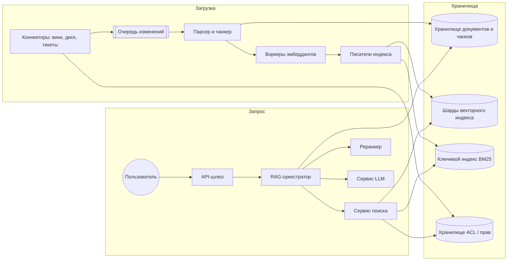
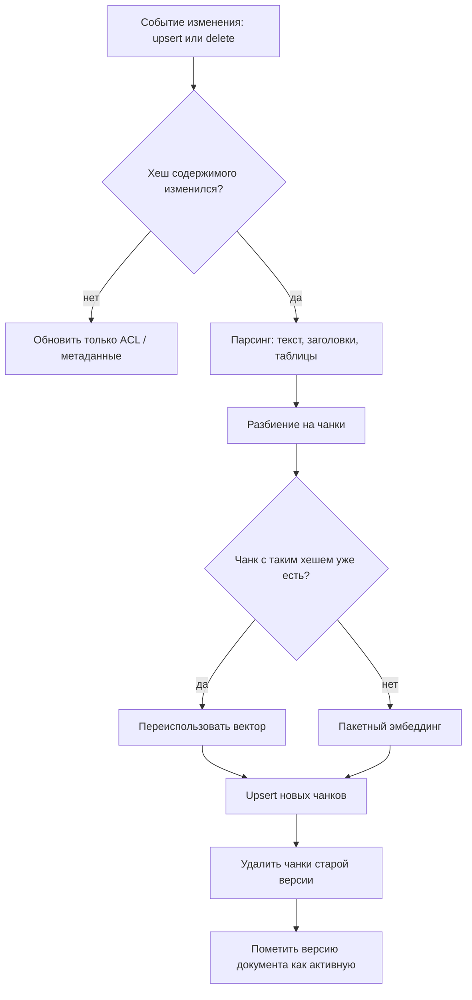
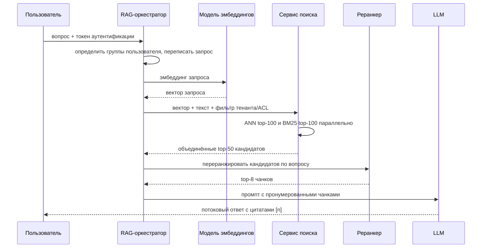
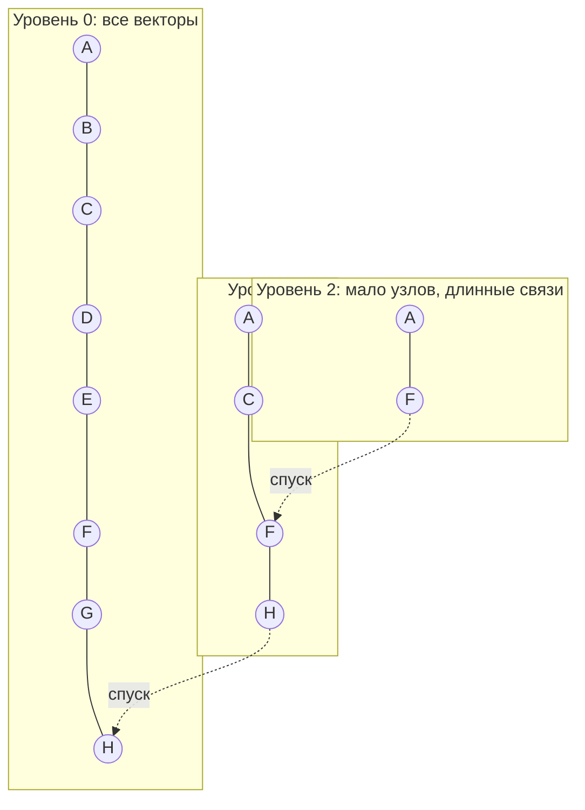
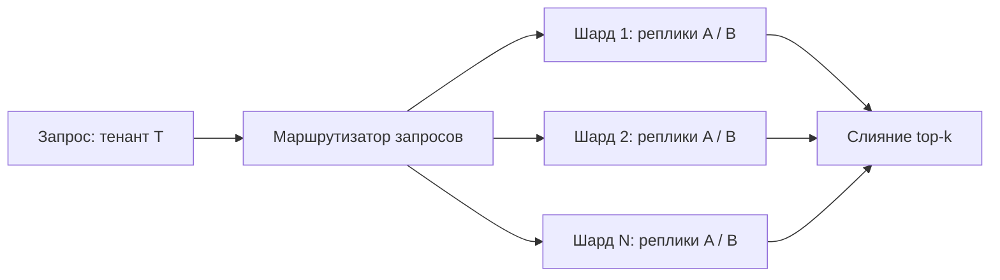

**Русский** | [English](./README.en.md)

# Глава 30: Проектирование сервиса векторного поиска для RAG

## Введение

Большие языковые модели, LLM (Large Language Model — нейросеть, обученная на огромном корпусе текстов и генерирующая текст), обучаются на публичных данных до определённой даты. Они ничего не знают о внутренней вики компании, вчерашних обращениях в поддержку или закрытых договорах клиента, а на вопросы об этом нередко «галлюцинируют» — уверенно выдают неверные ответы.

Эту проблему решает **RAG (Retrieval-Augmented Generation — генерация, дополненная поиском)**: прежде чем обратиться к LLM, система *находит* релевантные фрагменты во внешней базе знаний и помещает их в промпт, чтобы модель *сгенерировала* ответ, опирающийся на эти фрагменты, и могла на них сослаться. Термин появился в статье Lewis et al. (2020), где плотный ретривер объединили с seq2seq-генератором.

Сердце RAG-системы — **сервис векторного поиска**: документы разбиваются на чанки (chunks, фрагменты), каждый чанк превращается в эмбеддинг (embedding — плотный вектор из чисел с плавающей точкой), а при запросе мы ищем чанки, чьи векторы ближе всего к вектору запроса. Точный поиск ближайших соседей среди сотен миллионов векторов слишком медленный, поэтому используются индексы **ANN (Approximate Nearest Neighbor — приближённый поиск ближайших соседей)**: HNSW (Hierarchical Navigable Small World — многоуровневый граф близости), IVF (Inverted File index — индекс на основе кластеризации векторов) и PQ (Product Quantization — продуктовое квантование, сжатие векторов).

В этой главе мы спроектируем мультитенантную платформу «чат с вашими документами» и сосредоточимся на бэкенде поиска: пути загрузки, пути запроса, ANN-индексах, шардировании, контроле доступа, кэшировании, свежести данных и оценке качества.

---

## Шаг 1: Понять задачу и определить рамки проектирования

 * К: Кто пользователи и по каким данным мы ищем?
 * И: Это SaaS-продукт (Software as a Service — программное обеспечение как услуга) для бизнеса. Каждый клиент — арендатор, или тенант (tenant), — подключает свои источники: PDF (Portable Document Format — формат электронных документов), вики-страницы, тикеты, папки наподобие Google Drive. Сотрудники задают вопросы на естественном языке и получают ответ со ссылками на источники.
 * К: Мы сами обучаем или хостим LLM и модель эмбеддингов?
 * И: Нет, считайте обе внешними сервисами за API (Application Programming Interface — программный интерфейс). Всё остальное проектируем вокруг них.
 * К: Какой объём данных?
 * И: Около 25 миллионов документов у всех тенантов вместе. Размер тенанта — от нескольких сотен документов до нескольких миллионов.
 * К: Документы меняются?
 * И: Да, их редактируют и удаляют. Изменение должно становиться доступным для поиска в течение нескольких минут.
 * К: Видят ли разные пользователи внутри тенанта разные документы?
 * И: Да. Пользователь никогда не должен получить ответ, основанный на документе, который он не может открыть в исходной системе. Это жёсткое требование.
 * К: Какая задержка допустима?
 * И: Поиск должен быть быстрым — скажем, до 200 мс на p99 (99-й перцентиль). Полный ответ передаётся потоком; первый токен должен появиться примерно за 2 секунды.
 * К: Нужно ли поддерживать запросы по ключевым словам, например коды ошибок или артикулы товаров?
 * И: Да, чисто семантический поиск с ними справляется плохо.
 * К: Языки?
 * И: Многоязычность нужна, но не будем углубляться.

### **Функциональные требования**

 * Загружать документы из коннекторов: парсить, разбивать на чанки, вычислять эмбеддинги и индексировать; распространять изменения и удаления.
 * Отвечать на вопрос на естественном языке: находить релевантные чанки, генерировать ответ с помощью LLM и возвращать цитаты (citations) — ссылки на исходные чанки.
 * Обеспечивать изоляцию тенантов и контроль доступа на уровне документов.
 * Предоставлять API «сырого» поиска (top-k чанков) для клиентов, которые хотят собирать промпты сами.

### **Нефункциональные требования**

 * **Низкая задержка**: поиск p99 < 200 мс; время до первого токена < 2 с.
 * **Высокая полнота (recall)**: ANN должен находить большинство истинных ближайших соседей (например, recall@10 ≥ 0,95 относительно точного поиска).
 * **Свежесть (freshness)**: изменения и удаления отражаются в поиске в течение нескольких минут.
 * **Безопасность**: ноль утечек между тенантами; ACL (Access Control List — список прав доступа к объекту) соблюдаются в каждом запросе.
 * **Масштабируемость и доступность**: горизонтальное масштабирование индекса; отсутствие единой точки отказа.
 * **Экономичность**: основные затраты — эмбеддинги, память под индекс и токены LLM.

### **Оценка «на салфетке» (back-of-the-envelope)**

Все числа ниже — **допущения**, выбранные для упражнения, а не результаты измерений.

 * Документы: 25 млн; в среднем 20 чанков на документ (~500 токенов каждый) → **500 млн чанков**.
 * Размерность эмбеддинга: 768, хранение в float32 → 768 × 4 = **3072 байта на вектор**.
 * «Сырые» векторы: 500 млн × 3072 Б ≈ **1,5 ТБ**.
 * Накладные расходы графа HNSW (FAISS (Facebook AI Similarity Search — библиотека Meta для поиска по сходству векторов) оценивает связи примерно в `M * 2 * 4` байта на вектор); при M = 32 → 256 Б × 500 млн ≈ **128 ГБ**.
 * Итого HNSW в памяти с векторами полной точности требует ~1,7 ТБ RAM (Random Access Memory — оперативная память) на одну копию и ~5 ТБ при трёх репликах. Отсюда потребность в шардировании и/или сжатии.
 * При PQ-сжатии до 96 байт на вектор (+8 Б на идентификатор): 500 млн × 104 Б ≈ **52 ГБ** на копию — сокращение примерно в 30 раз ценой снижения полноты, которую мы восстанавливаем переранжированием по полным векторам.
 * Текст чанков + метаданные: 500 млн × ~2,5 КБ ≈ **1,25 ТБ** в хранилище документов (может лежать на диске).
 * Запросы: 5 млн пользователей в день × 10 вопросов в день = 50 млн запросов в день → 50 млн / 86 400 ≈ **~580 QPS** (Queries Per Second — запросов в секунду) в среднем и **~1700 QPS** в пике при трёхкратном запасе.
 * Изменения: 2% документов меняются за день → 500 тыс. документов × 20 чанков = **10 млн чанков на переэмбеддинг в день** ≈ 116 чанков/с, т. е. 10 млн × 500 = **5 млрд токенов эмбеддинга в день**.
 * Генерация: 8 чанков × 500 токенов + вопрос + инструкции ≈ 4,5 тыс. входных токенов на запрос → 50 млн × 4,5 тыс. ≈ **225 млрд входных токенов LLM в день**. Обычно основную стоимость составляет именно LLM, а не векторный индекс, поэтому кэширование и грамотный выбор top-k так важны.

---

## Шаг 2: Предложить высокоуровневый дизайн и получить одобрение

Система естественным образом делится на два пути:

 * **Загрузка (ingestion; офлайн / почти в реальном времени)**: источники → парсинг → чанкинг → эмбеддинг → индексация.
 * **Запрос (query; онлайн)**: вопрос → эмбеддинг → гибридный поиск → переранжирование → сборка промпта → генерация → цитирование.

### **Высокоуровневый дизайн**



 * **Коннекторы** опрашивают исходные системы или получают от них вебхуки и порождают события изменений (upsert/delete) вместе с ACL документа.
 * **Очередь изменений** (например, Kafka, см. главу 19) отделяет коннекторы от тяжёлой обработки и сглаживает всплески, такие как первичный импорт.
 * **Парсер и чанкер** извлекает текст и структуру (заголовки, таблицы, страницы) и разбивает его на чанки.
 * **Воркеры эмбеддингов** вызывают модель эмбеддингов пакетами.
 * **Писатели индекса** выполняют upsert векторов в векторный индекс и текста — в индекс BM25 (Best Matching 25 — классическая функция ранжирования по ключевым словам на основе частоты терминов).
 * **Хранилище документов и чанков** содержит текст чанков, URL (Uniform Resource Locator — адрес ресурса) источника, смещения и метаданные — всё это нужно для сборки промпта и цитат.
 * **Сервис поиска** параллельно выполняет векторный и ключевой поиск, применяет фильтры по тенанту и ACL и объединяет результаты.
 * **Реранкер (reranker)** — модель-кросс-энкодер, которая точнее переоценивает лучших кандидатов.
 * **RAG-оркестратор** собирает промпт, вызывает LLM, передаёт ответ потоком и прикрепляет цитаты.

### **Проектирование API**

**Загрузка документа**

```
PUT /v1/tenants/{tenant_id}/documents/{doc_id}
{
  "source_url": "https://wiki.example.com/page/42",
  "content_type": "text/html",
  "content": "...",               // or a pointer to object storage
  "acl": { "groups": ["eng", "sre"], "users": ["u_17"] },
  "metadata": { "lang": "en", "updated_at": "2026-09-01T10:00:00Z" },
  "version": 7
}
```

`DELETE /v1/tenants/{tenant_id}/documents/{doc_id}` удаляет все чанки документа.

**Поиск («сырой» ретривал)**

```
POST /v1/tenants/{tenant_id}/search
{ "query": "how do I rotate the API key?", "top_k": 10,
  "filters": { "lang": "en" }, "mode": "hybrid" }
→ { "results": [ { "chunk_id": "...", "doc_id": "...", "score": 0.83,
                    "text": "...", "source_url": "..." } ] }
```

**Вопрос (полный RAG)**

```
POST /v1/tenants/{tenant_id}/answers        (response streamed via SSE)
{ "question": "...", "conversation_id": "..." }
→ { "answer": "... [1] ... [2]", "citations": [ { "id": 1, "doc_id": "...",
     "chunk_id": "...", "source_url": "...", "quote": "..." } ] }
```

Ответ передаётся через SSE (Server-Sent Events — однонаправленный поток событий от сервера к клиенту поверх HTTP, протокола передачи гипертекста HyperText Transfer Protocol). Идентичность пользователя берётся из токена аутентификации, а не из тела запроса: от неё зависит фильтрация по ACL.

### **Модель данных**

**Запись чанка** (хранилище документов, например шардированная реляционная БД или колоночное хранилище с ключом `tenant_id`):

| Поле | Описание |
|---|---|
| tenant_id, chunk_id | Первичный ключ; `chunk_id = hash(doc_id, doc_version, position)` |
| doc_id, doc_version | Родительский документ и его версия |
| text | Текст чанка (то, что попадает в промпт) |
| position, char_start, char_end, page | Положение в источнике, используется для цитат |
| heading_path | Например, «Настройка > Аутентификация > API-ключи» |
| acl_groups, acl_users | Денормализованные права доступа |
| embedding_model | Например, `emb-v3-768` — какая модель построила вектор |
| updated_at | Для фильтров свежести и повышения веса новых документов |

**Запись векторного индекса**: `(internal_id, vector, tenant_id, acl_groups, doc_id, lang, updated_at)`. Атрибуты для фильтрации хранятся рядом с вектором, чтобы ANN-поиск мог фильтровать без обращения к другой базе данных.

---

## Шаг 3: Углублённое проектирование

### **Путь загрузки**



**Парсинг.** PDF, презентации и HTML (HyperText Markup Language — язык разметки веб-страниц) нужно превратить в чистый текст с сохранением структуры: заголовков, границ списков, таблиц и номеров страниц. Плохой парсинг (слипшиеся колонки, колонтитулы на каждой странице) незаметно портит качество поиска, поэтому ему стоит уделить внимание на уровне отдельной команды.

**Стратегии чанкинга (chunking).** Чанк — единица поиска и цитирования. Распространённые варианты:

 * **Фиксированный размер**: окна (например, 300–800 токенов) с перекрытием (10–20%), чтобы предложение, разрезанное на границе, целиком попало хотя бы в один чанк. Просто и предсказуемо.
 * **С учётом структуры**: разбиение по заголовкам, абзацам и пунктам списков; мелкие разделы объединяются, крупные — делятся. Чанки получаются более связными.
 * **Семантический**: разбиение там, где падает сходство эмбеддингов соседних предложений.
 * **Контекстные чанки**: перед эмбеддингом и индексацией в BM25 к чанку добавляется короткое описание его места в документе («Из политики безопасности 2025 года, раздел об API-ключах: ...»). Anthropic сообщила, что контекстные эмбеддинги вместе с контекстным BM25 на их бенчмарках сократили долю неудачных извлечений в top-20 на 49%, а с переранжированием — на 67%.

Слишком маленькие чанки теряют контекст; слишком большие «размывают» эмбеддинг и тратят токены промпта. Частый компромисс — «от малого к большому» (small to big): искать по маленьким чанкам, а передавать в LLM окружающий их раздел.

**Генерация эмбеддингов.** Воркеры собирают чанки в пакеты, чтобы амортизировать накладные расходы на запрос, и обрабатывают ограничения частоты (rate limits) повторными попытками с экспоненциальной задержкой (backoff). Для документов и запросов обязательно используется одна и та же модель: векторы разных моделей живут в разных пространствах и несравнимы.

**Версионирование эмбеддингов.** Рано или поздно мы перейдём на лучшую модель эмбеддингов. Старые и новые векторы несовместимы, поэтому смешивать их в одном индексе нельзя. Решение — **сине-зелёная переиндексация (blue/green re-index)**: в фоне строится новый индекс (`emb-v4`) по хранилищу чанков (повторный парсинг не нужен), новые изменения пишутся в оба индекса (dual-write), новый индекс оценивается офлайн, после чего трафик запросов переключается, а старый индекс удаляется. Каждый чанк и каждый индекс хранят `embedding_model`, чтобы несоответствие обнаруживалось явно, а не приводило к тихому мусору в выдаче.

**Инкрементальные обновления и удаления.**

 * Хеши содержимого на уровне документа и чанка позволяют при правке одного абзаца заново вычислять эмбеддинги только затронутых чанков.
 * Идентификаторы чанков включают `doc_version`, поэтому сначала записывается новая версия, а затем удаляются чанки старой. Запросы на короткое время могут видеть обе версии, но никогда — ни одной.
 * Удаления критичны для корректности и соответствия требованиям (compliance): удалённый документ должен перестать появляться в ответах. Большинство ANN-индексов (особенно HNSW) не умеют дёшево физически удалять узлы; вместо этого используются **надгробия (tombstones)** — идентификатор помечается удалённым и отфильтровывается при запросе, а фоновое уплотнение (compaction) позже перестраивает сегменты. Такая модель «сегменты + уплотнение» используется в Milvus и подобных системах.
 * Изменения ACL (кого-то исключили из группы) тоже должны распространяться быстро; хранение ACL в метаданных позволяет обновлять их без переэмбеддинга.

### **Путь запроса**



1. **Понимание запроса.** В диалоге вопрос «а для администраторов?» нужно переписать в самостоятельный с учётом истории чата (вызовом LLM или более дешёвой маленькой модели). Группы пользователя определяются через провайдер идентификации и кэшируются.
2. **Эмбеддинг запроса** той же моделью и версией, что и у индекса.
3. **Гибридный поиск (hybrid search).** Плотные векторы улавливают смысл («сбросить учётные данные» ≈ «ротировать API-ключ»), но плохо справляются с точными токенами: кодами ошибок, артикулами, именами. Ключевой поиск BM25 здесь силён. Мы запускаем оба параллельно и объединяем списки результатов. Два популярных метода слияния:
    * **RRF (Reciprocal Rank Fusion — слияние по обратному рангу)**: `score(d) = Σ 1 / (k + rank_i(d))` с k ≈ 60. Используются только ранги, поэтому не нужно калибровать оценки BM25 относительно косинусного сходства.
    * **Взвешенное слияние оценок**: обе оценки нормализуются и объединяются как `alpha * dense + (1 - alpha) * sparse`. И Pinecone, и Weaviate предоставляют такой параметр `alpha` (1,0 — чисто векторный поиск, 0,0 — чисто ключевой).
4. **Переранжирование (reranking).** Эмбеддинги би-энкодера (bi-encoder) сжимают чанк в один вектор независимо от вопроса. **Реранкер-кросс-энкодер (cross-encoder)** читает вопрос и чанк вместе и оценивает релевантность гораздо точнее, но он слишком дорог, чтобы прогонять его по миллионам чанков. Поэтому его применяют к ~50 кандидатам: сначала дешёвая полнота, затем дорогая точность.
5. **Сборка промпта.** Выбираем лучшие чанки в пределах бюджета токенов, удаляем почти одинаковые, упорядочиваем и нумеруем `[1]..[n]` вместе с заголовком и источником. Системные инструкции требуют от модели отвечать только по предоставленному контексту, ссылаться на номера чанков и говорить «не знаю», если контекста недостаточно.
6. **Генерация и цитаты.** Ответ передаётся потоком. Оркестратор сопоставляет маркеры `[n]` с `chunk_id → doc_id, source_url, char offsets`, чтобы интерфейс мог дать ссылку на точный фрагмент и подсветить его. Пост-проверка может убедиться, что каждый процитированный чанк действительно был в контексте, и отбросить некорректные цитаты.

### **ANN-индексы**

Точный поиск полным перебором (brute force) сравнивает запрос с каждым вектором: 500 млн × 768 умножений-сложений на запрос — слишком медленно при 1700 QPS. ANN-индексы жертвуют небольшой долей полноты ради ускорения на порядки.

**HNSW (иерархический навигируемый граф «малого мира»)** — многоуровневый граф близости (Malkov & Yashunin). Верхние уровни разреженные и позволяют делать длинные прыжки; нижний уровень содержит все векторы. Поиск начинается сверху, жадно переходит к соседу, ближайшему к запросу, и спускается уровень за уровнем.



 * Параметры: `M` (число связей у узла — больше памяти, выше полнота), `efConstruction` (качество построения), `efSearch` (ширина поиска при запросе — чем больше, тем медленнее, но точнее).
 * Плюсы: отличное соотношение полноты и задержки, поддержка инкрементальных вставок.
 * Минусы: прожорлив по памяти (полные векторы + граф в RAM), неудобные удаления, фильтрованный поиск требует особой обработки.

**IVF (инвертированный файловый индекс)** — алгоритм k-means разбивает векторы на `nlist` ячеек (кластеров); каждый вектор попадает в список ближайшего центроида. Запрос сравнивается с центроидами и просматривает только `nprobe` ближайших списков.

 * Плюсы: меньше накладных расходов памяти, чем у HNSW, легко шардировать и хранить на диске.
 * Минусы: полнота зависит от `nprobe`; центроиды, обученные на старых данных, со временем «дрейфуют», поэтому нужно периодическое переобучение.

**PQ (продуктовое квантование, сжатие векторов по подпространствам)** — Jégou et al. Вектор делится на m подвекторов, в каждом подпространстве k-means строит 256 центроидов, и хранится только однобайтовый идентификатор центроида для каждого подвектора. Вектор размерности 768 во float32 (3072 Б) превращается, например, в 96 байт. Расстояния вычисляются по таблицам поиска.

 * Плюсы: колоссальная экономия памяти; в комбинации **IVF-PQ** это классическая конфигурация FAISS для миллиардных масштабов.
 * Минусы: сжатие с потерями — полнота падает. Стандартное решение — **переоценка (re-ranking)**: берём, например, top-200 по PQ-расстоянию и пересчитываем точные расстояния по полным векторам с SSD (Solid State Drive — твердотельный накопитель).

| Индекс | Память | Задержка | Полнота | Обновления |
|---|---|---|---|---|
| Flat (точный) | 1x | очень высокая | 100% | тривиальны |
| HNSW | 1x + граф | минимальная | очень высокая | хорошие вставки, удаления через tombstones |
| IVF-Flat | ~1x | низкая | настраивается через nprobe | простые, нужно переобучение |
| IVF-PQ | ~0,03x | низкая | ниже; исправляется переоценкой | простые, нужно переобучение |

Для нашего масштаба разумный выбор — **HNSW по сжатым (PQ или скалярно квантованным) векторам в RAM и полные векторы на SSD для переоценки**. Маленьким тенантам (несколько тысяч чанков) достаточно плоского поиска (flat search) — он точен и достаточно быстр.

### **Шардирование и репликация**

Индекс на 1,7 ТБ не помещается на одну машину, и даже 52 ГБ PQ-кодов выгодно распределить ради пропускной способности.



 * **Шардирование по тенанту.** Большинство запросов касаются одного тенанта, поэтому маршрутизация по `tenant_id` (консистентное хеширование, см. главу 5) означает, что запрос попадает в один шард, а не во все. Маленькие тенанты упаковываются вместе; очень крупный тенант получает собственные шарды.
 * **Шардирование по векторам внутри крупного тенанта.** Векторы случайно распределяются по N шардам; запрос рассылается во все N, каждый возвращает свой локальный top-k, а маршрутизатор объединяет их (scatter-gather — «разослать и собрать»). Задержка определяется самым медленным шардом, поэтому важны хвостовые задержки.
 * **Шардирование по кластерам** (каждый IVF-кластер — на своём шарде) позволяет запросу посещать лишь несколько шардов, но создаёт «горячие» шарды, когда популярные темы оказываются рядом.
 * **Репликация.** У каждого шарда 2–3 реплики для доступности и пропускной способности чтения. Записи проходят через журнал (очередь изменений), и реплики применяют их по порядку, что даёт согласованность в конечном счёте (eventual consistency) в пределах секунд.
 * **Сегменты.** Новые векторы попадают в маленький изменяемый сегмент в памяти (плоский или небольшой HNSW); фоновые задачи «запечатывают» его и строят оптимизированный индекс, сливая сегменты и вычищая tombstones. Это та же LSM-подобная идея (LSM, Log-Structured Merge tree — структура, копящая записи и периодически сливающая их в отсортированные сегменты), что используется в Milvus и движках на базе Lucene.

### **Мультитенантность и контроль доступа**

Утечка данных одного клиента другому — худший возможный сбой, поэтому изоляция должна обеспечиваться слоем поиска, а не промптом LLM.

 * **Изоляция тенантов.** Варианты — от отдельного индекса/коллекции на тенанта (сильнейшая изоляция, но большие накладные расходы при множестве мелких тенантов) до общего индекса с обязательным ключом партиционирования `tenant_id` (масштабируется до миллионов тенантов, но физическая изоляция слабее). В документации Milvus описан именно этот спектр: мультитенантность на уровне базы данных, коллекции, партиции и ключа партиции. Часто применяют гибрид: выделенные индексы для крупных тенантов и ключи партиций для «длинного хвоста». Фильтр по тенанту подставляется сервером из токена аутентификации.
 * **ACL на уровне документов.** Каждый чанк несёт `acl_groups`/`acl_users`; запрос включает группы пользователя как фильтр.
 * **Предфильтрация и постфильтрация (pre-filtering vs post-filtering).** Постфильтрация (найти top-k, затем отбросить запрещённое) может вернуть слишком мало результатов или вообще ни одного, если пользователю доступна лишь малая доля документов. Предфильтрация ограничивает поиск разрешёнными кандидатами. Weaviate, например, строит список разрешённых идентификаторов (allow-list) по инвертированному индексу и обходит HNSW, учитывая только их, а при очень строгом фильтре переключается на перебор по разрешённому множеству. В нашем дизайне используется предфильтрация с плоским поиском как запасным вариантом для очень селективных фильтров.
 * **Эшелонированная защита (defense in depth).** Перед сборкой промпта оркестратор повторно сверяет ACL каждого чанка с хранилищем прав — это покрывает и изменения ACL, ещё не дошедшие до индекса.

### **Кэширование**

 * **Кэш эмбеддингов запросов**: ключ — `(model_version, normalized query text)`. Популярные вопросы повторяются.
 * **Кэш результатов поиска**: ключ обязан включать `tenant_id` и **отпечаток ACL** пользователя (например, хеш отсортированных идентификаторов групп), а также версию индекса — иначе закэшированные результаты одного пользователя утекут к другому. Инвалидировать при смене версии индекса или держать короткий TTL (Time To Live — время жизни записи).
 * **Кэш ответов**: промах по нему самый дорогой, но и риск самый высокий; использовать только для идентичного вопроса + идентичного набора найденных чанков + тех же прав.
 * **Семантический кэш**: повторно использовать ответ, если эмбеддинг нового вопроса очень близок к закэшированному. Экономит стоимость LLM, но может вернуть тонко неверный ответ; нужен высокий порог сходства.
 * **Кэширование промптов в LLM (prompt caching)**: провайдеры умеют кэшировать стабильный префикс промпта (системные инструкции), что снижает стоимость и задержку.
 * **Кэш эмбеддингов при загрузке**: с ключом по хешу содержимого чанка повторная загрузка неизменённого контента становится бесплатной.

### **Свежесть данных**

 * Коннекторы используют вебхуки, где это возможно, а иначе — периодический опрос с токенами изменений.
 * Изменяемый сегмент в памяти делает новые векторы доступными для поиска сразу после коммита писателя индекса, без ожидания полной перестройки.
 * Сквозная свежесть (изменение в источнике → доступно в поиске) — отслеживаемый SLO (Service Level Objective — целевой уровень качества сервиса), например p95 < 5 минут; главный сигнал для алертов — отставание очереди.
 * Удаления и отзыв прав получают приоритетные полосы в очереди: устаревшие права — это проблема безопасности, а слегка устаревший абзац — всего лишь проблема качества.
 * Новизна может быть признаком ранжирования (повышать вес более свежих `updated_at`) для вопросов вида «последняя версия политики по ...».

### **Оценка качества**

RAG-система может ошибиться в трёх разных местах, поэтому их измеряют раздельно:

 * **Качество поиска (retrieval quality)**: на размеченном наборе (вопрос, релевантные чанки) измеряем recall@k, precision@k, MRR (Mean Reciprocal Rank — средний обратный ранг первого релевантного результата) и nDCG (normalized Discounted Cumulative Gain — нормированная метрика качества ранжирования с учётом позиций). Отдельно измеряем **полноту ANN** относительно точного поиска для настройки `efSearch`/`nprobe` — это отделяет погрешность приближения индекса от качества модели эмбеддингов.
 * **Качество генерации (generation quality)**: верен ли ответ, релевантен ли и **достоверен (faithful)** — подтверждается ли каждое утверждение найденным контекстом? Измеряется ручной разметкой и подходом LLM-as-a-judge (LLM в роли оценщика). Например, фреймворк RAGAS определяет метрики достоверности, релевантности ответа и релевантности контекста.
 * **Качество цитирования (citation quality)**: действительно ли каждый процитированный чанк подтверждает предложение, к которому он прикреплён (точность цитат), и снабжено ли цитатой каждое утверждение (полнота цитат)?

Любое изменение — размер чанка, модель эмбеддингов, `alpha`, реранкер, промпт — перед выкаткой оценивается офлайн на эталонном наборе (golden set), а затем проходит онлайн A/B-тест по сигналам вроде оценок «палец вверх/вниз», переходов по цитатам и доли ответов «не знаю».

---

## Шаг 4: Подведение итогов

Мы спроектировали сервис векторного поиска для RAG с чётким разделением на путь загрузки (парсинг → чанкинг → эмбеддинг → индексация, с хешированием, версионированием и tombstones) и путь запроса (эмбеддинг → гибридный поиск → переранжирование → промпт → генерация → цитаты). Мы выбрали HNSW по квантованным векторам с переоценкой по полным векторам, шардирование по тенантам со scatter-gather для крупных тенантов и применение фильтров по тенанту и ACL внутри слоя поиска.

Дополнительные темы для обсуждения:
 * **Агентный / многошаговый поиск**: LLM сама решает выполнить несколько поисков, например для вопросов-сравнений.
 * **ANN на диске** (например, графы в стиле DiskANN на SSD) для дальнейшего снижения затрат на RAM.
 * **Ускорение на GPU** (Graphics Processing Unit — графический процессор) для построения индекса и высокопроизводительного поиска (FAISS поддерживает GPU).
 * **Защитные механизмы (guardrails)**: prompt injection (внедрение вредоносных инструкций), спрятанный внутри проиндексированных документов; маскирование PII (Personally Identifiable Information — персональные данные).
 * **Контроль затрат**: квоты на тенанта, небольшие модели для переписывания запросов, адаптивный top-k.
 * **Наблюдаемость (observability)**: трассировка каждого ответа до запроса, найденных чанков, их оценок и промпта — необходима для отладки плохих ответов.

---

## Источники

 * [Lewis et al. — Retrieval-Augmented Generation for Knowledge-Intensive NLP Tasks (2020)](https://arxiv.org/abs/2005.11401)
 * [Malkov, Yashunin — Efficient and robust approximate nearest neighbor search using Hierarchical Navigable Small World graphs](https://arxiv.org/abs/1603.09320)
 * [Jégou, Douze, Schmid — Product Quantization for Nearest Neighbor Search](https://ieeexplore.ieee.org/document/5432202)
 * [FAISS wiki — Faiss indexes](https://github.com/facebookresearch/faiss/wiki/Faiss-indexes)
 * [Pinecone — Product Quantization](https://www.pinecone.io/learn/series/faiss/product-quantization/)
 * [Pinecone — Getting Started with Hybrid Search](https://www.pinecone.io/learn/hybrid-search-intro/)
 * [Weaviate docs — Filtering](https://docs.weaviate.io/weaviate/concepts/filtering)
 * [Weaviate docs — Hybrid search](https://docs.weaviate.io/weaviate/search/hybrid)
 * [Milvus docs — Multi-tenancy](https://milvus.io/docs/multi_tenancy.md)
 * [Cormack, Clarke, Büttcher — Reciprocal Rank Fusion outperforms Condorcet and individual rank learning methods](https://plg.uwaterloo.ca/~gvcormac/cormacksigir09-rrf.pdf)
 * [Anthropic — Introducing Contextual Retrieval](https://www.anthropic.com/engineering/contextual-retrieval)
 * [Es et al. — RAGAS: Automated Evaluation of Retrieval Augmented Generation](https://arxiv.org/abs/2309.15217)
