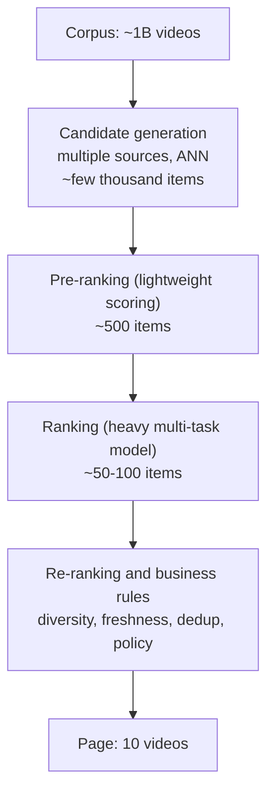
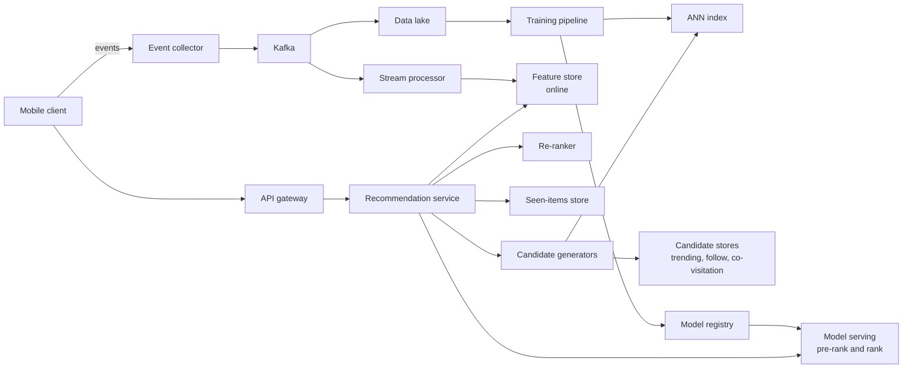
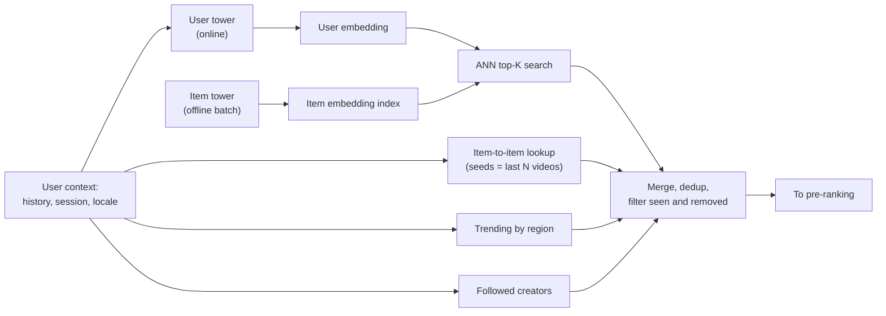
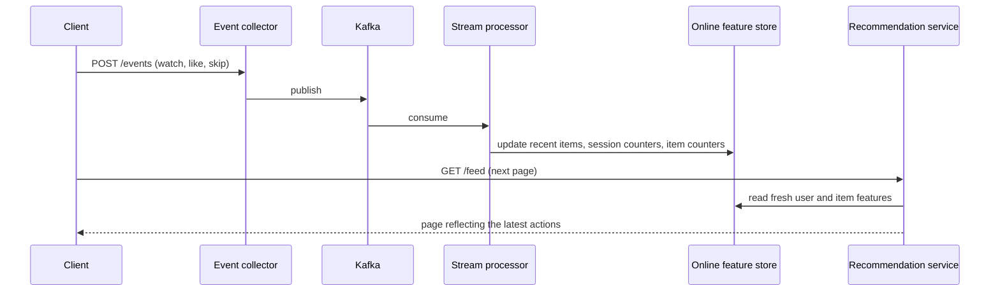
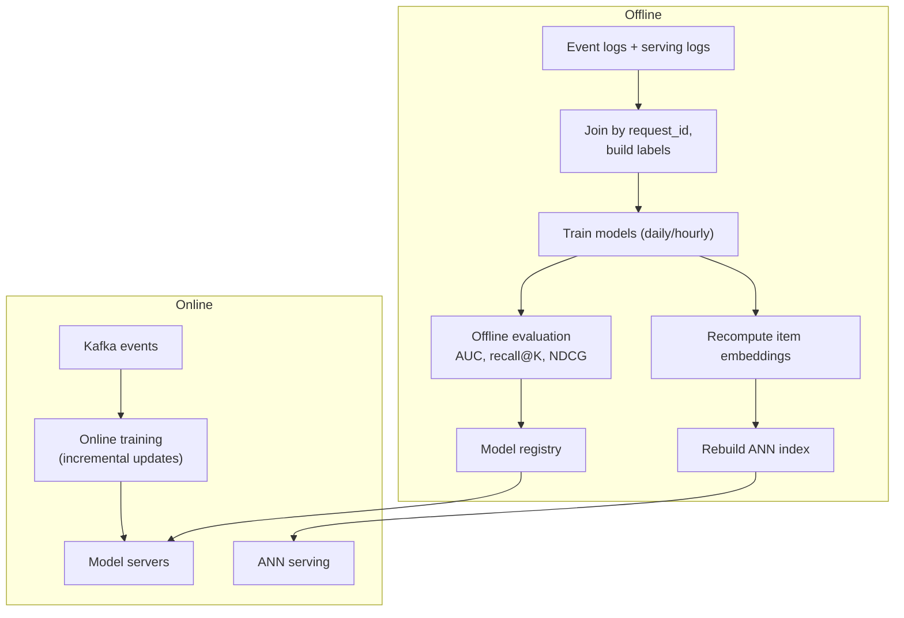

[Русский](./README.md) | **English**

# Chapter 32: Design a Recommendation System

## Introduction

In this chapter we design the backend of a **personalized recommendation system** for a short-video app — think of a "For You" feed or an Instagram Explore-style grid. The user opens the app and, without searching or following anyone, gets an endless feed of videos that the system believes they will enjoy.

This problem differs from the news feed chapter in one important way: a news feed is mostly built from content of accounts the user follows, so the candidate set is small and known in advance. A recommendation feed selects from the **entire corpus** — potentially hundreds of millions or billions of items — and has to do it within a couple hundred milliseconds.

The core idea every large-scale recommender shares is a **multi-stage funnel**: cheap models narrow down a huge corpus to a few thousand candidates, and progressively more expensive models re-score smaller and smaller sets until a handful of items is left. YouTube described a two-stage version of this (candidate generation + ranking) in 2016, and Instagram Explore describes a pipeline where candidate sourcing is followed by three ranking passes (500 → 150 → 50 → 25 candidates).

Note that an interview on this topic is a **system design** interview, not an ML interview: we need to know which models live where and why, but the focus is on data flow, latency, storage and scalability.

---

## Step 1: Understand the Problem and Establish Design Scope

Some questions to drive the interview:
 * C: What kind of content are we recommending?
 * I: Short videos (15-60s) uploaded by users. Think of a TikTok/Reels-style vertical feed.
 * C: Is the feed based on the follow graph, or purely on interests?
 * I: Mostly interest-based. Users can follow creators, but the main feed recommends content from anyone.
 * C: What signals are available?
 * I: Explicit ones (like, share, comment, follow, "not interested") and implicit ones (watch time, completion, re-watch, skip).
 * C: How quickly should the feed react to user behavior?
 * I: Within the same session. If a user suddenly watches several cooking videos, the next page should reflect that.
 * C: How many users and how many videos?
 * I: 100 million DAU. The corpus contains about 1 billion videos, and ~10 million new videos are uploaded per day.
 * C: Do new videos need to be recommended quickly?
 * I: Yes, fresh content should get a chance to be shown within minutes of upload.
 * C: Are there business rules, such as ads, content policy or creator fairness?
 * I: Content policy filtering is mandatory. Ads are out of scope. Diversity matters.
 * C: What about the model training itself?
 * I: Discuss the training pipeline at the system level, but don't go deep into model architectures.

### **Functional requirements**

 * Return a personalized, paginated feed of videos for a user
 * Take into account real-time signals from the current session
 * New users (no history) and new videos (no interactions) must be handled — the cold start problem
 * Never show the same video twice within a short window; never show removed or policy-violating videos
 * Support experimentation: multiple models/strategies running side by side as A/B tests

### **Non-functional requirements**

- **Low latency**: p99 latency of the feed request below ~200ms, so the next page loads before the user finishes the current video
- **High availability**: if the personalized pipeline degrades, we should still return *something* reasonable (fallback to cached or popular content)
- **Scalability**: handle tens of thousands of feed QPS and hundreds of thousands of events per second
- **Freshness**: user signals are reflected within seconds, new items become recommendable within minutes
- **Eventual consistency** is acceptable: a like registered a few seconds late won't hurt anyone

### **Back-of-the-envelope estimation**

All numbers below are **assumptions** for the sake of the exercise, not real figures of any company.

 * 100M DAU, each user opens 10 sessions per day, each session fetches 10 pages of 10 videos → 100M * 10 * 10 = **10B videos served per day**, or **1B feed requests per day**
 * **Feed QPS** = 1B / 86,400 ≈ **11.6k QPS** on average; assuming a 2x peak factor → **~23k QPS**
 * Each served video yields ~5 events (impression, watch progress, completion, like/skip, ...) → 10B * 5 = **50B events/day** ≈ **580k events/s**
 * Event size ~200 bytes → 50B * 200B = **10 TB/day** of raw interaction logs
 * Item embeddings: 1B videos * 64-dim float32 (256 bytes) = **256 GB** — too large for a single ANN node, so the index has to be sharded (or quantized)
 * Ranking cost: if the heavy ranking model scores 500 candidates per request, 23k * 500 ≈ **11.5M model predictions/s** at peak — this is why we cannot run the heavy model on the entire corpus, or even on all retrieved candidates

---

## Step 2: Propose High-Level Design and Get Buy-In

### **The multi-stage funnel**

The fundamental constraint is cost: the more accurate a model is, the more expensive each prediction. So we split the work into stages, each one scoring fewer items with a more expensive model:



 * **Candidate generation (retrieval)**: several independent sources each return hundreds of candidates. Goal is **recall** — don't miss good items. Must be very cheap per item.
 * **Pre-ranking**: a light model (often a two-tower model or a distilled version of the ranker) cuts thousands of candidates to a few hundred.
 * **Ranking**: a heavy model with hundreds of features, including user-item cross features, predicts the probabilities of several actions (watch, like, share, skip...). Goal is **precision**.
 * **Re-ranking**: not a model of "relevance" but a set of rules and list-level optimizations — diversity, freshness boosts, deduplication, policy filters.

### **High-level architecture**



 * **Recommendation service**: the orchestrator. Stateless; it fans out to candidate generators, fetches features, calls model servers, applies re-ranking and returns a page.
 * **Candidate generators**: each source is independent and can be implemented differently (ANN search, key-value lookup, precomputed lists).
 * **Feature store**: an online low-latency store (e.g. a Redis/Cassandra-like key-value store) with user features, item features and real-time counters, plus an offline counterpart used for training. Using the same feature definitions in both is key to avoid **training-serving skew**.
 * **Model serving**: a fleet of servers (often GPU-backed for the heavy ranker) serving model versions from the model registry.
 * **Event collector + Kafka**: all client events (impressions, watch time, likes, skips) are ingested and published to Kafka.
 * **Stream processor** (e.g. Flink): computes real-time features — recent watched items, rolling counters per item, session interests — and writes them to the online feature store.
 * **Data lake + training pipeline**: logs are joined with the features that were used at serving time into training examples; models are retrained and pushed to the registry; item embeddings are re-computed and the ANN index is rebuilt.

### **API design**

**Get feed**
```
GET /v1/feed?cursor={cursor}&count=10
```
Response:
```json
{
  "items": [
    {"video_id": "v_123", "url": "https://cdn.example.com/v_123.m3u8", "request_id": "r_987", "position": 0}
  ],
  "next_cursor": "c_456"
}
```
The `request_id` is critical: it ties every impression back to the exact model version, experiment bucket and features that produced it, which later lets us join events with serving logs for training and A/B analysis.

**Log events** (batched by the client)
```
POST /v1/events
```
```json
{
  "events": [
    {"type": "watch", "video_id": "v_123", "request_id": "r_987", "watch_ms": 14200, "duration_ms": 15000, "ts": 1727700000000},
    {"type": "like", "video_id": "v_123", "request_id": "r_987", "ts": 1727700001000}
  ]
}
```

### **Data model**

 * **Video metadata** (e.g. a relational or wide-column DB): `video_id, creator_id, upload_ts, duration, language, topics, status (active/removed)`
 * **User profile features** (online feature store, key = `user_id`): long-term interest embedding, demographics, language, aggregated stats updated daily
 * **Real-time user features** (key = `user_id`): last N watched/liked video ids, session topic counters — updated by the stream processor
 * **Item features** (key = `video_id`): content embedding, creator stats, real-time counters (views, likes, completion rate in the last hour)
 * **ANN index**: `video_id → embedding` for the two-tower item tower
 * **Seen-items store** (key = `user_id`): recently served video ids with TTL, e.g. a Bloom filter or a capped list in Redis
 * **Event log** (Kafka → data lake): append-only, partitioned by date

---

## Step 3: Design Deep Dive

### **Candidate generation**

No single source is good enough, so production systems blend several and then let the ranker decide. Typical sources:

 * **Collaborative filtering (item-to-item)**: "users who watched X also watched Y". Co-visitation counts are computed offline (or in a streaming job) and stored as `video_id → top-K related videos`. At request time, we take the user's last N interactions as seeds and look up their neighbors. Cheap and reacts instantly to the latest session signals.
 * **Matrix factorization**: factorize the user-item interaction matrix into user embeddings `U` and item embeddings `V` so that `U·Vᵀ` approximates the observed feedback. Weighted variants also push unobserved pairs toward zero and can be trained with WALS or SGD. Limitation: only IDs seen in training get embeddings, and it's hard to add side features.
 * **Two-tower model + ANN retrieval**: the modern default. A *user tower* encodes user features (history, context, demographics) into a vector; an *item tower* encodes item features (ID, content embedding, creator, ...) into a vector in the same space; relevance is their dot product. Since the item tower doesn't depend on the user, **all item embeddings can be precomputed** and put into an ANN index (HNSW, IVF-PQ, e.g. FAISS or ScaNN). At request time we compute only one user embedding and run a top-K ANN query. Training commonly uses in-batch negatives, with a correction for sampling bias toward popular items (Yi et al., 2019).
 * **Content-based**: embeddings of video frames, audio, captions and hashtags from pretrained models. Doesn't need interactions — essential for **new items**.
 * **Social / follow**: recent uploads of creators the user follows.
 * **Trending / popular**: per region/language, updated every few minutes by the stream processor. Serves as a fallback and cold-start source.
 * **Exploration**: a small quota of random or fresh candidates to gather feedback on items the models are uncertain about.



Each source has a fixed budget (e.g. two-tower 1000, item-to-item 500, trending 200...), and sources run **in parallel** with a timeout: a slow source is dropped instead of delaying the whole request. After merging, we remove duplicates, items the user has already seen (seen-items store) and removed/policy-violating items.

**Keeping the ANN index fresh**: with 10M uploads/day, a daily index rebuild would make new videos unreachable via two-tower retrieval for up to a day. Common approach: a full rebuild periodically (e.g. daily) plus incremental inserts of new item embeddings as they're computed (HNSW supports incremental inserts), and a separate "fresh content" source for items too new to have good embeddings.

### **Pre-ranking**

Scoring a few thousand candidates with the heavy ranker is too expensive, so a light model narrows the list down to a few hundred. Two common options:
 * a **two-tower model** where the score is a dot product of precomputed embeddings — cheap, but without user-item feature interactions;
 * a **distilled** small model trained to mimic the heavy ranker's scores (Instagram Explore describes this for its first ranking pass).

The key requirement for pre-ranking is **consistency** with the ranker: if pre-ranking optimizes a different objective, it will throw away items the ranker would have liked.

### **Ranking**

The ranker is where most of the quality comes from. It's typically a deep **multi-task** network that, for each `(user, item, context)` triple, predicts several probabilities at once: `P(watch > 50%)`, `P(like)`, `P(share)`, `P(follow)`, `P(skip)`, `P("not interested")`, expected watch time.

Features fall into several groups:
 * **User features**: long-term interest embedding, demographics, activity level
 * **Item features**: content embedding, duration, age of the video, creator popularity, real-time counters (CTR and completion rate over the last hour)
 * **Cross features**: how often the user watched this creator/topic, similarity between the user's recent items and this item
 * **Context**: time of day, device, network type, position in the session
 * **Sequence features**: the last N items the user interacted with, often processed by an attention layer

The final score combines task predictions via a **value model** — a weighted formula tuned via experiments, e.g.:

```
score = w1*P(complete) + w2*P(like) + w3*P(share) + w4*E[watch_time] - w5*P(not_interested)
```

Weights are business decisions: they define what the platform optimizes for. YouTube's 2016 paper, for example, used weighted logistic regression with watch time as the weight so that the ranker optimizes for expected watch time rather than click probability, which avoids rewarding clickbait.

Serving considerations:
 * Features for hundreds of candidates are fetched from the feature store in **batch** (multi-get), with item features cached locally in the recommendation service (they're shared across users).
 * The model server batches candidates into one inference call; GPUs are efficient here.
 * The ranker stores features used at scoring time into a **serving log** keyed by `request_id`. Training on these logged features (instead of recomputing them later) removes an important source of training-serving skew.

### **Re-ranking and business rules**

Sorting purely by score produces a monotonous feed — five videos from the same creator or topic in a row. The re-ranker applies list-level logic:
 * **Diversity**: e.g. no more than 2 videos from the same creator in a page, penalize items too similar to the ones already placed (MMR-style greedy selection or a sliding window rule)
 * **Freshness**: boost recently uploaded items
 * **Exploration quota**: reserve 1 slot out of 10 for new/uncertain items
 * **Policy & safety filters**: last-moment checks against removed or age-restricted content
 * **Dedup**: remove items already served in this or recent sessions

### **Real-time user signals**

For the feed to react within a session, signals have to flow back in seconds:



 * The stream processor maintains per-user state (last N items, session topic distribution) and per-item rolling counters (views, likes, completion rate in 5-min/1-h windows).
 * The client may also send its last few actions directly in the feed request to cover the few seconds of pipeline lag.
 * The user tower of the two-tower model uses the fresh sequence, so even retrieval adapts within the session.

### **Offline training vs online serving**



 * **Batch training**: examples are built by joining impressions with subsequent actions (label = watched > 50%, liked...) and the logged features. Models retrain on a schedule and are validated offline before release.
 * **Online (continuous) training**: models are updated incrementally from the event stream so they catch new trends and new IDs quickly. ByteDance's Monolith paper describes such a system: Kafka streams of actions and features are joined in Flink into training examples; sparse embedding parameters are synced from training to serving parameter servers at minute-level intervals, while dense parameters are synced less often. It uses a collisionless embedding table (cuckoo hashing) with expirable embeddings and frequency filtering to bound memory as new IDs keep appearing.
 * **Model rollout**: shadow mode → small canary → A/B test → full rollout, with automatic rollback if online metrics drop.

### **Cold start**

**New user**: no history, so collaborative sources are useless.
 * Use context: locale, language, device, time, acquisition source
 * Serve popular/trending content per region, plus a diverse "exploration" mix across topics
 * Optional onboarding: pick interests
 * Learn fast: real-time features after the first few swipes let the user tower produce a meaningful embedding within the first session

**New video**: no interactions, so ID embeddings are random.
 * Content-based embeddings (video, audio, text) and creator features make the item reachable by the item tower and content-based retrieval
 * A dedicated **fresh-content pool**: each new video gets a small guaranteed number of impressions to users whose interests match its content embedding; if early engagement is good, it graduates to broader distribution
 * Features like "age of the video" let the ranker learn how to treat new items (YouTube's paper introduced an "example age" feature to account for freshness)

### **Feedback loops and bias**

A recommender trains on data it itself generated: users can only interact with what they were shown. This leads to:
 * **Popularity bias / rich-get-richer**: popular items get more impressions, hence more positive labels, hence more impressions
 * **Position bias**: items at the top get more engagement regardless of relevance
 * **Filter bubbles**: users see an ever-narrowing slice of topics

Mitigations: exploration traffic (a small random or uncertainty-driven share of impressions), position as a feature during training (set to a fixed value at serving), sampling-bias correction for popular items, and diversity rules in re-ranking.

### **Latency budget**

An example split of the ~200ms p99 budget (assumption, not a benchmark):

| Stage | Budget |
|---|---|
| Request parsing, user features fetch | 10ms |
| Candidate generation (parallel sources, ANN) | 30ms |
| Filtering (seen, removed), merge | 10ms |
| Pre-ranking ~3000 → ~500 | 20ms |
| Feature fetch for ~500 items | 20ms |
| Ranking ~500 → ~100 | 60ms |
| Re-ranking, response assembly | 10ms |
| Network and headroom | 40ms |

Techniques to stay in budget: parallel fan-out with per-source timeouts, local caches of item features, batching inference on GPUs, and graceful degradation — if ranking times out, return pre-ranking order; if the whole pipeline fails, return a cached list.

### **Caching precomputed recommendations**

Most feed requests are "next page" requests. Instead of running the whole funnel for every page:
 * Run the funnel once per ~N pages: rank ~100 items, return the first 10, and store the rest in a per-user **session cache** (Redis, TTL of a few minutes). Subsequent pages are served from the cache, optionally re-ranked lightly with fresh signals.
 * Invalidate or shorten the cache when strong signals arrive ("not interested", a burst of skips), so the feed can still adapt within a session.
 * For inactive or low-traffic users, a batch job can **precompute** recommendations offline and store them, which also serves as a fallback if the online pipeline is down.
 * Trade-off: caching lowers cost and latency but makes the feed less responsive to fresh signals.

### **A/B testing and metrics**

**Offline metrics** evaluate a model on held-out logged data before it touches users:
 * Retrieval: recall@K, hit rate
 * Ranking: AUC / log loss per task, NDCG
 * Good offline metrics are necessary but not sufficient — logged data only covers items the old model chose to show

**Online metrics** are what actually matter:
 * Engagement: total watch time, completion rate, likes/shares per session
 * Retention: next-day/7-day return rate, session length, DAU
 * Health/guardrails: "not interested" rate, report rate, creator-side distribution (how many creators get impressions), latency and error rate

**A/B testing infrastructure**:
 * Users are deterministically bucketed via `hash(user_id, experiment_id)`, so a user stays in the same arm
 * The experiment config (model version, value-model weights, re-ranking rules) is attached to every request and logged via `request_id`
 * Experiments must run long enough to capture novelty effects, and metrics need statistical significance tests
 * Interleaving can be used as a faster, more sensitive comparison of two rankers before a full A/B test

---

## Step 4: Wrap Up

Recap of the design:
 * A **multi-stage funnel** (retrieval → pre-ranking → ranking → re-ranking) makes it possible to score a billion-item corpus within ~200ms
 * **Multiple candidate sources** (two-tower + ANN, item-to-item, content-based, trending, follow) balance recall, freshness and cold start
 * A **streaming pipeline** (Kafka + stream processing + online feature store) makes the feed react within a session
 * **Offline training** and **online serving** share feature definitions and logged features to avoid skew; online training catches trends faster
 * **Caching** of ranked lists reduces cost, **A/B testing** decides what ships

Additional talking points:
 * **Multi-objective optimization**: how to tune the value-model weights, and long-term vs short-term goals (retention vs immediate clicks)
 * **Integrity**: filtering spam, clickbait and borderline content inside the ranker, not only in re-ranking
 * **Ads blending**: inserting ads into the organic feed with a separate auction
 * **Privacy**: data retention, per-region regulations, opting out of personalization
 * **Generative retrieval / sequence models**: newer approaches that model the user's history as a sequence and generate candidates directly

---

## References

- [Deep Neural Networks for YouTube Recommendations (Covington, Adams, Sargin, RecSys 2016)](https://research.google/pubs/deep-neural-networks-for-youtube-recommendations/)
- [Sampling-Bias-Corrected Neural Modeling for Large Corpus Item Recommendations (Yi et al., RecSys 2019)](https://research.google/pubs/sampling-bias-corrected-neural-modeling-for-large-corpus-item-recommendations/)
- [Powered by AI: Instagram's Explore recommender system (Meta AI blog)](https://ai.meta.com/blog/powered-by-ai-instagrams-explore-recommender-system/)
- [Monolith: Real Time Recommendation System With Collisionless Embedding Table (Liu et al., 2022)](https://arxiv.org/abs/2209.07663)
- [Pinterest Home Feed Unified Lightweight Scoring: A Two-tower Approach (Pinterest Engineering)](https://medium.com/pinterest-engineering/pinterest-home-feed-unified-lightweight-scoring-a-two-tower-approach-b3143ac70b55)
- [Google Machine Learning: Recommendation Systems — Overview](https://developers.google.com/machine-learning/recommendation/overview/types)
- [Google Machine Learning: Recommendation Systems — Matrix Factorization](https://developers.google.com/machine-learning/recommendation/collaborative/matrix)
