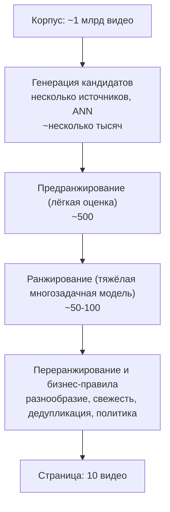
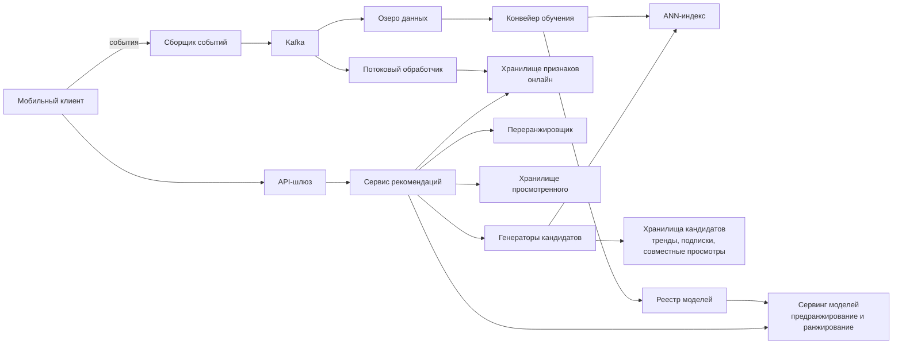
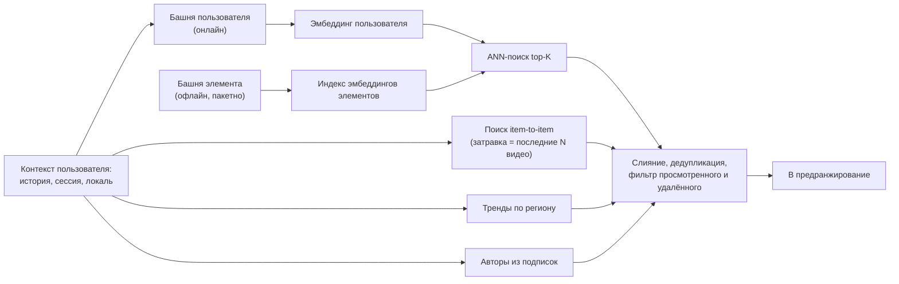
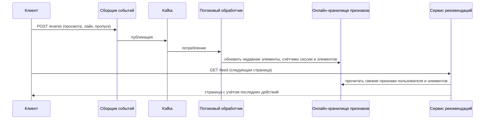
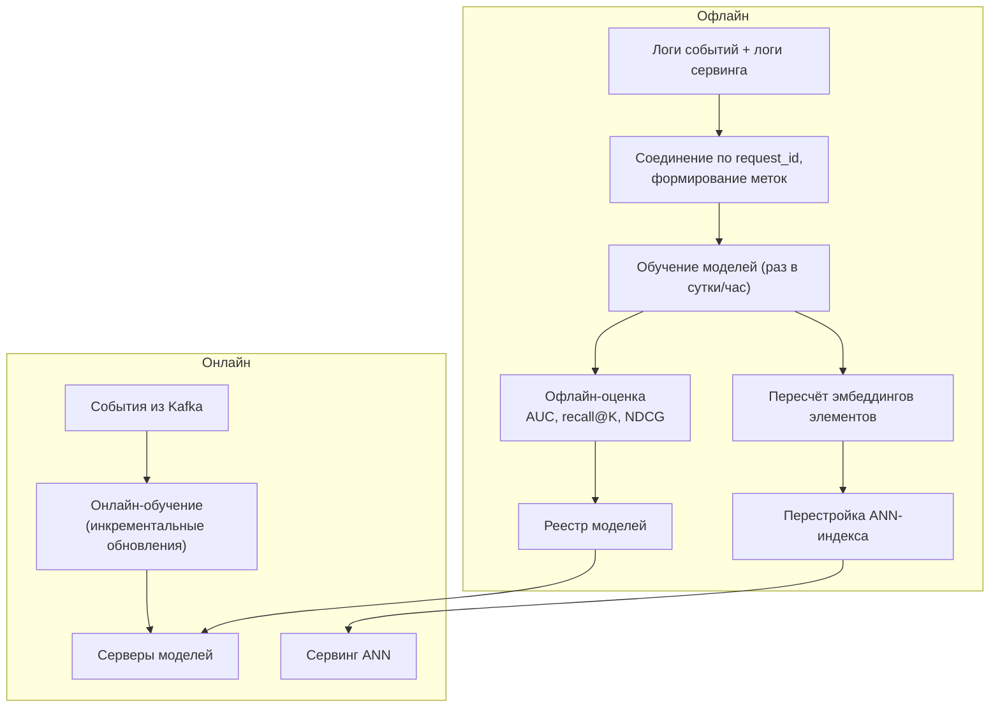

**Русский** | [English](./README.en.md)

# Глава 32: Проектирование рекомендательной системы

## Введение

В этой главе мы спроектируем бэкенд **персонализированной рекомендательной системы (recommendation system)** для приложения коротких видео — вроде ленты «Для вас» или сетки в стиле Instagram Explore. Пользователь открывает приложение и, ничего не ища и ни на кого не подписываясь, получает бесконечную ленту видео, которые, по мнению системы, ему понравятся.

От главы про новостную ленту эта задача отличается в одном важном аспекте: новостная лента в основном строится из контента аккаунтов, на которые подписан пользователь, поэтому множество кандидатов невелико и известно заранее. Рекомендательная лента выбирает из **всего корпуса** контента — потенциально из сотен миллионов или миллиардов единиц — и должна уложиться в пару сотен миллисекунд.

Ключевая идея, общая для всех крупных рекомендательных систем, — **многоступенчатая воронка (multi-stage funnel)**: дешёвые модели сужают огромный корпус до нескольких тысяч кандидатов, а всё более дорогие модели переоценивают всё меньшие множества, пока не останется несколько элементов. YouTube в 2016 году описал двухступенчатый вариант такой воронки (генерация кандидатов + ранжирование), а в Instagram Explore за отбором кандидатов следуют три прохода ранжирования (500 → 150 → 50 → 25 кандидатов).

Обратите внимание: собеседование на эту тему — это собеседование по **проектированию систем**, а не по ML (Machine Learning — машинное обучение). Нужно понимать, какие модели где работают и почему, но основной фокус — на потоках данных, задержках, хранении и масштабируемости.

---

## Шаг 1: Понять задачу и определить рамки проектирования

Вопросы, которые помогут направить собеседование:
 * К: Какой контент мы рекомендуем?
 * И: Короткие видео (15–60 с), загружаемые пользователями. Вертикальная лента в стиле TikTok/Reels.
 * К: Лента строится по графу подписок или исключительно по интересам?
 * И: В основном по интересам. Пользователи могут подписываться на авторов, но основная лента рекомендует контент от кого угодно.
 * К: Какие сигналы доступны?
 * И: Явные (лайк, репост, комментарий, подписка, «не интересно») и неявные (время просмотра, досмотр, повторный просмотр, пропуск).
 * К: Насколько быстро лента должна реагировать на поведение пользователя?
 * И: В пределах той же сессии. Если пользователь внезапно посмотрел несколько кулинарных видео, следующая страница должна это учесть.
 * К: Сколько пользователей и сколько видео?
 * И: 100 миллионов DAU (Daily Active Users — число уникальных пользователей, активных за сутки). Корпус — около 1 миллиарда видео, в день загружается около 10 миллионов новых.
 * К: Нужно ли быстро рекомендовать новые видео?
 * И: Да, свежий контент должен получить шанс на показ в течение нескольких минут после загрузки.
 * К: Есть ли бизнес-правила — реклама, контентная политика, справедливость по отношению к авторам?
 * И: Фильтрация по контентной политике обязательна. Реклама вне рамок задачи. Разнообразие важно.
 * К: А обучение самих моделей?
 * И: Обсудите конвейер обучения на уровне системы, но не углубляйтесь в архитектуры моделей.

### **Функциональные требования**

 * Возвращать персонализированную ленту видео с постраничной выдачей
 * Учитывать сигналы текущей сессии в реальном времени
 * Обрабатывать новых пользователей (без истории) и новые видео (без взаимодействий) — **проблема холодного старта (cold start)**
 * Не показывать одно и то же видео дважды за короткий промежуток; никогда не показывать удалённые видео и видео, нарушающие правила
 * Поддерживать эксперименты: несколько моделей/стратегий работают параллельно в рамках A/B-тестов (A/B testing — сравнение вариантов на случайно разделённых группах пользователей)

### **Нефункциональные требования**

- **Низкая задержка**: p99 (99-й процентиль — значение, которое не превышают 99% запросов) задержки запроса ленты — не более ~200 мс, чтобы следующая страница загрузилась раньше, чем пользователь досмотрит текущее видео
- **Высокая доступность**: если персонализированный конвейер деградирует, всё равно нужно вернуть *что-то* разумное (откат на закэшированный или популярный контент)
- **Масштабируемость**: десятки тысяч запросов ленты в секунду и сотни тысяч событий в секунду
- **Свежесть (freshness)**: сигналы пользователя учитываются за секунды, новые элементы становятся доступны для рекомендаций за минуты
- **Согласованность в конечном счёте (eventual consistency)** допустима: лайк, учтённый на несколько секунд позже, никому не навредит

### **Оценка «на салфетке» (back-of-the-envelope)**

Все числа ниже — **допущения** для упражнения, а не реальные показатели какой-либо компании.

 * 100 млн DAU, каждый пользователь открывает 10 сессий в день, в каждой сессии загружается 10 страниц по 10 видео → 100 млн * 10 * 10 = **10 млрд показанных видео в день**, или **1 млрд запросов ленты в день**
 * **QPS ленты** (Queries Per Second — запросов в секунду) = 1 млрд / 86 400 ≈ **11,6 тыс. QPS** в среднем; при пиковом коэффициенте 2x → **~23 тыс. QPS**
 * Каждое показанное видео порождает ~5 событий (показ, прогресс просмотра, досмотр, лайк/пропуск, ...) → 10 млрд * 5 = **50 млрд событий в день** ≈ **580 тыс. событий/с**
 * Размер события ~200 байт → 50 млрд * 200 Б = **10 ТБ в день** сырых логов взаимодействий
 * Эмбеддинги (embeddings — векторные представления) элементов: 1 млрд видео * 64-мерный float32 (256 байт) = **256 ГБ** — слишком много для одного узла ANN (Approximate Nearest Neighbor — приближённый поиск ближайших соседей), поэтому индекс нужно шардировать (или квантовать)
 * Стоимость ранжирования: если тяжёлая модель ранжирования оценивает 500 кандидатов на запрос, то 23 тыс. * 500 ≈ **11,5 млн предсказаний модели в секунду** в пике — именно поэтому нельзя прогонять тяжёлую модель по всему корпусу и даже по всем отобранным кандидатам

---

## Шаг 2: Предложить высокоуровневый дизайн и получить одобрение

### **Многоступенчатая воронка**

Фундаментальное ограничение — стоимость: чем точнее модель, тем дороже каждое предсказание. Поэтому работа делится на этапы, и каждый следующий оценивает меньше элементов более дорогой моделью:



 * **Генерация кандидатов (candidate generation, retrieval)**: несколько независимых источников возвращают по несколько сотен кандидатов. Цель — **полнота (recall)**: не упустить хорошие элементы. Оценка одного элемента должна быть очень дешёвой.
 * **Предранжирование (pre-ranking)**: лёгкая модель (часто двухбашенная или дистиллированная версия ранжировщика) сокращает тысячи кандидатов до нескольких сотен.
 * **Ранжирование (ranking)**: тяжёлая модель с сотнями признаков, включая перекрёстные признаки «пользователь — элемент», предсказывает вероятности нескольких действий (просмотр, лайк, репост, пропуск...). Цель — **точность (precision)**.
 * **Переранжирование (re-ranking)**: не модель «релевантности», а набор правил и оптимизаций на уровне всего списка — разнообразие, буст свежести, дедупликация, фильтры по политике.

### **Высокоуровневая архитектура**



 * **Сервис рекомендаций**: оркестратор. Не хранит состояние; параллельно опрашивает генераторы кандидатов, получает признаки, вызывает серверы моделей, применяет переранжирование и возвращает страницу. Запросы к нему приходят через шлюз API (Application Programming Interface — программный интерфейс приложения).
 * **Генераторы кандидатов**: каждый источник независим и может быть реализован по-своему (ANN-поиск, поиск по ключу, заранее вычисленные списки).
 * **Хранилище признаков (feature store)**: онлайн-хранилище типа «ключ — значение» с низкой задержкой (в духе Redis/Cassandra) для признаков пользователей, признаков элементов и счётчиков реального времени, плюс офлайн-аналог для обучения. Использование одних и тех же определений признаков в обоих — ключ к тому, чтобы избежать **расхождения между обучением и сервингом (training-serving skew)**.
 * **Сервинг моделей (model serving)**: парк серверов (для тяжёлого ранжировщика часто с GPU — Graphics Processing Unit, графический процессор), обслуживающих версии моделей из реестра моделей.
 * **Сборщик событий + Kafka**: все клиентские события (показы, время просмотра, лайки, пропуски) принимаются и публикуются в Kafka.
 * **Потоковый обработчик (stream processor)** (например, Flink): вычисляет признаки реального времени — недавно просмотренные элементы, скользящие счётчики по элементам, интересы в текущей сессии — и записывает их в онлайн-хранилище признаков.
 * **Озеро данных (data lake) + конвейер обучения**: логи соединяются с признаками, использованными при сервинге, и превращаются в обучающие примеры; модели переобучаются и публикуются в реестр; эмбеддинги элементов пересчитываются, а ANN-индекс перестраивается.

### **Дизайн API**

**Получить ленту**
```
GET /v1/feed?cursor={cursor}&count=10
```
Ответ:
```json
{
  "items": [
    {"video_id": "v_123", "url": "https://cdn.example.com/v_123.m3u8", "request_id": "r_987", "position": 0}
  ],
  "next_cursor": "c_456"
}
```
`request_id` критически важен: он связывает каждый показ с конкретной версией модели, группой эксперимента и признаками, которые его породили. Это позволяет потом соединять события с логами сервинга для обучения и анализа A/B-тестов.

**Отправить события** (клиент отправляет пачками)
```
POST /v1/events
```
```json
{
  "events": [
    {"type": "watch", "video_id": "v_123", "request_id": "r_987", "watch_ms": 14200, "duration_ms": 15000, "ts": 1727700000000},
    {"type": "like", "video_id": "v_123", "request_id": "r_987", "ts": 1727700001000}
  ]
}
```

### **Модель данных**

 * **Метаданные видео** (например, реляционная или wide-column база данных): `video_id, creator_id, upload_ts, duration, language, topics, status (active/removed)`
 * **Профильные признаки пользователя** (онлайн-хранилище признаков, ключ — `user_id`): эмбеддинг долгосрочных интересов, демография, язык, агрегированная статистика, обновляемая раз в сутки
 * **Признаки пользователя в реальном времени** (ключ — `user_id`): последние N просмотренных/лайкнутых видео, счётчики тем в сессии — обновляются потоковым обработчиком
 * **Признаки элементов** (ключ — `video_id`): контентный эмбеддинг, статистика автора, счётчики реального времени (просмотры, лайки, доля досмотров за последний час)
 * **ANN-индекс**: `video_id → embedding` из «башни» элементов двухбашенной модели
 * **Хранилище просмотренного** (ключ — `user_id`): недавно показанные видео с TTL (Time To Live — время жизни записи), например фильтр Блума или ограниченный список в Redis
 * **Лог событий** (Kafka → озеро данных): только дозапись, партиционирование по дате

---

## Шаг 3: Детальное проектирование

### **Генерация кандидатов**

Ни один источник сам по себе не достаточно хорош, поэтому промышленные системы смешивают несколько источников, а решение оставляют ранжировщику. Типичные источники:

 * **Коллаборативная фильтрация (collaborative filtering), item-to-item**: «пользователи, посмотревшие X, смотрели и Y». Счётчики совместных просмотров (co-visitation) вычисляются офлайн (или потоковой задачей) и хранятся как `video_id → top-K похожих видео`. При запросе берём последние N взаимодействий пользователя как «затравку» (seeds) и находим их соседей. Дёшево и мгновенно реагирует на свежие сигналы сессии.
 * **Матричная факторизация (matrix factorization)**: матрица взаимодействий «пользователь — элемент» раскладывается на эмбеддинги пользователей `U` и элементов `V` так, чтобы `U·Vᵀ` приближало наблюдаемую обратную связь. Взвешенные варианты дополнительно подталкивают ненаблюдаемые пары к нулю и обучаются методом WALS (Weighted Alternating Least Squares — взвешенные чередующиеся наименьшие квадраты) или SGD (Stochastic Gradient Descent — стохастический градиентный спуск). Ограничение: эмбеддинги есть только у ID (идентификаторов), встреченных при обучении, и в модель сложно добавить дополнительные признаки.
 * **Двухбашенная модель (two-tower model) + ANN-поиск**: современный стандарт. *Башня пользователя* кодирует признаки пользователя (история, контекст, демография) в вектор; *башня элемента* кодирует признаки элемента (ID, контентный эмбеддинг, автор, ...) в вектор того же пространства; релевантность — их скалярное произведение. Поскольку башня элемента не зависит от пользователя, **все эмбеддинги элементов можно вычислить заранее** и положить в ANN-индекс (HNSW — Hierarchical Navigable Small World, графовый индекс; IVF-PQ — Inverted File with Product Quantization, кластеризация с квантованием векторов; реализации — например, библиотеки FAISS или ScaNN). При запросе вычисляется только один эмбеддинг пользователя и выполняется top-K запрос к ANN. При обучении обычно используют негативные примеры из того же батча (in-batch negatives) с поправкой на смещение выборки в сторону популярных элементов (Yi et al., 2019).
 * **Контентные рекомендации (content-based)**: эмбеддинги кадров, аудио, подписей и хэштегов, полученные предобученными моделями. Не требуют взаимодействий — незаменимы для **новых элементов**.
 * **Социальные / подписки**: свежие загрузки авторов, на которых подписан пользователь.
 * **Тренды / популярное**: по регионам и языкам, обновляются каждые несколько минут потоковым обработчиком. Служат запасным вариантом и источником для холодного старта.
 * **Исследование (exploration)**: небольшая квота случайных или свежих кандидатов, чтобы собрать обратную связь по элементам, в которых модели не уверены.



У каждого источника фиксированный бюджет (например, двухбашенная модель — 1000, item-to-item — 500, тренды — 200...), и источники работают **параллельно** с таймаутом: медленный источник отбрасывается, а не задерживает весь запрос. После слияния удаляются дубликаты, уже просмотренные пользователем элементы (хранилище просмотренного) и удалённые/нарушающие правила элементы.

**Поддержание свежести ANN-индекса**: при 10 млн загрузок в день ежедневная перестройка индекса сделала бы новые видео недоступными для двухбашенного поиска на срок до суток. Распространённый подход: периодическая полная перестройка (например, раз в сутки) плюс инкрементальная вставка эмбеддингов новых элементов по мере их вычисления (HNSW поддерживает инкрементальные вставки), а также отдельный источник «свежего контента» для элементов, слишком новых, чтобы иметь качественные эмбеддинги.

### **Предранжирование**

Оценивать несколько тысяч кандидатов тяжёлым ранжировщиком слишком дорого, поэтому лёгкая модель сужает список до нескольких сотен. Два распространённых варианта:
 * **двухбашенная модель**, где оценка — скалярное произведение заранее вычисленных эмбеддингов: дёшево, но без взаимодействия признаков пользователя и элемента;
 * **дистиллированная (distilled)** маленькая модель, обученная имитировать оценки тяжёлого ранжировщика (Instagram Explore описывает такой подход для первого прохода ранжирования).

Ключевое требование к предранжированию — **согласованность** с ранжировщиком: если предранжирование оптимизирует другую цель, оно выбросит элементы, которые ранжировщик оценил бы высоко.

### **Ранжирование**

Ранжировщик даёт основную часть качества. Обычно это глубокая **многозадачная (multi-task)** нейросеть, которая для каждой тройки `(user, item, context)` одновременно предсказывает несколько вероятностей: `P(watch > 50%)`, `P(like)`, `P(share)`, `P(follow)`, `P(skip)`, `P("not interested")`, ожидаемое время просмотра.

Признаки делятся на несколько групп:
 * **Признаки пользователя**: эмбеддинг долгосрочных интересов, демография, уровень активности
 * **Признаки элемента**: контентный эмбеддинг, длительность, возраст видео, популярность автора, счётчики реального времени (CTR — Click-Through Rate, доля кликов от показов, — и доля досмотров за последний час)
 * **Перекрёстные признаки (cross features)**: как часто пользователь смотрел этого автора/эту тему, сходство между недавними элементами пользователя и данным элементом
 * **Контекст**: время суток, устройство, тип сети, позиция в сессии
 * **Последовательностные признаки (sequence features)**: последние N элементов, с которыми взаимодействовал пользователь, часто обрабатываемые слоем внимания (attention)

Итоговая оценка объединяет предсказания задач через **модель ценности (value model)** — взвешенную формулу, веса которой подбираются экспериментами, например:

```
score = w1*P(complete) + w2*P(like) + w3*P(share) + w4*E[watch_time] - w5*P(not_interested)
```

Веса — это бизнес-решение: они определяют, что именно оптимизирует платформа. Например, в статье YouTube 2016 года использовалась взвешенная логистическая регрессия с временем просмотра в качестве веса, чтобы ранжировщик оптимизировал ожидаемое время просмотра, а не вероятность клика, — это не поощряет кликбейт.

Особенности сервинга:
 * Признаки для сотен кандидатов забираются из хранилища признаков **пакетно** (multi-get), а признаки элементов кэшируются локально в сервисе рекомендаций (они общие для всех пользователей).
 * Сервер модели объединяет кандидатов в один вызов инференса; здесь эффективны GPU.
 * Ранжировщик записывает признаки, использованные при оценке, в **лог сервинга (serving log)** с ключом `request_id`. Обучение на этих залогированных признаках (вместо их повторного вычисления постфактум) устраняет важный источник расхождения между обучением и сервингом.

### **Переранжирование и бизнес-правила**

Сортировка только по оценке даёт монотонную ленту — пять видео одного автора или на одну тему подряд. Переранжировщик применяет логику на уровне списка:
 * **Разнообразие (diversity)**: например, не более 2 видео одного автора на странице, штраф за элементы, слишком похожие на уже размещённые (жадный отбор в стиле MMR — Maximal Marginal Relevance, баланс релевантности и новизны относительно уже выбранного, — или правило скользящего окна)
 * **Свежесть**: буст недавно загруженных элементов
 * **Квота исследования**: 1 слот из 10 резервируется под новые/неопределённые элементы
 * **Фильтры политики и безопасности**: проверка в последний момент на удалённый контент или контент с возрастными ограничениями
 * **Дедупликация**: удаление элементов, уже показанных в этой или недавних сессиях

### **Сигналы пользователя в реальном времени**

Чтобы лента реагировала в пределах сессии, сигналы должны возвращаться в систему за секунды:



 * Потоковый обработчик хранит состояние по пользователю (последние N элементов, распределение тем в сессии) и скользящие счётчики по элементам (просмотры, лайки, доля досмотров в окнах 5 мин/1 ч).
 * Клиент может также передавать свои последние действия прямо в запросе ленты, чтобы покрыть несколько секунд задержки конвейера.
 * Башня пользователя двухбашенной модели использует свежую последовательность, так что даже этап отбора кандидатов адаптируется в пределах сессии.

### **Офлайн-обучение и онлайн-сервинг**



 * **Пакетное обучение (batch training)**: примеры строятся соединением показов с последующими действиями (метка — досмотрено > 50%, лайкнуто...) и залогированными признаками. Модели переобучаются по расписанию и перед выпуском проверяются офлайн.
 * **Онлайн (непрерывное) обучение (online training)**: модели инкрементально обновляются из потока событий, чтобы быстро подхватывать новые тренды и новые ID. Такая система описана в статье ByteDance о Monolith: потоки действий и признаков из Kafka соединяются во Flink в обучающие примеры; разреженные параметры эмбеддингов синхронизируются с обучающих серверов параметров на сервинговые с интервалом порядка минут, а плотные параметры — реже. Используется бесколлизионная таблица эмбеддингов (cuckoo hashing — кукушкино хеширование) с истекающими эмбеддингами и фильтрацией по частоте, чтобы ограничить память при постоянном появлении новых ID.
 * **Выкатка модели**: теневой режим → небольшая канареечная группа → A/B-тест → полная выкатка с автоматическим откатом при падении онлайн-метрик.

### **Холодный старт**

**Новый пользователь**: истории нет, поэтому коллаборативные источники бесполезны.
 * Использовать контекст: локаль, язык, устройство, время, источник привлечения
 * Показывать популярный/трендовый контент по региону плюс разнообразную «исследовательскую» смесь тем
 * Опционально — онбординг с выбором интересов
 * Быстро учиться: признаки реального времени после первых нескольких свайпов позволяют башне пользователя выдать осмысленный эмбеддинг уже в первой сессии

**Новое видео**: взаимодействий нет, поэтому ID-эмбеддинги случайны.
 * Контентные эмбеддинги (видео, аудио, текст) и признаки автора делают элемент достижимым через башню элемента и контентный поиск
 * Отдельный **пул свежего контента**: каждое новое видео получает небольшое гарантированное число показов пользователям, чьи интересы соответствуют его контентному эмбеддингу; если раннее вовлечение хорошее, видео переходит к более широкому распространению
 * Признаки вроде «возраста видео» позволяют ранжировщику научиться обращаться с новыми элементами (в статье YouTube для учёта свежести был введён признак «возраст примера» (example age))

### **Петли обратной связи и смещения**

Рекомендательная система обучается на данных, которые сама же сгенерировала: пользователи могут взаимодействовать только с тем, что им показали. Это приводит к:
 * **Смещению популярности (popularity bias) / «богатые богатеют»**: популярные элементы получают больше показов, следовательно больше позитивных меток, следовательно ещё больше показов
 * **Позиционному смещению (position bias)**: элементы вверху получают больше вовлечения независимо от релевантности
 * **Пузырям фильтров (filter bubbles)**: пользователь видит всё более узкий срез тем

Способы смягчения: трафик на исследование (небольшая случайная или основанная на неопределённости доля показов), позиция как признак при обучении (с фиксированным значением при сервинге), поправка на смещение выборки для популярных элементов и правила разнообразия при переранжировании.

### **Бюджет задержки**

Пример распределения бюджета ~200 мс p99 (допущение, а не бенчмарк):

| Этап | Бюджет |
|---|---|
| Разбор запроса, получение признаков пользователя | 10 мс |
| Генерация кандидатов (параллельные источники, ANN) | 30 мс |
| Фильтрация (просмотренное, удалённое), слияние | 10 мс |
| Предранжирование ~3000 → ~500 | 20 мс |
| Получение признаков для ~500 элементов | 20 мс |
| Ранжирование ~500 → ~100 | 60 мс |
| Переранжирование, сборка ответа | 10 мс |
| Сеть и запас | 40 мс |

Приёмы, позволяющие уложиться в бюджет: параллельный опрос источников с таймаутами на каждый, локальные кэши признаков элементов, пакетный инференс на GPU и плавная деградация (graceful degradation) — если ранжирование не успело, вернуть порядок предранжирования; если весь конвейер отказал, вернуть закэшированный список.

### **Кэширование предвычисленных рекомендаций**

Большинство запросов ленты — это запросы «следующей страницы». Вместо того чтобы прогонять всю воронку на каждую страницу:
 * Прогонять воронку раз в ~N страниц: отранжировать ~100 элементов, вернуть первые 10, а остальные сохранить в **сессионном кэше** пользователя (Redis, TTL в несколько минут). Последующие страницы отдаются из кэша, при необходимости с лёгким переранжированием по свежим сигналам.
 * Инвалидировать или укорачивать кэш при сильных сигналах («не интересно», серия пропусков), чтобы лента всё равно адаптировалась в пределах сессии.
 * Для неактивных или малоактивных пользователей пакетная задача может **заранее вычислять** рекомендации офлайн и сохранять их; это же служит запасным вариантом, если онлайн-конвейер недоступен.
 * Компромисс: кэширование снижает стоимость и задержку, но делает ленту менее отзывчивой к свежим сигналам.

### **A/B-тестирование и метрики**

**Офлайн-метрики** оценивают модель на отложенных залогированных данных до того, как она попадёт к пользователям:
 * Отбор кандидатов: recall@K (доля релевантных элементов, попавших в top-K), hit rate (доля случаев, когда хотя бы один релевантный элемент попал в выдачу)
 * Ранжирование: AUC (Area Under the ROC Curve — площадь под ROC-кривой, качество разделения положительных и отрицательных примеров) и log loss (логарифмическая функция потерь) по каждой задаче, NDCG (Normalized Discounted Cumulative Gain — нормированная метрика качества порядка, учитывающая позицию релевантных элементов)
 * Хорошие офлайн-метрики необходимы, но не достаточны: залогированные данные покрывают только те элементы, которые решила показать старая модель

**Онлайн-метрики** — это то, что действительно важно:
 * Вовлечённость: суммарное время просмотра, доля досмотров, лайки/репосты за сессию
 * Удержание (retention): доля вернувшихся на следующий день/через 7 дней, длина сессии, DAU
 * Здоровье системы / ограничительные метрики (guardrails): доля «не интересно», доля жалоб, распределение показов по авторам (сколько авторов получают показы), задержка и доля ошибок

**Инфраструктура A/B-тестирования**:
 * Пользователи детерминированно распределяются по группам через `hash(user_id, experiment_id)`, поэтому пользователь всегда остаётся в одной группе
 * Конфигурация эксперимента (версия модели, веса модели ценности, правила переранжирования) прикрепляется к каждому запросу и логируется через `request_id`
 * Эксперименты должны длиться достаточно долго, чтобы учесть эффект новизны, а метрики требуют проверки статистической значимости
 * Чередование (interleaving) можно использовать как более быстрое и чувствительное сравнение двух ранжировщиков до полноценного A/B-теста

---

## Шаг 4: Подведение итогов

Краткое резюме дизайна:
 * **Многоступенчатая воронка** (отбор кандидатов → предранжирование → ранжирование → переранжирование) позволяет оценить корпус из миллиарда элементов за ~200 мс
 * **Несколько источников кандидатов** (двухбашенная модель + ANN, item-to-item, контентные, тренды, подписки) обеспечивают баланс полноты, свежести и холодного старта
 * **Потоковый конвейер** (Kafka + потоковая обработка + онлайн-хранилище признаков) позволяет ленте реагировать в пределах сессии
 * **Офлайн-обучение** и **онлайн-сервинг** используют общие определения признаков и залогированные признаки, чтобы избежать расхождения; онлайн-обучение быстрее подхватывает тренды
 * **Кэширование** отранжированных списков снижает стоимость, а **A/B-тестирование** решает, что попадёт в продакшен

Дополнительные темы для обсуждения:
 * **Многокритериальная оптимизация (multi-objective optimization)**: как настраивать веса модели ценности; долгосрочные цели против краткосрочных (удержание против сиюминутных кликов)
 * **Целостность (integrity)**: фильтрация спама, кликбейта и пограничного контента внутри ранжировщика, а не только при переранжировании
 * **Встраивание рекламы**: вставка рекламы в органическую ленту с отдельным аукционом
 * **Приватность**: сроки хранения данных, региональные регуляции, отказ от персонализации
 * **Генеративный отбор кандидатов / последовательностные модели**: новые подходы, моделирующие историю пользователя как последовательность и генерирующие кандидатов напрямую

---

## Источники

- [Deep Neural Networks for YouTube Recommendations (Covington, Adams, Sargin, RecSys 2016)](https://research.google/pubs/deep-neural-networks-for-youtube-recommendations/)
- [Sampling-Bias-Corrected Neural Modeling for Large Corpus Item Recommendations (Yi et al., RecSys 2019)](https://research.google/pubs/sampling-bias-corrected-neural-modeling-for-large-corpus-item-recommendations/)
- [Powered by AI: Instagram's Explore recommender system (Meta AI blog)](https://ai.meta.com/blog/powered-by-ai-instagrams-explore-recommender-system/)
- [Monolith: Real Time Recommendation System With Collisionless Embedding Table (Liu et al., 2022)](https://arxiv.org/abs/2209.07663)
- [Pinterest Home Feed Unified Lightweight Scoring: A Two-tower Approach (Pinterest Engineering)](https://medium.com/pinterest-engineering/pinterest-home-feed-unified-lightweight-scoring-a-two-tower-approach-b3143ac70b55)
- [Google Machine Learning: Recommendation Systems — Overview](https://developers.google.com/machine-learning/recommendation/overview/types)
- [Google Machine Learning: Recommendation Systems — Matrix Factorization](https://developers.google.com/machine-learning/recommendation/collaborative/matrix)
