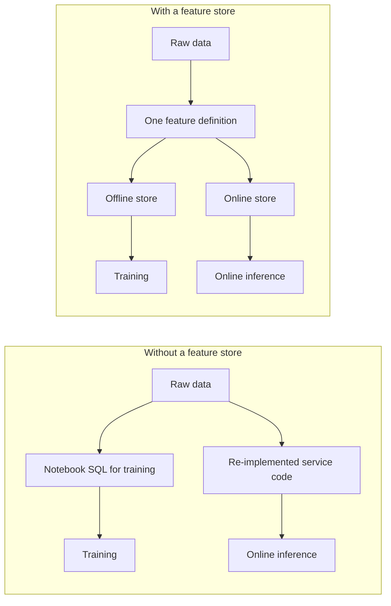
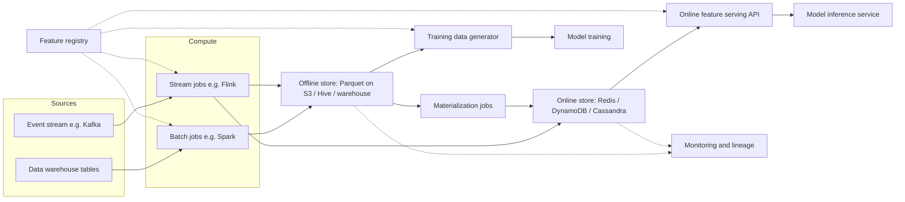
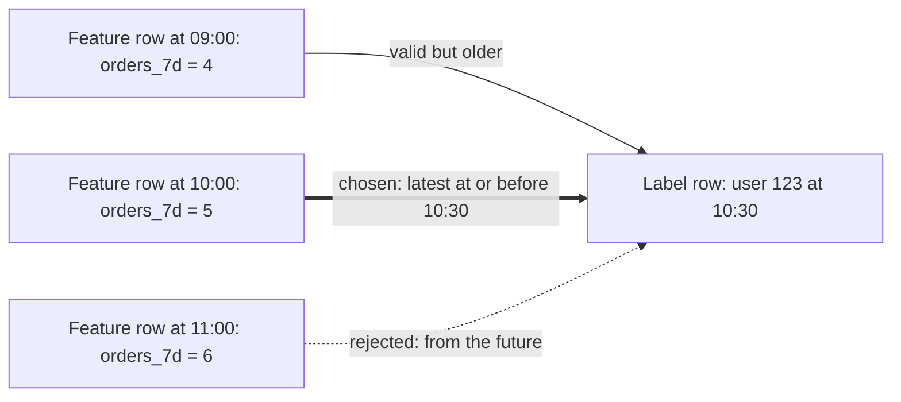
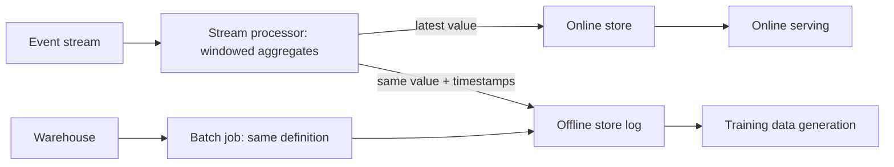
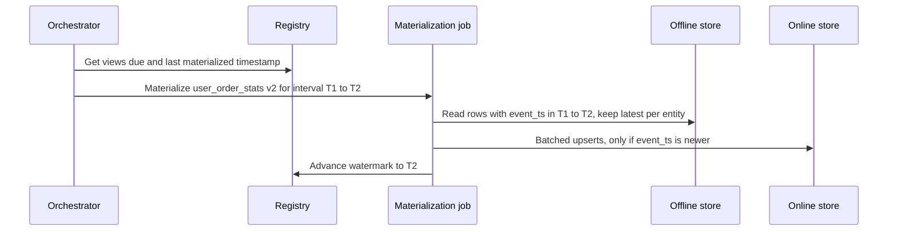

[Русский](./README.md) | **English**

# Chapter 33: Design a Feature Store

## Introduction

In this chapter we design a **feature store** — the part of an ML platform that computes, stores and serves the input signals (features) that machine learning models consume.

A feature is any value a model uses as input: "number of orders placed by this user in the last 7 days", "is this card used from a new device". Most features are derived from raw data (event logs, database tables) through aggregations.

Why a dedicated system? Without one, an organization ends up with two implementations of every feature:
 * Data scientists compute features for **training** in a notebook or a Spark job over the data warehouse, using SQL over historical data.
 * Engineers re-implement the same logic for **serving** inside a product microservice, reading from production databases, caches or streams.

The two implementations inevitably diverge (different null handling, different time windows, different time zones, bugs fixed in one place only). The model is then trained on one distribution and served on another. This is called **training/serving skew**, and it silently degrades model quality without raising any errors.

Uber described exactly this motivation behind its Michelangelo platform: models deployed online cannot read the data lake directly, and it is hard to compute many features efficiently from online databases, so the platform guarantees that the same data and pipelines are used for training and serving.

A feature store addresses it by making a **feature definition** the single source of truth, from which both the historical (training) values and the fresh (serving) values are produced.



Well-known systems in this space: Uber Michelangelo (and its feature store Palette), Feast (open source), Tecton, Airbnb Zipline and its successor Chronon (open source), Hopsworks, and the feature stores built into cloud ML platforms.

---

## Step 1: Understand the Problem and Establish Design Scope

A feature store can mean anything from a metadata catalog to a full compute platform, so it's important to pin down the scope.

 * C: Who are the users of the system?
 * I: Data scientists who train models and ML engineers who deploy them. Many teams across the company — fraud, recommendations, pricing, search.
 * C: Should we support both training and real-time inference?
 * I: Yes. Training data generation over historical data and low-latency feature lookup for online models. Batch scoring should also be possible.
 * C: Do we own feature computation, or only storage and serving?
 * I: Users write feature definitions (SQL or Python/Spark transformations, windowed aggregations), and the platform runs the pipelines.
 * C: How fresh must features be?
 * I: Most features are fine being refreshed daily or hourly. Some features, e.g. for fraud detection, must reflect events from the last few seconds.
 * C: What latency is expected for online feature lookup?
 * I: The feature fetch is only a part of the prediction request budget. Let's target p99 under 10 ms.
 * C: Do we need to support features that depend on the request itself, e.g. the distance between the user and a restaurant?
 * I: Yes, but it's a smaller use case — keep it in mind.
 * C: Do we need to guarantee that training data contains no information from the future?
 * I: Yes, that's a hard requirement. Leakage makes offline metrics look great and production metrics terrible.
 * C: Is monitoring in scope?
 * I: Yes — data freshness and basic data quality/drift monitoring.

### **Functional requirements**

 * Register, version, discover and share feature definitions (a feature registry)
 * Compute features from batch sources (data warehouse tables) and streaming sources (event streams)
 * Generate **point-in-time correct** training datasets: for each labeled example, return feature values as they were known at the example's timestamp
 * Serve the latest feature values for a set of entities with low latency
 * Materialize (load) feature values from the offline store to the online store
 * Backfill historical values for new or changed features
 * Monitor freshness, data quality and drift; track lineage

### **Non-functional requirements**

- **Low latency** online reads: p99 < 10 ms for a batch of features for one prediction
- **High availability** of the online path: if features can't be served, models can't make predictions
- **Scalability**: hundreds of millions of entities, thousands of features, many teams
- **Consistency between offline and online values**: the same definition must yield the same value in both stores (modulo freshness)
- **Eventual consistency is acceptable**: an online value may lag the source by the feature's freshness SLA (seconds for streaming, hours for batch)
- **Reproducibility**: a training dataset generated today for a past time range should be regenerable later

### **Back-of-the-envelope estimation**

All numbers below are assumptions for the interview, not figures from any real company.

 * Entities served online: 100 million users (other entity types — merchants, items — are smaller and ignored here)
 * Online features per user: 200, average 8 bytes per value
 * Raw feature payload per user: 200 * 8 B = **1.6 KB**; with keys, timestamps and serialization overhead, round up to ~2 KB
 * **Online store size**: 100M * 2 KB = **200 GB**; with 3 replicas = **600 GB** — fits comfortably in an in-memory cluster of a few dozen nodes, or in a disk-based KV store
 * Prediction traffic at peak: 50k predictions/s across all models
 * Each prediction fetches features for ~10 entities (the user plus candidate items/merchants) → **Online read QPS**: 50k * 10 = **500k entity lookups/s**
 * Streaming updates: 100k events/s arrive on the event bus, each updating a few features → a few hundred thousand online writes/s at peak
 * Daily batch materialization: 100M rows; to finish within 1 hour → 100M / 3600 s ≈ **28k writes/s** — modest, but it adds up across many feature views
 * **Offline storage**: a daily snapshot of 100M users * 1.6 KB = 160 GB/day raw; with columnar compression (assume 5x) ≈ 32 GB/day; for 2 years of history: 32 GB * 730 ≈ **23 TB** per 200-feature group. Cheap in object storage, but training joins over such tables are heavy compute jobs.

---

## Step 2: Propose High-Level Design and Get Buy-In

### **Core concepts**

 * **Entity**: the object a feature describes, identified by a join key — `user_id`, `merchant_id`, `(user_id, merchant_id)`.
 * **Feature view** (a.k.a. feature group): a set of features for one entity, computed by one transformation from one source, with a schema, owner, freshness and TTL. Example: `user_order_stats` with `orders_7d`, `avg_basket_30d`.
 * **Feature service**: a named, versioned list of features used by a specific model, e.g. `fraud_model_v3`. It's the contract between a model and the store.
 * **Event timestamp**: the time when the feature value became true in the real world. **Created timestamp**: when the row was written to the store. Both matter for point-in-time correctness.

### **High-level design**



 * **Feature registry**: a catalog of entities, feature views, feature services, sources, owners and versions. Every other component reads its configuration from here. Feast, for instance, keeps the registry as a serialized protobuf file in local/S3/GCS storage or in a SQL database.
 * **Batch compute**: scheduled jobs (orchestrated by e.g. Airflow) that run feature transformations over warehouse tables and write results to the offline store.
 * **Stream compute**: long-running jobs that consume events, maintain windowed aggregates and write fresh values to the online store — and log the same values to the offline store so training sees exactly what serving saw.
 * **Offline store**: the full history of feature values, stored in columnar format (Parquet/ORC in S3/HDFS behind Hive, or a warehouse like BigQuery/Snowflake). Optimized for large scans and joins, not for point lookups.
 * **Online store**: only the **latest** value per entity per feature view, in a low-latency key-value store. Optimized for point lookups by key.
 * **Materialization**: jobs that copy the latest values for a time range from the offline store into the online store.
 * **Training data generator**: takes a list of labeled examples with timestamps and performs point-in-time joins against the offline store.
 * **Online serving API**: a stateless service that resolves a feature service into keys, reads the online store and returns a feature vector.
 * **Monitoring and lineage**: freshness, quality and drift metrics; the graph of sources → features → models.

### **API design**

**Register definitions** (usually via an SDK and a CI pipeline, similar to "infrastructure as code"):

```
POST /v1/projects/{project}/apply
{
  "entities": [{"name": "user", "join_key": "user_id"}],
  "feature_views": [{
    "name": "user_order_stats",
    "version": 2,
    "entity": "user",
    "source": "warehouse.orders",
    "transformation": "SELECT user_id, count(*) AS orders_7d ... ",
    "schedule": "hourly",
    "ttl": "2d",
    "online": true,
    "owner": "growth-team"
  }]
}
```

**Online retrieval** (the hot path):

```
POST /v1/online-features
{
  "feature_service": "fraud_model_v3",
  "entities": {"user_id": [123], "merchant_id": [987]},
  "request_context": {"amount": 42.5}
}

Response:
{
  "features": {
    "user_order_stats:orders_7d": {"value": 5, "status": "PRESENT", "event_ts": "2026-09-30T10:00:00Z"},
    "user_txn_stream:txn_count_10m": {"value": null, "status": "NOT_FOUND"}
  }
}
```

Returning a per-feature status (present, not found, expired) lets the model service apply the same default-value logic that was used at training time.

**Historical retrieval** (asynchronous, since it runs a distributed job):

```
POST /v1/historical-features
{
  "feature_service": "fraud_model_v3",
  "entity_df": "s3://ml/labels/fraud_2026_q2.parquet",   // user_id, merchant_id, event_timestamp, label
  "output": "s3://ml/datasets/fraud_v3_2026_q2/"
}
→ {"job_id": "..."}  then GET /v1/jobs/{job_id}
```

**Ingestion and operations**:

```
POST /v1/push                 // write fresh values from a stream processor or service
POST /v1/materialize          // {feature_view, start_ts, end_ts}
POST /v1/backfill             // {feature_view, version, start_ts, end_ts}
```

### **Data model**

**Registry** (a relational database is a good fit — small data, strong consistency, transactions):

```
entity(name, join_keys, description, owner)
feature_view(name, version, entity, source, transformation, ttl, freshness_sla,
             online_enabled, owner_team, status, created_at)
feature(feature_view, version, name, dtype, description, tags)
feature_service(name, version, [feature_view:version:feature...], model_id)
lineage_edge(from_node, to_node)      // source → feature_view → feature_service → model
```

**Offline store**: one table per feature view version, partitioned by date:

| user_id | event_timestamp | created_timestamp | orders_7d | avg_basket_30d |
|---|---|---|---|---|
| 123 | 2026-09-29 10:00 | 2026-09-29 10:05 | 4 | 18.2 |
| 123 | 2026-09-29 11:00 | 2026-09-29 11:04 | 5 | 18.9 |

The table is **append-only**: new values produce new rows, history is never overwritten. This is what makes time travel possible.

**Online store**: key-value, keeping only the latest row:

```
key:   hash(project, feature_view, version, entity_key)   e.g. "p1:user_order_stats:v2:user_id=123"
value: {orders_7d: 5, avg_basket_30d: 18.9, event_ts: 2026-09-29T11:00Z}
```

Grouping all features of a view under one key means one read per (entity, view) rather than one read per feature. In Redis this can be a hash; in DynamoDB/Cassandra a row with the entity key as partition key.

---

## Step 3: Design Deep Dive

### **Feature definitions and versioning**

Feature definitions live in Git as code and are applied to the registry through CI: this gives review, history and rollback for free.

Rules that keep many teams from breaking each other:
 * A published feature view version is **immutable**. Changing the transformation (e.g. a 7-day window becoming a 14-day window) creates a new version, which gets its own offline table and online key namespace.
 * Models reference a **feature service version**, which pins exact feature view versions. A model trained on `user_order_stats:v2` keeps being served `v2` until it is retrained and redeployed.
 * Old versions are deprecated only when no active feature service references them — the lineage graph answers this question.
 * Non-breaking changes (description, tags, owner) can be updated in place.

### **Point-in-time correct training data**

This is the hardest correctness problem in the system.

A training example is `(entity, timestamp, label)`: "transaction 555 by user 123 at 2026-09-29 10:30 turned out to be fraud". We want feature values **as they were known at 10:30**, not their latest values. If we joined the latest value of, say, `chargebacks_30d`, it could already include the chargeback caused by this very transaction — the model would learn to "predict" fraud from its consequence. This is **data leakage**: great offline metrics, poor production results.

A point-in-time (as-of) join, for each row of the entity dataframe, picks the feature row with the **greatest event_timestamp ≤ example timestamp**, and discards it if it's older than the feature view's TTL:



Details that matter:
 * **TTL is relative to each example's timestamp**, not to "now". With a 2-day TTL, a feature row from 5 days before the example is treated as missing — exactly as the online store would have expired it.
 * **Event time vs created time.** A value computed late (or corrected by a backfill) has an old event timestamp but a new created timestamp. The value wasn't actually available to the online model at that moment. A stricter join also requires `created_timestamp ≤ example timestamp` to reproduce what serving really saw (Feast exposes this as an option).
 * **Streaming features** must be joined with the same semantics as they were served, including processing delay. Logging the values written to the online store (with timestamps) into the offline store is the simplest way to guarantee this.

**Implementation at scale.** A naive implementation joins on the entity key and filters `feature_ts <= label_ts`, then takes the max per row — this explodes when an entity has many feature rows. Better approaches:
 * **Sort-merge as-of join**: partition both sides by entity key, sort by timestamp within a partition, and walk both lists together — linear in input size.
 * **Prune by time**: read only the offline partitions between `min(label_ts) - TTL` and `max(label_ts)`.
 * **Handle skew**: a few "hot" entities (e.g. a giant merchant) can own a huge fraction of rows; salting or splitting hot keys prevents single-task stragglers.
 * **Compute windowed aggregates at the label timestamps** directly from raw events instead of from precomputed snapshots. Airbnb's Chronon takes this approach: an aggregation like "sum of purchases over the last 30 days" is computed exactly as of each example timestamp, so there's no need to precompute a snapshot per possible timestamp. This gives window-exact values rather than values that are up to one batch interval stale.

### **Batch vs streaming feature computation**

| | Batch | Streaming | On-demand |
|---|---|---|---|
| Source | Warehouse tables | Event stream (Kafka/Kinesis) | Request payload + other features |
| Engine | Spark / SQL | Flink / Spark Streaming / Samza | Serving service |
| Freshness | Hours to a day | Seconds | Instant |
| Example | Avg basket over 90 days | Transactions in last 10 min | Distance user ↔ restaurant |
| Cost | Cheapest | Always-on cluster, state management | Adds latency to every request |

Uber's Michelangelo used exactly this split: long-window features ("average meal prep time over 7 days") precomputed in batch and bulk-loaded into Cassandra; short-window features ("... over the last hour") computed by Samza streaming jobs from Kafka and written to Cassandra, while also logged back to HDFS for training.



**Sliding window aggregates** are expensive if recomputed from raw events on every update. A common trick is **tiling**: keep pre-aggregated partial results per small time bucket (e.g. 5-minute tiles of `count` and `sum`), and assemble a 1-hour or 7-day window from tiles at read or write time. It works for aggregations that can be merged (sum, count, min, max, approximate distinct), not for exact medians.

The same declarative definition should compile to both a batch and a streaming job. Writing it twice by hand brings back the skew we are trying to remove.

### **Materialization: offline → online**

Materialization copies the latest value per entity from an offline table to the online store for a given time interval.



 * **Incremental**: each run processes only `(last watermark, now]`, stored in the registry — like Feast's `materialize-incremental`.
 * **Idempotent and order-safe**: writes are conditional "upsert if newer event_ts" (last-write-wins by event time, not by arrival time). A retried job or an old backfill cannot overwrite a fresher streaming value.
 * **Bulk loading**: for very large views it's cheaper to generate a new table/snapshot and swap it atomically (versioned key prefix or table alias) than to issue 100M individual writes.
 * **Throttling**: materialization shares the online store with latency-sensitive reads, so write throughput is rate-limited or scheduled for off-peak.

### **Online serving path**

For a prediction request the serving API:
1. Resolves the feature service (cached from the registry) into a list of (feature view, entity key) pairs.
2. Issues **one batched read** per store (e.g. Redis pipeline/`MGET`, DynamoDB `BatchGetItem`) rather than one call per feature.
3. Checks each value's event timestamp against the TTL; expired values are reported as missing.
4. Computes on-demand features from the request context.
5. Returns the vector with per-feature statuses.

Techniques to hold p99 < 10 ms at 500k lookups/s:
 * Shard the online store by entity key hash (consistent hashing); replicate for read throughput and availability.
 * Deploy the serving layer in the same region/zone as the online store; optionally embed it as a library in the model service to save a network hop.
 * Tight per-request timeouts and **fallback defaults** — the same defaults used in training for missing values. A slow feature should degrade the prediction, not fail it.
 * An in-process cache for slow-changing features (e.g. daily merchant stats) with a TTL of a few minutes.
 * Compact serialization (protobuf/Avro), and don't store feature names in each value — the schema lives in the registry.

**Choosing the online store**: Redis gives the lowest latency but memory costs grow with data size; DynamoDB/Cassandra/ScyllaDB are disk-based, cheaper per GB, with single-digit millisecond reads and native TTL. With our ~600 GB estimate both are viable; the choice depends on the latency budget and cost.

### **Backfills**

When a new feature (or a new version) is created, it has no history, so it can't be used for training. A **backfill** runs the batch definition over past data (say, 2 years) and writes the results to the offline store.
 * Run it as many independent jobs split by time partition, so failures retry only one chunk.
 * Backfilled rows get `created_timestamp = now`; the strict point-in-time join mode will know these values were not available online historically.
 * Streaming-only features can't be backfilled from the stream itself; they need an equivalent batch definition over the archived events (this is another reason why definitions should compile to both batch and streaming).
 * Backfills do not overwrite the online store unless they produce fresher values (conditional upsert).

### **TTL and freshness**

Two related but different notions:
 * **TTL** (per feature view): how long a value remains valid. After it expires, serving treats the value as missing. The online store can enforce it natively (Redis `EXPIRE`, DynamoDB TTL, Cassandra TTL), and it also caps storage for inactive entities. The same TTL is applied in the point-in-time join, so training sees "missing" in the same situations as serving.
 * **Freshness SLA** (per feature view): the maximum acceptable lag between an event happening and the value being servable, e.g. "≤ 1 minute" for a streaming view, "≤ 26 hours" for a daily one. It's measured as `now - max(event_ts)` in the online store, or as materialization watermark lag.

### **Monitoring**

 * **Freshness**: watermark lag per feature view, stream consumer lag, failed/late batch jobs — alert against the SLA.
 * **Data quality**: null rate, value ranges, cardinality, schema changes in upstream sources; validate on write and block publishing of clearly broken batches.
 * **Drift**: compare the distribution of each feature in serving vs its distribution in the training dataset (e.g. with Population Stability Index or KL divergence over histograms). Drift doesn't necessarily mean a bug, but it signals that the model may need retraining.
 * **Online/offline consistency**: sample served feature vectors, log them, and later compare with what the offline pipeline computes for the same entity and timestamp. A mismatch rate above a threshold means skew has crept in. Logged served features can also be used directly as training data ("log and wait"), which is skew-free by construction but only accumulates from the moment logging starts.
 * **Serving SLOs**: latency percentiles, error rate, missing-feature rate per feature service.

### **Lineage and multi-team access**

 * **Lineage graph**: raw source → feature view version → feature service → model → endpoint. It answers "what breaks if this upstream table changes?", "which models use this PII column?", and "can this old version be deleted?".
 * **Discovery**: a searchable catalog with descriptions, owners, statistics and usage counts — reusing a well-tested feature is cheaper than building a new one, and this reuse is one of the main business arguments for a feature store.
 * **Namespaces**: projects per team or domain; feature views from other projects can be read but only changed by their owners.
 * **Access control**: role-based permissions on registry objects, and on offline/online data (sensitive features restricted to approved models).
 * **Isolation and quotas**: per-team compute quotas and per-feature-service rate limits on the serving API, so one team's traffic spike doesn't hurt another.

---

## Step 4: Wrap Up

A feature store makes one feature definition produce both historical values for training and fresh values for serving, eliminating training/serving skew. The key pieces are a versioned registry, an append-only offline store plus a latest-value online store, point-in-time correct joins, and idempotent materialization.

Additional talking points:
 * **Embeddings as features**: large vectors change the storage math and often call for a vector database alongside the online store.
 * **Multi-region serving**: replicate the online store across regions; streaming writes need a home region or conflict resolution by event time.
 * **Cost control**: garbage-collect unused feature views found via lineage; tier old offline partitions to cheaper storage.
 * **Privacy**: deletion requests (e.g. GDPR) must propagate to both the offline history and the online store.
 * **Feature store vs feature platform**: a minimal store (like early Feast) only stores and serves features computed elsewhere; a platform (Tecton, Chronon) also owns transformation and orchestration. The latter provides stronger consistency guarantees at the cost of more complexity.

---

## References

- [Meet Michelangelo: Uber's Machine Learning Platform](https://www.uber.com/blog/michelangelo-machine-learning-platform/)
- [Feast: Architecture overview](https://docs.feast.dev/getting-started/architecture/overview)
- [Feast: Point-in-time joins](https://docs.feast.dev/getting-started/concepts/point-in-time-joins)
- [Feast: Registry](https://docs.feast.dev/getting-started/components/registry)
- [Feast: Data ingestion and materialization](https://docs.feast.dev/getting-started/concepts/data-ingestion)
- [Feast: Feature view](https://docs.feast.dev/getting-started/concepts/feature-view)
- [Chronon — open-source feature platform](https://chronon.ai/)
