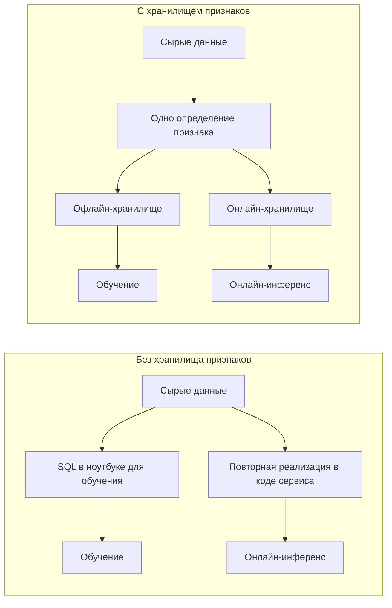
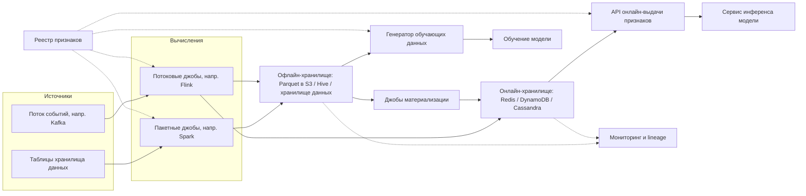
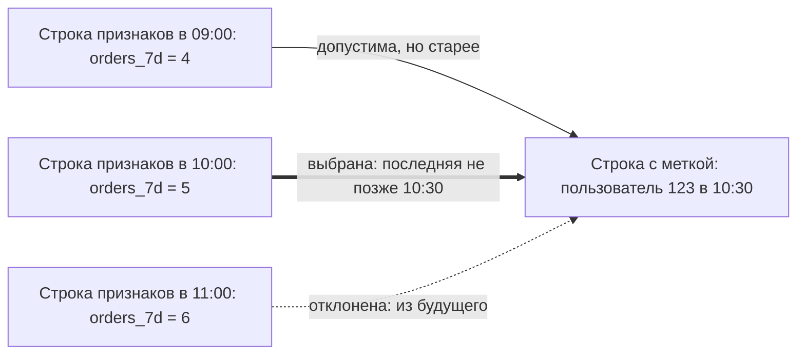
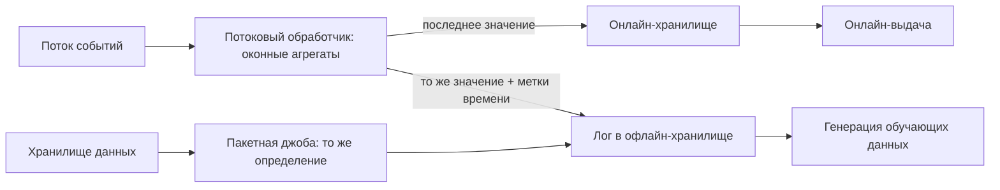
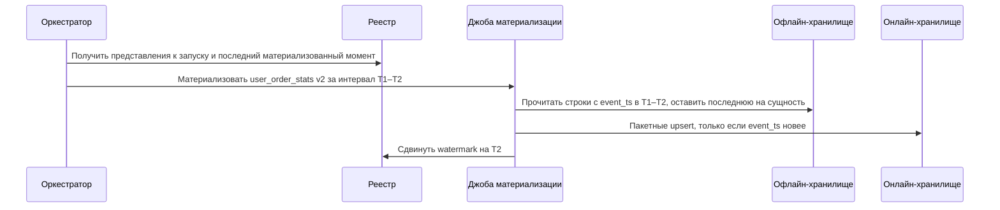

**Русский** | [English](./README.en.md)

# Глава 33: Проектирование хранилища признаков (Feature Store)

## Введение

В этой главе мы спроектируем **хранилище признаков (feature store)** — часть ML-платформы (ML, Machine Learning — машинное обучение), которая вычисляет, хранит и отдаёт входные сигналы (признаки, features), используемые моделями машинного обучения.

Признак — это любое значение, которое модель получает на вход: «число заказов пользователя за последние 7 дней», «используется ли карта с нового устройства». Большинство признаков получаются из сырых данных (логов событий, таблиц баз данных) путём агрегаций.

Зачем для этого отдельная система? Без неё у компании в итоге оказываются две реализации каждого признака:
 * Data scientist'ы вычисляют признаки для **обучения** в ноутбуке или Spark-джобе поверх хранилища данных, используя SQL (Structured Query Language — язык запросов к реляционным данным) по историческим данным.
 * Инженеры заново реализуют ту же логику для **обслуживания (serving)** внутри продуктового микросервиса, читая из боевых баз данных, кешей или потоков.

Две реализации неизбежно расходятся (разная обработка null, разные временные окна, разные часовые пояса, баги, исправленные только в одном месте). В результате модель обучается на одном распределении данных, а в продакшене получает другое. Это называется **расхождением между обучением и обслуживанием (training/serving skew)**, и оно незаметно ухудшает качество модели, не вызывая никаких ошибок.

Именно эту мотивацию Uber описывал для своей платформы Michelangelo: модели, развёрнутые онлайн, не могут напрямую читать озеро данных (data lake), а многие признаки сложно эффективно вычислить из онлайн-баз данных, поэтому платформа гарантирует, что для обучения и обслуживания используются одни и те же данные и пайплайны.

Хранилище признаков решает эту проблему, делая **определение признака (feature definition)** единственным источником истины, из которого получаются как исторические значения (для обучения), так и свежие значения (для обслуживания).



Известные системы в этой области: Uber Michelangelo (и его хранилище признаков Palette), Feast (open source), Tecton, Airbnb Zipline и его преемник Chronon (open source), Hopsworks, а также хранилища признаков, встроенные в облачные ML-платформы.

---

## Шаг 1: Понять задачу и определить рамки проектирования

Под хранилищем признаков можно понимать что угодно — от каталога метаданных до полноценной вычислительной платформы, поэтому важно зафиксировать рамки.

 * К: Кто пользователи системы?
 * И: Data scientist'ы, которые обучают модели, и ML-инженеры, которые их развёртывают. Много команд по всей компании — антифрод, рекомендации, ценообразование, поиск.
 * К: Нужно ли поддерживать и обучение, и инференс в реальном времени?
 * И: Да. Генерацию обучающих данных по историческим данным и быстрое получение признаков для онлайн-моделей. Пакетный скоринг (batch scoring) тоже должен быть возможен.
 * К: Мы отвечаем за вычисление признаков или только за хранение и выдачу?
 * И: Пользователи пишут определения признаков (SQL или трансформации на Python/Spark, оконные агрегации), а платформа запускает пайплайны.
 * К: Насколько свежими должны быть признаки?
 * И: Большинство признаков достаточно обновлять раз в день или раз в час. Некоторые признаки, например для обнаружения мошенничества, должны отражать события последних нескольких секунд.
 * К: Какая задержка ожидается для онлайн-получения признаков?
 * И: Получение признаков — лишь часть бюджета запроса на предсказание. Целимся в p99 (99-й перцентиль — 99% запросов быстрее этого значения) меньше 10 мс.
 * К: Нужно ли поддерживать признаки, зависящие от самого запроса, например расстояние между пользователем и рестораном?
 * И: Да, но это менее важный сценарий — просто держите его в уме.
 * К: Нужно ли гарантировать, что обучающие данные не содержат информации из будущего?
 * И: Да, это жёсткое требование. Утечка делает офлайн-метрики отличными, а метрики в продакшене — ужасными.
 * К: Входит ли мониторинг в рамки задачи?
 * И: Да — свежесть данных и базовый мониторинг качества данных и дрейфа.

### **Функциональные требования**

 * Регистрировать, версионировать, искать и переиспользовать определения признаков (реестр признаков, feature registry)
 * Вычислять признаки из пакетных источников (таблиц хранилища данных) и потоковых источников (потоков событий)
 * Генерировать **корректные на момент времени (point-in-time correct)** обучающие датасеты: для каждого размеченного примера возвращать значения признаков такими, какими они были известны на момент примера
 * Отдавать последние значения признаков для набора сущностей с низкой задержкой
 * Материализовывать (загружать) значения признаков из офлайн-хранилища в онлайн-хранилище
 * Выполнять бэкфилл (backfill — заполнение исторических значений) для новых или изменённых признаков
 * Мониторить свежесть, качество данных и дрейф; отслеживать происхождение данных (lineage)

### **Нефункциональные требования**

- **Низкая задержка** онлайн-чтения: p99 < 10 мс для пакета признаков одного предсказания
- **Высокая доступность** онлайн-пути: если признаки не отдаются, модели не могут делать предсказания
- **Масштабируемость**: сотни миллионов сущностей, тысячи признаков, много команд
- **Согласованность офлайн- и онлайн-значений**: одно и то же определение должно давать одно и то же значение в обоих хранилищах (с поправкой на свежесть)
- **Допустима согласованность в конечном счёте (eventual consistency)**: онлайн-значение может отставать от источника в пределах SLA (Service Level Agreement — соглашение об уровне обслуживания, здесь — обещанная свежесть) признака: секунды для потоковых, часы для пакетных
- **Воспроизводимость**: обучающий датасет, сгенерированный сегодня за прошлый период, должно быть можно сгенерировать повторно позже

### **Оценка «на салфетке» (back-of-the-envelope)**

Все числа ниже — допущения для собеседования, а не данные какой-либо реальной компании.

 * Сущностей, обслуживаемых онлайн: 100 млн пользователей (другие типы сущностей — мерчанты, товары — меньше, их не учитываем)
 * Онлайн-признаков на пользователя: 200, в среднем 8 байт на значение
 * Сырой объём признаков на пользователя: 200 * 8 Б = **1,6 КБ**; с ключами, временными метками и накладными расходами сериализации округлим до ~2 КБ
 * **Размер онлайн-хранилища**: 100 млн * 2 КБ = **200 ГБ**; с 3 репликами = **600 ГБ** — с запасом помещается в in-memory кластер из нескольких десятков узлов или в дисковое KV-хранилище (Key-Value — «ключ-значение»)
 * Трафик предсказаний в пике: 50 тыс. предсказаний/с по всем моделям
 * Каждое предсказание запрашивает признаки ~10 сущностей (пользователь плюс товары/мерчанты-кандидаты) → **QPS (Queries Per Second — запросов в секунду) онлайн-чтения**: 50 тыс. * 10 = **500 тыс. обращений к сущностям/с**
 * Потоковые обновления: в шину событий приходит 100 тыс. событий/с, каждое обновляет несколько признаков → несколько сотен тысяч онлайн-записей/с в пике
 * Ежедневная пакетная материализация: 100 млн строк; чтобы уложиться в 1 час → 100 млн / 3600 с ≈ **28 тыс. записей/с** — немного, но складывается по множеству представлений признаков
 * **Офлайн-хранилище**: ежедневный снапшот 100 млн пользователей * 1,6 КБ = 160 ГБ/день в сыром виде; с колоночным сжатием (допустим, 5x) ≈ 32 ГБ/день; за 2 года истории: 32 ГБ * 730 ≈ **23 ТБ** на группу из 200 признаков. В объектном хранилище это дёшево, но обучающие джойны по таким таблицам — тяжёлые вычислительные задачи.

---

## Шаг 2: Предложить высокоуровневый дизайн и получить одобрение

### **Основные понятия**

 * **Сущность (entity)**: объект, который описывает признак, идентифицируется ключом соединения (join key) — `user_id`, `merchant_id`, `(user_id, merchant_id)`.
 * **Представление признаков (feature view)**, оно же группа признаков (feature group): набор признаков одной сущности, вычисляемых одной трансформацией из одного источника, со схемой, владельцем, требованиями к свежести и TTL (Time To Live — время жизни значения). Пример: `user_order_stats` с признаками `orders_7d`, `avg_basket_30d`.
 * **Сервис признаков (feature service)**: именованный версионируемый список признаков, используемых конкретной моделью, например `fraud_model_v3`. Это контракт между моделью и хранилищем.
 * **Время события (event timestamp)**: момент, когда значение признака стало истинным в реальном мире. **Время создания (created timestamp)**: момент, когда строка была записана в хранилище. Для корректности на момент времени важны оба.

### **Высокоуровневый дизайн**



 * **Реестр признаков (feature registry)**: каталог сущностей, представлений признаков, сервисов признаков, источников, владельцев и версий. Все остальные компоненты берут конфигурацию отсюда. Feast, например, хранит реестр как сериализованный protobuf-файл в локальной файловой системе, в S3 (Simple Storage Service — объектное хранилище Amazon Web Services) или GCS (Google Cloud Storage — объектное хранилище Google), либо в SQL-базе данных.
 * **Пакетные вычисления**: джобы по расписанию (оркестрируемые, например, Airflow), которые выполняют трансформации признаков над таблицами хранилища данных и пишут результаты в офлайн-хранилище.
 * **Потоковые вычисления**: постоянно работающие джобы, которые потребляют события, поддерживают оконные агрегаты и пишут свежие значения в онлайн-хранилище — а также логируют те же значения в офлайн-хранилище, чтобы при обучении модель видела ровно то, что видела при обслуживании.
 * **Офлайн-хранилище (offline store)**: полная история значений признаков в колоночном формате (Parquet/ORC (Optimized Row Columnar — колоночный формат файлов) в S3 или HDFS (Hadoop Distributed File System — распределённая файловая система Hadoop) под управлением Hive, либо хранилище данных вроде BigQuery/Snowflake). Оптимизировано под большие сканирования и джойны, а не под точечные чтения.
 * **Онлайн-хранилище (online store)**: только **последнее** значение для каждой сущности в каждом представлении признаков, в KV-хранилище с низкой задержкой. Оптимизировано под точечные чтения по ключу.
 * **Материализация (materialization)**: джобы, копирующие последние значения за интервал времени из офлайн-хранилища в онлайн-хранилище.
 * **Генератор обучающих данных**: принимает список размеченных примеров с временными метками и выполняет джойны на момент времени (point-in-time joins) с офлайн-хранилищем.
 * **API (Application Programming Interface — программный интерфейс) онлайн-выдачи**: stateless-сервис, который разворачивает сервис признаков в набор ключей, читает онлайн-хранилище и возвращает вектор признаков.
 * **Мониторинг и lineage**: метрики свежести, качества и дрейфа; граф «источники → признаки → модели».

### **Проектирование API**

**Регистрация определений** (обычно через SDK (Software Development Kit — набор библиотек для разработчика) и CI-пайплайн (Continuous Integration — непрерывная интеграция), по аналогии с «инфраструктурой как кодом»):

```
POST /v1/projects/{project}/apply
{
  "entities": [{"name": "user", "join_key": "user_id"}],
  "feature_views": [{
    "name": "user_order_stats",
    "version": 2,
    "entity": "user",
    "source": "warehouse.orders",
    "transformation": "SELECT user_id, count(*) AS orders_7d ... ",
    "schedule": "hourly",
    "ttl": "2d",
    "online": true,
    "owner": "growth-team"
  }]
}
```

**Онлайн-получение** (горячий путь):

```
POST /v1/online-features
{
  "feature_service": "fraud_model_v3",
  "entities": {"user_id": [123], "merchant_id": [987]},
  "request_context": {"amount": 42.5}
}

Response:
{
  "features": {
    "user_order_stats:orders_7d": {"value": 5, "status": "PRESENT", "event_ts": "2026-09-30T10:00:00Z"},
    "user_txn_stream:txn_count_10m": {"value": null, "status": "NOT_FOUND"}
  }
}
```

Статус для каждого признака (есть, не найден, истёк) позволяет сервису модели применить ту же логику значений по умолчанию, что использовалась при обучении.

**Историческое получение** (асинхронное, так как запускает распределённую джобу):

```
POST /v1/historical-features
{
  "feature_service": "fraud_model_v3",
  "entity_df": "s3://ml/labels/fraud_2026_q2.parquet",   // user_id, merchant_id, event_timestamp, label
  "output": "s3://ml/datasets/fraud_v3_2026_q2/"
}
→ {"job_id": "..."}  then GET /v1/jobs/{job_id}
```

**Загрузка данных и операции**:

```
POST /v1/push                 // write fresh values from a stream processor or service
POST /v1/materialize          // {feature_view, start_ts, end_ts}
POST /v1/backfill             // {feature_view, version, start_ts, end_ts}
```

### **Модель данных**

**Реестр** (хорошо подходит реляционная база данных — данных мало, нужны строгая согласованность и транзакции):

```
entity(name, join_keys, description, owner)
feature_view(name, version, entity, source, transformation, ttl, freshness_sla,
             online_enabled, owner_team, status, created_at)
feature(feature_view, version, name, dtype, description, tags)
feature_service(name, version, [feature_view:version:feature...], model_id)
lineage_edge(from_node, to_node)      // source → feature_view → feature_service → model
```

**Офлайн-хранилище**: одна таблица на версию представления признаков, партиционированная по дате:

| user_id | event_timestamp | created_timestamp | orders_7d | avg_basket_30d |
|---|---|---|---|---|
| 123 | 2026-09-29 10:00 | 2026-09-29 10:05 | 4 | 18.2 |
| 123 | 2026-09-29 11:00 | 2026-09-29 11:04 | 5 | 18.9 |

Таблица **только дополняется (append-only)**: новые значения порождают новые строки, история никогда не перезаписывается. Именно это делает возможными «путешествия во времени» (time travel).

**Онлайн-хранилище**: «ключ-значение», хранится только последняя строка:

```
key:   hash(project, feature_view, version, entity_key)   e.g. "p1:user_order_stats:v2:user_id=123"
value: {orders_7d: 5, avg_basket_30d: 18.9, event_ts: 2026-09-29T11:00Z}
```

Группировка всех признаков представления под одним ключом означает одно чтение на пару (сущность, представление), а не одно чтение на признак. В Redis это может быть хеш (hash); в DynamoDB/Cassandra — строка с ключом сущности в качестве ключа партиции.

---

## Шаг 3: Детальное проектирование

### **Определения признаков и версионирование**

Определения признаков хранятся в Git как код и применяются к реестру через CI: так мы бесплатно получаем ревью, историю и откат.

Правила, которые не дают множеству команд ломать друг друга:
 * Опубликованная версия представления признаков **неизменяема**. Изменение трансформации (например, окно в 7 дней превращается в 14 дней) создаёт новую версию с собственной офлайн-таблицей и собственным пространством ключей в онлайн-хранилище.
 * Модели ссылаются на **версию сервиса признаков**, которая фиксирует точные версии представлений. Модель, обученная на `user_order_stats:v2`, продолжает получать `v2`, пока её не переобучат и не развернут заново.
 * Старые версии выводятся из эксплуатации только тогда, когда на них не ссылается ни один активный сервис признаков — на этот вопрос отвечает граф lineage.
 * Некритичные изменения (описание, теги, владелец) можно вносить на месте.

### **Корректные на момент времени обучающие данные**

Это самая сложная проблема корректности в системе.

Обучающий пример — это `(entity, timestamp, label)`: «транзакция 555 пользователя 123 в 2026-09-29 10:30 оказалась мошеннической». Нам нужны значения признаков **такими, какими они были известны в 10:30**, а не их последние значения. Если присоединить последнее значение, скажем, `chargebacks_30d`, оно уже может включать чарджбэк, вызванный этой самой транзакцией, — и модель научится «предсказывать» мошенничество по его последствию. Это **утечка данных (data leakage)**: отличные офлайн-метрики и плохие результаты в продакшене.

Джойн на момент времени (point-in-time join, также as-of join) для каждой строки датафрейма сущностей (entity dataframe) выбирает строку признаков с **наибольшим event_timestamp ≤ временной метки примера** и отбрасывает её, если она старше TTL представления признаков:



Важные детали:
 * **TTL отсчитывается от временной метки каждого примера**, а не от «сейчас». При TTL в 2 дня строка признаков, записанная за 5 дней до примера, считается отсутствующей — ровно так же, как её удалило бы по истечении срока онлайн-хранилище.
 * **Время события и время создания.** Значение, вычисленное с опозданием (или исправленное бэкфиллом), имеет старое время события, но новое время создания. На тот момент онлайн-модель этого значения на самом деле не видела. Более строгий джойн дополнительно требует `created_timestamp ≤ временной метки примера`, чтобы воспроизвести то, что реально видело обслуживание (в Feast это доступно как опция).
 * **Потоковые признаки** нужно джойнить с той же семантикой, с которой они отдавались, включая задержку обработки. Проще всего гарантировать это, логируя значения, записанные в онлайн-хранилище (с временными метками), в офлайн-хранилище.

**Реализация в масштабе.** Наивная реализация джойнит по ключу сущности, фильтрует `feature_ts <= label_ts` и берёт максимум для каждой строки — это взрывается, когда у сущности много строк признаков. Подходы получше:
 * **As-of джойн сортировкой-слиянием (sort-merge)**: партиционировать обе стороны по ключу сущности, отсортировать внутри партиции по времени и пройти оба списка одновременно — линейно от размера входа.
 * **Отсечение по времени**: читать только офлайн-партиции между `min(label_ts) - TTL` и `max(label_ts)`.
 * **Борьба с перекосом (skew)**: несколько «горячих» сущностей (например, гигантский мерчант) могут владеть огромной долей строк; «соление» (salting) или разбиение горячих ключей предотвращает отстающие одиночные задачи.
 * **Вычисление оконных агрегатов прямо в моменты меток** из сырых событий вместо готовых снапшотов. Так поступает Chronon от Airbnb: агрегация вроде «сумма покупок за последние 30 дней» вычисляется точно на момент каждого примера, поэтому не нужно заранее готовить снапшот на каждый возможный момент. Это даёт точные по окну значения, а не значения, устаревшие на величину интервала пакетного пересчёта.

### **Пакетное и потоковое вычисление признаков**

| | Пакетное (batch) | Потоковое (streaming) | По запросу (on-demand) |
|---|---|---|---|
| Источник | Таблицы хранилища данных | Поток событий (Kafka/Kinesis) | Данные запроса + другие признаки |
| Движок | Spark / SQL | Flink / Spark Streaming / Samza | Сервис выдачи |
| Свежесть | От часов до суток | Секунды | Мгновенно |
| Пример | Средний чек за 90 дней | Транзакции за последние 10 мин | Расстояние пользователь ↔ ресторан |
| Стоимость | Самое дешёвое | Постоянно работающий кластер, управление состоянием | Добавляет задержку к каждому запросу |

В Uber Michelangelo использовалось именно такое разделение: признаки с длинным окном («среднее время приготовления блюда за 7 дней») предвычислялись пакетно и массово загружались в Cassandra; признаки с коротким окном («... за последний час») вычислялись потоковыми джобами Samza из Kafka и писались в Cassandra, параллельно логируясь в HDFS для обучения.



**Агрегаты по скользящему окну** дорого пересчитывать из сырых событий при каждом обновлении. Распространённый приём — **тайлинг (tiling)**: хранить предагрегированные частичные результаты по небольшим временным корзинам (например, 5-минутные тайлы `count` и `sum`) и собирать окно в 1 час или 7 дней из тайлов при чтении или записи. Это работает для агрегаций, которые можно сливать (sum, count, min, max, приближённое число уникальных), но не для точной медианы.

Одно и то же декларативное определение должно компилироваться и в пакетную, и в потоковую джобу. Если писать его дважды вручную, вернётся то самое расхождение, от которого мы избавляемся.

### **Материализация: офлайн → онлайн**

Материализация копирует последнее значение для каждой сущности из офлайн-таблицы в онлайн-хранилище за заданный интервал времени.



 * **Инкрементальность**: каждый запуск обрабатывает только интервал `(последний watermark, сейчас]`, который хранится в реестре, — как `materialize-incremental` в Feast.
 * **Идемпотентность и устойчивость к порядку**: записи — условные «upsert, если event_ts новее» (побеждает последняя запись по времени события, а не по времени поступления). Повторённая джоба или старый бэкфилл не могут перезаписать более свежее потоковое значение.
 * **Массовая загрузка**: для очень больших представлений дешевле сгенерировать новую таблицу/снапшот и атомарно переключиться на неё (версионированный префикс ключей или алиас таблицы), чем выполнять 100 млн отдельных записей.
 * **Ограничение скорости (throttling)**: материализация делит онлайн-хранилище с чувствительными к задержке чтениями, поэтому пропускная способность записи ограничивается или переносится на непиковое время.

### **Путь онлайн-выдачи**

Для запроса на предсказание API выдачи:
1. Разворачивает сервис признаков (закешированный из реестра) в список пар (представление признаков, ключ сущности).
2. Делает **одно пакетное чтение** на хранилище (например, Redis pipeline/`MGET`, DynamoDB `BatchGetItem`), а не отдельный вызов на каждый признак.
3. Сверяет время события каждого значения с TTL; истёкшие значения помечаются как отсутствующие.
4. Вычисляет признаки по запросу (on-demand) из контекста запроса.
5. Возвращает вектор со статусами для каждого признака.

Приёмы, позволяющие удерживать p99 < 10 мс при 500 тыс. обращений/с:
 * Шардировать онлайн-хранилище по хешу ключа сущности (консистентное хеширование); реплицировать ради пропускной способности чтения и доступности.
 * Размещать слой выдачи в том же регионе/зоне, что и онлайн-хранилище; при желании встраивать его библиотекой в сервис модели, экономя сетевой переход.
 * Жёсткие таймауты на запрос и **значения по умолчанию (fallback defaults)** — те же, что использовались при обучении для отсутствующих значений. Медленный признак должен ухудшать предсказание, а не ломать его.
 * Внутрипроцессный кеш для медленно меняющихся признаков (например, ежедневной статистики мерчантов) с TTL в несколько минут.
 * Компактная сериализация (protobuf/Avro) без хранения имён признаков в каждом значении — схема живёт в реестре.

**Выбор онлайн-хранилища**: Redis даёт минимальную задержку, но стоимость памяти растёт вместе с объёмом данных; DynamoDB/Cassandra/ScyllaDB — дисковые, дешевле в пересчёте на ГБ, дают чтения за единицы миллисекунд и нативный TTL. При нашей оценке ~600 ГБ подходят оба варианта; выбор зависит от бюджета задержки и стоимости.

### **Бэкфиллы**

У нового признака (или новой версии) нет истории, поэтому его нельзя использовать для обучения. **Бэкфилл** запускает пакетное определение по прошлым данным (скажем, за 2 года) и пишет результаты в офлайн-хранилище.
 * Запускайте его как множество независимых джоб, разбитых по временным партициям, чтобы при сбое повторялся только один кусок.
 * Строки бэкфилла получают `created_timestamp = now`; строгий режим джойна на момент времени поймёт, что эти значения исторически не были доступны онлайн.
 * Чисто потоковые признаки нельзя заполнить из самого потока; для них нужно эквивалентное пакетное определение по архиву событий (ещё одна причина, почему определения должны компилироваться и в пакетный, и в потоковый режим).
 * Бэкфиллы не перезаписывают онлайн-хранилище, если только не дают более свежих значений (условный upsert).

### **TTL и свежесть**

Два связанных, но разных понятия:
 * **TTL** (на представление признаков): сколько времени значение остаётся действительным. После истечения выдача считает значение отсутствующим. Онлайн-хранилище может обеспечивать это нативно (Redis `EXPIRE`, TTL в DynamoDB, TTL в Cassandra), что заодно ограничивает объём хранения для неактивных сущностей. Тот же TTL применяется в джойне на момент времени, поэтому обучение видит «отсутствие» в тех же ситуациях, что и выдача.
 * **SLA свежести** (на представление признаков): максимально допустимое отставание между наступлением события и возможностью отдать значение, например «≤ 1 минуты» для потокового представления, «≤ 26 часов» для ежедневного. Измеряется как `now - max(event_ts)` в онлайн-хранилище или как отставание watermark материализации.

### **Мониторинг**

 * **Свежесть**: отставание watermark для каждого представления признаков, лаг потоковых консьюмеров, упавшие/опоздавшие пакетные джобы — алерты относительно SLA.
 * **Качество данных**: доля null, диапазоны значений, кардинальность, изменения схемы в upstream-источниках; валидация при записи и блокировка публикации явно сломанных пакетов.
 * **Дрейф (drift)**: сравнение распределения каждого признака при выдаче с его распределением в обучающем датасете (например, с помощью PSI (Population Stability Index — индекс стабильности популяции) или KL-дивергенции (Kullback–Leibler — мера расхождения распределений) по гистограммам). Дрейф не обязательно означает баг, но сигнализирует, что модели может потребоваться переобучение.
 * **Согласованность онлайн/офлайн**: семплировать отданные векторы признаков, логировать их и позже сравнивать с тем, что вычисляет офлайн-пайплайн для той же сущности и момента времени. Доля расхождений выше порога означает, что появилось расхождение (skew). Залогированные отданные признаки можно использовать и напрямую как обучающие данные («log and wait» — «логируй и жди»): такой подход свободен от расхождения по построению, но данные накапливаются только с момента начала логирования.
 * **SLO (Service Level Objective — целевой уровень обслуживания) выдачи**: перцентили задержки, доля ошибок, доля отсутствующих признаков на каждый сервис признаков.

### **Lineage и доступ для многих команд**

 * **Граф происхождения (lineage)**: сырой источник → версия представления признаков → сервис признаков → модель → эндпоинт. Он отвечает на вопросы «что сломается, если изменится эта upstream-таблица?», «какие модели используют эту PII-колонку (Personally Identifiable Information — персональные данные)?» и «можно ли удалить эту старую версию?».
 * **Поиск (discovery)**: каталог с поиском, описаниями, владельцами, статистикой и счётчиками использования — переиспользовать хорошо проверенный признак дешевле, чем строить новый, и такое переиспользование — один из главных бизнес-аргументов в пользу хранилища признаков.
 * **Пространства имён (namespaces)**: проекты по командам или доменам; представления признаков других проектов можно читать, но изменять их могут только владельцы.
 * **Контроль доступа**: ролевые права (role-based access control) на объекты реестра и на офлайн/онлайн-данные (чувствительные признаки доступны только одобренным моделям).
 * **Изоляция и квоты**: вычислительные квоты по командам и лимиты запросов к API выдачи на каждый сервис признаков, чтобы всплеск трафика одной команды не вредил другой.

---

## Шаг 4: Подведение итогов

Хранилище признаков позволяет одному определению признака давать и исторические значения для обучения, и свежие значения для выдачи, устраняя расхождение между обучением и обслуживанием. Ключевые элементы — версионируемый реестр, append-only офлайн-хранилище плюс онлайн-хранилище последних значений, джойны на момент времени и идемпотентная материализация.

Дополнительные темы для обсуждения:
 * **Эмбеддинги как признаки**: большие векторы меняют расчёт объёмов хранения и часто требуют векторной базы данных рядом с онлайн-хранилищем.
 * **Выдача в нескольких регионах**: реплицировать онлайн-хранилище между регионами; потоковым записям нужен домашний регион или разрешение конфликтов по времени события.
 * **Контроль затрат**: удалять неиспользуемые представления признаков, найденные через lineage; переносить старые офлайн-партиции в более дешёвые классы хранения.
 * **Приватность**: запросы на удаление данных (например, по GDPR — General Data Protection Regulation, общий регламент ЕС о защите данных) должны доходить и до офлайн-истории, и до онлайн-хранилища.
 * **Хранилище признаков vs платформа признаков**: минимальное хранилище (как ранний Feast) только хранит и отдаёт признаки, вычисленные где-то ещё; платформа (Tecton, Chronon) также берёт на себя трансформации и оркестрацию. Последняя даёт более сильные гарантии согласованности ценой большей сложности.

---

## Источники

- [Meet Michelangelo: Uber's Machine Learning Platform](https://www.uber.com/blog/michelangelo-machine-learning-platform/)
- [Feast: Architecture overview](https://docs.feast.dev/getting-started/architecture/overview)
- [Feast: Point-in-time joins](https://docs.feast.dev/getting-started/concepts/point-in-time-joins)
- [Feast: Registry](https://docs.feast.dev/getting-started/components/registry)
- [Feast: Data ingestion and materialization](https://docs.feast.dev/getting-started/concepts/data-ingestion)
- [Feast: Feature view](https://docs.feast.dev/getting-started/concepts/feature-view)
- [Chronon — open-source feature platform](https://chronon.ai/)
