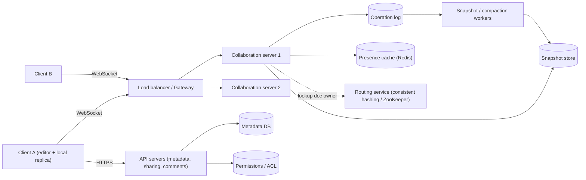
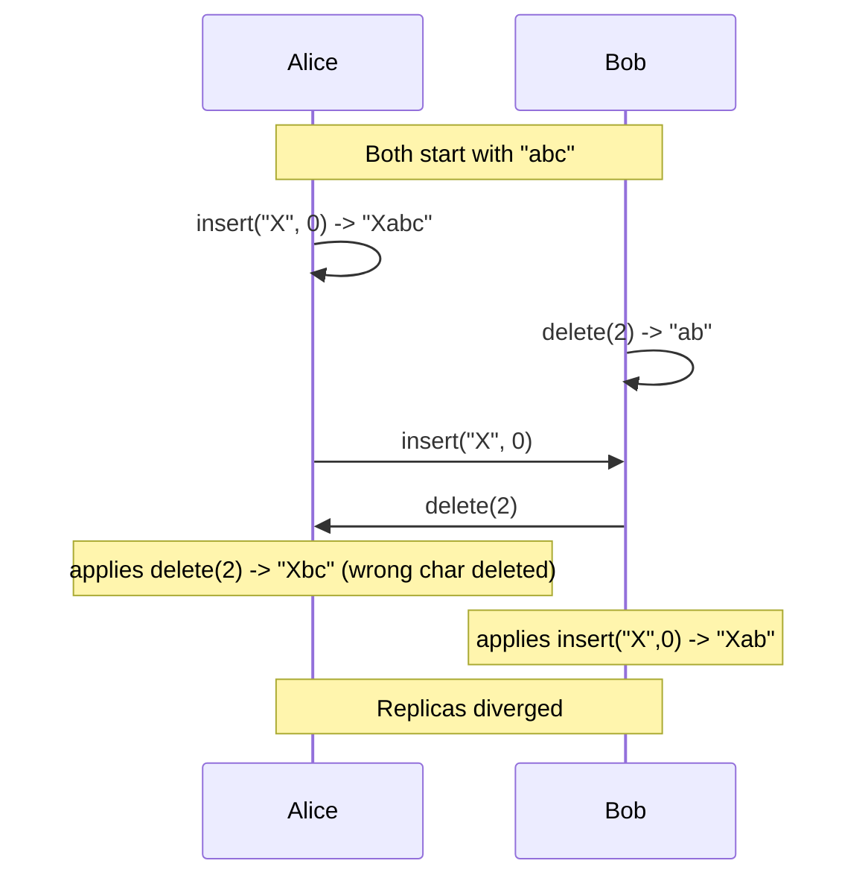
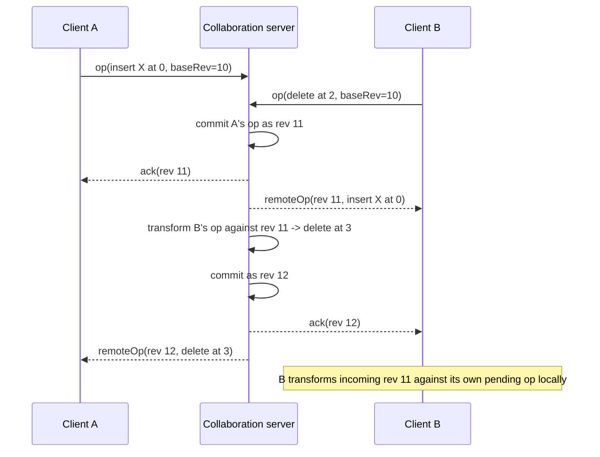
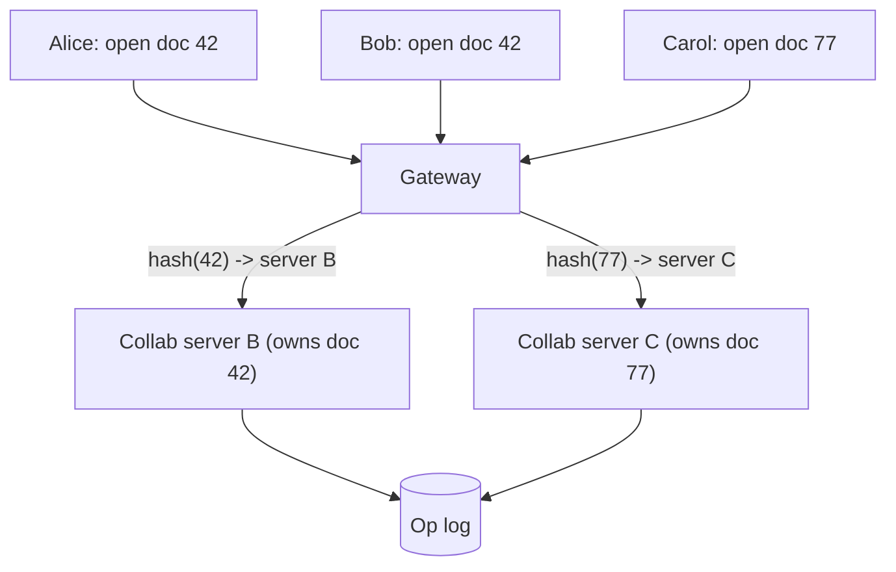
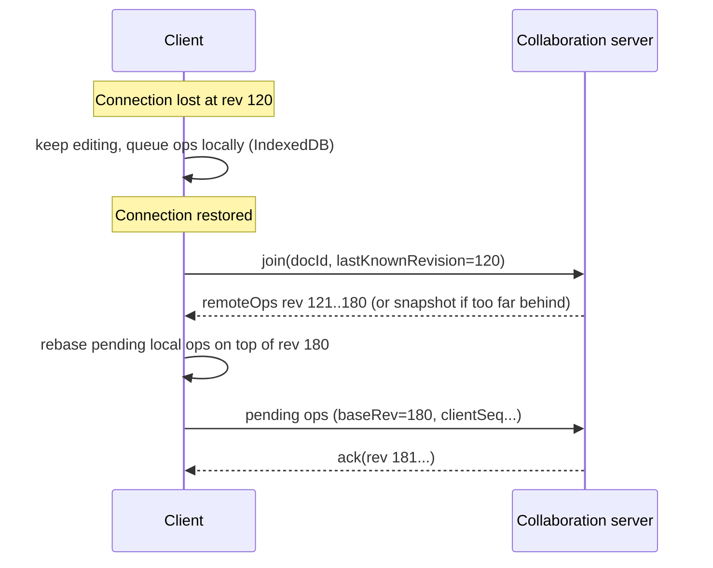

[Русский](./README.md) | **English**

# Chapter 34: Design a Real-time Collaborative Editor (Google Docs)

## Introduction

In this chapter we design a **real-time collaborative document editor** similar to Google Docs, Notion or Microsoft Word Online.
Several people open the same document, type at the same time, and each of them sees the others' changes (and cursors) within a fraction of a second.

This problem looks similar to the chat system (chapter 12) and to Google Drive (chapter 15), but it has a unique core challenge:
**concurrent edits to the same shared state**. If Alice inserts a word at position 10 while Bob deletes the character at position 5, naively applying both edits on every replica produces different documents. The heart of the design is a **concurrency control** mechanism that guarantees all replicas converge to the same content while preserving each user's intent.

---

## Step 1: Understand the Problem and Establish Design Scope

 * C: What kind of documents do we support? Rich text, spreadsheets, drawings?
 * I: Focus on rich-text documents. The approach should be extensible to other data types.
 * C: How many people can edit the same document concurrently?
 * I: Most documents have 1-3 active editors. Popular documents may have up to ~100 simultaneous editors; more users may only view.
 * C: Should editors see each other's cursors and selections?
 * I: Yes, presence (who is online, where their cursor is) is required.
 * C: Do we need version history?
 * I: Yes, users should be able to browse previous versions and restore one.
 * C: Should offline editing be supported?
 * I: Yes, a user may lose connectivity for a while and keep typing; changes must merge on reconnect.
 * C: Do we need comments and sharing permissions?
 * I: Yes - owner, editor, commenter and viewer roles. Comments are anchored to text ranges.
 * C: What is the scale?
 * I: Assume 50 million DAU.

### **Functional requirements**

 * Create, open, edit, delete documents
 * Multiple users edit the same document simultaneously; changes appear for everyone in near real-time
 * Presence: show active collaborators, their cursors and selections
 * Version history: view and restore earlier versions
 * Offline editing with automatic merge on reconnection
 * Comments anchored to ranges of text
 * Sharing with roles: owner / editor / commenter / viewer

### **Non-functional requirements**

 * **Low latency**: local edits are applied instantly (optimistic UI); remote edits are visible within ~100-200ms for users in the same region
 * **Convergence (strong eventual consistency)**: once all replicas have received the same set of operations, they must show identical content
 * **Intent preservation**: an edit should have the effect the user intended even if the document changed concurrently
 * **Durability**: an acknowledged edit is never lost
 * **High availability** and horizontal scalability

### **Back-of-the-envelope estimation**

All numbers below are assumptions made for the interview, not real Google figures.

 * 50M DAU; at peak 10% are editing at the same time -> **5M concurrent WebSocket sessions**
 * Only ~20% of connected users are actively typing at any moment; the client batches keystrokes and sends ~1 operation message per second while typing -> 5M * 0.2 * 1 = **~1M operations/sec** (write QPS)
 * Average document has ~3 active collaborators, so each op is broadcast to ~2 other clients -> **~2M outgoing messages/sec**. Presence (cursor) updates are throttled to e.g. 1 per 500ms, but can easily exceed the op volume, so they must be cheap and ephemeral
 * Operation size (payload + metadata) ~100 bytes. Each DAU produces ~2,000 ops/day -> 50M * 2,000 * 100B = **~10 TB/day** of raw operation log
 * Assume 5B documents stored, 50KB average snapshot -> 5B * 50KB = **~250 TB** of snapshots (before replication)
 * Conclusion: the op log grows fast, so we need **compaction into snapshots**, and a single server per document is fine because per-document throughput is tiny (tens of ops/sec even for a busy doc) - the scale problem is the total number of documents and connections.

---

## Step 2: Propose High-Level Design and Get Buy-In

### **Communication protocol**

HTTP request/response works for opening a document, listing files, sharing, comments. But live editing requires the server to push changes to clients as soon as they happen, so we use a **WebSocket** - a persistent bidirectional connection (the same reasoning as in the Chat and Nearby Friends chapters).

### **High-level design**

 * **Client**: the editor keeps a full local replica of the document, applies local edits immediately and exchanges operations with the server.
 * **Load balancer / gateway**: terminates TLS, authenticates the user, and routes the WebSocket to the collaboration server that owns the document.
 * **Collaboration (document) server**: stateful. Holds the in-memory state of the documents it owns, orders/merges incoming operations, persists them to the op log and broadcasts them to all connected editors of that document.
 * **Operation log**: append-only, per-document ordered list of operations - the source of truth.
 * **Snapshot store**: periodic full copies of the document (object storage such as S3).
 * **Presence cache**: ephemeral cursor/selection data with a TTL.
 * **API servers**: stateless REST services for document metadata, sharing, comments, version history.
 * **Metadata DB / ACL**: document title, owner, folder, roles.
 * **Compaction workers**: fold the op log into new snapshots in the background.

### **API design**

REST (stateless) endpoints:
 * `POST /v1/documents` - create a document
 * `GET /v1/documents/{docId}` - returns metadata, latest snapshot and its `revision`
 * `GET /v1/documents/{docId}/revisions?from=...` - version history
 * `POST /v1/documents/{docId}/revisions/{rev}:restore` - restore a version (implemented as a new operation, not by rewriting history)
 * `POST /v1/documents/{docId}/permissions` - share: `{ "email": ..., "role": "editor" }`
 * `POST /v1/documents/{docId}/comments` - `{ "anchor": {...}, "text": ... }`

WebSocket messages (`wss://collab.example.com/v1/documents/{docId}`):
 * Client -> server: `join { docId, lastKnownRevision }`, `op { clientId, clientSeq, baseRevision, ops[] }`, `presence { cursor, selection }`
 * Server -> client: `ack { clientSeq, revision }`, `remoteOp { revision, authorId, ops[] }`, `presence {...}`, `snapshot {...}` (on join when the client is too far behind)

`clientSeq` makes retries idempotent: if a client resends an op after a reconnect, the server recognizes the `(clientId, clientSeq)` pair and does not apply it twice.

### **Data model**

 * **documents** (metadata DB, relational): `doc_id (PK), title, owner_id, created_at, updated_at, latest_snapshot_rev`
 * **permissions**: `doc_id, principal_id (user/group/link), role`
 * **operations** (op log, wide-column store such as Cassandra/Bigtable, or a log per document): partition key `doc_id`, clustering key `revision`; columns `author_id, client_id, client_seq, payload, timestamp`
 * **snapshots**: `doc_id, revision, object_key` - the blob lives in object storage
 * **comments**: `comment_id, doc_id, anchor, author_id, text, resolved, thread_id`

Partitioning the op log by `doc_id` keeps all operations of one document together and ordered by revision, which makes "give me everything after revision N" a single range scan.

---

## Step 3: Design Deep Dive

### **Concurrency control: the core problem**

Bob meant to delete "c", but on Alice's side the index 2 now points to "b". We need a way to reconcile concurrent operations. Three families of solutions exist.

#### Option 1: Locking

Lock the document (or a paragraph/section) while one user edits it. Simple and always consistent, but:
 * Poor UX - users wait for each other; not "real-time collaboration"
 * Lock leases must expire if a client disconnects
 * Fine-grained (per-paragraph) locking reduces contention but still blocks people working near each other

Locking is acceptable for coarse-grained objects (e.g. a spreadsheet cell being edited, a slide being dragged), but not for text.

#### Option 2: Operational Transformation (OT)

OT keeps operations index-based but **transforms** an incoming operation against the concurrent operations that were applied before it. In the example, the server sees that `insert("X", 0)` was applied first, so Bob's `delete(2)` is transformed into `delete(3)`, which deletes "c" on every replica.

Classic peer-to-peer OT is notoriously hard to get right - many published algorithms were later shown to be incorrect under some interleavings. Production systems simplify it with a **central server that defines a single total order** of operations. Google Wave (and, by public accounts, Google Docs) uses this approach:

 * The server assigns each accepted operation a monotonically increasing **revision number**.
 * A client sends an operation together with the revision it was based on (`baseRevision`).
 * The server transforms the op against all operations committed after `baseRevision`, applies it, appends it to the log, and broadcasts it.
 * The client may have **only one operation in flight**; while waiting for the acknowledgement it buffers new local edits and composes them into one operation. This means the server only needs to transform against a linear history instead of tracking a separate state space per client.

Pros: compact operations (just position + content), the document has no per-character metadata, the server's linear log doubles as version history, and it is a mature, proven approach at large scale.
Cons: requires a central server to order operations (no true peer-to-peer), transformation functions must be written for every pair of operation types (rich text with formatting, tables, etc. makes this complex), and long offline sessions mean transforming against a long history.

#### Option 3: CRDTs

A **CRDT (Conflict-free Replicated Data Type)** is a data structure designed so that concurrent operations commute: replicas can apply the same set of operations in any order and still converge, without a central coordinator.

For text, sequence CRDTs such as **RGA** (Replicated Growable Array), used in Automerge, and the YATA-based algorithm in **Yjs** give every inserted character a **globally unique, immutable ID** - e.g. `(replicaId, counter)` - and describe an insert as "insert after the element with ID x" rather than "insert at index 5". Deletes mark elements as deleted (**tombstones**) instead of removing them, because a concurrent insert may refer to them. Ties between concurrent inserts at the same place are broken deterministically (e.g. by ID ordering), so every replica ends up with the same sequence.

Pros:
 * No central ordering needed - works peer-to-peer and offline; merging any two replicas is always possible (a good fit for **local-first** software)
 * The server can become a simple relay + storage; it does not need to understand the document
 * Libraries (Yjs, Automerge) provide ready-made rich-text, map and list types

Cons:
 * **Metadata overhead**: every character carries an ID, and tombstones accumulate. Modern implementations mitigate this with run-length encoding of consecutive inserts and compact binary/columnar encodings, and Yjs garbage-collects deleted content, but memory and storage are still larger than the plain text
 * Subtle anomalies: Martin Kleppmann showed some list CRDTs **interleave** characters of two users typing concurrently at the same position; RGA and later algorithms avoid it. Moving elements and tree structures are also hard
 * Permissions and validation are harder in a pure peer-to-peer model

#### Hybrid: CRDT-inspired, server-authoritative

Figma, for example, explicitly rejected OT as unnecessarily complex for its problem and uses **CRDT-inspired** ideas (last-writer-wins registers per object property) while keeping a **central server as the authority** for each document. This removes most of the distributed-systems overhead of pure CRDTs.

#### Comparison and choice

| | Locking | OT (central server) | CRDT |
|---|---|---|---|
| Real-time concurrent editing | No | Yes | Yes |
| Needs central ordering | Yes (lock owner) | Yes | No |
| Offline editing | No | Limited (transform on reconnect) | Natural |
| Metadata overhead | None | Low | Higher (IDs, tombstones) |
| Implementation complexity | Low | High (transform functions) | Medium (use a library) |
| Peer-to-peer | No | No | Yes |

For the interview we choose **server-ordered operations**: the collaboration server owns each document and assigns revisions. The merge algorithm can be OT (as in Google Docs) or a CRDT such as Yjs, where the server additionally gives us a total order for the op log, permission checks and a single place to persist. The rest of the design (routing, storage, presence) is the same for both choices.

### **Routing all editors of a document to one server**

Because the server holds the live state of a document and orders its operations, all editors of that document must connect to the **same collaboration server**. Options:

 * **Consistent hashing** on `doc_id` (see chapter 5): the gateway hashes `doc_id` to find the owner server. Adding/removing servers moves only a fraction of documents.
 * **Explicit assignment** in a coordination service (ZooKeeper/etcd): the first client to open a document triggers assignment to a lightly loaded server; the mapping `doc_id -> server` is stored with a lease. This allows load-aware placement and moving hot documents.

Note that plain "sticky sessions" (pinning a *user* to a server) are not enough - we need stickiness per *document*.

**Failover**: if a collaboration server dies, its lease expires, documents are reassigned to other servers, and clients reconnect. The new owner loads the latest snapshot plus the op log tail and continues from the last committed revision. Since an op is acknowledged only **after** it is durably appended to the op log, no acknowledged edit is lost; unacknowledged ops are still in the client's pending buffer and are resent (deduplicated by `clientId + clientSeq`).

To avoid **split-brain** (two servers both believing they own the document), the op log append can be conditional on the expected revision (compare-and-set) or carry a fencing token from the lease.

### **Write path**

 1. The user types; the editor applies the change locally immediately.
 2. The client sends `op { baseRevision, clientSeq, ops }` over WebSocket.
 3. The collaboration server checks the user has the `editor` role (cached ACL).
 4. It transforms/merges the op against newer revisions and assigns revision N+1.
 5. It appends the op to the op log (durable, replicated write).
 6. It sends `ack` to the author and `remoteOp` to all other connected editors of the document.
 7. Asynchronously, compaction workers periodically build snapshots.

### **Storage: operation log + periodic snapshots**

Replaying a document from its first keystroke is too slow for a document with millions of operations, so we combine:
 * **Op log** - the append-only, ordered source of truth
 * **Snapshots** - full document state at revision N, taken e.g. every 1,000 ops or every few minutes of activity

Loading a document = latest snapshot + ops after the snapshot revision. After a snapshot is taken, old ops can be moved to cheap cold storage, or compacted (merged into coarser steps) according to the version-history retention policy. For CRDT-based designs, the snapshot is the encoded CRDT state (e.g. a Yjs update), which merges with any later updates.

### **Version history**

The op log already records every change with author and timestamp, so version history is a view over it:
 * Group consecutive ops of the same author within a time window into a **named or automatic version**
 * To show version N: load the nearest snapshot <= N and replay ops up to N
 * **Restore** does not delete history: it computes the diff between the current state and version N and applies it as a **new operation**, so collaborators receive it like any other edit

### **Presence and cursors**

Presence (online users, cursor, selection, name/color) changes very frequently but has no long-term value:
 * Sent over the same WebSocket, throttled on the client (e.g. every 100-500ms)
 * Broadcast by the collaboration server to other editors, stored only in memory / Redis with a short TTL - **never** in the op log
 * Clients send heartbeats; a user is considered gone after a timeout (Yjs's awareness protocol, for example, marks a client offline after 30 seconds without updates)
 * Cursor positions must be expressed so they survive remote edits: with OT they are transformed like operations; with CRDTs they are **relative positions** anchored to a character ID

### **Offline editing and reconnection**

 * The client persists the document and pending ops locally (e.g. IndexedDB) so work survives a browser restart.
 * On reconnect it sends its last known revision; the server returns missing ops, or a fresh snapshot if the gap is too large.
 * **OT**: pending ops are transformed against the missed ops (rebased), then sent. Very long offline sessions can produce surprising merges, so some products limit offline duration or show a warning.
 * **CRDT**: client and server exchange **state vectors** (what each has seen) and send each other only the missing updates; merging is automatic in any order.
 * Permissions are rechecked on reconnect - access may have been revoked while the user was offline.

### **Comments**

Comments are stored separately from document content (comments DB, via REST API), but their **anchor** must follow the text as it is edited:
 * Store the anchor as a pair of stable positions (CRDT character IDs, or positions at a given revision that the server transforms forward)
 * If the anchored text is deleted, the comment becomes "orphaned" and is shown in the comment history
 * Comment notifications go through the notification system (chapter 10)

### **Permissions and sharing**

 * Roles: owner > editor > commenter > viewer; principals are users, groups, or "anyone with the link"
 * Checked by API servers on every REST call and by the collaboration server at `join` time and on every write operation (a viewer's socket can receive updates but its ops are rejected)
 * ACLs are cached in the collaboration server; when a permission changes, an event invalidates the cache and the server can downgrade or close affected sessions
 * Never trust the client: the server validates every op (role, size, well-formed)

### **Scaling to many concurrent editors**

The whole system scales horizontally by sharding documents across collaboration servers. The harder case is a **single hot document** (a company-wide doc everyone opens at 9am):
 * **Separate readers from writers**: viewers do not need to go through the ordering server; ops can be fanned out through a pub/sub layer or read-only replicas of the document session
 * **Batch** outgoing broadcasts (send ops every ~50-100ms instead of per keystroke) and **throttle presence**; show only a subset of cursors when there are hundreds of users
 * **Cap** the number of concurrent editors per document and switch extra users to view mode (a common product decision)
 * Split very large documents into independently ordered sections/blocks

For global users, editors far from the owning server see higher latency for remote edits, but local edits remain instant because of optimistic application. Placing the document's owner in the region of most of its editors is a reasonable optimization.

---

## Step 4: Wrap Up

In this chapter we designed a Google Docs-like collaborative editor: stateful collaboration servers that own documents (via consistent hashing or a coordination service), WebSockets for real-time edits and presence, an append-only op log with periodic snapshots, and version history built on top of the log. The key decision is the concurrency control: locking is too restrictive, server-ordered OT is proven and compact, CRDTs make offline and peer-to-peer collaboration natural at the cost of metadata overhead.

Additional talking points:
 * **End-to-end encryption**: with CRDTs the server can relay encrypted updates without understanding them (at the cost of server-side search, indexing and validation)
 * **Full-text search** over documents via an asynchronous indexing pipeline
 * **Undo/redo** in a collaborative setting should undo only the user's own operations, not others'
 * **Rich content**: images and attachments are stored in object storage, the document only references them
 * **Monitoring**: op latency, transform/merge time, reconnect rate, divergence detection (periodic checksums of replica state)

---

## References

 * [Google Wave Operational Transformation whitepaper](https://svn.apache.org/repos/asf/incubator/wave/whitepapers/operational-transform/operational-transform.html)
 * [How Figma's multiplayer technology works](https://www.figma.com/blog/how-figmas-multiplayer-technology-works/)
 * [Martin Kleppmann - CRDTs: The Hard Parts](https://martin.kleppmann.com/2020/07/06/crdt-hard-parts-hydra.html)
 * [Kleppmann, Beresford - A Conflict-Free Replicated JSON Datatype](https://arxiv.org/pdf/1608.03960)
 * [Yjs documentation](https://docs.yjs.dev/)
 * [Yjs - Awareness & Presence](https://docs.yjs.dev/api/about-awareness)
 * [Operational transformation - Wikipedia](https://en.wikipedia.org/wiki/Operational_transformation)
