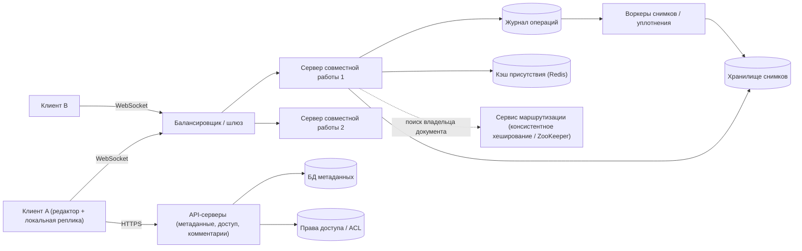
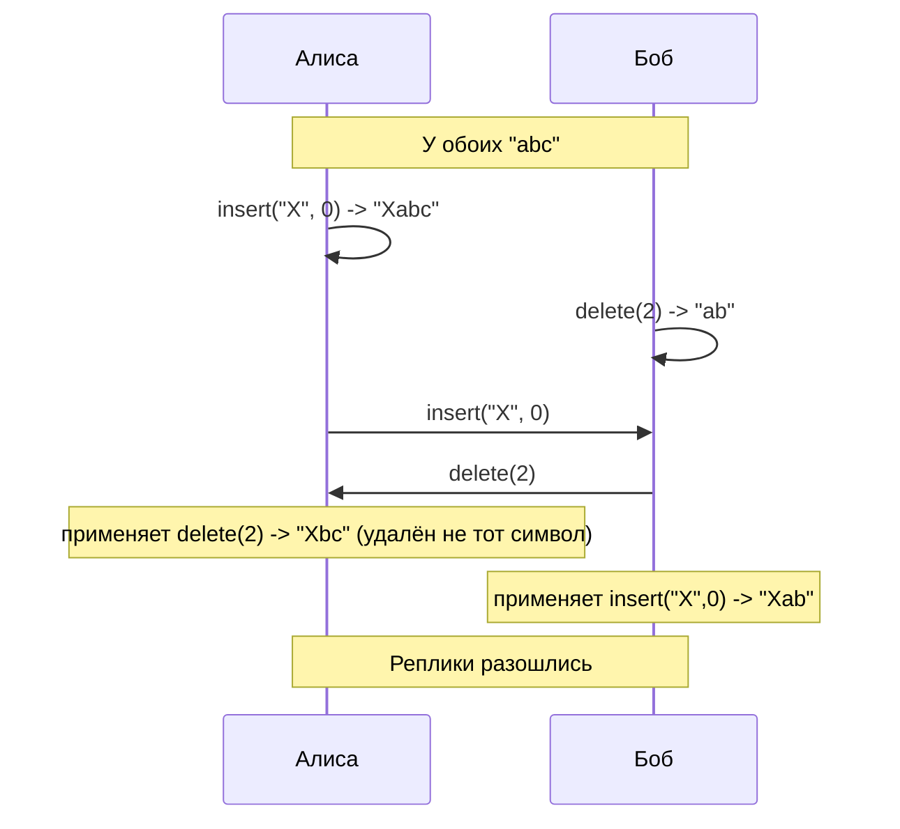
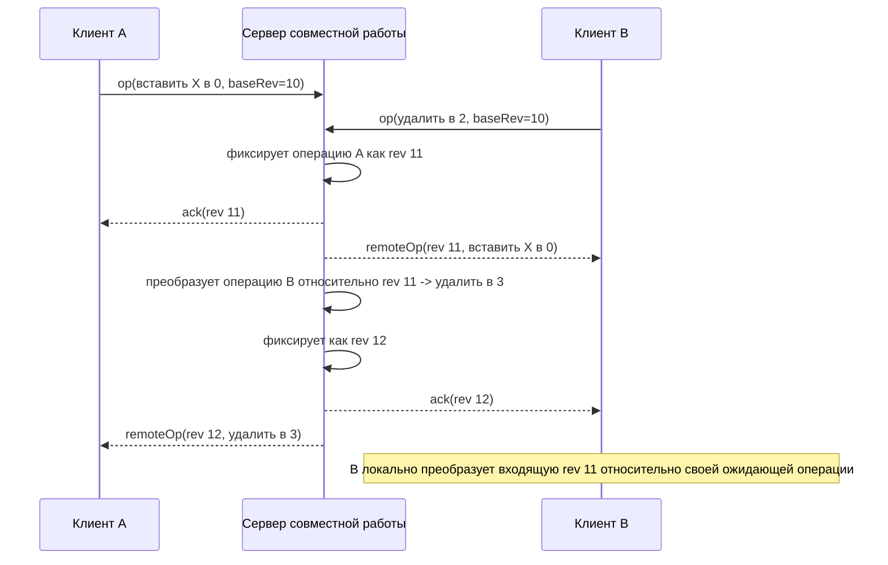
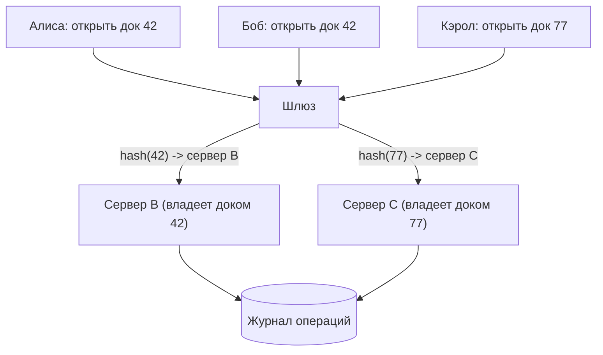
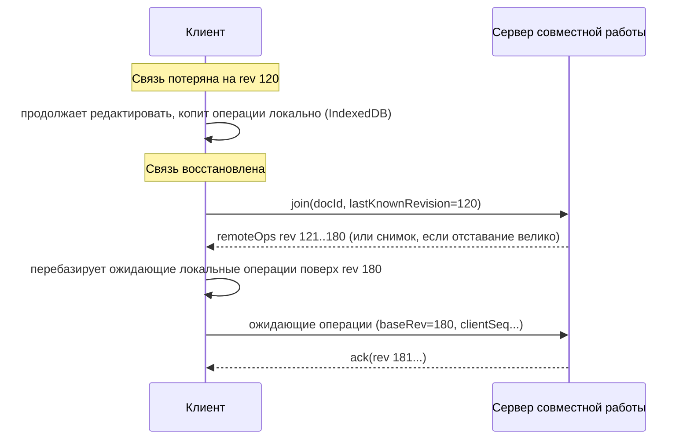

**Русский** | [English](./README.en.md)

# Глава 34: Проектирование редактора для совместной работы в реальном времени (Google Docs)

## Введение

В этой главе мы спроектируем **редактор документов для совместной работы в реальном времени (real-time collaborative editor)**, похожий на Google Docs, Notion или Microsoft Word Online.
Несколько человек открывают один и тот же документ, одновременно печатают, и каждый видит изменения (и курсоры) остальных с задержкой в доли секунды.

Задача похожа на чат (глава 12) и Google Drive (глава 15), но у неё есть собственная ключевая сложность:
**конкурентные правки одного и того же общего состояния**. Если Алиса вставляет слово в позицию 10, а Боб в это же время удаляет символ в позиции 5, то наивное применение обеих правок на каждой реплике даст разные документы. Сердце системы — механизм **управления конкурентным доступом (concurrency control)**, который гарантирует, что все реплики сходятся к одному и тому же содержимому и при этом сохраняется намерение каждого пользователя.

---

## Шаг 1: Понять задачу и определить рамки проектирования

 * К: Какие типы документов поддерживаем? Форматированный текст, таблицы, рисунки?
 * И: Сосредоточимся на документах с форматированным текстом (rich text). Подход должен расширяться на другие типы данных.
 * К: Сколько человек могут одновременно редактировать один документ?
 * И: У большинства документов 1–3 активных редактора. У популярных — до ~100 одновременных редакторов; остальные пользователи могут только просматривать.
 * К: Должны ли редакторы видеть курсоры и выделения друг друга?
 * И: Да, присутствие (presence) — кто онлайн и где его курсор — обязательно.
 * К: Нужна ли история версий?
 * И: Да, пользователи должны видеть предыдущие версии и восстанавливать их.
 * К: Нужно ли поддерживать офлайн-редактирование?
 * И: Да, пользователь может на время потерять связь и продолжать печатать; при переподключении изменения должны слиться.
 * К: Нужны ли комментарии и права доступа?
 * И: Да — роли владельца, редактора, комментатора и читателя. Комментарии привязаны к фрагментам текста.
 * К: Каков масштаб?
 * И: Предположим 50 миллионов DAU (Daily Active Users — число уникальных активных пользователей за день).

### **Функциональные требования**

 * Создание, открытие, редактирование и удаление документов
 * Несколько пользователей одновременно редактируют один документ; изменения появляются у всех почти в реальном времени
 * Присутствие: показывать активных соавторов, их курсоры и выделения
 * История версий: просмотр и восстановление прежних версий
 * Офлайн-редактирование с автоматическим слиянием при переподключении
 * Комментарии, привязанные к фрагментам текста
 * Совместный доступ с ролями: владелец / редактор / комментатор / читатель

### **Нефункциональные требования**

 * **Низкая задержка**: локальные правки применяются мгновенно (оптимистичный UI (User Interface — пользовательский интерфейс): интерфейс сразу показывает результат, не дожидаясь сервера); удалённые правки видны в пределах ~100–200 мс для пользователей в том же регионе
 * **Сходимость (сильная согласованность в конечном счёте, strong eventual consistency)**: когда все реплики получили один и тот же набор операций, они должны показывать одинаковое содержимое
 * **Сохранение намерения (intent preservation)**: правка должна давать тот эффект, который задумал пользователь, даже если документ был параллельно изменён
 * **Надёжность хранения (durability)**: подтверждённая правка никогда не теряется
 * **Высокая доступность** и горизонтальная масштабируемость

### **Оценка «на салфетке» (back-of-the-envelope)**

Все числа ниже — допущения для собеседования, а не реальные данные Google.

 * DAU — 50 млн; в пике 10% редактируют одновременно -> **5 млн одновременных WebSocket-сессий**
 * Лишь ~20% подключённых пользователей в каждый момент активно печатают; клиент группирует нажатия клавиш и во время набора отправляет ~1 сообщение с операцией в секунду -> 5 млн * 0,2 * 1 = **~1 млн операций/с** (QPS (Queries Per Second — число запросов в секунду) на запись)
 * В среднем у документа ~3 активных соавтора, значит, каждая операция рассылается ~2 другим клиентам -> **~2 млн исходящих сообщений/с**. Обновления присутствия (курсоры) ограничиваются, например, одним обновлением раз в 500 мс, но легко могут превысить объём операций, поэтому они должны быть дешёвыми и эфемерными
 * Размер операции (данные + метаданные) ~100 байт. Каждый DAU порождает ~2000 операций в день -> 50 млн * 2000 * 100 Б = **~10 ТБ/день** сырого журнала операций
 * Предположим, хранится 5 млрд документов со средним снимком 50 КБ -> 5 млрд * 50 КБ = **~250 ТБ** снимков (без учёта репликации)
 * Вывод: журнал операций растёт быстро, поэтому нужно **уплотнение (compaction) в снимки**; при этом один сервер на документ — нормально, потому что пропускная способность одного документа мизерна (десятки операций в секунду даже для оживлённого документа). Проблема масштаба — в общем количестве документов и соединений.

---

## Шаг 2: Предложить высокоуровневый дизайн и получить одобрение

### **Протокол взаимодействия**

Для открытия документа, списка файлов, совместного доступа и комментариев подходит обычный HTTP (HyperText Transfer Protocol — протокол передачи гипертекста) в режиме «запрос-ответ». Но при живом редактировании сервер должен отправлять изменения клиентам сразу, как только они происходят, поэтому используем **WebSocket** — постоянное двунаправленное соединение (те же соображения, что и в главах про чат и Nearby Friends).

### **Высокоуровневый дизайн**

 * **Клиент**: редактор хранит полную локальную реплику документа, сразу применяет локальные правки и обменивается операциями с сервером.
 * **Балансировщик / шлюз**: терминирует TLS (Transport Layer Security — протокол шифрования транспортного уровня), аутентифицирует пользователя и направляет WebSocket на сервер совместной работы, владеющий документом.
 * **Сервер совместной работы (сервер документов)**: хранит состояние (stateful). Держит в памяти состояние своих документов, упорядочивает и сливает входящие операции, сохраняет их в журнал операций и рассылает всем подключённым редакторам документа.
 * **Журнал операций (operation log)**: упорядоченный список операций документа, только на добавление (append-only), — источник истины.
 * **Хранилище снимков (snapshot store)**: периодические полные копии документа (объектное хранилище, например S3 (Simple Storage Service — объектное хранилище Amazon)).
 * **Кэш присутствия**: эфемерные данные о курсорах и выделениях с TTL (Time To Live — время жизни записи).
 * **API-серверы**: REST-сервисы (REST — Representational State Transfer, архитектурный стиль HTTP-API) без состояния для метаданных, совместного доступа, комментариев и истории версий. API (Application Programming Interface — программный интерфейс приложения).
 * **БД метаданных / ACL** (Access Control List — список управления доступом): название документа, владелец, папка, роли.
 * **Воркеры уплотнения**: в фоне сворачивают журнал операций в новые снимки.

### **Проектирование API**

REST-эндпоинты (без состояния):
 * `POST /v1/documents` — создать документ
 * `GET /v1/documents/{docId}` — вернуть метаданные, последний снимок и его `revision`
 * `GET /v1/documents/{docId}/revisions?from=...` — история версий
 * `POST /v1/documents/{docId}/revisions/{rev}:restore` — восстановить версию (реализуется как новая операция, а не переписывание истории)
 * `POST /v1/documents/{docId}/permissions` — открыть доступ: `{ "email": ..., "role": "editor" }`
 * `POST /v1/documents/{docId}/comments` — `{ "anchor": {...}, "text": ... }`

Сообщения WebSocket (`wss://collab.example.com/v1/documents/{docId}`):
 * Клиент -> сервер: `join { docId, lastKnownRevision }`, `op { clientId, clientSeq, baseRevision, ops[] }`, `presence { cursor, selection }`
 * Сервер -> клиент: `ack { clientSeq, revision }`, `remoteOp { revision, authorId, ops[] }`, `presence {...}`, `snapshot {...}` (при подключении, если клиент слишком отстал)

`clientSeq` делает повторные отправки идемпотентными: если клиент после переподключения отправит операцию ещё раз, сервер узнает пару `(clientId, clientSeq)` и не применит её дважды.

### **Модель данных**

 * **documents** (БД метаданных, реляционная): `doc_id (PK), title, owner_id, created_at, updated_at, latest_snapshot_rev`
 * **permissions**: `doc_id, principal_id (user/group/link), role`
 * **operations** (журнал операций; колоночное хранилище вроде Cassandra/Bigtable или отдельный лог на документ): ключ партиции `doc_id`, ключ кластеризации `revision`; столбцы `author_id, client_id, client_seq, payload, timestamp`
 * **snapshots**: `doc_id, revision, object_key` — сам блоб лежит в объектном хранилище
 * **comments**: `comment_id, doc_id, anchor, author_id, text, resolved, thread_id`

Партиционирование журнала операций по `doc_id` держит все операции документа вместе и упорядоченными по ревизии, поэтому запрос «дай всё после ревизии N» — это одно сканирование диапазона.

---

## Шаг 3: Детальное проектирование

### **Управление конкурентным доступом: ключевая проблема**

Боб хотел удалить «c», но у Алисы индекс 2 теперь указывает на «b». Нужен способ согласовать конкурентные операции. Существует три семейства решений.

#### Вариант 1: Блокировки (locking)

Документ (или абзац/раздел) блокируется, пока его редактирует один пользователь. Просто и всегда согласованно, но:
 * Плохой UX (User Experience — пользовательский опыт) — пользователи ждут друг друга; это не «совместная работа в реальном времени»
 * Аренда блокировки (lease) должна истекать, если клиент отключился
 * Мелкозернистые (поабзацные) блокировки снижают конкуренцию, но всё равно мешают тем, кто работает рядом

Блокировки допустимы для крупных объектов (например, редактируемая ячейка таблицы или перетаскиваемый слайд), но не для текста.

#### Вариант 2: Операционное преобразование (Operational Transformation)

OT (Operational Transformation — операционное преобразование, алгоритм, корректирующий параметры операции с учётом параллельно применённых операций) сохраняет индексные операции, но **преобразует (transform)** входящую операцию относительно конкурентных операций, применённых до неё. В нашем примере сервер видит, что `insert("X", 0)` применена первой, поэтому `delete(2)` Боба преобразуется в `delete(3)`, и на всех репликах удаляется «c».

Классический одноранговый OT печально известен сложностью: многие опубликованные алгоритмы позже оказались некорректными при некоторых чередованиях операций. Промышленные системы упрощают задачу с помощью **центрального сервера, задающего единый полный порядок (total order)** операций. Так устроен Google Wave (и, по публичным источникам, Google Docs):

 * Сервер присваивает каждой принятой операции монотонно возрастающий **номер ревизии (revision)**.
 * Клиент отправляет операцию вместе с ревизией, на которой она основана (`baseRevision`).
 * Сервер преобразует операцию относительно всех операций, зафиксированных после `baseRevision`, применяет её, добавляет в журнал и рассылает.
 * У клиента может быть **только одна неподтверждённая операция в полёте**; ожидая подтверждения, он буферизует новые локальные правки и объединяет (compose) их в одну операцию. Благодаря этому серверу достаточно преобразовывать операции относительно линейной истории, а не хранить отдельное пространство состояний для каждого клиента.

Плюсы: компактные операции (только позиция и содержимое), у документа нет посимвольных метаданных, линейный журнал сервера одновременно служит историей версий, подход зрелый и проверен в большом масштабе.
Минусы: нужен центральный сервер для упорядочивания (настоящий peer-to-peer невозможен), функции преобразования надо написать для каждой пары типов операций (форматирование, таблицы и т. п. сильно усложняют задачу), а долгая офлайн-сессия означает преобразование относительно длинной истории.

#### Вариант 3: CRDT

**CRDT (Conflict-free Replicated Data Type — бесконфликтный реплицируемый тип данных)** — структура данных, спроектированная так, что конкурентные операции коммутируют: реплики могут применять один и тот же набор операций в любом порядке и всё равно сходятся, без центрального координатора.

Для текста последовательностные CRDT, такие как **RGA (Replicated Growable Array — реплицируемый растущий массив)**, используемый в Automerge, и алгоритм на основе YATA (Yet Another Transformation Approach — «ещё один подход к преобразованию», CRDT-алгоритм для последовательностей) в **Yjs**, присваивают каждому вставленному символу **глобально уникальный неизменяемый ID (identifier — идентификатор)** — например, `(replicaId, counter)` — и описывают вставку как «вставить после элемента с ID x», а не «вставить в позицию 5». Удаление помечает элементы удалёнными (**надгробия, tombstones**), а не убирает их физически, потому что на них может ссылаться конкурентная вставка. Конфликты между одновременными вставками в одно место разрешаются детерминированно (например, по порядку ID), поэтому у всех реплик получается одна и та же последовательность.

Плюсы:
 * Не нужен центральный порядок — работает peer-to-peer и офлайн; слить две любые реплики можно всегда (хорошо подходит для **local-first** ПО — программ, где данные прежде всего живут на устройстве пользователя)
 * Сервер может быть простым ретранслятором и хранилищем; ему не нужно понимать структуру документа
 * Библиотеки (Yjs, Automerge) предоставляют готовые типы для форматированного текста, словарей и списков

Минусы:
 * **Накладные расходы на метаданные**: у каждого символа есть ID, а надгробия накапливаются. Современные реализации смягчают это кодированием длин серий (run-length encoding) последовательных вставок и компактными бинарными/колоночными форматами, а Yjs собирает мусор удалённого содержимого, но память и хранилище всё равно больше, чем для чистого текста
 * Тонкие аномалии: Мартин Клеппман показал, что некоторые списковые CRDT **перемешивают (interleaving)** символы двух пользователей, одновременно печатающих в одном месте; RGA и более поздние алгоритмы этого избегают. Перемещение элементов и древовидные структуры тоже сложны
 * В чистой peer-to-peer-модели сложнее реализовать права доступа и валидацию

#### Гибрид: идеи CRDT при авторитетном сервере

Figma, например, явно отказалась от OT как излишне сложного для своей задачи и использует **идеи, вдохновлённые CRDT** (регистры «последняя запись побеждает», last-writer-wins, для каждого свойства объекта), сохраняя при этом **центральный сервер как источник истины** для каждого документа. Это устраняет большую часть накладных расходов распределённых систем, присущих чистым CRDT.

#### Сравнение и выбор

| | Блокировки | OT (центральный сервер) | CRDT |
|---|---|---|---|
| Одновременное редактирование в реальном времени | Нет | Да | Да |
| Нужен центральный порядок | Да (владелец блокировки) | Да | Нет |
| Офлайн-редактирование | Нет | Ограниченно (преобразование при переподключении) | Естественно |
| Накладные расходы на метаданные | Нет | Низкие | Выше (ID, надгробия) |
| Сложность реализации | Низкая | Высокая (функции преобразования) | Средняя (используем библиотеку) |
| Peer-to-peer | Нет | Нет | Да |

На собеседовании выбираем **упорядочивание операций на сервере**: сервер совместной работы владеет каждым документом и назначает ревизии. Алгоритм слияния может быть OT (как в Google Docs) или CRDT вроде Yjs — тогда сервер дополнительно даёт полный порядок для журнала операций, проверку прав и единое место для сохранения. Остальная часть дизайна (маршрутизация, хранение, присутствие) одинакова для обоих вариантов.

### **Маршрутизация всех редакторов документа на один сервер**

Поскольку сервер хранит живое состояние документа и упорядочивает его операции, все редакторы документа должны подключаться к **одному и тому же серверу совместной работы**. Варианты:

 * **Консистентное хеширование (consistent hashing)** по `doc_id` (см. главу 5): шлюз хеширует `doc_id` и находит сервер-владелец. При добавлении/удалении серверов перемещается лишь часть документов.
 * **Явное назначение** в сервисе координации (ZooKeeper/etcd): первый открывший документ клиент инициирует назначение документа на малонагруженный сервер; соответствие `doc_id -> server` хранится с арендой (lease). Это позволяет размещать документы с учётом нагрузки и переносить «горячие» документы.

Обычных «липких сессий» (sticky sessions), привязывающих *пользователя* к серверу, недостаточно — нужна привязка по *документу*.

**Отказоустойчивость (failover)**: если сервер совместной работы падает, его аренда истекает, документы переназначаются на другие серверы, а клиенты переподключаются. Новый владелец загружает последний снимок и хвост журнала операций и продолжает с последней зафиксированной ревизии. Так как операция подтверждается только **после** надёжной записи в журнал, ни одна подтверждённая правка не теряется; неподтверждённые операции остаются в буфере клиента и отправляются повторно (дедупликация по `clientId + clientSeq`).

Чтобы избежать **split-brain** (раздвоения — ситуации, когда два сервера одновременно считают себя владельцами документа), запись в журнал делается условной по ожидаемой ревизии (compare-and-set) или сопровождается фехтовальным токеном (fencing token) из аренды.

### **Путь записи**

 1. Пользователь печатает; редактор сразу применяет изменение локально.
 2. Клиент отправляет `op { baseRevision, clientSeq, ops }` по WebSocket.
 3. Сервер совместной работы проверяет, что у пользователя есть роль `editor` (кэшированный ACL).
 4. Сервер преобразует/сливает операцию с более новыми ревизиями и присваивает ревизию N+1.
 5. Добавляет операцию в журнал операций (надёжная реплицированная запись).
 6. Отправляет `ack` автору и `remoteOp` всем остальным подключённым редакторам документа.
 7. Асинхронно воркеры уплотнения периодически строят снимки.

### **Хранение: журнал операций + периодические снимки**

Воспроизводить документ с самого первого нажатия клавиши слишком долго, если в нём миллионы операций, поэтому комбинируем:
 * **Журнал операций** — упорядоченный источник истины, только на добавление
 * **Снимки (snapshots)** — полное состояние документа на ревизии N, создаются, например, каждые 1000 операций или каждые несколько минут активности

Загрузка документа = последний снимок + операции после ревизии снимка. После создания снимка старые операции можно перенести в дешёвое «холодное» хранилище или уплотнить (объединить в более крупные шаги) согласно политике хранения истории версий. В дизайне на CRDT снимок — это закодированное состояние CRDT (например, обновление Yjs), которое сливается с любыми последующими обновлениями.

### **История версий**

Журнал операций уже содержит каждое изменение с автором и временем, поэтому история версий — это представление поверх него:
 * Последовательные операции одного автора в пределах временного окна группируются в **именованную или автоматическую версию**
 * Чтобы показать версию N: загрузить ближайший снимок <= N и воспроизвести операции до N
 * **Восстановление** не удаляет историю: вычисляется разница (diff) между текущим состоянием и версией N и применяется как **новая операция**, поэтому соавторы получают её как любую другую правку

### **Присутствие и курсоры**

Присутствие (онлайн-пользователи, курсор, выделение, имя/цвет) меняется очень часто, но не имеет долгосрочной ценности:
 * Передаётся по тому же WebSocket с ограничением частоты на клиенте (например, раз в 100–500 мс)
 * Сервер совместной работы рассылает его остальным редакторам и хранит только в памяти / Redis с коротким TTL — **никогда** в журнале операций
 * Клиенты отправляют heartbeat-сообщения (сигналы «я жив»); пользователь считается ушедшим по таймауту (например, протокол awareness в Yjs помечает клиента офлайн после 30 секунд без обновлений)
 * Позиции курсоров должны выражаться так, чтобы переживать удалённые правки: в OT они преобразуются как операции; в CRDT это **относительные позиции (relative positions)**, привязанные к ID символа

### **Офлайн-редактирование и переподключение**

 * Клиент сохраняет документ и ожидающие операции локально (например, в IndexedDB), чтобы работа пережила перезапуск браузера.
 * При переподключении клиент отправляет последнюю известную ревизию; сервер возвращает недостающие операции или свежий снимок, если разрыв слишком велик.
 * **OT**: ожидающие операции преобразуются относительно пропущенных (перебазируются, rebase), затем отправляются. Очень долгие офлайн-сессии могут давать неожиданные результаты слияния, поэтому некоторые продукты ограничивают длительность офлайна или показывают предупреждение.
 * **CRDT**: клиент и сервер обмениваются **векторами состояния (state vectors)** — что каждый уже видел — и пересылают друг другу только недостающие обновления; слияние происходит автоматически в любом порядке.
 * При переподключении права доступа проверяются заново — пока пользователь был офлайн, доступ могли отозвать.

### **Комментарии**

Комментарии хранятся отдельно от содержимого документа (БД комментариев, через REST API), но их **якорь (anchor)** должен следовать за текстом при редактировании:
 * Якорь хранится как пара стабильных позиций (ID символов CRDT или позиции на заданной ревизии, которые сервер преобразует вперёд)
 * Если текст под якорем удалён, комментарий становится «осиротевшим» и показывается в истории комментариев
 * Уведомления о комментариях идут через систему уведомлений (глава 10)

### **Права доступа и совместное использование**

 * Роли: владелец > редактор > комментатор > читатель; субъекты — пользователи, группы или «все, у кого есть ссылка»
 * Проверяются API-серверами при каждом REST-вызове и сервером совместной работы при `join` и при каждой операции записи (сокет читателя получает обновления, но его операции отклоняются)
 * ACL кэшируются на сервере совместной работы; при изменении прав событие инвалидирует кэш, и сервер может понизить права или закрыть затронутые сессии
 * Никогда не доверяйте клиенту: сервер валидирует каждую операцию (роль, размер, корректность формата)

### **Масштабирование на множество одновременных редакторов**

Система в целом масштабируется горизонтально за счёт шардирования документов по серверам совместной работы. Более сложный случай — **один «горячий» документ** (общий документ компании, который все открывают в 9 утра):
 * **Разделить читателей и писателей**: читателям не нужно проходить через упорядочивающий сервер; операции можно раздавать через слой pub/sub (публикация-подписка) или реплики сессии документа только для чтения
 * **Группировать (batch)** исходящие рассылки (отправлять операции раз в ~50–100 мс, а не на каждое нажатие) и **ограничивать частоту присутствия**; при сотнях пользователей показывать лишь часть курсоров
 * **Ограничить** число одновременных редакторов документа и переводить лишних пользователей в режим просмотра (распространённое продуктовое решение)
 * Разбивать очень большие документы на независимо упорядочиваемые разделы/блоки

Для пользователей по всему миру редакторы, находящиеся далеко от сервера-владельца, видят чужие правки с большей задержкой, но локальные правки остаются мгновенными благодаря оптимистичному применению. Разумная оптимизация — размещать владельца документа в регионе, где находится большинство его редакторов.

---

## Шаг 4: Подведение итогов

В этой главе мы спроектировали редактор для совместной работы в духе Google Docs: серверы совместной работы с состоянием, владеющие документами (через консистентное хеширование или сервис координации), WebSocket для правок и присутствия в реальном времени, журнал операций только на добавление с периодическими снимками и история версий поверх журнала. Ключевое решение — управление конкурентным доступом: блокировки слишком ограничивают, OT с упорядочиванием на сервере проверен и компактен, CRDT делают офлайн- и peer-to-peer-совместную работу естественной ценой накладных расходов на метаданные.

Дополнительные темы для обсуждения:
 * **Сквозное шифрование (end-to-end encryption)**: с CRDT сервер может ретранслировать зашифрованные обновления, не понимая их (ценой серверного поиска, индексации и валидации)
 * **Полнотекстовый поиск** по документам через асинхронный конвейер индексации
 * **Отмена/повтор (undo/redo)** при совместной работе должны отменять только собственные операции пользователя, а не чужие
 * **Мультимедийное содержимое**: изображения и вложения хранятся в объектном хранилище, документ лишь ссылается на них
 * **Мониторинг**: задержка операций, время преобразования/слияния, частота переподключений, обнаружение расхождений (периодические контрольные суммы состояния реплик)

---

## Источники

 * [Google Wave Operational Transformation whitepaper](https://svn.apache.org/repos/asf/incubator/wave/whitepapers/operational-transform/operational-transform.html)
 * [How Figma's multiplayer technology works](https://www.figma.com/blog/how-figmas-multiplayer-technology-works/)
 * [Martin Kleppmann - CRDTs: The Hard Parts](https://martin.kleppmann.com/2020/07/06/crdt-hard-parts-hydra.html)
 * [Kleppmann, Beresford - A Conflict-Free Replicated JSON Datatype](https://arxiv.org/pdf/1608.03960)
 * [Yjs documentation](https://docs.yjs.dev/)
 * [Yjs - Awareness & Presence](https://docs.yjs.dev/api/about-awareness)
 * [Operational transformation - Wikipedia](https://en.wikipedia.org/wiki/Operational_transformation)
