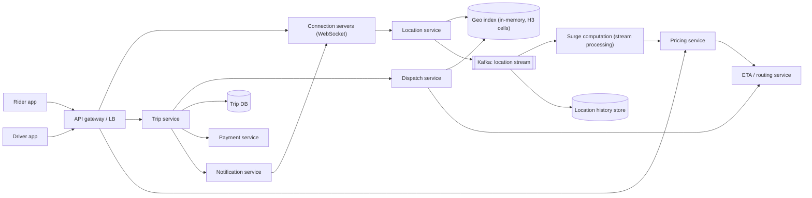
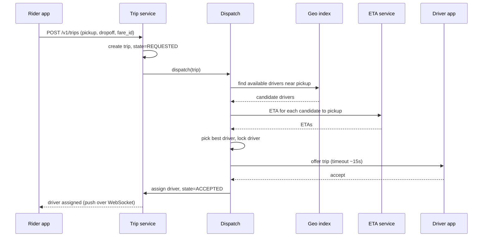
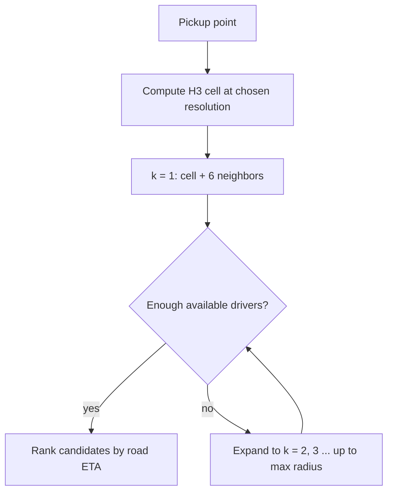
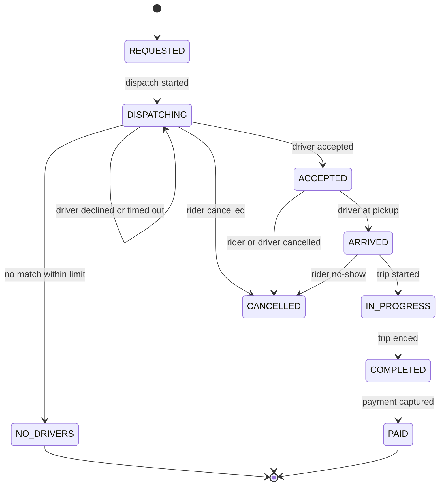
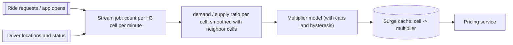

[Русский](./README.md) | **English**

# Chapter 35: Design a Ride-Sharing Service

## Introduction

In this chapter we design the backend of a ride-sharing (ride-hailing) service such as Uber or Lyft. A rider opens the app, sees a price and an ETA, requests a ride, gets matched with a nearby driver, watches the car approach on the map, takes the trip and pays at the end.

The problem combines ideas from several earlier chapters:
 * Geospatial indexing, as in [Chapter 16: Proximity Service](../16.%20Proximity%20Service/Readme.en.md)
 * High-frequency location updates over persistent connections, as in [Chapter 17: Nearby Friends](../17.%20Nearby%20Friends/README.en.md)
 * Routing and ETA, as in [Chapter 18: Google Maps](../18.%20Google%20Maps/README.en.md)
 * Charging the rider and paying out the driver, as in [Chapter 26: Payment System](../26.%20Payment%20System/README.en.md)

What is new here is the **matching (dispatch)** problem: every driver can serve only one trip at a time, so the system must make fast, correct, exclusive decisions over a constantly moving supply.

---

## Step 1: Understand the Problem and Establish Design Scope

Some questions to drive the interview:
 * C: Which features should we focus on?
 * I: Rider requests a ride, system matches a driver, both see each other's location in real time, trip is completed and paid. Also fare estimates and surge pricing.
 * C: Do we need shared rides (pooling), scheduled rides, food delivery?
 * I: No, single-rider on-demand trips only.
 * C: What is the scale?
 * I: Assume 100 million daily active riders worldwide and 5 million drivers online at peak.
 * C: How often do drivers send location updates?
 * I: Every few seconds while online. Let's say every 4 seconds.
 * C: How fast must a match happen?
 * I: The rider should see an assigned driver within a few seconds; let's target under 10 seconds end-to-end, excluding the time the driver takes to accept.
 * C: Can a driver decline an offer?
 * I: Yes. If they decline or time out, the system offers the trip to someone else.
 * C: Do we handle payments ourselves?
 * I: No, integrate with an existing payment service.
 * C: Is the service multi-region?
 * I: Yes, it operates in many cities on several continents.

### **Functional requirements**

 * Drivers go online/offline and continuously report their location
 * Riders get a fare estimate (with surge multiplier) and an ETA before requesting
 * Riders request a ride; the system matches them with a suitable nearby driver
 * Drivers receive, accept or decline trip offers
 * Rider and driver see each other's live location during pickup and trip
 * Trip lifecycle: pickup, start, complete, cancel; payment is triggered at the end
 * Push notifications for key trip events

### **Non-functional requirements**

- **Low latency**: location updates visible within ~1-2 seconds; matching in a few seconds
- **Consistency of assignments**: a driver must never be assigned two trips at once, and a trip must never get two drivers. This is the one place where we need strong consistency.
- **High availability**: an outage in a city means people stranded on the street; dispatch must survive node and even datacenter failures
- **Scalability**: handle high write throughput of location updates and peaks (concerts, rain, New Year's Eve)
- **Eventual consistency is fine elsewhere**: driver positions, surge multipliers and ETAs can be a few seconds stale

### **Back-of-the-envelope estimation**

All numbers below are assumptions for the interview, not real company figures.

 * Online drivers at peak: 5 million, each sending an update every 4 seconds
 * **Location update QPS** = 5,000,000 / 4 = **1.25 million writes/sec**
 * Size of one update (driver_id, lat, lng, heading, speed, timestamp, status) ≈ 100 bytes, so ingress ≈ 1.25M × 100 B = **125 MB/s**
 * Location history: 125 MB/s × 86,400 s ≈ 10.8 TB/day if every point is stored at peak rate. In practice average load is lower and points can be down-sampled or compressed.
 * Trips: assume 100M DAU and 0.2 trips per user per day = **20M trips/day**
 * **Ride request QPS** = 20M / 86,400 ≈ 230/sec on average; assume 5× at peak ≈ **1,200/sec**
 * Fare estimate requests are more frequent than actual rides (people check prices without booking). Assuming 5 estimates per trip ≈ 1,200 QPS on average, ~6,000 QPS peak
 * Trip records: 20M × ~2 KB ≈ 40 GB/day, ≈ 15 TB/year

Key takeaway: the system is dominated by **location writes** (over a million per second), while the transactional part (trip creation and assignment) is orders of magnitude smaller but must be strictly correct.

---

## Step 2: Propose High-Level Design and Get Buy-In

### **High-level design**



- **Connection servers**: keep persistent WebSocket connections with rider and driver apps. They receive driver location updates and push events (offers, driver position, trip status) to clients. Stateful, like in the Nearby Friends chapter.
- **Location service**: validates location updates, updates the in-memory geo index of available drivers, and publishes every update to a Kafka topic.
- **Geo index**: an in-memory index mapping geospatial cells to the drivers currently inside them, sharded by cell.
- **Dispatch service**: given a ride request, finds candidate drivers, ranks them by ETA and offers the trip. Responsible for exclusivity.
- **ETA / routing service**: computes travel time on the road graph (see the Google Maps chapter).
- **Pricing service**: computes fare estimates = base fare × distance/time model × surge multiplier.
- **Surge computation**: a stream processing job consuming ride requests and driver locations, producing a multiplier per geographic cell.
- **Trip service**: owns the trip state machine and the trip DB (source of truth for trips).
- **Payment service**: charges the rider and records driver earnings (see the Payment System chapter).
- **Notification service**: sends in-app messages via the connection servers and falls back to mobile push (APNs/FCM) when the app is in the background.

### **Ride request flow**



### **API design**

Rider:

```
POST /v1/fares/estimate
  { pickup: {lat, lng}, dropoff: {lat, lng}, product: "standard" }
  -> { fare_id, price_range, surge_multiplier, eta_seconds, expires_at }

POST /v1/trips
  { fare_id, pickup, dropoff, payment_method_id }
  Idempotency-Key: <uuid>
  -> { trip_id, status: "REQUESTED" }

GET  /v1/trips/{trip_id}
POST /v1/trips/{trip_id}/cancel
```

Driver:

```
POST /v1/drivers/me/status     { status: "ONLINE" | "OFFLINE" }
POST /v1/offers/{offer_id}/accept
POST /v1/offers/{offer_id}/decline
POST /v1/trips/{trip_id}/arrived | /start | /complete
```

Location updates are sent over the WebSocket rather than as separate HTTP calls to avoid per-request overhead at 1.25M updates/sec:

```
{ "type": "loc", "driver_id": 42, "lat": 37.7749, "lng": -122.4194,
  "heading": 90, "speed": 11.2, "ts": 1727700000123, "seq": 5812 }
```

The `fare_id` returned by the estimate locks in the quoted price (including surge) for a short time, so the rider pays what they saw. The `Idempotency-Key` protects against creating two trips when the rider taps "Request" twice or the client retries.

### **Data model**

**Driver location (in-memory, hot)** — keyed by driver:

| field | type |
|---|---|
| driver_id | bigint |
| lat, lng | double |
| h3_cell | bigint (64-bit H3 index) |
| status | AVAILABLE / OFFERED / ON_TRIP / OFFLINE |
| updated_at | timestamp |

plus a reverse index `h3_cell -> set<driver_id>` for available drivers. Entries expire if no update arrives for, say, 30 seconds.

**Trip (Trip DB)** — relational DB (e.g. MySQL/PostgreSQL) sharded by trip_id or by city. We want transactions and conditional updates here:

| field | type |
|---|---|
| trip_id | bigint (PK) |
| rider_id, driver_id | bigint |
| status | enum (see state machine) |
| version | int (optimistic locking) |
| pickup, dropoff | lat/lng |
| fare_id, surge_multiplier, final_fare | … |
| requested_at, accepted_at, started_at, completed_at | timestamp |

**Location history** — write-heavy, append-only time series: a wide-column store such as Cassandra, partitioned by (driver_id, day). Used for disputes, fare recalculation, analytics and ML training.

---

## Step 3: Design Deep Dive

### **Driver location updates**

At 1.25M writes/sec the write path must be cheap:
 * Driver apps keep a WebSocket to a connection server. The client sends an update every ~4 seconds while online (more often during an active trip, less often when stationary, to save battery).
 * Each update carries a sequence number / timestamp; out-of-order or stale updates are dropped.
 * The location service computes the H3 cell of the point, updates the driver's current position and, if the cell changed, moves the driver from the old cell set to the new one.
 * The update is published to Kafka. Consumers: history store, surge computation, trip tracking (push the driver's position to the rider during an active trip), fraud detection.
 * The hot index does not need to be durable: if a node dies, the index is rebuilt within seconds from the next round of updates. This is why an in-memory store is acceptable.

During an active trip, the rider's app needs the driver's position. The location service looks up the active trip for the driver and forwards the update to the connection server holding the rider's WebSocket (via pub/sub, as in the Nearby Friends chapter).

### **Geospatial indexing: geohash vs H3**

We need to answer "which available drivers are within X km of this point?" in milliseconds. Options discussed in the Proximity Service chapter include geohash, quadtree and Google S2. Ride-sharing adds two special requirements: data changes every few seconds, and we want to aggregate supply/demand per area for pricing.

**Geohash** splits the world into rectangles encoded as base-32 strings. It is simple and prefix-friendly, but cells vary in shape with latitude, and neighbors are at different distances (edge neighbors vs corner neighbors).

**H3**, Uber's open-source hierarchical hexagonal grid, has useful properties for this problem:
 * 16 resolutions (0-15); each finer resolution has cells with roughly 1/7 the area of the coarser one
 * Each cell is a 64-bit integer — compact and cheap to use as a hash key or shard key
 * A hexagon has only one distance between its center and each neighbor's center (squares have two, triangles three). This makes "rings" around a cell a good approximation of a circle and simplifies smoothing across neighboring areas
 * `gridDisk(cell, k)` (formerly `kRing`) returns all cells within grid distance k — exactly what we need for "search around the pickup point"



Resolution choice is a trade-off: small cells mean more cells to scan for a given radius, big cells mean more irrelevant drivers per cell. A mid resolution (cells with edges of a few hundred meters) works well for a pickup search; a coarser one is used for surge aggregation.

Note that straight-line distance is only a filter. A driver 300 m away on the other side of a river or a highway can be 10 minutes away by road. Candidates are therefore **ranked by road ETA**, not by distance.

### **Sharding the geo index**

The index is sharded by cell (e.g. by a coarse-resolution parent H3 cell) so that one query touches a few shards. Uber historically used **Ringpop** for this kind of stateful service: a library that combines a consistent hash ring (see the Consistent Hashing chapter) with a SWIM gossip membership protocol, so every node knows who owns which keys and can forward requests to the owner. When a node dies, its keys move to neighbors on the ring.

Hot spots (an airport, a stadium after a game) are a real concern: sharding by fine cells spreads a dense area across many nodes, and read replicas can serve the heavy query traffic.

Sharding by city/region is a natural first level: trips almost never cross regions, so each region's dispatch can be independent.

### **Matching: nearest driver vs batched matching**

**Greedy (nearest driver)**: for each request as it arrives, pick the available driver with the smallest ETA. Simple and fast, but locally optimal decisions can be globally bad:

 * Rider A requests; driver 1 is 2 min away, driver 2 is 3 min away. Greedy gives A driver 1.
 * A second later rider B requests; the only driver near B was driver 1 (2 min), driver 2 is 12 min away from B.
 * Total wait: 2 + 12 = 14 min. Assigning A→2 and B→1 would give 3 + 2 = 5 min.

**Batched matching**: collect requests and available drivers for a short window (a few seconds), build a bipartite graph where edge weight = ETA (or a more general cost), and solve an assignment problem (e.g. Hungarian algorithm / min-cost matching). This minimizes total wait time across the batch. Lyft describes its dispatch this way — gathering unmatched requests and available drivers every few seconds and solving the batch as a weighted bipartite matching. The cost of batching is a small added delay before the offer.

Real systems also consider drivers who are **about to finish** a trip near the pickup, which may be better than an idle driver far away.

The cost function can include more than ETA: driver rating, vehicle type, acceptance probability, and fairness of earnings across drivers.

### **Avoiding double assignment**

Two concurrent dispatch decisions (two batches, a retry, two dispatch nodes after a partition) could pick the same driver. We need a guarantee that one driver holds at most one offer/trip and that one trip gets at most one driver.

**1. Driver lock with a lease.** Before sending an offer, dispatch atomically changes driver status `AVAILABLE -> OFFERED` with an expiry equal to the offer timeout, e.g. in Redis:

```
SET driver:42:lock trip_981 NX PX 15000
```

`NX` succeeds only if nobody holds the lock. If it fails, the driver is skipped. If the driver doesn't respond, the lease expires and the driver becomes available again. Since only the owning shard of that driver writes this state (single writer per key via the hash ring), contention is local.

**2. Conditional update on the trip (source of truth).** Acceptance is committed in the Trip DB with a compare-and-set:

```sql
UPDATE trips
SET status = 'ACCEPTED', driver_id = 42, version = version + 1
WHERE trip_id = 981 AND status = 'DISPATCHING' AND version = 7;
```

If 0 rows are updated, someone else won (or the rider cancelled) and the driver app is told the offer is no longer valid. A unique constraint on "active trip per driver" (e.g. a separate `driver_active_trip` table with `driver_id` as primary key) adds a second safety net.

The lock is an optimization that prevents sending conflicting offers; the conditional write is what guarantees correctness.

### **Trip state machine**

All trip transitions go through the trip service and are validated against an explicit state machine. Invalid transitions (e.g. `COMPLETED -> IN_PROGRESS`) are rejected, and duplicate requests are idempotent.



Each transition emits an event (via an outbox table + Kafka) consumed by notifications, payments, analytics and the driver supply state (e.g. `COMPLETED` puts the driver back to `AVAILABLE`).

### **ETA computation**

ETA is used in three places: the estimate screen, ranking candidates in dispatch, and live tracking. The routing service models the road network as a graph of segments with weights = traversal time, and uses a shortest-path algorithm (with preprocessing such as contraction hierarchies, see the Google Maps chapter). Segment weights come from real-time traffic derived from the driver location stream itself.

Uber describes a hybrid: the routing engine produces a physics-based ETA, and an ML model predicts the **residual** between that estimate and observed arrival times (accounting for pickup spots, time of day, etc.). This lets the ML part evolve quickly without refactoring the routing engine.

For dispatch, we need ETAs from many drivers to one pickup point. This is a one-to-many query that can be computed with a single backward search from the pickup, and results can be cached per (cell, cell) pair for a short time.

### **Surge (dynamic) pricing**

When demand exceeds supply in an area, prices rise to reduce demand and to attract drivers to the area.



 * A stream processing job (e.g. Kafka + Flink) aggregates demand (requests, app opens) and supply (available drivers) per H3 cell in a sliding window.
 * The ratio is smoothed across neighboring hexagons (`gridDisk`) so prices don't jump sharply at cell borders.
 * A model maps the ratio to a multiplier, with caps and hysteresis so prices don't oscillate every minute.
 * The result is written to a low-latency cache read by the pricing service.
 * The multiplier is locked into the quote (`fare_id`) at estimate time; the rider pays what they accepted even if surge changes a minute later.

### **Notifications**

Time-critical events (offer to a driver, "driver assigned", "driver arrived") go over the existing WebSocket. If the connection is down (the app is in the background), the notification service falls back to APNs/FCM push, see the Notification System chapter. Offers must carry an expiry and an offer id, because a delayed push might arrive after the offer is no longer valid.

### **Payments integration**

 * At request time, the payment service creates an **authorization (hold)** on the rider's card for the estimated amount, so we know the card is valid.
 * On `COMPLETED`, the final fare is computed (from the quote or from distance/time using the location history) and the payment service **captures** the charge.
 * The trip service calls the payment service with an idempotency key (the trip_id), so retries never double-charge.
 * Driver earnings are recorded in a ledger and paid out in batches. Details of double-entry ledgers and reconciliation are in the Payment System chapter.

Payment is asynchronous with respect to the trip: a failed capture doesn't block the rider from leaving the car; it is retried and eventually escalated.

### **Driver offline and app crashes**

 * **Heartbeats**: location updates double as heartbeats. If no update arrives for N seconds (e.g. 30), the driver is removed from the available index so they don't receive offers.
 * **Offer timeout**: an offer not answered within ~15 seconds is treated as a decline; the lock lease expires and dispatch moves to the next candidate.
 * **Crash during a trip**: the trip is not cancelled automatically. The trip state lives in the Trip DB, so when the app restarts it calls `GET /v1/drivers/me/active-trip` and resumes. Gaps in location history are filled by route interpolation when computing the final fare.
 * **Connection server failure**: clients reconnect via the load balancer to another server and resubscribe; since connection servers hold only soft state, nothing is lost.
 * **Rider cancels while an offer is in flight**: the conditional update on the trip ensures a late acceptance fails cleanly.

### **Multi-region and datacenter failover**

 * The world is partitioned into regions (cities → geo regions), each served mostly from the nearest datacenter. Trips are local by nature, so cross-region coordination is rare.
 * Riders and drivers are routed to the datacenter owning their city. User profiles and payment methods are replicated globally; trip and location data stay in-region (also useful for data residency laws).
 * For failover, the region's state must be available in another datacenter. Besides async DB replication, Uber has described an interesting trick: sending an encrypted digest of the trip state to the **driver's phone**. After failover to a backup datacenter, when the driver app reconnects, the dispatch system sees an unknown trip and restores it from the digest stored on the phone.
 * The in-memory geo index doesn't need replication — it rebuilds itself from fresh location updates within seconds of failover.

---

## Step 4: Wrap Up

In this chapter we designed a ride-sharing service. The key points:
 * Location updates dominate traffic (~1.25M writes/sec in our estimate); they go over WebSockets into an in-memory, sharded geo index, and into Kafka for everything else
 * H3 hexagonal cells index drivers and aggregate supply/demand; nearby search uses rings of neighbor cells, and candidates are ranked by road ETA, not straight-line distance
 * Batched matching over a few seconds gives better global results than greedy nearest-driver assignment
 * Double assignment is prevented by a lease lock on the driver plus a conditional (compare-and-set) update on the trip, which is the source of truth
 * An explicit trip state machine keeps transitions valid and idempotent, and drives notifications and payments
 * Surge is a streaming aggregation per cell, smoothed across neighbors and locked into the quote

Additional talking points:
- **Shared rides (pooling)**: matching multiple riders into one vehicle turns matching into a routing problem with detour constraints
- **Fraud and safety**: GPS spoofing detection, route deviation alerts, emergency button
- **Driver positioning**: heatmaps and incentives to move idle drivers toward predicted demand
- **Scheduled rides**: pre-dispatch shortly before the scheduled time
- **Map matching**: snapping noisy GPS points to roads before using them for traffic and fares

---

## References

- [H3: Uber's Hexagonal Hierarchical Spatial Index (Uber Engineering)](https://www.uber.com/blog/h3/)
- [H3 documentation](https://h3geo.org/)
- [How Uber Scales Their Real-time Market Platform (High Scalability)](https://highscalability.com/how-uber-scales-their-real-time-market-platform/)
- [DeepETA: How Uber Predicts Arrival Times Using Deep Learning (Uber Engineering)](https://www.uber.com/blog/deepeta-how-uber-predicts-arrival-times/)
- [Solving Dispatch in a Ridesharing Problem Space (Lyft Engineering)](https://eng.lyft.com/solving-dispatch-in-a-ridesharing-problem-space-821d9606c3ff)
- [Real-time Data Infrastructure at Uber (arXiv)](https://arxiv.org/abs/2104.00087)
- [Ringpop (Uber open source)](https://github.com/uber-node/ringpop-node)
