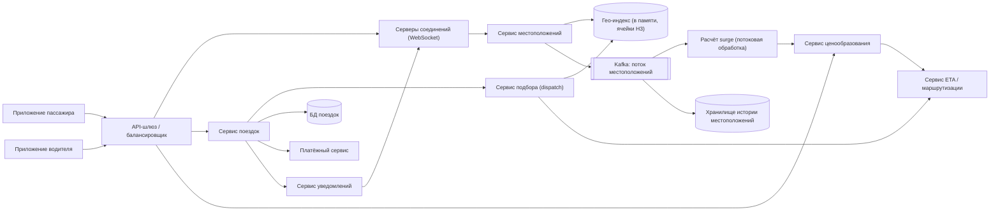
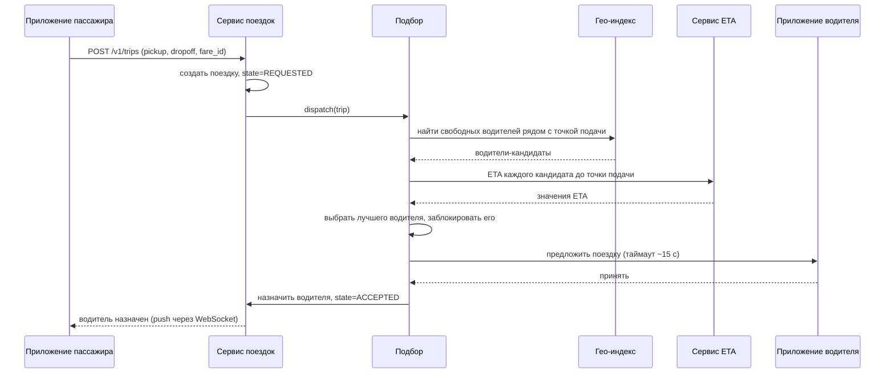
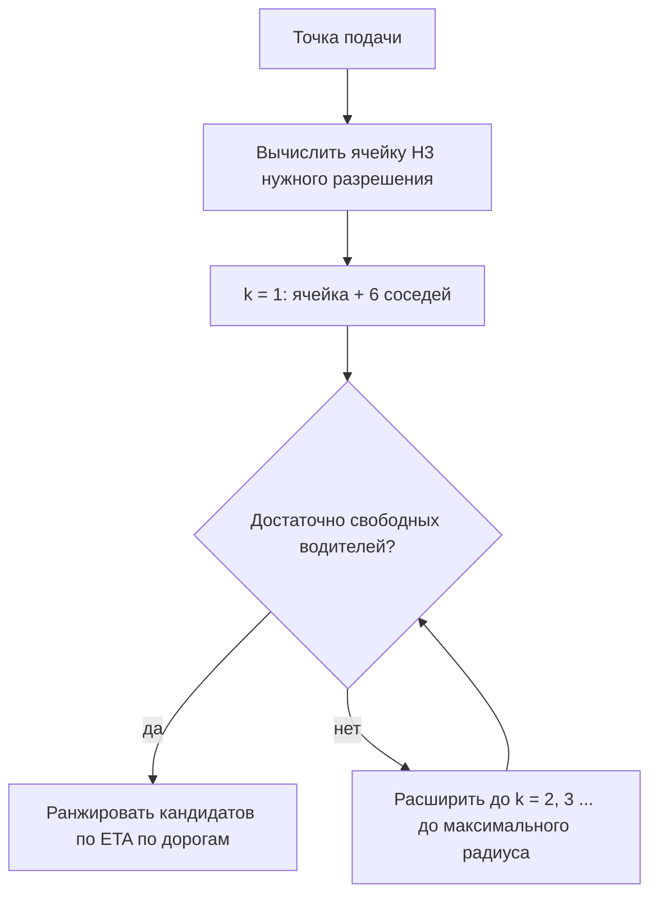
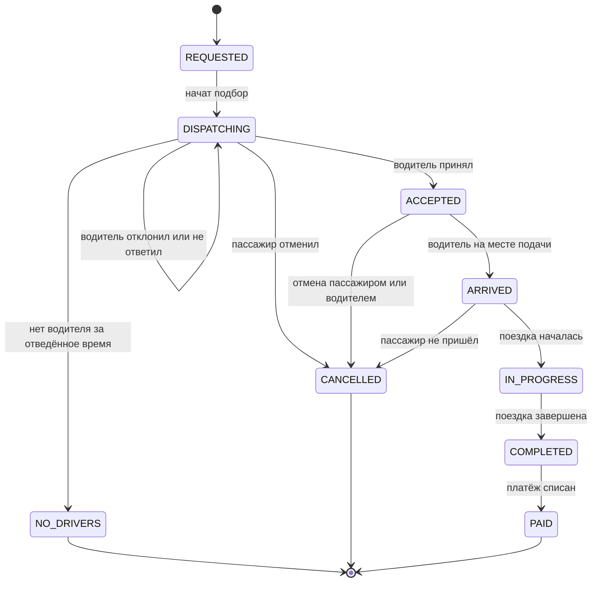

**Русский** | [English](./README.en.md)

# Глава 35: Проектирование сервиса заказа поездок (Ride-Sharing Service)

## Введение

В этой главе мы проектируем бэкенд сервиса заказа поездок (ride-sharing, ride-hailing), такого как Uber или Lyft. Пассажир открывает приложение, видит цену и ETA (Estimated Time of Arrival — расчётное время прибытия), заказывает поездку, получает водителя поблизости, наблюдает на карте, как машина подъезжает, совершает поездку и в конце оплачивает её.

Задача объединяет идеи из нескольких предыдущих глав:
 * Геопространственное индексирование — как в [Главе 16: Сервис поиска ближайших объектов](../16.%20Proximity%20Service/Readme.md)
 * Частые обновления местоположения по постоянным соединениям — как в [Главе 17: Друзья поблизости](../17.%20Nearby%20Friends/README.md)
 * Маршрутизация и расчёт ETA — как в [Главе 18: Google Maps](../18.%20Google%20Maps/README.md)
 * Списание денег с пассажира и выплаты водителю — как в [Главе 26: Платёжная система](../26.%20Payment%20System/README.md)

Новое здесь — задача **подбора водителя (matching, dispatch)**: каждый водитель может выполнять только одну поездку одновременно, поэтому система должна принимать быстрые, корректные и эксклюзивные решения над постоянно движущимся предложением.

---

## Шаг 1: Понимание задачи и определение границ дизайна

Несколько вопросов для ведения интервью (К — кандидат, И — интервьюер):
 * К: На каких функциях сосредоточиться?
 * И: Пассажир заказывает поездку, система подбирает водителя, оба видят местоположение друг друга в реальном времени, поездка завершается и оплачивается. Плюс оценка стоимости и повышающий коэффициент (surge pricing).
 * К: Нужны ли совместные поездки (pooling), поездки по расписанию, доставка еды?
 * И: Нет, только поездки по требованию с одним пассажиром.
 * К: Каков масштаб?
 * И: Допустим, 100 млн активных пассажиров в день по всему миру и 5 млн водителей онлайн в пиковое время.
 * К: Как часто водители отправляют обновления местоположения?
 * И: Каждые несколько секунд, пока они онлайн. Скажем, раз в 4 секунды.
 * К: Насколько быстро должен происходить подбор?
 * И: Пассажир должен увидеть назначенного водителя за несколько секунд; ориентируемся на менее чем 10 секунд из конца в конец, не считая времени, которое водитель тратит на принятие заказа.
 * К: Может ли водитель отклонить предложение?
 * И: Да. Если он отклоняет или не отвечает вовремя, система предлагает поездку другому.
 * К: Обрабатываем ли мы платежи сами?
 * И: Нет, интегрируемся с существующим платёжным сервисом.
 * К: Сервис работает в нескольких регионах?
 * И: Да, во многих городах на нескольких континентах.

### **Функциональные требования**

 * Водители выходят на линию и уходят с неё, непрерывно сообщая своё местоположение
 * Перед заказом пассажиры получают оценку стоимости (с учётом повышающего коэффициента) и ETA
 * Пассажир заказывает поездку; система подбирает ему подходящего водителя поблизости
 * Водители получают, принимают или отклоняют предложения поездок
 * Во время подачи и поездки пассажир и водитель видят местоположение друг друга в реальном времени
 * Жизненный цикл поездки: подача, начало, завершение, отмена; в конце запускается оплата
 * Push-уведомления о ключевых событиях поездки

### **Нефункциональные требования**

- **Низкая задержка (latency)**: обновления местоположения видны в пределах ~1–2 секунд; подбор — за несколько секунд
- **Согласованность назначений**: водитель никогда не должен быть назначен на две поездки одновременно, а у поездки не должно быть двух водителей. Это единственное место, где нужна строгая согласованность (strong consistency).
- **Высокая доступность (high availability)**: сбой в городе означает, что люди остаются на улице; подбор должен переживать отказы узлов и даже целых дата-центров
- **Масштабируемость**: выдерживать высокий поток записей местоположений и пиковые нагрузки (концерты, дождь, Новый год)
- **В остальных местах допустима согласованность в конечном счёте (eventual consistency)**: позиции водителей, повышающие коэффициенты и ETA могут отставать на несколько секунд

### **Оценка на салфетке (back-of-the-envelope)**

Все числа ниже — допущения для интервью, а не реальные данные компаний.

 * Водителей онлайн в пике: 5 млн, каждый отправляет обновление раз в 4 секунды
 * **QPS (Queries Per Second — запросов в секунду) обновлений местоположения** = 5 000 000 / 4 = **1,25 млн записей/с**
 * Размер одного обновления (driver_id, широта, долгота, направление, скорость, метка времени, статус) ≈ 100 байт, значит входящий трафик ≈ 1,25 млн × 100 Б = **125 МБ/с**
 * История местоположений: 125 МБ/с × 86 400 с ≈ 10,8 ТБ/день, если хранить каждую точку при пиковой нагрузке. На практике средняя нагрузка ниже, а точки можно прореживать или сжимать.
 * Поездки: допустим, DAU (Daily Active Users — ежедневно активные пользователи) = 100 млн и 0,2 поездки на пользователя в день = **20 млн поездок/день**
 * **QPS заказов поездок** = 20 млн / 86 400 ≈ 230/с в среднем; в пике допустим ×5 ≈ **1 200/с**
 * Запросов оценки стоимости больше, чем реальных поездок (люди проверяют цену, не заказывая). При 5 оценках на поездку ≈ 1 200 QPS в среднем, ~6 000 QPS в пике
 * Записи о поездках: 20 млн × ~2 КБ ≈ 40 ГБ/день, ≈ 15 ТБ/год

Главный вывод: в системе доминируют **записи местоположений** (более миллиона в секунду), тогда как транзакционная часть (создание поездки и назначение водителя) на порядки меньше, но должна быть строго корректной.

---

## Шаг 2: Высокоуровневый дизайн и согласование

### **Высокоуровневый дизайн**



- **Серверы соединений**: держат постоянные соединения WebSocket (протокол двусторонней связи поверх одного TCP-соединения; TCP — Transmission Control Protocol, протокол управления передачей) с приложениями пассажиров и водителей. Принимают обновления местоположения водителей и отправляют клиентам события (предложения, позиция водителя, статус поездки). Хранят состояние (stateful), как в главе «Друзья поблизости».
- **Сервис местоположений**: проверяет обновления местоположения, обновляет гео-индекс свободных водителей в памяти и публикует каждое обновление в топик Kafka.
- **Гео-индекс**: индекс в памяти, сопоставляющий геопространственным ячейкам водителей, которые сейчас в них находятся; шардирован по ячейкам.
- **Сервис подбора (dispatch)**: по заказу находит водителей-кандидатов, ранжирует их по ETA и предлагает поездку. Отвечает за эксклюзивность назначения.
- **Сервис ETA / маршрутизации**: рассчитывает время в пути по дорожному графу (см. главу о Google Maps).
- **Сервис ценообразования**: рассчитывает оценку стоимости = базовый тариф × модель расстояния/времени × повышающий коэффициент.
- **Расчёт surge**: задание потоковой обработки, которое читает заказы и местоположения водителей и выдаёт коэффициент для каждой географической ячейки.
- **Сервис поездок**: владеет конечным автоматом поездки и БД поездок (источник истины для поездок).
- **Платёжный сервис**: списывает деньги с пассажира и учитывает заработок водителя (см. главу «Платёжная система»).
- **Сервис уведомлений**: отправляет сообщения внутри приложения через серверы соединений, а когда приложение в фоне, переключается на мобильные push-уведомления через APNs (Apple Push Notification service — сервис push-уведомлений Apple) и FCM (Firebase Cloud Messaging — сервис push-уведомлений Google).

### **Процесс заказа поездки**



### **Дизайн API**

API (Application Programming Interface — программный интерфейс приложения) пассажира:

```
POST /v1/fares/estimate
  { pickup: {lat, lng}, dropoff: {lat, lng}, product: "standard" }
  -> { fare_id, price_range, surge_multiplier, eta_seconds, expires_at }

POST /v1/trips
  { fare_id, pickup, dropoff, payment_method_id }
  Idempotency-Key: <uuid>
  -> { trip_id, status: "REQUESTED" }

GET  /v1/trips/{trip_id}
POST /v1/trips/{trip_id}/cancel
```

Водитель:

```
POST /v1/drivers/me/status     { status: "ONLINE" | "OFFLINE" }
POST /v1/offers/{offer_id}/accept
POST /v1/offers/{offer_id}/decline
POST /v1/trips/{trip_id}/arrived | /start | /complete
```

Обновления местоположения отправляются через WebSocket, а не отдельными HTTP-вызовами (HyperText Transfer Protocol — протокол передачи гипертекста), чтобы не платить накладные расходы на каждый запрос при 1,25 млн обновлений в секунду:

```
{ "type": "loc", "driver_id": 42, "lat": 37.7749, "lng": -122.4194,
  "heading": 90, "speed": 11.2, "ts": 1727700000123, "seq": 5812 }
```

Возвращаемый при оценке `fare_id` фиксирует предложенную цену (включая surge) на короткое время, чтобы пассажир заплатил ровно то, что увидел. Заголовок `Idempotency-Key` защищает от создания двух поездок, если пассажир дважды нажал «Заказать» или клиент повторил запрос.

### **Модель данных**

**Местоположение водителя (в памяти, «горячие» данные)** — ключ по водителю:

| поле | тип |
|---|---|
| driver_id | bigint |
| lat, lng | double |
| h3_cell | bigint (64-битный индекс H3) |
| status | AVAILABLE / OFFERED / ON_TRIP / OFFLINE |
| updated_at | timestamp |

плюс обратный индекс `h3_cell -> set<driver_id>` для свободных водителей. Записи устаревают, если обновление не приходило, скажем, 30 секунд.

**Поездка (БД поездок)** — реляционная БД (например, MySQL/PostgreSQL), шардированная по trip_id или по городу. Здесь нам нужны транзакции и условные обновления:

| поле | тип |
|---|---|
| trip_id | bigint (PK, Primary Key — первичный ключ) |
| rider_id, driver_id | bigint |
| status | enum (см. конечный автомат) |
| version | int (оптимистическая блокировка) |
| pickup, dropoff | lat/lng |
| fare_id, surge_multiplier, final_fare | … |
| requested_at, accepted_at, started_at, completed_at | timestamp |

**История местоположений** — нагрузка преимущественно на запись, временной ряд только с добавлением (append-only): колоночное хранилище (wide-column store), например Cassandra, с партиционированием по (driver_id, день). Используется для разбора споров, пересчёта стоимости, аналитики и обучения ML-моделей (Machine Learning — машинное обучение).

---

## Шаг 3: Детальное проектирование

### **Обновления местоположения водителей**

При 1,25 млн записей в секунду путь записи должен быть дешёвым:
 * Приложение водителя держит WebSocket с сервером соединений. Пока водитель онлайн, клиент отправляет обновление примерно раз в 4 секунды (чаще во время активной поездки и реже, когда машина стоит, чтобы экономить батарею).
 * Каждое обновление несёт порядковый номер / метку времени; пришедшие не по порядку или устаревшие обновления отбрасываются.
 * Сервис местоположений вычисляет ячейку H3 для точки, обновляет текущую позицию водителя и, если ячейка сменилась, переносит водителя из множества старой ячейки в множество новой.
 * Обновление публикуется в Kafka. Потребители: хранилище истории, расчёт surge, отслеживание поездки (отправка позиции водителя пассажиру во время активной поездки), обнаружение мошенничества.
 * «Горячий» индекс не обязан быть долговечным: если узел падает, индекс восстанавливается за секунды из следующей волны обновлений. Именно поэтому допустимо хранилище в памяти.

Во время активной поездки приложению пассажира нужна позиция водителя. Сервис местоположений находит активную поездку водителя и пересылает обновление на сервер соединений, держащий WebSocket пассажира (через pub/sub, как в главе «Друзья поблизости»).

### **Геопространственное индексирование: geohash против H3**

Нам нужно за миллисекунды отвечать на вопрос «какие свободные водители находятся в пределах X км от этой точки?». Варианты, рассмотренные в главе о сервисе поиска ближайших объектов, — geohash, дерево квадрантов (quadtree) и Google S2. У сервиса поездок есть два особых требования: данные меняются каждые несколько секунд, а спрос и предложение нужно агрегировать по районам для ценообразования.

**Geohash** делит мир на прямоугольники, закодированные строками в base-32. Он прост и удобен для поиска по префиксу, но форма ячеек зависит от широты, а соседи находятся на разных расстояниях (соседи по стороне и по углу).

**H3** (Hexagonal Hierarchical Spatial Index — иерархический гексагональный пространственный индекс), открытая разработка Uber, обладает полезными для нашей задачи свойствами:
 * 16 разрешений (0–15); ячейки каждого следующего, более мелкого разрешения имеют площадь примерно в 1/7 от площади ячеек предыдущего
 * Каждая ячейка — 64-битное целое число: компактно и дёшево использовать как ключ хеша или ключ шардирования
 * У шестиугольника расстояние от центра до центра каждого соседа одинаково (у квадрата таких расстояний два, у треугольника три). Поэтому «кольца» вокруг ячейки хорошо аппроксимируют окружность, а сглаживание между соседними районами упрощается
 * `gridDisk(cell, k)` (ранее `kRing`) возвращает все ячейки в пределах сеточного расстояния k — ровно то, что нужно для «поиска вокруг точки подачи»



Выбор разрешения — компромисс: при мелких ячейках для заданного радиуса приходится сканировать больше ячеек, при крупных в каждой ячейке больше нерелевантных водителей. Для поиска вокруг точки подачи хорошо подходит среднее разрешение (ячейки со стороной в несколько сотен метров), для агрегации surge — более грубое.

Обратите внимание: расстояние по прямой — лишь фильтр. Водитель в 300 м от пассажира, но на другом берегу реки или по другую сторону шоссе, может ехать 10 минут. Поэтому кандидаты **ранжируются по ETA по дорогам**, а не по расстоянию.

### **Шардирование гео-индекса**

Индекс шардируется по ячейкам (например, по родительской ячейке H3 грубого разрешения), чтобы один запрос затрагивал всего несколько шардов. Для подобных сервисов с состоянием Uber исторически использовал **Ringpop** — библиотеку, которая объединяет кольцо консистентного хеширования (см. главу «Консистентное хеширование») с протоколом членства SWIM (Scalable Weakly-consistent Infection-style process group Membership — масштабируемый протокол членства в группе на основе слухов, gossip). Благодаря этому каждый узел знает, кто владеет какими ключами, и может переслать запрос владельцу. Когда узел падает, его ключи переходят к соседям по кольцу.

Горячие точки (аэропорт, стадион после матча) — реальная проблема: шардирование по мелким ячейкам распределяет плотный район по многим узлам, а реплики для чтения могут обслуживать интенсивный поток запросов.

Естественный первый уровень шардирования — по городу/региону: поездки почти никогда не пересекают границы регионов, поэтому подбор в каждом регионе может работать независимо.

### **Подбор: ближайший водитель против пакетного подбора**

**Жадный алгоритм (ближайший водитель, greedy)**: для каждого заказа в момент поступления выбирается свободный водитель с наименьшим ETA. Просто и быстро, но локально оптимальные решения могут быть глобально плохими:

 * Пассажир A делает заказ; водитель 1 в 2 минутах, водитель 2 в 3 минутах. Жадный алгоритм отдаёт A водителя 1.
 * Секундой позже заказывает пассажир B; единственный водитель рядом с B — водитель 1 (2 мин), а водитель 2 от B в 12 минутах.
 * Суммарное ожидание: 2 + 12 = 14 мин. Назначение A→2 и B→1 дало бы 3 + 2 = 5 мин.

**Пакетный подбор (batched matching)**: в течение короткого окна (несколько секунд) собираем заказы и свободных водителей, строим двудольный граф, где вес ребра = ETA (или более общая стоимость), и решаем задачу о назначениях (например, венгерским алгоритмом / поиском паросочетания минимальной стоимости). Это минимизирует суммарное время ожидания по всему пакету. Lyft описывает свой подбор именно так: каждые несколько секунд собираются неназначенные заказы и свободные водители, и пакет решается как задача взвешенного двудольного паросочетания. Цена пакетирования — небольшая дополнительная задержка перед отправкой предложения.

Реальные системы учитывают и водителей, которые **вот-вот завершат** поездку рядом с точкой подачи: такой водитель может оказаться лучше свободного, но далёкого.

Функция стоимости может включать не только ETA: рейтинг водителя, тип автомобиля, вероятность принятия заказа, справедливое распределение заработка между водителями.

### **Предотвращение двойного назначения**

Два параллельных решения подбора (два пакета, повторная попытка, два узла подбора после сетевого разделения) могут выбрать одного и того же водителя. Нужна гарантия, что у водителя не более одного предложения/поездки, а у поездки не более одного водителя.

**1. Блокировка водителя с арендой (lease).** Перед отправкой предложения подбор атомарно меняет статус водителя `AVAILABLE -> OFFERED` со сроком действия, равным таймауту предложения, например в Redis:

```
SET driver:42:lock trip_981 NX PX 15000
```

`NX` срабатывает, только если блокировку никто не держит. Если не удалось — водитель пропускается. Если водитель не ответил, аренда истекает, и он снова становится свободным. Поскольку это состояние пишет только шард-владелец водителя (один писатель на ключ благодаря кольцу хеширования), конкуренция остаётся локальной.

**2. Условное обновление поездки (источник истины).** Принятие заказа фиксируется в БД поездок операцией «сравнить и установить» (compare-and-set):

```sql
UPDATE trips
SET status = 'ACCEPTED', driver_id = 42, version = version + 1
WHERE trip_id = 981 AND status = 'DISPATCHING' AND version = 7;
```

Если обновлено 0 строк, значит, выиграл кто-то другой (или пассажир отменил заказ), и приложению водителя сообщается, что предложение больше не действительно. Ограничение уникальности «одна активная поездка на водителя» (например, отдельная таблица `driver_active_trip` с `driver_id` в качестве первичного ключа) даёт вторую страховку.

Блокировка — оптимизация, которая не даёт отправлять конфликтующие предложения; корректность же гарантирует условная запись.

### **Конечный автомат поездки (state machine)**

Все переходы поездки проходят через сервис поездок и проверяются по явному конечному автомату. Недопустимые переходы (например, `COMPLETED -> IN_PROGRESS`) отклоняются, а повторные запросы идемпотентны.



Каждый переход порождает событие (через таблицу outbox + Kafka), которое потребляют уведомления, платежи, аналитика и состояние предложения водителей (например, `COMPLETED` возвращает водителя в `AVAILABLE`).

### **Расчёт ETA**

ETA используется в трёх местах: на экране оценки стоимости, при ранжировании кандидатов в подборе и при отслеживании поездки. Сервис маршрутизации моделирует дорожную сеть как граф сегментов с весами = время проезда и использует алгоритм поиска кратчайшего пути (с предобработкой, например иерархиями сжатия (contraction hierarchies), см. главу о Google Maps). Веса сегментов берутся из данных о трафике в реальном времени, которые получаются из того же потока местоположений водителей.

Uber описывает гибридный подход: движок маршрутизации выдаёт «физическую» оценку ETA, а ML-модель предсказывает **остаток (residual)** — разницу между этой оценкой и фактическим временем прибытия (с учётом мест подачи, времени суток и т. д.). Это позволяет быстро развивать ML-часть, не переделывая движок маршрутизации.

Для подбора нужны ETA от многих водителей до одной точки подачи. Это запрос «один ко многим», который можно вычислить одним обратным поиском от точки подачи, а результаты — кешировать на короткое время для пар (ячейка, ячейка).

### **Динамическое ценообразование (surge pricing)**

Когда спрос в районе превышает предложение, цены растут, чтобы снизить спрос и привлечь туда водителей.


 * Задание потоковой обработки (например, Kafka + Flink) агрегирует спрос (заказы, открытия приложения) и предложение (свободные водители) по ячейкам H3 в скользящем окне.
 * Отношение сглаживается по соседним шестиугольникам (`gridDisk`), чтобы цены не скакали резко на границах ячеек.
 * Модель преобразует отношение в коэффициент — с верхними ограничениями и гистерезисом, чтобы цены не колебались каждую минуту.
 * Результат записывается в кеш с низкой задержкой, откуда его читает сервис ценообразования.
 * Коэффициент фиксируется в предложении цены (`fare_id`) в момент оценки: пассажир платит то, с чем согласился, даже если surge через минуту изменится.

### **Уведомления**

Срочные события (предложение водителю, «водитель назначен», «водитель на месте») идут через уже открытый WebSocket. Если соединение разорвано (приложение в фоне), сервис уведомлений переключается на push через APNs/FCM — см. главу «Система уведомлений». Предложения должны содержать срок действия и идентификатор, потому что задержавшийся push может прийти, когда предложение уже недействительно.

### **Интеграция с платежами**

 * В момент заказа платёжный сервис создаёт **авторизацию (hold, удержание)** на карте пассажира на оценочную сумму — так мы убеждаемся, что карта действительна.
 * При переходе в `COMPLETED` вычисляется итоговая стоимость (по предложенной цене или по расстоянию/времени из истории местоположений), и платёжный сервис **списывает (capture)** платёж.
 * Сервис поездок вызывает платёжный сервис с ключом идемпотентности (trip_id), поэтому повторы никогда не приводят к двойному списанию.
 * Заработок водителя записывается в журнал учёта (ledger) и выплачивается пакетами. Подробности о двойной записи и сверке — в главе «Платёжная система».

Оплата асинхронна по отношению к поездке: неудачное списание не мешает пассажиру выйти из машины; оно повторяется и в конечном счёте эскалируется.

### **Водитель офлайн и падения приложения**

 * **Сигналы жизни (heartbeats)**: обновления местоположения одновременно служат сигналами жизни. Если обновлений нет N секунд (например, 30), водитель удаляется из индекса свободных и не получает предложений.
 * **Таймаут предложения**: предложение без ответа в течение ~15 секунд считается отклонённым; аренда блокировки истекает, и подбор переходит к следующему кандидату.
 * **Падение приложения во время поездки**: поездка автоматически не отменяется. Её состояние хранится в БД поездок, поэтому после перезапуска приложение вызывает `GET /v1/drivers/me/active-trip` и продолжает работу. Пропуски в истории местоположений заполняются интерполяцией по маршруту при расчёте итоговой стоимости.
 * **Отказ сервера соединений**: клиенты переподключаются через балансировщик к другому серверу и заново подписываются; так как серверы соединений хранят только «мягкое» состояние, ничего не теряется.
 * **Пассажир отменяет заказ, пока предложение в пути**: условное обновление поездки гарантирует, что запоздалое принятие корректно завершится неудачей.

### **Мультирегиональность и переключение дата-центров**

 * Мир разбит на регионы (города → географические регионы), каждый обслуживается в основном ближайшим дата-центром. Поездки по своей природе локальны, поэтому межрегиональная координация требуется редко.
 * Пассажиры и водители направляются в дата-центр, владеющий их городом. Профили пользователей и способы оплаты реплицируются глобально; данные о поездках и местоположениях остаются в регионе (что полезно и для законов о локализации данных).
 * Для переключения при сбое (failover) состояние региона должно быть доступно в другом дата-центре. Помимо асинхронной репликации БД, Uber описывал интересный приём: зашифрованная сводка состояния поездки отправляется на **телефон водителя**. После переключения на резервный дата-центр, когда приложение водителя переподключается, система подбора видит неизвестную ей поездку и восстанавливает её из сводки, хранящейся на телефоне.
 * Гео-индекс в памяти реплицировать не нужно — после переключения он сам восстанавливается из свежих обновлений местоположения за считанные секунды.

---

## Шаг 4: Подведение итогов

В этой главе мы спроектировали сервис заказа поездок. Ключевые моменты:
 * Основной трафик — обновления местоположения (~1,25 млн записей/с по нашей оценке); они идут через WebSocket в шардированный гео-индекс в памяти и в Kafka — для всего остального
 * Шестиугольные ячейки H3 индексируют водителей и агрегируют спрос/предложение; поиск поблизости использует кольца соседних ячеек, а кандидаты ранжируются по ETA по дорогам, а не по расстоянию по прямой
 * Пакетный подбор за окно в несколько секунд даёт лучший глобальный результат, чем жадное назначение ближайшего водителя
 * Двойное назначение предотвращается арендуемой блокировкой водителя плюс условным обновлением (compare-and-set) поездки, которая является источником истины
 * Явный конечный автомат поездки поддерживает корректность и идемпотентность переходов и управляет уведомлениями и платежами
 * Surge — это потоковая агрегация по ячейкам, сглаженная по соседям и зафиксированная в предложении цены

Дополнительные темы для обсуждения:
- **Совместные поездки (pooling)**: объединение нескольких пассажиров в одну машину превращает подбор в задачу маршрутизации с ограничениями на крюк
- **Мошенничество и безопасность**: обнаружение подмены GPS (Global Positioning System — глобальная система позиционирования), оповещения об отклонении от маршрута, тревожная кнопка
- **Расстановка водителей**: тепловые карты и стимулы, чтобы простаивающие водители перемещались туда, где ожидается спрос
- **Поездки по расписанию**: предварительный подбор незадолго до назначенного времени
- **Привязка к карте (map matching)**: «прилипание» зашумлённых GPS-точек к дорогам перед их использованием для трафика и расчёта стоимости

---

## Источники

- [H3: Uber's Hexagonal Hierarchical Spatial Index (Uber Engineering)](https://www.uber.com/blog/h3/)
- [H3 documentation](https://h3geo.org/)
- [How Uber Scales Their Real-time Market Platform (High Scalability)](https://highscalability.com/how-uber-scales-their-real-time-market-platform/)
- [DeepETA: How Uber Predicts Arrival Times Using Deep Learning (Uber Engineering)](https://www.uber.com/blog/deepeta-how-uber-predicts-arrival-times/)
- [Solving Dispatch in a Ridesharing Problem Space (Lyft Engineering)](https://eng.lyft.com/solving-dispatch-in-a-ridesharing-problem-space-821d9606c3ff)
- [Real-time Data Infrastructure at Uber (arXiv)](https://arxiv.org/abs/2104.00087)
- [Ringpop (Uber open source)](https://github.com/uber-node/ringpop-node)
