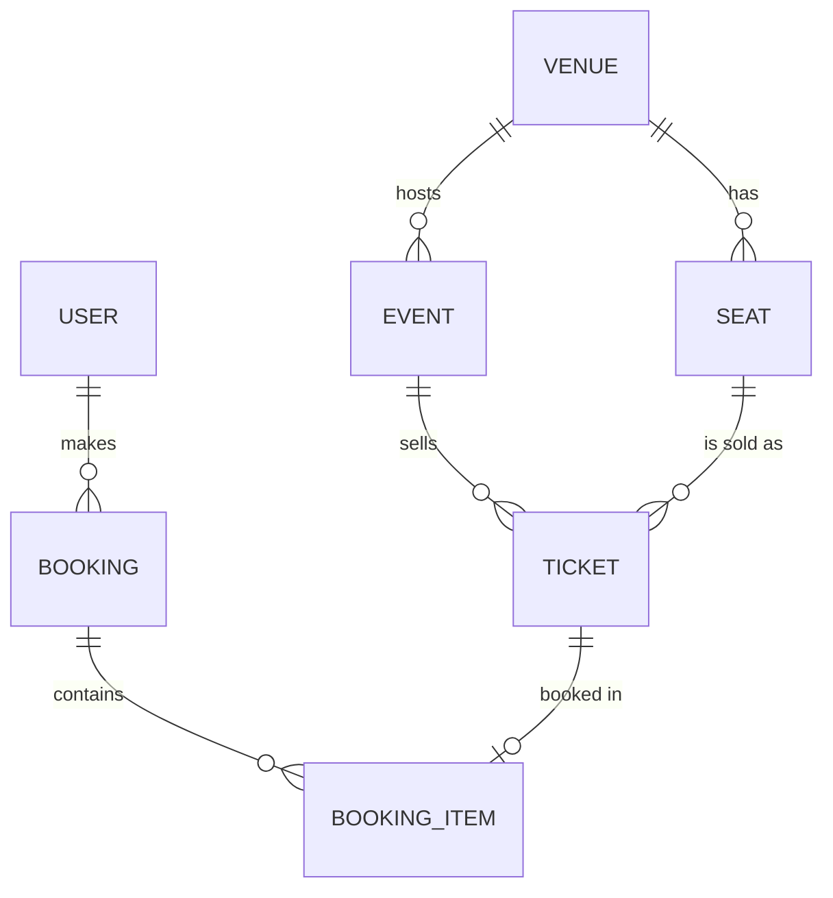
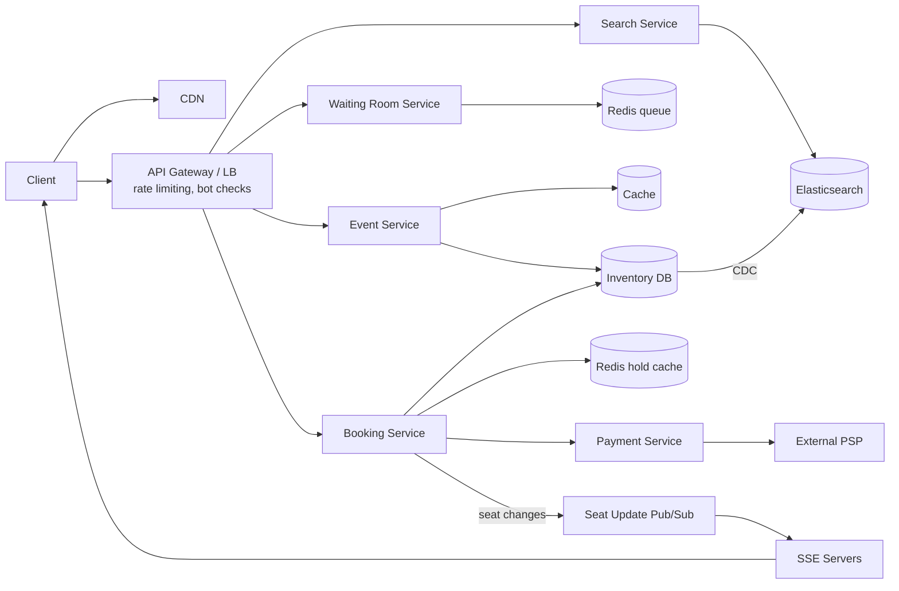
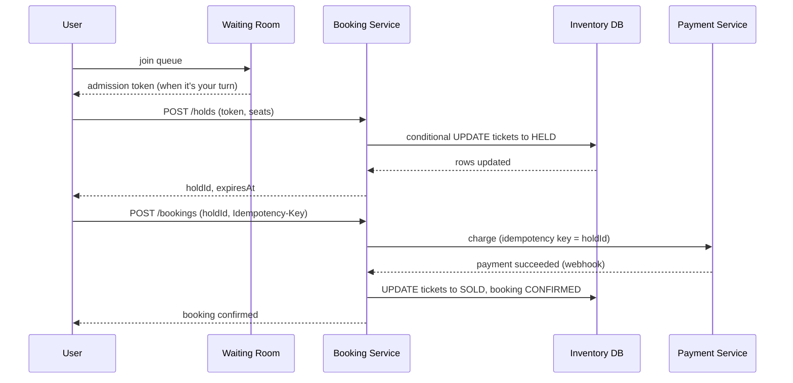
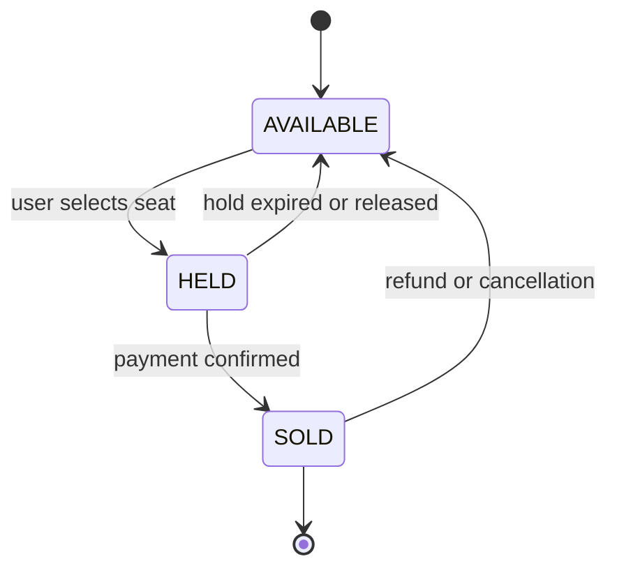
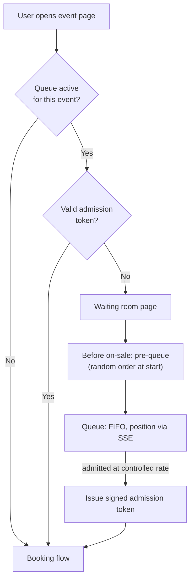

[Русский](./README.md) | **English**

# Chapter 36: Design a Ticket Booking System

## Introduction

In this chapter we design a ticket booking platform similar to Ticketmaster: users browse and search for events (concerts, sports, theatre), pick seats on an interactive seat map and buy tickets.

At first glance this looks like the [hotel reservation system](../22.%20Hotel%20Reservation%20System/README.en.md) — both are inventory reservations. The key differences:
 * **Inventory is unique.** A hotel sells "a room of type X", while here every seat is a distinct item (section 112, row F, seat 7). Two users must never buy the same seat.
 * **Extreme traffic spikes.** When tickets for a popular artist go on sale, millions of people arrive at the same minute for a few tens of thousands of seats. Demand exceeds supply by orders of magnitude, and bots compete with humans.
 * **Temporary holds.** A user needs a few minutes to enter payment details, so the seat has to be held for them — and released automatically if they give up.

Payment processing itself is covered in the [payment system chapter](../26.%20Payment%20System/README.en.md); here we treat the payment service as a black box and focus on the booking flow around it.

---

## Step 1: Understand the Problem and Establish Design Scope

 * C: What are the main features we need to support?
 * I: Browse and search events, view an event with its seat map, and book tickets.
 * C: Are seats always assigned, or is there general admission too?
 * I: Mostly assigned seating. Mention how general admission (standing zones) differs.
 * C: How long can a user hold selected seats before paying?
 * I: Around 10 minutes. After that the seats go back on sale.
 * C: How many tickets can one user buy per event?
 * I: The organizer sets a limit, typically 4-8.
 * C: What happens during on-sales for very popular events?
 * I: That's the hard part. Assume millions of users trying to buy tickets for a single stadium show at the same time.
 * C: Should we deal with bots and scalpers?
 * I: Yes, fairness matters. Real fans should have a fair chance.
 * C: Do we handle payments ourselves?
 * I: No, we integrate with a third-party payment service provider (PSP).
 * C: Do we need secondary market (resale), dynamic pricing, or ticket delivery?
 * I: Out of scope.

### **Functional requirements**

 * Users can browse and search events by keyword, location, date, performer
 * Users can view an event page with its seat map and seat availability
 * Users can select seats and hold them for a limited time (e.g. 10 minutes)
 * Users can pay for held seats and receive a confirmed booking
 * During high-demand on-sales, users go through a virtual waiting room

### **Non-functional requirements**

- **No double booking**: strong consistency for seat inventory. A seat is sold at most once. This is the one property we never trade off.
- **High availability for reads**: browsing and search should stay up even when booking is degraded; eventual consistency is fine here.
- **Scalability for spikes**: handle 100x+ normal traffic during on-sales without falling over.
- **Low latency**: search results within a few hundred milliseconds; seat map availability close to real-time.
- **Fairness**: bots should not get an advantage, arrival order before the sale starts should not matter.

The system is heavily **read-skewed**: for every purchase there are many searches, event page views and seat map refreshes.

### **Back-of-the-envelope estimation**

All numbers below are assumptions made for the interview, not real Ticketmaster figures.

Normal traffic:
 * 10mil DAU, each makes ~20 read requests (search, event pages) per day
 * Read QPS = 10mil * 20 / 10^5 seconds ≈ **2,000 QPS**, peak (x5) ≈ **10,000 QPS**
 * 100k new events per year, average 5,000 seats each → 500mil ticket rows per year
 * One ticket row ≈ 100 bytes → 500mil * 100 bytes = **50GB per year**. Inventory data fits comfortably in a sharded relational database.

A flash sale for one popular event:
 * Stadium with 50,000 seats, 2mil users show up at on-sale time
 * If every user refreshes the seat map every 5 seconds without any protection: 2mil / 5 = **400,000 QPS** against one event
 * Average order is 2.5 tickets → 50,000 / 2.5 = **20,000 orders** can succeed at most, i.e. **99%** of the users will leave without tickets
 * If the event sells out in ~20 minutes: 20,000 / 1,200 seconds ≈ **17 orders per second**. Even with 10x retries and contention, hold attempts are in the hundreds per second.

Conclusion: the write path (holds and bookings) is small in absolute numbers but must be strictly correct. The read path and the sheer number of simultaneous users are what need to be absorbed — and a large part of that load is better **not admitted** to the booking system at all.

---

## Step 2: Propose High-Level Design and Get Buy-In

### **API design**

Search and browse:
```
GET /v1/events/search?keyword=...&city=...&from=...&to=...&page_token=...
GET /v1/events/{eventId}               -- event details, venue, price levels
GET /v1/events/{eventId}/seatmap       -- venue layout + current availability
```

Holding seats (requires an admission token during on-sales):
```
POST /v1/events/{eventId}/holds
Headers: Admission-Token: <signed token>, Idempotency-Key: <uuid>
Body: { "ticketIds": ["t_101", "t_102"] }
Response: { "holdId": "h_9f2", "expiresAt": "2026-09-30T18:10:00Z" }

DELETE /v1/holds/{holdId}              -- user releases seats voluntarily
```

Checkout:
```
POST /v1/bookings
Headers: Idempotency-Key: <uuid>
Body: { "holdId": "h_9f2", "paymentMethod": "..." }
Response: { "bookingId": "b_77a", "status": "PENDING_PAYMENT" | "CONFIRMED" }

GET /v1/bookings/{bookingId}
```

Waiting room:
```
POST /v1/events/{eventId}/queue        -- join the queue, returns queueId
GET  /v1/queue/{queueId}               -- position, ETA; admission token when it's your turn
```

The `Idempotency-Key` header makes retries of state-changing calls safe — a user double-clicking "Buy" or a mobile client retrying on timeout must not create two holds or two charges. This follows the same approach as in the [payment system chapter](../26.%20Payment%20System/README.en.md) and Stripe's API.

### **Data model**

 * **Venue**: `venue_id, name, address, geo`
 * **Seat (venue layout)**: `seat_id, venue_id, section, row, number, x, y` — static, shared by all events in the venue
 * **Event**: `event_id, venue_id, performer_id, name, start_time, on_sale_time, max_tickets_per_user, status`
 * **Ticket (inventory)**: `ticket_id, event_id, seat_id, price_level, status, hold_id, hold_expires_at, booking_id, version`
 * **Booking**: `booking_id, user_id, event_id, status, total_amount, payment_id, idempotency_key, created_at`
 * **Booking item**: `booking_id, ticket_id`

The important decision is that **a ticket row is created per seat per event**. Seat availability becomes a property of a single row, which makes "only one buyer per seat" a single-row consistency problem that relational databases handle well.



For inventory and bookings we use a relational database (e.g. PostgreSQL/MySQL) — we need ACID transactions and conditional updates. Events are partitioned by `event_id`, so all tickets of one event live on one shard and a multi-seat hold is a local transaction.

### **High-level design**



 * **CDN**: serves static assets, event images and the static venue layout (seat coordinates, SVG).
 * **API gateway**: authentication, rate limiting (see the [rate limiter chapter](../04.%20Rate%20Limiter/Readme.en.md)), admission token verification.
 * **Event service**: event details and seat maps; heavily cached.
 * **Search service**: full-text and geo search over Elasticsearch, fed by change data capture (CDC) from the primary DB.
 * **Waiting room service**: manages queues for high-demand events and issues admission tokens.
 * **Booking service**: holds, bookings, expiry; the only writer of ticket status.
 * **Payment service**: wraps the external PSP.
 * **SSE servers**: push seat availability changes to clients viewing the seat map.

### **Booking flow**



---

## Step 3: Design Deep Dive

We'll dig into:
 * Seat hold and preventing double booking
 * Hold expiry
 * Checkout, payment and idempotency
 * Virtual waiting room
 * Bot protection and fairness
 * Seat map caching and real-time updates
 * Search
 * Scaling reads vs writes

### **Ticket state machine**

Every ticket moves through a small state machine:



The whole correctness problem is: **the transition AVAILABLE → HELD must succeed for exactly one user.**

### **Preventing double booking**

There are several options, similar to those discussed in the [hotel reservation chapter](../22.%20Hotel%20Reservation%20System/README.en.md), with some specifics.

#### Option 1: Pessimistic locking

```sql
BEGIN;
SELECT * FROM tickets
 WHERE event_id = :e AND ticket_id IN (:ids)
 FOR UPDATE;
-- check that all are AVAILABLE, then
UPDATE tickets SET status = 'HELD', hold_id = :h, hold_expires_at = now() + interval '10 min'
 WHERE ticket_id IN (:ids);
COMMIT;
```

`SELECT ... FOR UPDATE` takes row-level locks, so a concurrent transaction on the same seats waits. Correct, but under contention transactions queue up on hot rows. Lock ids in a stable order (e.g. sort `ticket_id`) to avoid deadlocks between users selecting overlapping seats.

#### Option 2: Optimistic concurrency with a conditional update

A single atomic statement that only succeeds if the seat is still free:

```sql
UPDATE tickets
   SET status = 'HELD', hold_id = :h,
       hold_expires_at = now() + interval '10 min',
       version = version + 1
 WHERE event_id = :e
   AND ticket_id IN (:ids)
   AND (status = 'AVAILABLE'
        OR (status = 'HELD' AND hold_expires_at < now()));
```

The application checks the affected row count: if it's less than the number of requested seats, someone else got one of them, and the transaction is rolled back (all-or-nothing). No row is held locked while the user thinks; the database serializes only the short update itself. Losers get an immediate "seat just taken" response instead of waiting.

Notice the `hold_expires_at < now()` clause: an expired hold is treated as available **at write time**, so correctness doesn't depend on a background job cleaning up expired holds in time.

#### Option 3: Database constraints

As a safety net, the `booking_item` table has a unique constraint on `ticket_id` (or a unique index on `(event_id, seat_id)` for active bookings). Even if application logic has a bug, the database refuses to insert a second booking for the same seat.

#### Option 4: Distributed lock in Redis

A popular approach is to keep holds in Redis:

```
SET hold:{eventId}:{ticketId} <holdId> NX PX 600000
```

`NX` sets the key only if it doesn't exist; `PX` makes it expire automatically after 10 minutes — the hold TTL comes for free. Multi-seat holds are made atomic with a Lua script that checks all keys and sets them together. Releasing must compare the stored value with our `holdId` before deleting, otherwise we may delete someone else's lock.

This is fast and takes load off the database, but has caveats worth mentioning:
 * Redis replication is asynchronous. If the primary fails after granting a lock but before replicating it, a promoted replica can grant the same lock again.
 * Expiry relies on time; a paused process may believe it still holds a lock that already expired. Martin Kleppmann's analysis recommends **fencing tokens** — a monotonically increasing number checked by the storage on write.

**Recommendation**: the database is the source of truth. Use conditional updates (option 2) plus a unique constraint (option 3). A Redis layer can be added in front for hot events to reject obviously taken seats cheaply, but the final transition to HELD/SOLD is always a conditional write in the DB — which plays the role of the fencing check.

#### General admission

For standing zones there are no seat ids, just a counter. The same idea applies:

```sql
UPDATE ga_inventory SET remaining = remaining - :n
 WHERE event_id = :e AND zone_id = :z AND remaining >= :n;
```

For very hot zones the counter can live in Redis (an atomic Lua script decrementing only if enough remain), with holds recorded in the DB asynchronously and reconciled.

### **Hold expiry**

Holds expire in two ways:
 * **Lazily**: as shown above, a write treats an expired hold as free.
 * **Actively**: a sweeper (or a delayed message, see [distributed message queue](../19.%20Distributed%20Message%20Queue/README.en.md)) periodically flips expired holds back to AVAILABLE and publishes a seat-map update, so other users actually *see* the seat become free.

The client shows a countdown based on `expiresAt`. Hold duration is a trade-off: too short and users can't finish payment; too long and abandoned carts lock inventory during peak demand.

### **Checkout, payment and idempotency**

 1. The client calls `POST /bookings` with the `holdId` and an `Idempotency-Key`. The booking service stores the key; a repeated request with the same key returns the stored result instead of starting a second booking.
 2. The booking service creates a booking in `PENDING_PAYMENT` status and extends `hold_expires_at` of the held tickets by a short grace period (a conditional update on `hold_id`), so the seats can't be released while the PSP is processing.
 3. It calls the payment service using the `holdId`/`bookingId` as the PSP idempotency key — retries of the charge never double-charge.
 4. On a success webhook, one transaction marks tickets SOLD (`WHERE hold_id = :h AND status = 'HELD'`) and the booking CONFIRMED.
 5. If the conditional update affects fewer rows than expected (the hold was lost, e.g. after a very late webhook), the booking is marked failed and an automatic refund is issued. This edge case must be handled explicitly rather than assumed impossible.

Payments are asynchronous, reconciliation and PSP failures are covered in the [payment system chapter](../26.%20Payment%20System/README.en.md).

### **Virtual waiting room**

Without protection, 2mil users hammering seat maps and holds would overload every service, and most requests would end in "seat taken" anyway. A **virtual waiting room** puts users in a queue *before* they reach the booking flow and admits them at a controlled rate.



How it works:
 * **Activation**: the queue is enabled per event by an admin (for scheduled on-sales) or automatically when traffic exceeds a threshold.
 * **Pre-queue and randomization**: users arriving before on-sale time wait on a countdown page. At on-sale time they're assigned random positions — like a raffle — so refreshing at 9:59:59 gives no advantage over arriving at 9:30. Users arriving afterwards are appended in FIFO order. This is how commercial waiting rooms such as Queue-it work.
 * **Queue storage**: a Redis sorted set per event (`ZADD queue:{eventId} <position> <queueId>`); position lookup is `ZRANK`. Clients get position/ETA updates via SSE or light polling.
 * **Admission rate**: a controller admits the next N users per interval. N is based on backend capacity *and* remaining inventory: there's no point admitting 100k users for the last 500 seats. When the event sells out, everyone left in the queue is told immediately.
 * **Admission token**: admitted users receive a short-lived token signed by the waiting room (e.g. HMAC or JWT with `eventId`, `userId`, `expiry`). The gateway verifies the signature statelessly on every booking request, so the booking service is protected even from users who try to skip the queue by calling the API directly. The token is bound to the user/session so it can't be shared or resold.

The waiting room itself must be extremely cheap to serve: a static page from the CDN plus a lightweight position endpoint. It absorbs the spike so the booking system only sees the admitted, manageable flow.

### **Bot protection and fairness**

Bots try to grab tickets faster than humans and resell them. Defense in depth:
 * **Enforce the queue server-side**: admission tokens are checked at the gateway, not just in JavaScript.
 * **One queue position per account**: bind queue entries to authenticated, verified accounts (phone/email verification); many accounts → verified-fan pre-registration.
 * **CAPTCHA at queue entry**: challenge suspicious sessions once, before they get a position, rather than in the middle of checkout.
 * **Rate limiting** per account, IP and device fingerprint.
 * **Purchase limits** enforced in the booking transaction (`max_tickets_per_user` checked against existing bookings of the user for this event).
 * **Behavioral signals**: request timing, headless browser detection, known bad IP ranges.

Randomization of the pre-queue plus FIFO after the start plus per-user limits give a reasonable definition of fairness.

### **Seat map caching and real-time availability**

A seat map combines two very different kinds of data:
 * **Layout** (seat coordinates, sections): static per venue → served from the CDN with long cache TTL.
 * **Availability**: changes constantly during an on-sale.

Availability is kept in Redis per event, e.g. as a bitmap per section (one bit per seat: 1 = available). 50,000 seats → 50,000 bits ≈ 6KB for the whole stadium, so a client can load the full availability in a single cheap request. The booking service updates the bitmap after each committed state change. It's a cache: the DB conditional update remains the final arbiter, so a slightly stale map can lead to a "seat just taken" error but never to a double booking.

To keep maps fresh, clients subscribe via **SSE (Server-Sent Events)** — a one-way server-to-client channel with automatic reconnect, which fits this case better than WebSockets since the client doesn't need to push data. The flow: booking service → pub/sub topic per event → SSE servers → clients. For huge events, per-seat updates can be batched (e.g. once per second) or aggregated to "available count per section" at zoomed-out levels.

An alternative UX that avoids contention altogether is **"best available"**: the user picks a price level and quantity, and the server picks seats. This spreads buyers across the inventory instead of everyone clicking the same front-row seats.

### **Search**

Event search needs full-text matching (performer names with typos), filters (date, city, category) and geo queries. SQL `LIKE` queries don't scale for this, so we index events in **Elasticsearch**, populated from the primary database via CDC. Search results are eventually consistent — acceptable, since the event page and the booking flow read the authoritative data. Popular queries (e.g. the top-100 search terms) can be cached with a short TTL.

### **Scaling reads vs writes**

Reads:
 * CDN for static content and waiting-room pages
 * Cache (Redis/Memcached) for event details; they change rarely and are invalidated on update
 * Read replicas for anything that tolerates replication lag
 * Seat availability from the Redis bitmap, not the DB

Writes:
 * Inventory DB sharded by `event_id`, so a hold is a single-shard transaction
 * A hot event lands on one shard — that's fine because the waiting room caps the write rate to what one primary can handle (hundreds of transactions per second from our estimation). A big shard can be dedicated to one mega-event ahead of time.
 * Booking service instances are stateless and scale horizontally
 * Payment and notifications (email tickets) happen asynchronously via a message queue

The main idea: **scale reads with caching and replication, and protect writes by limiting how many users can attempt them at once**, rather than trying to scale the write path to millions of concurrent users.

---

## Step 4: Wrap Up

We designed a ticket booking system with:
 * A per-event ticket inventory where each seat is a row, and double booking is prevented by conditional updates and unique constraints in the database
 * Temporary holds with a TTL, expired lazily at write time and actively by a sweeper
 * An idempotent checkout flow integrated with an external PSP
 * A virtual waiting room with randomized pre-queue, FIFO admission and signed admission tokens
 * Bot protection and fairness measures
 * CDN + Redis bitmap seat maps with real-time updates over SSE
 * Elasticsearch for search, and a clear separation of read and write scaling

Additional talking points:
 * **Resale marketplace**: tickets transfer between users, requiring ownership history and fraud checks
 * **Dynamic pricing**: price levels changing based on demand during the sale
 * **Multi-region**: event reads served globally, while each event's inventory has a single home region to keep writes strongly consistent
 * **Observability**: dashboards for queue length, admission rate, hold/confirm ratio, payment failures during on-sales
 * **Load testing**: rehearsing on-sales with synthetic traffic before a mega-event

---

## References

 * [Hello Interview: Design a Ticket Booking Site Like Ticketmaster](https://www.hellointerview.com/learn/system-design/problem-breakdowns/ticketmaster)
 * [Queue-it: How Queue-it Works (developers)](https://queue-it.com/developers/how-queue-it-works/)
 * [Queue-it: How Does Queue-it Work?](https://queue-it.com/how-does-queue-it-work/)
 * [Redis: Distributed Locks with Redis](https://redis.io/docs/latest/develop/clients/patterns/distributed-locks/)
 * [Martin Kleppmann: How to do distributed locking](https://martin.kleppmann.com/2016/02/08/how-to-do-distributed-locking.html)
 * [PostgreSQL Documentation: Explicit Locking](https://www.postgresql.org/docs/current/explicit-locking.html)
 * [Stripe: Designing robust and predictable APIs with idempotency](https://stripe.com/blog/idempotency)
 * [MDN: Using server-sent events](https://developer.mozilla.org/en-US/docs/Web/API/Server-sent_events/Using_server-sent_events)
