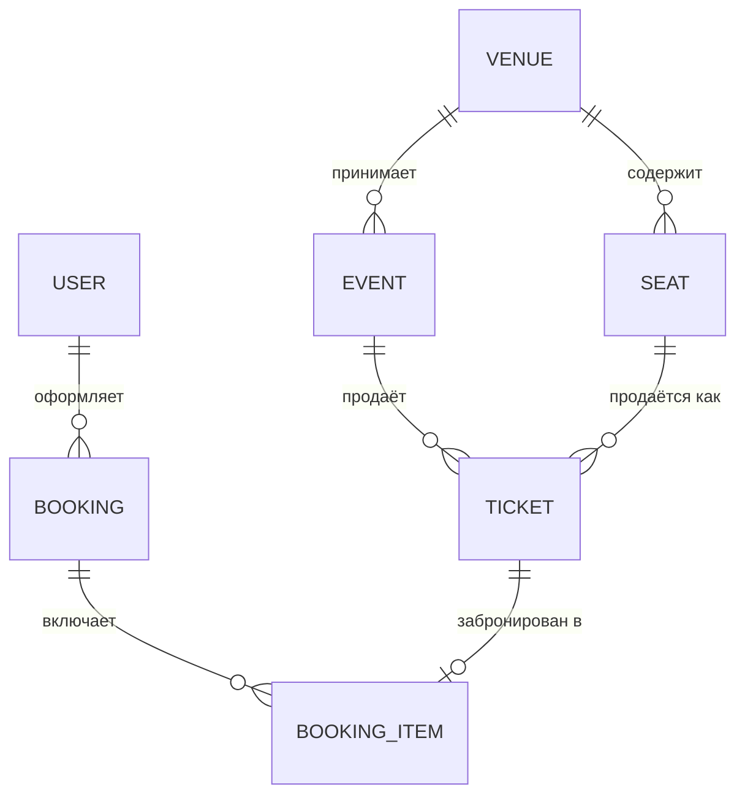
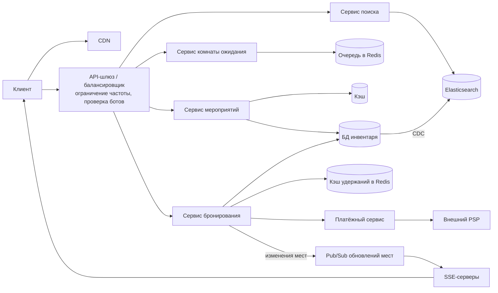
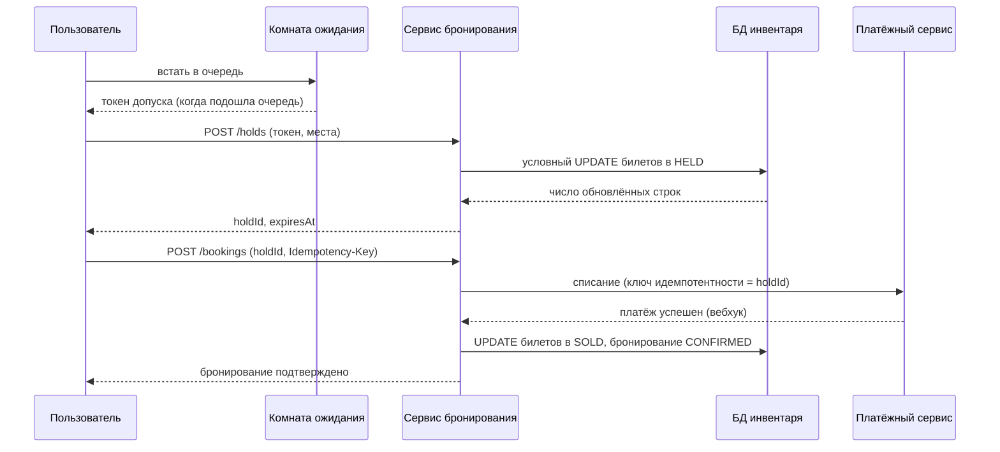
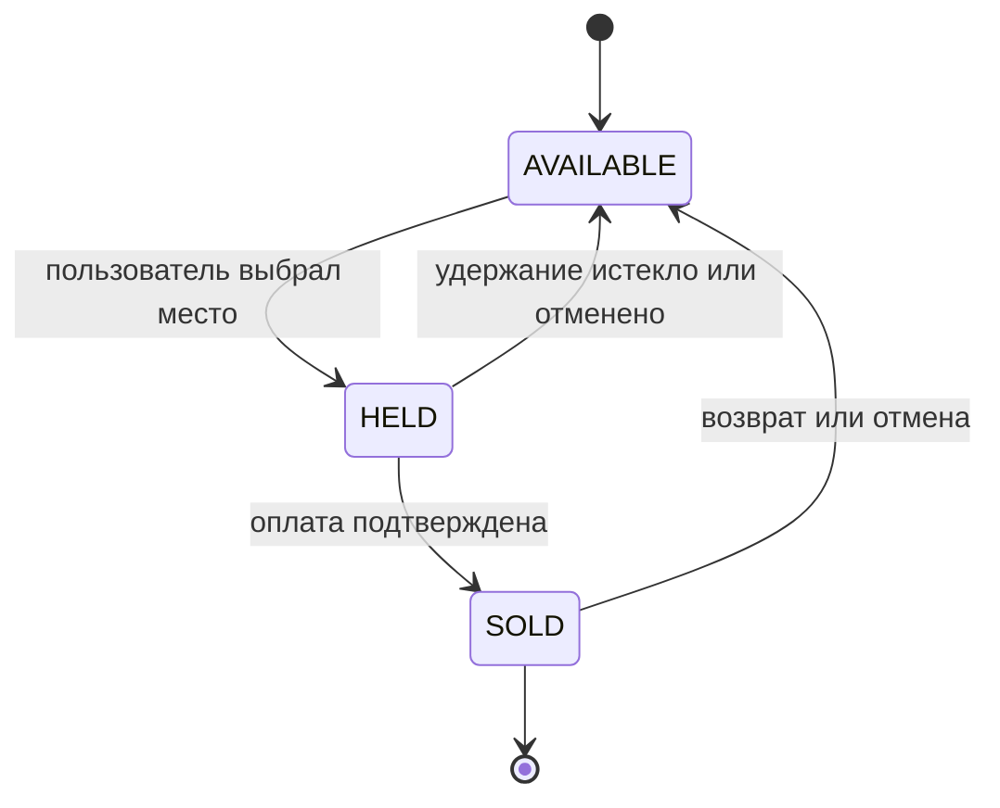
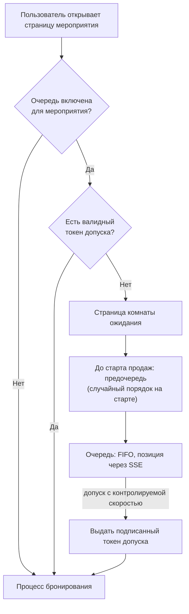

**Русский** | [English](./README.en.md)

# Глава 36: Проектирование системы бронирования билетов

## Введение

В этой главе мы спроектируем платформу продажи билетов наподобие Ticketmaster: пользователи просматривают и ищут мероприятия (концерты, спортивные матчи, спектакли), выбирают места на интерактивной схеме зала и покупают билеты.

На первый взгляд задача похожа на [систему бронирования отелей](../22.%20Hotel%20Reservation%20System/README.md) — в обоих случаях мы резервируем инвентарь. Ключевые отличия:
 * **Инвентарь уникален.** Отель продаёт «номер типа X», а здесь каждое место — отдельный товар (сектор 112, ряд F, место 7). Два пользователя ни в коем случае не должны купить одно и то же место.
 * **Экстремальные всплески трафика.** Когда стартуют продажи на концерт популярного артиста, миллионы людей приходят в одну и ту же минуту за несколькими десятками тысяч мест. Спрос на порядки превышает предложение, а с людьми соревнуются боты.
 * **Временная бронь.** Пользователю нужно несколько минут, чтобы ввести платёжные данные, поэтому место нужно за ним придержать — и автоматически освободить, если он передумал.

Сама обработка платежей разобрана в [главе о платёжной системе](../26.%20Payment%20System/README.md); здесь мы считаем платёжный сервис чёрным ящиком и сосредоточимся на процессе бронирования вокруг него.

---

## Шаг 1: Понять задачу и определить рамки проектирования

Возможный диалог между кандидатом (К) и интервьюером (И):
 * К: Какие основные функции нужно поддержать?
 * И: Просмотр и поиск мероприятий, страница мероприятия со схемой зала и бронирование билетов.
 * К: Места всегда именные или бывает и свободная рассадка?
 * И: В основном именные места. Упомяните, чем отличается входной билет без места (general admission, танцпол).
 * К: Сколько времени пользователь может держать выбранные места до оплаты?
 * И: Около 10 минут. После этого места возвращаются в продажу.
 * К: Сколько билетов один пользователь может купить на одно мероприятие?
 * И: Лимит задаёт организатор, обычно 4–8.
 * К: Что происходит при старте продаж на очень популярные мероприятия?
 * И: Это самая сложная часть. Предположим, миллионы пользователей одновременно пытаются купить билеты на одно шоу на стадионе.
 * К: Нужно ли бороться с ботами и перекупщиками?
 * И: Да, важна справедливость. У настоящих фанатов должен быть честный шанс.
 * К: Обрабатываем ли мы платежи сами?
 * И: Нет, мы интегрируемся со сторонним PSP (Payment Service Provider — платёжный провайдер, обрабатывающий карточные платежи).
 * К: Нужны ли вторичный рынок (перепродажа), динамическое ценообразование или доставка билетов?
 * И: Это вне рамок задачи.

### **Функциональные требования**

 * Пользователи могут просматривать и искать мероприятия по ключевому слову, городу, дате, исполнителю
 * Пользователи могут открыть страницу мероприятия со схемой зала и доступностью мест
 * Пользователи могут выбрать места и удерживать их ограниченное время (например, 10 минут)
 * Пользователи могут оплатить удерживаемые места и получить подтверждённое бронирование
 * При высоком спросе на старте продаж пользователи проходят через виртуальную комнату ожидания (virtual waiting room)

### **Нефункциональные требования**

- **Никакого двойного бронирования (double booking)**: строгая согласованность инвентаря мест. Место продаётся не более одного раза. Это единственное свойство, которым мы никогда не жертвуем.
- **Высокая доступность на чтение**: просмотр и поиск должны работать, даже когда бронирование деградирует; здесь допустима согласованность в конечном счёте (eventual consistency).
- **Масштабируемость под всплески**: выдерживать трафик в 100 и более раз выше обычного во время старта продаж.
- **Низкая задержка**: результаты поиска — за несколько сотен миллисекунд; доступность мест на схеме — почти в реальном времени.
- **Справедливость (fairness)**: у ботов не должно быть преимущества, а момент прихода до старта продаж не должен иметь значения.

Нагрузка в системе сильно **смещена в сторону чтения**: на каждую покупку приходится множество поисковых запросов, просмотров страниц мероприятий и обновлений схемы зала.

### **Оценка «на салфетке» (back-of-the-envelope)**

Все числа ниже — допущения для собеседования, а не реальные показатели Ticketmaster.

Обычный трафик:
 * 10 млн DAU (Daily Active Users — пользователей, активных за сутки), каждый делает ~20 запросов на чтение (поиск, страницы мероприятий) в день
 * QPS (Queries Per Second — запросов в секунду) на чтение = 10 млн * 20 / 10^5 секунд ≈ **2 000 QPS**, в пике (x5) ≈ **10 000 QPS**
 * 100 тыс. новых мероприятий в год, в среднем по 5 000 мест → 500 млн строк билетов в год
 * Одна строка билета ≈ 100 байт → 500 млн * 100 байт = **50 ГБ в год**. Данные инвентаря спокойно помещаются в шардированную реляционную базу данных.

Флеш-продажа (flash sale) на одно популярное мероприятие:
 * Стадион на 50 000 мест, в момент старта продаж приходят 2 млн пользователей
 * Если без всякой защиты каждый пользователь обновляет схему зала раз в 5 секунд: 2 млн / 5 = **400 000 QPS** на одно мероприятие
 * Средний заказ — 2,5 билета → успешных заказов максимум 50 000 / 2,5 = **20 000**, то есть **99%** пользователей уйдут без билетов
 * Если билеты раскупаются за ~20 минут: 20 000 / 1 200 секунд ≈ **17 заказов в секунду**. Даже с 10-кратными повторными попытками и конкуренцией за места попыток удержания — сотни в секунду.

Вывод: путь записи (удержания и бронирования) невелик в абсолютных цифрах, но должен быть строго корректным. Поглощать нужно путь чтения и само огромное число одновременных пользователей — причём значительную часть этой нагрузки лучше вообще **не допускать** до системы бронирования.

---

## Шаг 2: Предложить высокоуровневый дизайн и получить одобрение

### **Проектирование API**

API (Application Programming Interface — программный интерфейс, через который клиенты обращаются к сервису) для поиска и просмотра:
```
GET /v1/events/search?keyword=...&city=...&from=...&to=...&page_token=...
GET /v1/events/{eventId}               -- event details, venue, price levels
GET /v1/events/{eventId}/seatmap       -- venue layout + current availability
```

Удержание мест (во время старта продаж требуется токен допуска):
```
POST /v1/events/{eventId}/holds
Headers: Admission-Token: <signed token>, Idempotency-Key: <uuid>
Body: { "ticketIds": ["t_101", "t_102"] }
Response: { "holdId": "h_9f2", "expiresAt": "2026-09-30T18:10:00Z" }

DELETE /v1/holds/{holdId}              -- user releases seats voluntarily
```

Оформление заказа (checkout):
```
POST /v1/bookings
Headers: Idempotency-Key: <uuid>
Body: { "holdId": "h_9f2", "paymentMethod": "..." }
Response: { "bookingId": "b_77a", "status": "PENDING_PAYMENT" | "CONFIRMED" }

GET /v1/bookings/{bookingId}
```

Комната ожидания:
```
POST /v1/events/{eventId}/queue        -- join the queue, returns queueId
GET  /v1/queue/{queueId}               -- position, ETA; admission token when it's your turn
```

Заголовок `Idempotency-Key` делает повторы изменяющих состояние вызовов безопасными: двойной клик пользователя по кнопке «Купить» или повтор запроса мобильным клиентом по таймауту не должны создавать два удержания или два списания. Это тот же подход, что и в [главе о платёжной системе](../26.%20Payment%20System/README.md) и в API Stripe.

### **Модель данных**

 * **Площадка (Venue)**: `venue_id, name, address, geo`
 * **Место (Seat, схема площадки)**: `seat_id, venue_id, section, row, number, x, y` — статично и общее для всех мероприятий на площадке
 * **Мероприятие (Event)**: `event_id, venue_id, performer_id, name, start_time, on_sale_time, max_tickets_per_user, status`
 * **Билет (Ticket, инвентарь)**: `ticket_id, event_id, seat_id, price_level, status, hold_id, hold_expires_at, booking_id, version`
 * **Бронирование (Booking)**: `booking_id, user_id, event_id, status, total_amount, payment_id, idempotency_key, created_at`
 * **Позиция бронирования (Booking item)**: `booking_id, ticket_id`

Ключевое решение — **строка билета создаётся на каждое место каждого мероприятия**. Доступность места становится свойством одной строки, и правило «у места только один покупатель» сводится к задаче согласованности одной строки, с которой реляционные базы справляются хорошо.



Для инвентаря и бронирований используем реляционную БД (базу данных), например PostgreSQL или MySQL: нам нужны ACID-транзакции (Atomicity, Consistency, Isolation, Durability — атомарность, согласованность, изолированность, долговечность) и условные обновления. Данные разбиваются на шарды по `event_id`, так что все билеты одного мероприятия лежат на одном шарде, и удержание нескольких мест — это локальная транзакция.

### **Высокоуровневый дизайн**



 * **CDN** (Content Delivery Network — сеть доставки контента, раздающая статику с ближайших к пользователю серверов): отдаёт статические ресурсы, изображения мероприятий и статическую схему площадки (координаты мест, SVG (Scalable Vector Graphics — векторный формат изображений)).
 * **API-шлюз (API gateway)**: аутентификация, ограничение частоты запросов (rate limiting, см. [главу об ограничителе частоты](../04.%20Rate%20Limiter/Readme.md)), проверка токенов допуска.
 * **Сервис мероприятий**: детали мероприятий и схемы залов; активно кэшируется.
 * **Сервис поиска**: полнотекстовый и геопоиск по Elasticsearch, который наполняется через CDC (Change Data Capture — захват изменений из журнала основной БД).
 * **Сервис комнаты ожидания**: управляет очередями на мероприятия с высоким спросом и выдаёт токены допуска.
 * **Сервис бронирования**: удержания, бронирования, истечение срока; единственный, кто меняет статус билетов.
 * **Платёжный сервис**: обёртка над внешним PSP.
 * **SSE-серверы** (Server-Sent Events — события, отправляемые сервером, односторонний поток от сервера к браузеру): рассылают изменения доступности мест клиентам, которые смотрят схему зала.

### **Процесс бронирования**



---

## Шаг 3: Углублённое проектирование

Разберём подробнее:
 * Удержание мест и предотвращение двойного бронирования
 * Истечение удержаний
 * Оформление заказа, оплату и идемпотентность
 * Виртуальную комнату ожидания
 * Защиту от ботов и справедливость
 * Кэширование схемы зала и обновления в реальном времени
 * Поиск
 * Масштабирование чтения и записи

### **Конечный автомат билета**

Каждый билет проходит через небольшой конечный автомат (state machine):



Вся проблема корректности сводится к одному: **переход AVAILABLE → HELD должен удаться ровно одному пользователю.**

### **Предотвращение двойного бронирования**

Вариантов несколько; они похожи на рассмотренные в [главе о бронировании отелей](../22.%20Hotel%20Reservation%20System/README.md), но есть своя специфика.

#### Вариант 1: Пессимистическая блокировка (pessimistic locking)

```sql
BEGIN;
SELECT * FROM tickets
 WHERE event_id = :e AND ticket_id IN (:ids)
 FOR UPDATE;
-- check that all are AVAILABLE, then
UPDATE tickets SET status = 'HELD', hold_id = :h, hold_expires_at = now() + interval '10 min'
 WHERE ticket_id IN (:ids);
COMMIT;
```

`SELECT ... FOR UPDATE` захватывает блокировки на уровне строк, поэтому конкурирующая транзакция на те же места ждёт. Это корректно, но при высокой конкуренции транзакции выстраиваются в очередь на «горячих» строках. Блокируйте идентификаторы в стабильном порядке (например, отсортировав `ticket_id`), чтобы избежать взаимных блокировок (deadlock) между пользователями, выбравшими пересекающиеся места.

#### Вариант 2: Оптимистичная конкурентность (optimistic concurrency) с условным обновлением

Одна атомарная инструкция, которая срабатывает, только если место всё ещё свободно:

```sql
UPDATE tickets
   SET status = 'HELD', hold_id = :h,
       hold_expires_at = now() + interval '10 min',
       version = version + 1
 WHERE event_id = :e
   AND ticket_id IN (:ids)
   AND (status = 'AVAILABLE'
        OR (status = 'HELD' AND hold_expires_at < now()));
```

Приложение проверяет число затронутых строк: если оно меньше числа запрошенных мест, кто-то уже занял одно из них, и транзакция откатывается (всё или ничего). Ни одна строка не остаётся заблокированной, пока пользователь раздумывает; база сериализует только само короткое обновление. Проигравшие сразу получают ответ «место только что заняли», а не ждут.

Обратите внимание на условие `hold_expires_at < now()`: истёкшее удержание считается свободным **в момент записи**, поэтому корректность не зависит от того, успела ли фоновая задача вовремя почистить просроченные удержания.

#### Вариант 3: Ограничения базы данных

В качестве страховочной сетки на таблице `booking_item` стоит ограничение уникальности на `ticket_id` (или уникальный индекс на `(event_id, seat_id)` для активных бронирований). Даже если в логике приложения есть ошибка, база откажется вставлять второе бронирование того же места.

#### Вариант 4: Распределённая блокировка (distributed lock) в Redis

Популярный подход — хранить удержания в Redis:

```
SET hold:{eventId}:{ticketId} <holdId> NX PX 600000
```

`NX` устанавливает ключ, только если его ещё нет; `PX` заставляет его автоматически истечь через 10 минут — TTL (Time To Live — время жизни записи) удержания получается «бесплатно». Удержание нескольких мест делается атомарным с помощью Lua-скрипта, который проверяет и устанавливает все ключи разом. При освобождении нужно сравнить сохранённое значение с нашим `holdId` перед удалением, иначе можно удалить чужую блокировку.

Это быстро и снимает нагрузку с базы, но есть оговорки, которые стоит упомянуть:
 * Репликация в Redis асинхронная. Если основной узел откажет после выдачи блокировки, но до её репликации, повышенная до основной реплика может выдать ту же блокировку повторно.
 * Истечение завязано на время; приостановленный процесс может считать, что всё ещё владеет уже истёкшей блокировкой. Мартин Клеппман в своём разборе рекомендует **токены ограждения (fencing tokens)** — монотонно растущий номер, который хранилище проверяет при записи.

**Рекомендация**: источник истины — база данных. Используем условные обновления (вариант 2) плюс ограничение уникальности (вариант 3). Для «горячих» мероприятий перед базой можно поставить слой Redis, чтобы дёшево отсекать заведомо занятые места, но финальный переход в HELD/SOLD — всегда условная запись в БД, которая и играет роль проверки токена ограждения.

#### Входные билеты без мест (general admission)

Для танцпола нет идентификаторов мест, есть только счётчик. Идея та же:

```sql
UPDATE ga_inventory SET remaining = remaining - :n
 WHERE event_id = :e AND zone_id = :z AND remaining >= :n;
```

Для очень «горячих» зон счётчик можно держать в Redis (атомарный Lua-скрипт уменьшает его, только если остатка хватает), а удержания записывать в БД асинхронно с последующей сверкой (reconciliation).

### **Истечение удержаний**

Удержания истекают двумя способами:
 * **Лениво (lazily)**: как показано выше, запись считает просроченное удержание свободным.
 * **Активно**: фоновый «уборщик» (sweeper) или отложенное сообщение (см. [распределённую очередь сообщений](../19.%20Distributed%20Message%20Queue/README.md)) периодически возвращает просроченные удержания в AVAILABLE и публикует обновление схемы зала, чтобы другие пользователи действительно *увидели*, что место освободилось.

Клиент показывает обратный отсчёт по `expiresAt`. Длительность удержания — компромисс: слишком короткое, и пользователи не успевают оплатить; слишком длинное, и брошенные корзины блокируют инвентарь в пик спроса.

### **Оформление заказа, оплата и идемпотентность**

 1. Клиент вызывает `POST /bookings` с `holdId` и `Idempotency-Key`. Сервис бронирования сохраняет ключ; повторный запрос с тем же ключом возвращает сохранённый результат, а не запускает второе бронирование.
 2. Сервис бронирования создаёт бронирование в статусе `PENDING_PAYMENT` и продлевает `hold_expires_at` удерживаемых билетов на короткий льготный период (условным обновлением по `hold_id`), чтобы места не освободились, пока PSP обрабатывает платёж.
 3. Он вызывает платёжный сервис, передавая `holdId`/`bookingId` в качестве ключа идемпотентности для PSP, — повторы списания никогда не приведут к двойной оплате.
 4. По вебхуку об успехе одна транзакция помечает билеты как SOLD (`WHERE hold_id = :h AND status = 'HELD'`), а бронирование — как CONFIRMED.
 5. Если условное обновление затронуло меньше строк, чем ожидалось (удержание потеряно, например из-за очень позднего вебхука), бронирование помечается как неуспешное и автоматически оформляется возврат средств. Этот крайний случай нужно обрабатывать явно, а не считать невозможным.

Асинхронность платежей, сверка и сбои PSP разобраны в [главе о платёжной системе](../26.%20Payment%20System/README.md).

### **Виртуальная комната ожидания**

Без защиты 2 млн пользователей, долбящих схемы залов и удержания, перегрузят все сервисы, а большинство запросов всё равно закончится ответом «место занято». **Виртуальная комната ожидания** ставит пользователей в очередь *до* того, как они попадут в процесс бронирования, и пропускает их с контролируемой скоростью.



Как это работает:
 * **Включение**: очередь включается для конкретного мероприятия администратором (для запланированных стартов продаж) или автоматически, когда трафик превышает порог.
 * **Предочередь (pre-queue) и рандомизация**: пользователи, пришедшие до старта продаж, ждут на странице с обратным отсчётом. В момент старта им присваиваются случайные позиции — как в лотерее, — так что обновление страницы в 9:59:59 не даёт преимущества перед приходом в 9:30. Пришедшие позже добавляются в конец в порядке FIFO (First In, First Out — «первым пришёл, первым обслужен»). Так работают коммерческие комнаты ожидания, например Queue-it.
 * **Хранение очереди**: отсортированное множество (sorted set) Redis на каждое мероприятие (`ZADD queue:{eventId} <position> <queueId>`); позиция определяется через `ZRANK`. Клиенты получают позицию и ETA (Estimated Time of Arrival — ожидаемое время допуска) через SSE или лёгкий периодический опрос.
 * **Скорость допуска**: контроллер пропускает следующих N пользователей за интервал. N определяется ёмкостью бэкенда *и* оставшимся инвентарём: нет смысла пускать 100 тыс. пользователей за последними 500 местами. Когда билеты распроданы, всем оставшимся в очереди сразу сообщают об этом.
 * **Токен допуска (admission token)**: допущенные пользователи получают короткоживущий токен, подписанный комнатой ожидания (например, HMAC (Hash-based Message Authentication Code — код аутентификации сообщения на основе хеша) или JWT (JSON Web Token — подписанный токен с набором утверждений) с `eventId`, `userId`, `expiry`). Шлюз проверяет подпись без обращения к хранилищу на каждом запросе к бронированию, так что сервис бронирования защищён даже от тех, кто пытается обойти очередь, обращаясь к API напрямую. Токен привязан к пользователю/сессии, поэтому его нельзя передать или перепродать.

Сама комната ожидания должна обслуживаться предельно дёшево: статическая страница из CDN плюс лёгкий эндпоинт позиции. Она поглощает всплеск, и система бронирования видит только допущенный, управляемый поток.

### **Защита от ботов и справедливость**

Боты пытаются захватить билеты быстрее людей, чтобы перепродать их. Защита строится в несколько эшелонов (defense in depth):
 * **Очередь навязывается на стороне сервера**: токены допуска проверяются на шлюзе, а не только в JavaScript.
 * **Одна позиция в очереди на аккаунт**: записи в очереди привязываются к аутентифицированным, верифицированным аккаунтам (подтверждение телефона/почты); против множества аккаунтов — предварительная регистрация проверенных фанатов (verified fan).
 * **CAPTCHA (Completely Automated Public Turing test to tell Computers and Humans Apart — тест, отличающий человека от программы) на входе в очередь**: подозрительные сессии проверяются один раз, до получения позиции, а не посреди оформления заказа.
 * **Ограничение частоты запросов** по аккаунту, IP-адресу (Internet Protocol — сетевой адрес устройства) и отпечатку устройства (device fingerprint).
 * **Лимиты на покупку** проверяются в транзакции бронирования (`max_tickets_per_user` сверяется с уже существующими бронированиями пользователя на это мероприятие).
 * **Поведенческие сигналы**: тайминги запросов, обнаружение headless-браузеров, известные вредоносные диапазоны IP.

Рандомизация предочереди, FIFO после старта и лимиты на пользователя вместе дают разумное определение справедливости.

### **Кэширование схемы зала и доступность в реальном времени**

Схема зала объединяет два совершенно разных вида данных:
 * **Раскладка (layout)** — координаты мест, секторы: статична для площадки → раздаётся из CDN с длинным TTL кэша.
 * **Доступность**: постоянно меняется во время старта продаж.

Доступность хранится в Redis для каждого мероприятия, например как битовая карта (bitmap) на сектор (один бит на место: 1 = свободно). 50 000 мест → 50 000 бит ≈ 6 КБ на весь стадион, так что клиент может загрузить полную доступность одним дешёвым запросом. Сервис бронирования обновляет битовую карту после каждого зафиксированного изменения состояния. Это кэш: окончательный арбитр — условное обновление в БД, поэтому слегка устаревшая схема может привести к ошибке «место только что заняли», но никогда — к двойному бронированию.

Чтобы схемы оставались свежими, клиенты подписываются через **SSE** — односторонний канал от сервера к клиенту с автоматическим переподключением. Здесь он подходит лучше WebSocket, поскольку клиенту не нужно отправлять данные. Поток такой: сервис бронирования → pub/sub-топик на мероприятие → SSE-серверы → клиенты. Для огромных мероприятий обновления по отдельным местам можно группировать (например, раз в секунду) или агрегировать до «числа свободных мест в секторе» на отдалённых уровнях масштаба.

Альтернативный UX (User Experience — пользовательский опыт), который вообще избегает конкуренции за места, — **«лучшие доступные места» (best available)**: пользователь выбирает ценовую категорию и количество, а места подбирает сервер. Так покупатели распределяются по инвентарю, а не кликают все одновременно по одним и тем же местам в первом ряду.

### **Поиск**

Поиску мероприятий нужны полнотекстовое сопоставление (имена исполнителей с опечатками), фильтры (дата, город, категория) и геозапросы. Запросы `LIKE` в SQL (Structured Query Language — язык запросов к реляционным базам данных) для этого не масштабируются, поэтому мы индексируем мероприятия в **Elasticsearch**, наполняя его из основной базы через CDC. Результаты поиска согласованы в конечном счёте — это приемлемо, поскольку страница мероприятия и процесс бронирования читают авторитетные данные. Популярные запросы (например, топ-100 поисковых фраз) можно кэшировать с коротким TTL.

### **Масштабирование чтения и записи**

Чтение:
 * CDN для статического контента и страниц комнаты ожидания
 * Кэш (Redis/Memcached) для деталей мероприятий: они меняются редко и инвалидируются при обновлении
 * Реплики для чтения для всего, что терпит задержку репликации
 * Доступность мест — из битовой карты в Redis, а не из БД

Запись:
 * БД инвентаря шардирована по `event_id`, так что удержание — транзакция в пределах одного шарда
 * «Горячее» мероприятие попадает на один шард — и это нормально, потому что комната ожидания ограничивает скорость записи тем, что способен выдержать один основной узел (по нашей оценке — сотни транзакций в секунду). Под мега-мероприятие можно заранее выделить отдельный мощный шард.
 * Экземпляры сервиса бронирования не хранят состояние (stateless) и масштабируются горизонтально
 * Оплата и уведомления (отправка билетов по почте) выполняются асинхронно через очередь сообщений

Главная идея: **масштабировать чтение кэшированием и репликацией, а запись защищать, ограничивая число пользователей, которые одновременно могут её пытаться выполнить**, вместо попыток масштабировать путь записи до миллионов одновременных пользователей.

---

## Шаг 4: Подведение итогов

Мы спроектировали систему бронирования билетов, в которой есть:
 * Инвентарь билетов по мероприятиям, где каждое место — строка, а двойное бронирование предотвращается условными обновлениями и ограничениями уникальности в базе данных
 * Временные удержания с TTL, истекающие лениво в момент записи и активно — через «уборщика»
 * Идемпотентный процесс оформления заказа, интегрированный с внешним PSP
 * Виртуальная комната ожидания с рандомизированной предочередью, допуском по FIFO и подписанными токенами допуска
 * Меры защиты от ботов и обеспечения справедливости
 * Схемы залов через CDN и битовые карты в Redis с обновлениями в реальном времени по SSE
 * Elasticsearch для поиска и чёткое разделение масштабирования чтения и записи

Дополнительные темы для обсуждения:
 * **Площадка перепродажи (resale marketplace)**: билеты переходят между пользователями, нужны история владения и антифрод-проверки
 * **Динамическое ценообразование (dynamic pricing)**: ценовые категории меняются в зависимости от спроса во время продажи
 * **Мультирегиональность**: чтение мероприятий обслуживается глобально, а инвентарь каждого мероприятия имеет один «домашний» регион, чтобы запись оставалась строго согласованной
 * **Наблюдаемость (observability)**: дашборды длины очереди, скорости допуска, отношения удержаний к подтверждениям, сбоев оплаты во время старта продаж
 * **Нагрузочное тестирование**: репетиции старта продаж на синтетическом трафике перед мега-мероприятием

---

## Источники

 * [Hello Interview: Design a Ticket Booking Site Like Ticketmaster](https://www.hellointerview.com/learn/system-design/problem-breakdowns/ticketmaster)
 * [Queue-it: How Queue-it Works (developers)](https://queue-it.com/developers/how-queue-it-works/)
 * [Queue-it: How Does Queue-it Work?](https://queue-it.com/how-does-queue-it-work/)
 * [Redis: Distributed Locks with Redis](https://redis.io/docs/latest/develop/clients/patterns/distributed-locks/)
 * [Martin Kleppmann: How to do distributed locking](https://martin.kleppmann.com/2016/02/08/how-to-do-distributed-locking.html)
 * [PostgreSQL Documentation: Explicit Locking](https://www.postgresql.org/docs/current/explicit-locking.html)
 * [Stripe: Designing robust and predictable APIs with idempotency](https://stripe.com/blog/idempotency)
 * [MDN: Using server-sent events](https://developer.mozilla.org/en-US/docs/Web/API/Server-sent_events/Using_server-sent_events)
