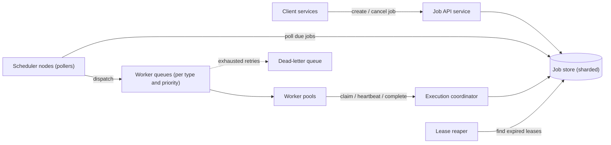
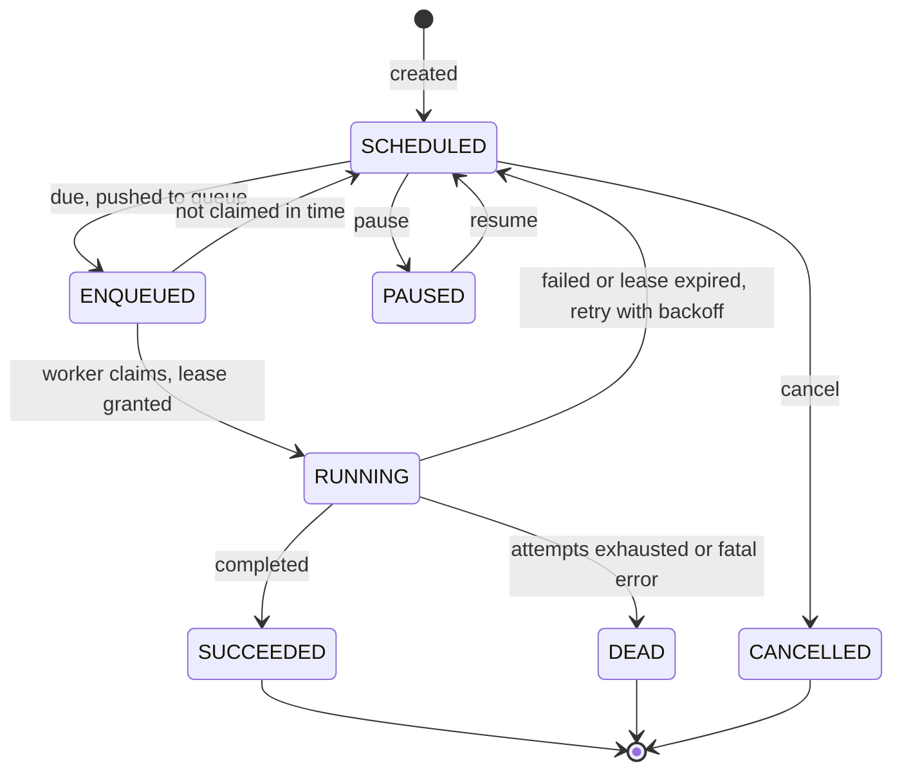
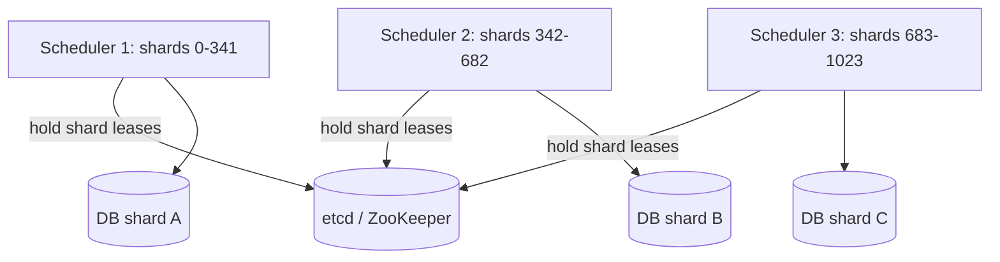
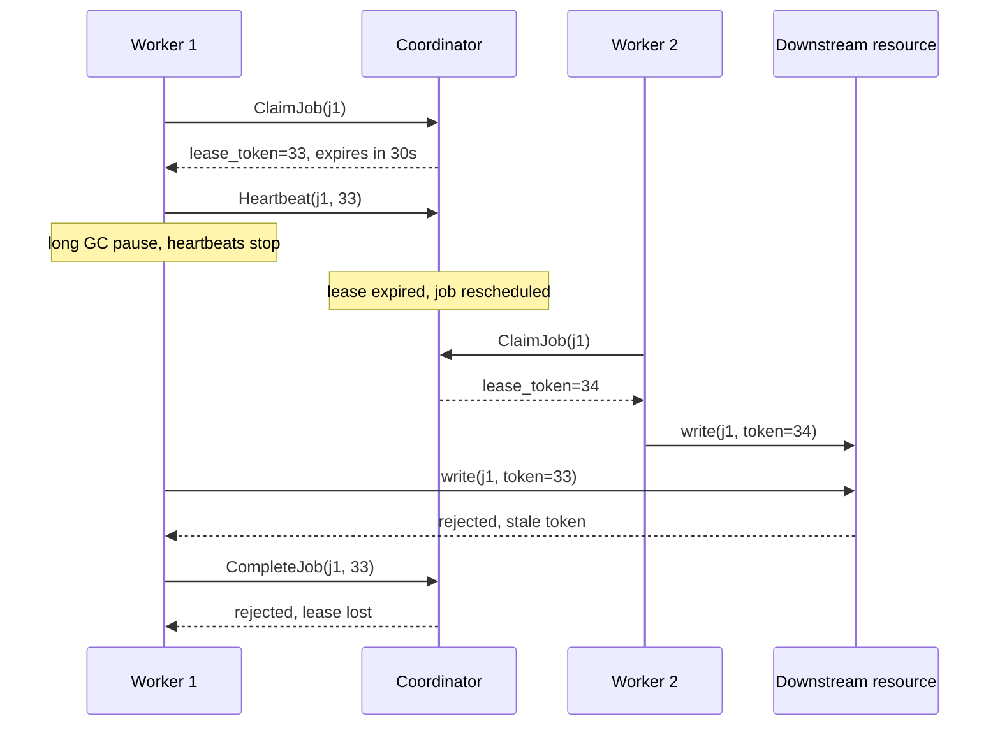

[Русский](./README.md) | **English**

# Chapter 37: Distributed Task Scheduler

## Introduction

In this chapter we'll design a **distributed task scheduler** - a service that lets other teams say "run this piece of work at time T" or "run this every day at 03:00" and then makes sure it actually happens, even when machines crash.

Typical use-cases:
 * **Delayed one-off jobs**: send a reminder email 24h after sign-up, cancel an unpaid order after 30 minutes, retry a failed webhook in 5 minutes.
 * **Recurring (cron) jobs**: nightly reports, hourly data syncs, periodic cleanup.
 * **Asynchronous work offloading**: "do this as soon as possible, but not in the request path".

A single-machine `cron` daemon is not enough: it is a single point of failure, it has no retries, no history and no way to scale beyond one host.
Well-known building blocks in this space are Celery, Sidekiq, Quartz, Kubernetes CronJobs, Airflow and Temporal. Dropbox described its in-house system, ATF (Async Task Framework), which we'll borrow ideas from.

The hardest parts of this problem are not the timers themselves, but **correctness under failure**: what happens if a scheduler node dies after picking a job, or if a worker freezes mid-execution and then wakes up?

---

## Step 1: Understand the Problem and Establish Design Scope

Here's a possible dialogue between Candidate and Interviewer:
 * C: Do we need both one-off delayed jobs and recurring jobs?
 * I: Yes, both. Recurring schedules are expressed as cron expressions with a timezone.
 * C: Does the scheduler execute the job code itself, or just trigger it?
 * I: Clients register job types and run their own workers. Our system stores, schedules, dispatches and tracks jobs.
 * C: How precise does the execution time need to be?
 * I: Second-level precision is enough. A job should start within a few seconds of its scheduled time.
 * C: What execution guarantee do we need? Can a job run twice?
 * I: A job must never be lost. Running twice in rare failure cases is acceptable, but we must minimize it and make it safe.
 * C: Do we need retries?
 * I: Yes, configurable retries with backoff. Jobs that keep failing should be parked somewhere for inspection.
 * C: What's the scale?
 * I: Let's say 100 million one-off jobs per day and 1 million recurring job definitions.
 * C: How long can a job run?
 * I: Most finish in seconds, but some can take up to an hour.
 * C: Do we need priorities, dependencies between jobs, multi-tenancy?
 * I: Priorities and per-tenant rate limits - yes. Dependencies - nice to have, discuss briefly.

### **Functional requirements**

 * Schedule a one-off job to run at a specific time (or after a delay).
 * Schedule a recurring job using a cron expression and a timezone.
 * Cancel, pause and resume jobs; query job status and execution history.
 * Retry failed jobs with exponential backoff, up to a configurable number of attempts; move exhausted jobs to a dead-letter queue.
 * Support job priorities and per-tenant / per-job-type rate limits.
 * (Optional) run a job only after other jobs have completed (DAG).

### **Non-functional requirements**

- **Reliability**: an accepted job is never lost - **at-least-once** execution.
- **Timeliness**: p95 delay between scheduled time and actual start is a few seconds.
- **Scalability**: horizontally scalable to handle bursts (e.g. many crons at `00:00`).
- **High availability**: no single point of failure in scheduling or dispatching.
- **Isolation**: a misbehaving job type or tenant must not starve others.

### **Back-of-the-envelope estimation**

All numbers below are assumptions for the interview, not measurements of any real system.
 * One-off jobs: 100M/day -> 10^8 / 86,400 s ~= **1,200 jobs/s** on average. Assume peak = 5x average -> ~**6,000 jobs/s**.
 * Recurring jobs: 1M definitions. Assume an average frequency of once per hour -> 24M runs/day -> 2.4 * 10^7 / 86,400 ~= **280 runs/s** average.
 * The real problem is **alignment**: humans love round times. If 20% of the 1M cron definitions fire at the top of the hour, that is **200,000 jobs due in the same second**. The system must absorb this spike (by queueing) rather than being sized for it.
 * Storage: assume ~1 KB per job record (metadata + small payload; big payloads go to object storage and are passed by reference).
   * 100M jobs/day * 1 KB = **100 GB/day** of new job data.
   * Keeping execution history for 30 days: 100 GB * 30 = **3 TB** (before replication). Completed jobs can be moved to cheaper storage.
 * Status writes: each job goes through ~4 state transitions (scheduled -> enqueued -> running -> succeeded), plus heartbeats for long jobs. 6,000 jobs/s * 4 = **~24,000 writes/s** at peak, which requires a sharded job store.

---

## Step 2: Propose High-Level Design and Get Buy-In

### **High-level design**

The design separates **when** a job should run (scheduling) from **where** it runs (execution):



 * **Job API service** - stateless; validates requests, computes the first run time, writes jobs to the job store.
 * **Job store** - the source of truth. Stores job definitions, their state, and a time-based index (`next_run_at`) to find jobs that are due.
 * **Scheduler nodes** - every second or so, poll the store for jobs whose time has come and push them into worker queues.
 * **Worker queues** - a message queue (Kafka, SQS, RabbitMQ, etc.) with separate queues per job type and priority. They decouple scheduling from execution and absorb spikes.
 * **Workers** - owned by client teams; pull messages, claim the job, execute it, send heartbeats and report the result.
 * **Execution coordinator** - handles claim/heartbeat/complete calls and enforces the state machine. Dropbox ATF has a similar component (Heartbeat and Status Controller).
 * **Lease reaper** - finds jobs whose worker stopped heartbeating and makes them retryable.

Why not just put delayed messages directly into a queue? Most queues support only short delays (e.g. SQS delay queues cap at 15 minutes), and they don't support cancellation, querying, cron or history well. So we store jobs in a database and only hand them to a queue when they are due.

### **API design**

Public API:

```
POST /v1/jobs
{
  "type": "send_reminder_email",
  "payload": {"user_id": 42},
  "run_at": "2026-10-01T09:00:00Z",       // one-off, OR:
  "cron": "0 3 * * *", "timezone": "Europe/Berlin",
  "priority": "high",
  "max_attempts": 5,
  "timeout_sec": 300,
  "idempotency_key": "reminder-42-2026-10-01"
}
-> 201 {"job_id": "j_8f2c..."}

GET    /v1/jobs/{job_id}               -> state, next_run_at, attempts
GET    /v1/jobs/{job_id}/executions    -> history of runs
DELETE /v1/jobs/{job_id}               -> cancel
POST   /v1/jobs/{job_id}:pause | :resume
```

The `idempotency_key` makes job creation itself safe to retry: a second `POST` with the same key returns the existing `job_id` instead of creating a duplicate.

Internal worker API (gRPC):
 * `ClaimJob(job_id) -> {lease_token, lease_expires_at}`
 * `Heartbeat(job_id, lease_token) -> {lease_expires_at}`
 * `CompleteJob(job_id, lease_token, status, result)`

### **Data model**

`jobs` table - one row per job (for cron jobs - the definition):

| Column | Description |
|---|---|
| job_id (PK) | unique id |
| tenant_id, type | owner and job type (routes to a queue) |
| payload | small JSON or a pointer to object storage |
| cron_expr, timezone | null for one-off jobs |
| priority, max_attempts, timeout_sec | execution policy |
| state | SCHEDULED, ENQUEUED, RUNNING, SUCCEEDED, DEAD, CANCELLED, PAUSED |
| next_run_at | UTC time of the next execution; **indexed** |
| attempt | current attempt number |
| lease_owner, lease_expires_at | who runs it and until when |
| lease_token | monotonically increasing fencing token |
| shard_id | hash(job_id) mod N, used for partitioning |

`executions` table - one row per attempt: `(job_id, attempt, scheduled_at, started_at, finished_at, worker_id, status, error)`. It is append-only and good for history and debugging; it can live in a cheaper, time-partitioned store.

The key access pattern is "**give me the jobs with `next_run_at <= now()` that are in state SCHEDULED**", so the index on `(shard_id, state, next_run_at)` is the heart of the design.

---

## Step 3: Design Deep Dive

### **Job state machine**

Every job moves through an explicit state machine. All transitions are **conditional writes** in the job store (compare-and-set on the current state and lease token), so concurrent actors cannot corrupt the state.



Note that for a recurring job, "SUCCEEDED" applies to one **run**; the definition itself goes back to SCHEDULED with the next cron occurrence (see below).

Each non-terminal state has a timeout that brings the job back to a known state. That's the core idea behind "never lose a job": if any component dies, some timer eventually notices and re-drives the job. ATF follows the same principle.

### **Storing jobs and finding due jobs**

There are three common options for the time-based index.

**Option 1: Relational DB polling with `SKIP LOCKED`.**
The simplest reliable design. Multiple scheduler nodes run the same query; `FOR UPDATE SKIP LOCKED` (PostgreSQL 9.5+, MySQL 8.0+) makes each node skip rows already locked by another node, so they don't block each other or double-dispatch:

```sql
WITH due AS (
  SELECT job_id FROM jobs
  WHERE shard_id = ANY(:my_shards)
    AND state = 'SCHEDULED'
    AND next_run_at <= now()
  ORDER BY next_run_at
  LIMIT 500
  FOR UPDATE SKIP LOCKED
)
UPDATE jobs j
SET state = 'ENQUEUED', enqueued_at = now()
FROM due
WHERE j.job_id = due.job_id
RETURNING j.job_id, j.type, j.priority, j.payload;
```

Pros: transactional, easy to reason about, cancellation is a simple update. Cons: a single database has a write ceiling, so at our scale we need to shard it.

**Option 2: Time buckets in a wide-column store (Cassandra, DynamoDB).**
Partition key = `(minute_bucket, shard_id)`, clustering key = `(run_at, job_id)`. A scheduler reads partition `(12:05, shard 17)` at 12:05 and gets all jobs due that minute, already sorted. Writes scale horizontally. The shard component is essential - without it, all jobs of one minute land in one hot partition. Cons: no multi-row transactions, so state transitions rely on conditional writes (lightweight transactions), and late-arriving jobs for a past bucket need special handling.

**Option 3: Redis sorted sets.**
`ZADD due:{shard} <run_at_ms> <job_id>`; the poller fetches members with score `<= now` and atomically removes them (a Lua script) before dispatching. Very fast, good for short delays. Cons: memory-bound and weaker durability, so it is usually a **cache/index in front of** the durable store, not the source of truth.

A pragmatic choice: a sharded relational store (or a distributed SQL database) as source of truth with Option 1. Optionally, an in-memory index (Redis or a timing wheel inside the scheduler) for the jobs due in the next few minutes, so precise timing doesn't require hammering the DB.

### **Scheduler partitioning and leader election**

To scale polling, split jobs into a fixed number of logical shards (e.g. 1024, `shard_id = hash(job_id) mod 1024`) and assign shards to scheduler nodes.



 * Each scheduler node holds a lease (e.g. an etcd lease with TTL) for its shards. If a node dies, its leases expire and other nodes take over its shards - this is **leader election per shard**.
 * With `SKIP LOCKED`, shard ownership is an optimization (less contention), not a correctness requirement: even if two nodes briefly poll the same shard, the row lock and the conditional state change prevent double dispatch.
 * With a store that lacks row locks, ownership **is** a correctness mechanism, and we must guard against a stale leader (see fencing tokens below).

Logical shards >> nodes, so rebalancing is just moving shard leases, not moving data (similar to consistent hashing with virtual nodes).

### **Dispatching to worker queues**

After the state is changed to ENQUEUED, the scheduler publishes a message `{job_id, type, attempt}` to the queue for `(type, priority)`. There is a classic dual-write problem here: the DB update and the queue publish are not atomic.
 * If the scheduler crashes after committing ENQUEUED but before publishing, the job would be stuck. Solution: a **timeout on ENQUEUED** - a sweeper resets jobs that stayed ENQUEUED longer than X (e.g. 1 minute) back to SCHEDULED.
 * If the message is published twice (e.g. sweeper re-drives a job whose message was just slow), the **claim** step dedupes it: only one worker can move the job from ENQUEUED to RUNNING.

So the queue message is just a "hint to go claim job X"; the job store decides who actually runs it. This keeps the queue's own delivery semantics (usually at-least-once) from leaking into job semantics.

Keeping the payload in the store and only the `job_id` in the message also makes cancellation easy: a cancelled job fails the claim and the message is dropped.

### **Execution: leases, heartbeats and fencing tokens**

A worker may crash, get stuck in a long GC pause, or lose network connection at any time. We use **leases**: the right to run a job for a limited time.



 * **Claim** is a conditional update: `UPDATE jobs SET state='RUNNING', lease_owner=:w, lease_expires_at=now()+30s, lease_token=lease_token+1 WHERE job_id=:id AND state='ENQUEUED'`. Zero rows updated means another worker already has it (or the job was cancelled) - drop the message.
 * **Heartbeats**: the worker extends the lease every ~10s (a fraction of the lease duration). This lets a lease be short (fast failure detection) while the job runs for an hour. It's the same idea as extending an SQS visibility timeout or a Temporal activity heartbeat.
 * **Lease reaper** periodically finds `state='RUNNING' AND lease_expires_at < now()` and moves the job to SCHEDULED for a retry (incrementing `attempt`).
 * **Fencing token**: a lease alone is not safe. As Martin Kleppmann points out, a process can pause (GC, VM migration) after checking its lease and resume after it expired, while believing it still holds it. The `lease_token` increases on every claim; the coordinator rejects heartbeats and completions with an old token, and downstream systems that support it can reject writes with a token lower than one they've already seen.
 * **Self-termination**: a worker that fails several heartbeats in a row should abort the job itself (ATF kills the executor after three consecutive heartbeat failures), shrinking the window where two copies run.

### **At-least-once vs exactly-once**

In a distributed system with crashes we can't guarantee that a job's side effects happen exactly once: the worker may perform the side effect and crash just before reporting success. The scheduler can't distinguish that from "crashed before doing anything", so it must retry. Hence:
 * The platform guarantees **at-least-once** execution.
 * The job owners make jobs **idempotent**, which gives **effectively-once** results:
   * Pass an idempotency key that is stable across attempts (e.g. `job_id + scheduled_time`, never including `attempt`) to downstream APIs (e.g. payment providers accept idempotency keys).
   * Use upserts / conditional writes instead of blind inserts or increments.
   * Record "processed" markers in the same transaction as the business change.

Celery's docs make the same trade-off: with late acknowledgement a task may run multiple times if a worker crashes, so tasks should be idempotent. At-most-once (ack before executing) is possible too, but then a crash loses the job - rarely what users want.

### **Retries, backoff and dead-letter queue**

When a job fails (exception, timeout, lost lease):
 * **Retriable failure**: set `state='SCHEDULED'`, `attempt=attempt+1`, `next_run_at = now() + backoff(attempt)`. Retrying is just scheduling again - no separate retry machinery needed.
 * **Exponential backoff with jitter**: `backoff = random(0, min(cap, base * 2^attempt))` ("full jitter" from the AWS Architecture Blog). Jitter prevents thousands of jobs that failed together (e.g. a dependency outage) from retrying at the same instant. For reference: Temporal's default retry policy uses a 1s initial interval, coefficient 2.0 and max interval of 100x the initial interval; Sidekiq by default retries 25 times over about 21 days.
 * **Non-retriable (fatal) failure** (bad payload, validation error): go straight to DEAD.
 * **Dead-letter queue (DLQ)**: jobs that exhausted `max_attempts` move to DEAD and are copied to a DLQ, with the last error. Operators can inspect, fix the bug and re-drive them in bulk. Alert on DLQ growth.

### **Recurring (cron) jobs**

A cron definition is not executed directly; it **materializes** one run at a time:
1. On creation, compute the next occurrence from `cron_expr` and `timezone`, convert it to UTC and store in `next_run_at`.
2. When due, the scheduler creates a run with a **deterministic id** `run_id = hash(job_id, scheduled_time)` (a unique constraint prevents duplicate runs even if two schedulers race) and advances `next_run_at` to the following occurrence in the same transaction.

Policies we should expose (Kubernetes CronJob has similar knobs):
 * **Concurrency policy**: what if the previous run is still going? `Allow`, `Forbid` (skip this run) or `Replace` (cancel the old one).
 * **Misfire policy**: after an outage, the scheduler finds a job that missed 50 occurrences. Run once, run all missed, or skip? A **starting deadline** (e.g. "don't start if more than 1 hour late") is a sensible default.
 * **Timezones and DST**: store schedules in the user's timezone but compute next times in UTC. A `02:30` daily job may be skipped or run twice on DST transition days - document the behavior.
 * **Top-of-the-hour spikes**: pre-materialize runs a few minutes ahead, and offer optional jitter ("any time within the hour") for jobs that don't care about exact timing.

### **Priorities and rate limits**

 * **Priorities**: separate queues per `(type, priority)`, as ATF does. Workers poll high-priority queues more often (weighted polling) so a flood of low-priority jobs can't starve urgent ones. Strict priority risks starvation of low priority; weights avoid that.
 * **Per-tenant / per-type rate limits**: before dispatching, the scheduler checks a token bucket (see Chapter 4, Rate Limiter). If the tenant is over its limit, the job stays SCHEDULED with `next_run_at` pushed slightly into the future.
 * **Concurrency limits**: e.g. "at most 50 running jobs of type X" to protect a fragile downstream. Enforced by counting RUNNING leases per type at claim time.
 * **Isolation**: dedicated worker pools per job type mean a slow job type only backs up its own queue.

### **Job dependencies (DAG)**

Some workflows need "run C after A and B succeeded". A simple extension:
 * Store edges in a `job_dependencies(parent_id, child_id)` table and a `pending_parents` counter on the child.
 * The child is created in a WAITING state. When a parent succeeds, decrement children's counters in the same transaction; when a counter hits 0, move the child to SCHEDULED with `next_run_at = now()`.
 * If a parent goes DEAD, mark descendants as upstream-failed.

For complex workflows (branching, long-lived state, compensation) dedicated engines such as Airflow (batch DAGs) or Temporal (durable workflows) are a better fit than growing the scheduler into one.

### **Clock skew**

Many decisions compare timestamps (`next_run_at <= now()`, `lease_expires_at < now()`), and different machines' clocks drift.
 * Use **one time source per decision**: evaluate `now()` in the database (or the coordinator), not on each worker/scheduler host.
 * A scheduling guarantee is "**not before** T, and soon after". A few hundred ms of skew only delays a job slightly, which is acceptable.
 * Leases are more dangerous: a worker with a slow clock could think its lease is still valid. Workers should treat leases conservatively (stop at `lease_duration - safety_margin` measured with a local monotonic clock since the claim), and correctness must not depend on clocks at all - that's what fencing tokens are for.
 * Store all times in UTC; keep time zones only for cron evaluation.

### **Observability**

Key metrics:
 * **Schedule lag** = `started_at - scheduled_at` (p50/p95/p99) - the main SLO. ATF, for example, targets starting 95% of tasks within 5 seconds of their scheduled time.
 * Number of **due but not dispatched** jobs (scheduler falling behind), and queue depth / age of oldest message per queue (workers falling behind).
 * Success / failure / retry rates per job type; DLQ size; lease expirations (worker crashes or timeouts too short).
 * Scheduler health: shard ownership, poll duration, rows per poll.

Plus per-job history via the `executions` table, structured logs and distributed traces tagged with `job_id`, and a UI for owners to search, cancel and re-drive jobs.

---

## Step 4: Wrap Up

Summary of the design:
 * Jobs live in a **sharded durable store** with an index on `next_run_at`; schedulers poll their shards (`SKIP LOCKED` or time buckets) and push due jobs into **per-type, per-priority queues**.
 * The **state machine with timeouts** in every non-terminal state ensures no job is lost.
 * Execution uses **leases + heartbeats + fencing tokens**; the platform provides **at-least-once**, and **idempotent jobs** make it effectively-once.
 * Retries are just rescheduling with **exponential backoff and jitter**; exhausted jobs go to a **DLQ**.
 * Cron jobs materialize one run at a time with deterministic run ids, plus concurrency and misfire policies.

Additional talking points:
 * **Multi-region**: active-passive per shard, or region-pinned tenants; cross-region failover makes duplicate runs more likely, so idempotency matters even more.
 * **Large payloads**: store them in object storage and pass references.
 * **Archiving**: move finished jobs and executions to cold storage after the retention period.
 * **Build vs buy**: for many teams, Postgres + `SKIP LOCKED`, SQS delay queues + a DB, or Temporal is enough; a custom platform pays off at large scale with many teams.

---

## References

 * [Asynchronous task scheduling at Dropbox (ATF)](https://dropbox.tech/infrastructure/asynchronous-task-scheduling-at-dropbox)
 * [How to do distributed locking - Martin Kleppmann](https://martin.kleppmann.com/2016/02/08/how-to-do-distributed-locking.html)
 * [PostgreSQL documentation: SELECT, the locking clause (SKIP LOCKED)](https://www.postgresql.org/docs/current/sql-select.html)
 * [Amazon SQS visibility timeout](https://docs.aws.amazon.com/AWSSimpleQueueService/latest/SQSDeveloperGuide/sqs-visibility-timeout.html)
 * [Exponential Backoff And Jitter - AWS Architecture Blog](https://aws.amazon.com/blogs/architecture/exponential-backoff-and-jitter/)
 * [Temporal: Detecting Activity failures](https://docs.temporal.io/encyclopedia/detecting-activity-failures)
 * [Temporal: Retry Policies](https://docs.temporal.io/encyclopedia/retry-policies)
 * [Sidekiq wiki: Error Handling](https://github.com/sidekiq/sidekiq/wiki/Error-Handling)
 * [Celery documentation: Tasks](https://docs.celeryq.dev/en/stable/userguide/tasks.html)
 * [Kubernetes documentation: CronJob](https://kubernetes.io/docs/concepts/workloads/controllers/cron-jobs/)
