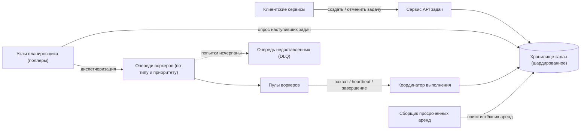
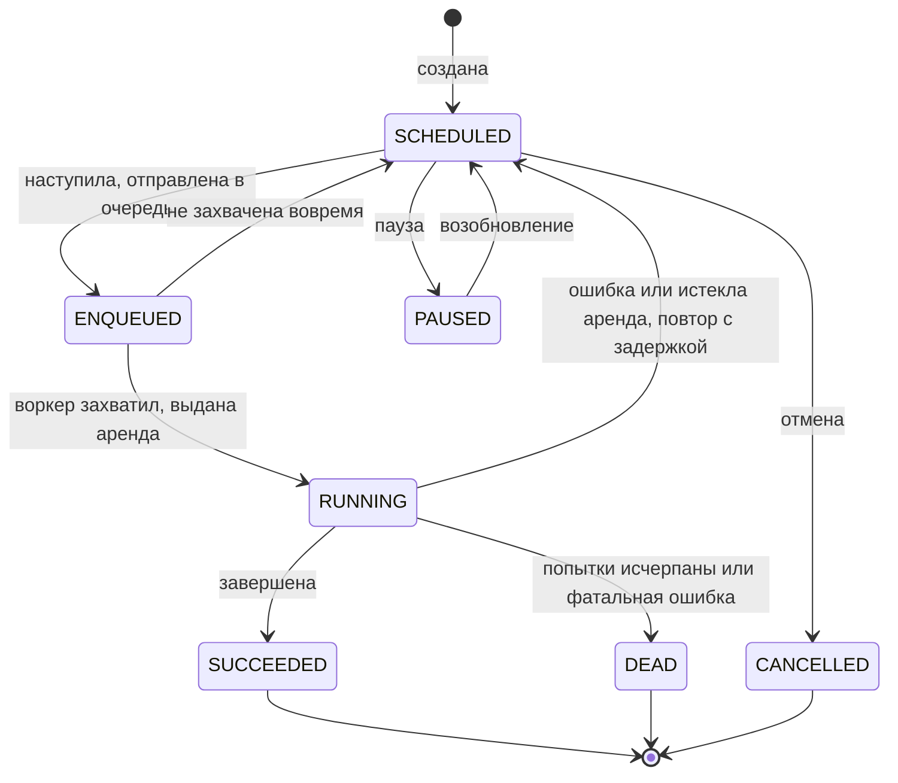
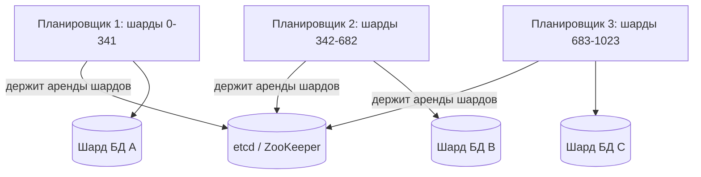
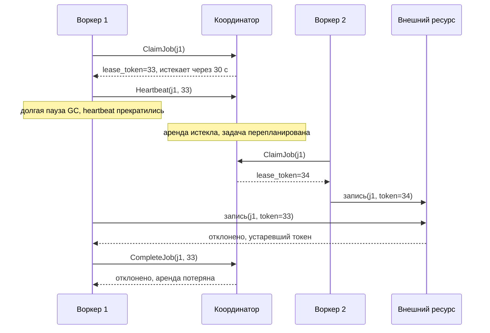

**Русский** | [English](./README.en.md)

# Глава 37: Распределённый планировщик задач

## Введение

В этой главе мы спроектируем **распределённый планировщик задач (distributed task scheduler)** — сервис, которому другие команды могут сказать «выполни эту работу в момент T» или «выполняй это каждый день в 03:00», а он гарантирует, что это действительно произойдёт, даже если машины падают.

Типичные сценарии:
 * **Отложенные разовые задачи (delayed one-off jobs)**: отправить письмо-напоминание через 24 часа после регистрации, отменить неоплаченный заказ через 30 минут, повторить неудачный вебхук через 5 минут.
 * **Периодические задачи (recurring / cron jobs)**: ночные отчёты, ежечасная синхронизация данных, регулярная очистка.
 * **Вынос работы в асинхронный режим**: «сделай это как можно скорее, но не в пути обработки запроса».

Демона `cron` на одной машине недостаточно: он является единой точкой отказа (single point of failure), не умеет повторять задачи, не хранит историю и не масштабируется за пределы одного хоста.
Известные решения в этой области — Celery, Sidekiq, Quartz, Kubernetes CronJob, Airflow и Temporal. Dropbox описал свою внутреннюю систему ATF (Async Task Framework — фреймворк асинхронных задач), идеи из которой мы позаимствуем.

Самое сложное в этой задаче — не сами таймеры, а **корректность при сбоях**: что будет, если узел планировщика умрёт сразу после того, как взял задачу, или если воркер (worker) зависнет посреди выполнения, а потом «проснётся»?

---

## Шаг 1: Понять задачу и определить рамки проектирования

Возможный диалог между кандидатом (К) и интервьюером (И):
 * К: Нужны ли и разовые отложенные задачи, и периодические?
 * И: Да, обе. Периодическое расписание задаётся cron-выражением с часовым поясом.
 * К: Планировщик сам выполняет код задачи или только запускает его?
 * И: Клиенты регистрируют типы задач и запускают собственные воркеры. Наша система хранит, планирует, распределяет и отслеживает задачи.
 * К: Насколько точным должно быть время выполнения?
 * И: Достаточно точности до секунды. Задача должна стартовать в пределах нескольких секунд от запланированного времени.
 * К: Какая нужна гарантия выполнения? Может ли задача выполниться дважды?
 * И: Задача никогда не должна теряться. Двойное выполнение в редких случаях сбоев допустимо, но его нужно минимизировать и сделать безопасным.
 * К: Нужны ли повторные попытки?
 * И: Да, настраиваемые повторы с увеличивающейся задержкой. Задачи, которые постоянно падают, нужно откладывать в отдельное место для разбора.
 * К: Каков масштаб?
 * И: Допустим, 100 миллионов разовых задач в сутки и 1 миллион определений периодических задач.
 * К: Сколько может выполняться задача?
 * И: Большинство завершаются за секунды, но некоторые могут идти до часа.
 * К: Нужны ли приоритеты, зависимости между задачами, мультитенантность?
 * И: Приоритеты и ограничения частоты на арендатора (tenant) — да. Зависимости — желательно, обсудим кратко.

### **Функциональные требования**

 * Запланировать разовую задачу на конкретное время (или через заданную задержку).
 * Запланировать периодическую задачу с помощью cron-выражения и часового пояса.
 * Отменять, приостанавливать и возобновлять задачи; запрашивать статус задачи и историю её выполнений.
 * Повторять упавшие задачи с экспоненциальной задержкой (exponential backoff) до настраиваемого числа попыток; переносить исчерпавшие попытки задачи в DLQ (Dead Letter Queue — очередь недоставленных сообщений, куда складываются задачи, которые не удалось обработать).
 * Поддерживать приоритеты задач и ограничения частоты (rate limits) на арендатора и тип задачи.
 * (Опционально) запускать задачу только после завершения других задач — DAG (Directed Acyclic Graph — направленный ациклический граф зависимостей).

### **Нефункциональные требования**

- **Надёжность**: принятая задача никогда не теряется — выполнение **хотя бы один раз (at-least-once)**.
- **Своевременность**: p95 (95-й перцентиль — значение, в которое укладываются 95% замеров) задержки между запланированным и фактическим стартом — несколько секунд.
- **Масштабируемость**: горизонтальное масштабирование для обработки всплесков (например, множества cron-задач в `00:00`).
- **Высокая доступность**: нет единой точки отказа ни в планировании, ни в распределении задач.
- **Изоляция**: некорректно ведущий себя тип задачи или арендатор не должен «морить голодом» остальных.

### **Оценка на салфетке (back-of-the-envelope)**

Все числа ниже — допущения для собеседования, а не измерения какой-либо реальной системы.
 * Разовые задачи: 100 млн/сутки -> 10^8 / 86 400 с ~= **1 200 задач/с** в среднем. Пусть пик = 5x от среднего -> ~**6 000 задач/с**.
 * Периодические задачи: 1 млн определений. Пусть в среднем каждая запускается раз в час -> 24 млн запусков/сутки -> 2,4 * 10^7 / 86 400 ~= **280 запусков/с** в среднем.
 * Настоящая проблема — **выравнивание**: люди любят круглое время. Если 20% из 1 млн cron-определений срабатывают в начале часа, это **200 000 задач, наступающих в одну и ту же секунду**. Система должна поглощать этот всплеск (за счёт очередей), а не рассчитываться на него.
 * Хранилище: пусть запись о задаче занимает ~1 КБ (метаданные + небольшая полезная нагрузка; большие данные кладутся в объектное хранилище и передаются по ссылке).
   * 100 млн задач/сутки * 1 КБ = **100 ГБ/сутки** новых данных.
   * Хранение истории выполнений 30 дней: 100 ГБ * 30 = **3 ТБ** (без учёта репликации). Завершённые задачи можно переносить в более дешёвое хранилище.
 * Записи статусов: каждая задача проходит ~4 перехода состояний (scheduled -> enqueued -> running -> succeeded), плюс heartbeat-сигналы для долгих задач. 6 000 задач/с * 4 = **~24 000 записей/с** в пике, что требует шардированного хранилища задач.

---

## Шаг 2: Предложить высокоуровневый дизайн и получить одобрение

### **Высокоуровневый дизайн**

Дизайн разделяет **когда** задача должна выполниться (планирование) и **где** она выполняется (исполнение):



 * **Сервис API задач** — API (Application Programming Interface — программный интерфейс приложения) без состояния; валидирует запросы, вычисляет время первого запуска и записывает задачи в хранилище.
 * **Хранилище задач** — источник истины. Хранит определения задач, их состояние и индекс по времени (`next_run_at`), чтобы находить наступившие задачи.
 * **Узлы планировщика** — примерно раз в секунду опрашивают хранилище в поисках задач, чьё время пришло, и кладут их в очереди воркеров.
 * **Очереди воркеров** — брокер сообщений (Kafka, SQS (Simple Queue Service — управляемый сервис очередей в AWS (Amazon Web Services — облачная платформа Amazon)), RabbitMQ и т. д.) с отдельными очередями на каждый тип задачи и приоритет. Они отделяют планирование от исполнения и сглаживают всплески.
 * **Воркеры** — принадлежат командам-клиентам; забирают сообщения, захватывают задачу, выполняют её, шлют heartbeat-сигналы и сообщают результат.
 * **Координатор выполнения** — обрабатывает вызовы claim/heartbeat/complete и следит за соблюдением машины состояний. В Dropbox ATF есть похожий компонент (Heartbeat and Status Controller).
 * **Сборщик просроченных аренд (lease reaper)** — находит задачи, чей воркер перестал слать heartbeat, и делает их доступными для повтора.

Почему бы не класть отложенные сообщения сразу в очередь? Большинство очередей поддерживают лишь короткие задержки (например, у очередей с задержкой SQS максимум — 15 минут) и плохо поддерживают отмену, запросы, cron и историю. Поэтому мы храним задачи в базе данных и передаём их в очередь только когда они наступили.

### **Дизайн API**

Публичный API:

```
POST /v1/jobs
{
  "type": "send_reminder_email",
  "payload": {"user_id": 42},
  "run_at": "2026-10-01T09:00:00Z",       // one-off, OR:
  "cron": "0 3 * * *", "timezone": "Europe/Berlin",
  "priority": "high",
  "max_attempts": 5,
  "timeout_sec": 300,
  "idempotency_key": "reminder-42-2026-10-01"
}
-> 201 {"job_id": "j_8f2c..."}

GET    /v1/jobs/{job_id}               -> state, next_run_at, attempts
GET    /v1/jobs/{job_id}/executions    -> history of runs
DELETE /v1/jobs/{job_id}               -> cancel
POST   /v1/jobs/{job_id}:pause | :resume
```

Ключ идемпотентности (idempotency key) `idempotency_key` делает безопасным повтор самого создания задачи: второй `POST` с тем же ключом вернёт существующий `job_id` вместо создания дубликата.

Внутренний API для воркеров (gRPC — фреймворк удалённого вызова процедур от Google):
 * `ClaimJob(job_id) -> {lease_token, lease_expires_at}`
 * `Heartbeat(job_id, lease_token) -> {lease_expires_at}`
 * `CompleteJob(job_id, lease_token, status, result)`

### **Модель данных**

Таблица `jobs` — одна строка на задачу (для cron-задач — на определение):

| Столбец | Описание |
|---|---|
| job_id (PK) | уникальный идентификатор (PK, Primary Key — первичный ключ) |
| tenant_id, type | владелец и тип задачи (определяет очередь) |
| payload | небольшой JSON (JavaScript Object Notation — текстовый формат данных) или ссылка на объектное хранилище |
| cron_expr, timezone | null для разовых задач |
| priority, max_attempts, timeout_sec | политика выполнения |
| state | SCHEDULED, ENQUEUED, RUNNING, SUCCEEDED, DEAD, CANCELLED, PAUSED |
| next_run_at | время следующего выполнения в UTC; **индексируется** |
| attempt | номер текущей попытки |
| lease_owner, lease_expires_at | кто выполняет и до какого момента |
| lease_token | монотонно растущий токен ограждения (fencing token) |
| shard_id | hash(job_id) mod N, используется для партиционирования |

Здесь UTC (Coordinated Universal Time — всемирное координированное время) — единая шкала времени без часовых поясов и перехода на летнее время.

Таблица `executions` — одна строка на попытку: `(job_id, attempt, scheduled_at, started_at, finished_at, worker_id, status, error)`. Она только дописывается (append-only) и удобна для истории и отладки; её можно держать в более дешёвом хранилище с партиционированием по времени.

Ключевой шаблон доступа — «**дай мне задачи в состоянии SCHEDULED с `next_run_at <= now()`**», поэтому индекс по `(shard_id, state, next_run_at)` — сердце всего дизайна.

---

## Шаг 3: Детальное проектирование

### **Машина состояний задачи**

Каждая задача проходит через явную машину состояний (state machine). Все переходы — **условные записи** в хранилище задач (compare-and-set по текущему состоянию и токену аренды), поэтому параллельно действующие участники не могут испортить состояние.



Обратите внимание: для периодической задачи SUCCEEDED относится к одному **запуску**; само определение возвращается в SCHEDULED со следующим срабатыванием cron (см. ниже).

У каждого нетерминального состояния есть тайм-аут, который возвращает задачу в известное состояние. В этом основная идея «никогда не терять задачу»: если любой компонент умирает, какой-то таймер рано или поздно это заметит и снова продвинет задачу. ATF следует тому же принципу.

### **Хранение задач и поиск наступивших**

Есть три распространённых варианта индекса по времени.

**Вариант 1: опрос реляционной БД с `SKIP LOCKED`.**
Самый простой надёжный дизайн. Несколько узлов планировщика выполняют один и тот же запрос; `FOR UPDATE SKIP LOCKED` (PostgreSQL 9.5+, MySQL 8.0+) заставляет каждый узел пропускать строки, уже заблокированные другим узлом, так что узлы не блокируют друг друга и не отправляют задачу дважды. БД (база данных) здесь выполняет SQL (Structured Query Language — язык структурированных запросов) такого вида:

```sql
WITH due AS (
  SELECT job_id FROM jobs
  WHERE shard_id = ANY(:my_shards)
    AND state = 'SCHEDULED'
    AND next_run_at <= now()
  ORDER BY next_run_at
  LIMIT 500
  FOR UPDATE SKIP LOCKED
)
UPDATE jobs j
SET state = 'ENQUEUED', enqueued_at = now()
FROM due
WHERE j.job_id = due.job_id
RETURNING j.job_id, j.type, j.priority, j.payload;
```

Плюсы: транзакционность, простота рассуждений, отмена — это обычный update. Минусы: у одной базы есть потолок по записи, поэтому в нашем масштабе её нужно шардировать.

**Вариант 2: временные корзины (time buckets) в широкостолбцовом хранилище (Cassandra, DynamoDB).**
Ключ партиции = `(minute_bucket, shard_id)`, ключ кластеризации = `(run_at, job_id)`. В 12:05 планировщик читает партицию `(12:05, shard 17)` и получает все задачи этой минуты, уже отсортированные. Запись масштабируется горизонтально. Компонент шарда обязателен — без него все задачи одной минуты попадут в одну «горячую» партицию. Минусы: нет многострочных транзакций, поэтому переходы состояний опираются на условные записи (lightweight transactions), а задачи, пришедшие с опозданием в уже прошедшую корзину, требуют особой обработки.

**Вариант 3: сортированные множества Redis (sorted sets).**
`ZADD due:{shard} <run_at_ms> <job_id>`; поллер выбирает элементы со score `<= now` и атомарно удаляет их (скриптом на Lua) перед отправкой. Очень быстро, хорошо подходит для коротких задержек. Минусы: ограничение объёмом памяти и более слабая долговечность, поэтому обычно это **кэш/индекс перед** долговечным хранилищем, а не источник истины.

Прагматичный выбор: шардированная реляционная база (или распределённая SQL-база) как источник истины плюс вариант 1. Опционально — индекс в памяти (Redis или колесо таймеров (timing wheel) внутри планировщика) для задач, наступающих в ближайшие несколько минут, чтобы точность срабатывания не требовала непрерывно нагружать БД.

### **Партиционирование планировщика и выбор лидера**

Чтобы масштабировать опрос, разбиваем задачи на фиксированное число логических шардов (например, 1024, `shard_id = hash(job_id) mod 1024`) и назначаем шарды узлам планировщика.



 * Каждый узел планировщика держит аренду (lease) своих шардов — например, аренду etcd с TTL (Time To Live — время жизни записи, по истечении которого она удаляется). Если узел умирает, его аренды истекают, и другие узлы забирают его шарды — это **выбор лидера (leader election) на уровне шарда**.
 * С `SKIP LOCKED` владение шардом — оптимизация (меньше конкуренции), а не требование корректности: даже если два узла кратковременно опрашивают один шард, блокировка строки и условная смена состояния не дадут отправить задачу дважды.
 * В хранилище без блокировок строк владение **является** механизмом корректности, и нужно защищаться от устаревшего лидера (см. токены ограждения ниже).

Логических шардов намного больше, чем узлов, поэтому ребалансировка — это просто перенос аренд шардов, а не перемещение данных (аналогично консистентному хешированию с виртуальными узлами).

### **Диспетчеризация в очереди воркеров**

После смены состояния на ENQUEUED планировщик публикует сообщение `{job_id, type, attempt}` в очередь для пары `(type, priority)`. Здесь возникает классическая проблема двойной записи (dual write): обновление БД и публикация в очередь не атомарны.
 * Если планировщик упадёт после коммита ENQUEUED, но до публикации, задача «застрянет». Решение — **тайм-аут на ENQUEUED**: фоновый процесс возвращает в SCHEDULED задачи, пробывшие в ENQUEUED дольше X (например, 1 минуты).
 * Если сообщение опубликовано дважды (например, фоновый процесс повторно продвинул задачу, чьё сообщение просто задержалось), дубликат отсекается на шаге **захвата (claim)**: только один воркер может перевести задачу из ENQUEUED в RUNNING.

Таким образом, сообщение в очереди — лишь «подсказка пойти и захватить задачу X»; кто её реально выполнит, решает хранилище задач. Это не даёт собственной семантике доставки очереди (обычно at-least-once) просочиться в семантику задач.

Хранение полезной нагрузки в хранилище, а в сообщении только `job_id`, ещё и упрощает отмену: отменённая задача не пройдёт захват, и сообщение будет отброшено.

### **Выполнение: аренды, heartbeat-сигналы и токены ограждения**

Воркер может в любой момент упасть, застрять в долгой паузе GC (Garbage Collection — сборка мусора, во время которой процесс может быть приостановлен) или потерять сеть. Мы используем **аренды (leases)** — право выполнять задачу в течение ограниченного времени.



 * **Захват (claim)** — условное обновление: `UPDATE jobs SET state='RUNNING', lease_owner=:w, lease_expires_at=now()+30s, lease_token=lease_token+1 WHERE job_id=:id AND state='ENQUEUED'`. Ноль обновлённых строк означает, что задачу уже взял другой воркер (или её отменили) — сообщение отбрасывается.
 * **Heartbeat-сигналы (heartbeats)**: воркер продлевает аренду каждые ~10 с (доля от длительности аренды). Это позволяет держать аренду короткой (быстрое обнаружение сбоя), пока задача выполняется целый час. Та же идея, что и продление тайм-аута видимости (visibility timeout) в SQS или heartbeat активности в Temporal.
 * **Сборщик просроченных аренд** периодически ищет `state='RUNNING' AND lease_expires_at < now()` и переводит задачу в SCHEDULED для повтора (увеличивая `attempt`).
 * **Токен ограждения (fencing token)**: одной аренды недостаточно. Как отмечает Мартин Клеппман, процесс может приостановиться (GC, миграция VM (Virtual Machine — виртуальная машина)) после проверки аренды и продолжить работу, когда она уже истекла, всё ещё считая себя её владельцем. `lease_token` растёт при каждом захвате; координатор отклоняет heartbeat и завершение со старым токеном, а внешние системы, которые это поддерживают, могут отклонять записи с токеном меньше уже виденного.
 * **Самоостановка**: воркер, у которого подряд не прошло несколько heartbeat, должен сам прервать задачу (ATF убивает исполнитель после трёх подряд неудачных heartbeat), сокращая окно, в котором работают две копии.

### **At-least-once против exactly-once**

В распределённой системе со сбоями нельзя гарантировать, что побочные эффекты задачи произойдут ровно один раз (exactly-once): воркер может выполнить побочный эффект и упасть прямо перед сообщением об успехе. Планировщик не отличит это от «упал, ничего не сделав», поэтому обязан повторить. Отсюда:
 * Платформа гарантирует выполнение **хотя бы один раз (at-least-once)**.
 * Владельцы задач делают задачи **идемпотентными**, что даёт **фактически однократный (effectively-once)** результат:
   * Передавать во внешние API ключ идемпотентности, стабильный между попытками (например, `job_id + scheduled_time`, но никогда не включающий `attempt`) — например, платёжные провайдеры принимают ключи идемпотентности.
   * Использовать upsert и условные записи вместо «слепых» вставок или инкрементов.
   * Записывать маркер «обработано» в той же транзакции, что и бизнес-изменение.

Документация Celery описывает тот же компромисс: при позднем подтверждении (late acknowledgement) задача может выполниться несколько раз, если воркер упадёт, поэтому задачи должны быть идемпотентными. Режим «не более одного раза (at-most-once)» (подтверждение до выполнения) тоже возможен, но тогда падение теряет задачу — пользователям это нужно редко.

### **Повторы, экспоненциальная задержка и DLQ**

Когда задача падает (исключение, тайм-аут, потеря аренды):
 * **Повторяемая ошибка (retriable failure)**: `state='SCHEDULED'`, `attempt=attempt+1`, `next_run_at = now() + backoff(attempt)`. Повтор — это просто повторное планирование, отдельный механизм повторов не нужен.
 * **Экспоненциальная задержка со случайным разбросом (jitter)**: `backoff = random(0, min(cap, base * 2^attempt))` — «full jitter» из блога AWS Architecture. Разброс не даёт тысячам задач, упавшим одновременно (например, при отказе зависимости), повториться в один и тот же момент. Для справки: политика повторов Temporal по умолчанию использует начальный интервал 1 с, коэффициент 2,0 и максимальный интервал в 100 раз больше начального; Sidekiq по умолчанию делает 25 повторов примерно за 21 день.
 * **Неповторяемая (фатальная) ошибка** (некорректная полезная нагрузка, ошибка валидации): сразу в DEAD.
 * **DLQ**: задачи, исчерпавшие `max_attempts`, переходят в DEAD и копируются в DLQ вместе с последней ошибкой. Операторы могут изучить их, исправить баг и массово перезапустить. Настройте алерты на рост DLQ.

### **Периодические (cron) задачи**

Cron-определение не выполняется напрямую — оно **материализует** по одному запуску за раз:
1. При создании вычисляем следующее срабатывание по `cron_expr` и `timezone`, переводим его в UTC и сохраняем в `next_run_at`.
2. Когда время наступает, планировщик создаёт запуск с **детерминированным идентификатором** `run_id = hash(job_id, scheduled_time)` (ограничение уникальности не даёт создать дубликат, даже если два планировщика состязаются) и в той же транзакции сдвигает `next_run_at` на следующее срабатывание.

Политики, которые стоит предоставить (у Kubernetes CronJob есть похожие настройки):
 * **Политика параллельности (concurrency policy)**: что делать, если предыдущий запуск ещё идёт? `Allow`, `Forbid` (пропустить этот запуск) или `Replace` (отменить старый).
 * **Политика пропусков (misfire policy)**: после простоя планировщик находит задачу, пропустившую 50 срабатываний. Запустить один раз, запустить все пропущенные или пропустить? Разумное значение по умолчанию — **крайний срок старта (starting deadline)**, например «не запускать, если опоздание больше часа».
 * **Часовые пояса и DST** (Daylight Saving Time — переход на летнее время): расписание хранится в часовом поясе пользователя, но следующее время вычисляется в UTC. Ежедневная задача на `02:30` в дни перехода может быть пропущена или выполнена дважды — это поведение нужно задокументировать.
 * **Всплески в начале часа**: материализуйте запуски на несколько минут вперёд и предложите опциональный разброс («в любой момент в пределах часа») для задач, которым точное время не важно.

### **Приоритеты и ограничения частоты**

 * **Приоритеты**: отдельные очереди на `(type, priority)`, как в ATF. Воркеры чаще опрашивают высокоприоритетные очереди (взвешенный опрос), так что поток низкоприоритетных задач не может задавить срочные. Строгий приоритет грозит голоданием низкого приоритета; веса этого избегают.
 * **Ограничения частоты на арендатора / тип**: перед отправкой планировщик проверяет корзину токенов (token bucket, см. главу 4, «Ограничитель частоты запросов»). Если арендатор превысил лимит, задача остаётся в SCHEDULED, а `next_run_at` немного сдвигается в будущее.
 * **Ограничения параллельности**: например, «не более 50 одновременно выполняющихся задач типа X», чтобы защитить хрупкую внешнюю систему. Проверяется подсчётом аренд RUNNING по типу в момент захвата.
 * **Изоляция**: выделенные пулы воркеров на тип задачи означают, что медленный тип задач забивает только собственную очередь.

### **Зависимости задач (DAG)**

Некоторым сценариям нужно «запустить C после успешного завершения A и B». Простое расширение:
 * Хранить рёбра в таблице `job_dependencies(parent_id, child_id)` и счётчик `pending_parents` у дочерней задачи.
 * Дочерняя задача создаётся в состоянии WAITING. Когда родитель успешно завершается, в той же транзакции уменьшаем счётчики у детей; когда счётчик достигает 0, переводим ребёнка в SCHEDULED с `next_run_at = now()`.
 * Если родитель переходит в DEAD, помечаем потомков как упавших из-за предшественника (upstream-failed).

Для сложных процессов (ветвления, долгоживущее состояние, компенсации) лучше подходят специализированные движки, такие как Airflow (пакетные DAG) или Temporal (долговечные workflow), чем разрастание планировщика в такой движок.

### **Рассинхронизация часов (clock skew)**

Многие решения сравнивают метки времени (`next_run_at <= now()`, `lease_expires_at < now()`), а часы разных машин расходятся.
 * Используйте **один источник времени на решение**: вычисляйте `now()` в базе данных (или координаторе), а не на каждом хосте воркера/планировщика.
 * Гарантия планирования звучит как «**не раньше** T и вскоре после». Расхождение в несколько сотен миллисекунд лишь немного задержит задачу — это приемлемо.
 * Аренды опаснее: воркер с отстающими часами может считать свою аренду ещё действующей. Воркеры должны трактовать аренды консервативно (останавливаться через `lease_duration - safety_margin`, отмеренные локальными монотонными часами с момента захвата), а корректность вообще не должна зависеть от часов — для этого и нужны токены ограждения.
 * Все времена храните в UTC; часовые пояса нужны только для вычисления cron.

### **Наблюдаемость (observability)**

Ключевые метрики:
 * **Задержка расписания (schedule lag)** = `started_at - scheduled_at` (p50/p95/p99) — главный SLO (Service Level Objective — целевой уровень качества сервиса). ATF, например, ставит целью запускать 95% задач в пределах 5 секунд от запланированного времени.
 * Число **наступивших, но не отправленных** задач (планировщик отстаёт), а также глубина очереди и возраст самого старого сообщения в каждой очереди (воркеры отстают).
 * Доли успехов / ошибок / повторов по типам задач; размер DLQ; истечения аренд (падения воркеров или слишком короткие тайм-ауты).
 * Здоровье планировщика: владение шардами, длительность опроса, число строк за опрос.

Плюс история каждой задачи в таблице `executions`, структурированные логи и распределённые трассировки с меткой `job_id`, а также UI (User Interface — пользовательский интерфейс), где владельцы могут искать, отменять и перезапускать задачи.

---

## Шаг 4: Подведение итогов

Итоги дизайна:
 * Задачи живут в **шардированном долговечном хранилище** с индексом по `next_run_at`; планировщики опрашивают свои шарды (`SKIP LOCKED` или временные корзины) и кладут наступившие задачи в **очереди по типу и приоритету**.
 * **Машина состояний с тайм-аутами** в каждом нетерминальном состоянии гарантирует, что ни одна задача не потеряется.
 * Выполнение использует **аренды + heartbeat + токены ограждения**; платформа даёт **at-least-once**, а **идемпотентные задачи** превращают это в effectively-once.
 * Повторы — это просто перепланирование с **экспоненциальной задержкой и разбросом**; исчерпавшие попытки задачи уходят в **DLQ**.
 * Cron-задачи материализуют по одному запуску за раз с детерминированными идентификаторами запусков плюс политиками параллельности и пропусков.

Дополнительные темы для обсуждения:
 * **Мультирегиональность**: active-passive на уровне шарда или привязка арендаторов к региону; межрегиональное переключение повышает вероятность дублирующих запусков, поэтому идемпотентность становится ещё важнее.
 * **Большие полезные нагрузки**: хранить в объектном хранилище и передавать ссылки.
 * **Архивирование**: переносить завершённые задачи и выполнения в холодное хранилище после окончания срока хранения.
 * **Строить или купить**: многим командам достаточно Postgres + `SKIP LOCKED`, очередей с задержкой SQS + БД или Temporal; собственная платформа окупается при большом масштабе и множестве команд.

---

## Источники

 * [Asynchronous task scheduling at Dropbox (ATF)](https://dropbox.tech/infrastructure/asynchronous-task-scheduling-at-dropbox)
 * [How to do distributed locking - Martin Kleppmann](https://martin.kleppmann.com/2016/02/08/how-to-do-distributed-locking.html)
 * [PostgreSQL documentation: SELECT, the locking clause (SKIP LOCKED)](https://www.postgresql.org/docs/current/sql-select.html)
 * [Amazon SQS visibility timeout](https://docs.aws.amazon.com/AWSSimpleQueueService/latest/SQSDeveloperGuide/sqs-visibility-timeout.html)
 * [Exponential Backoff And Jitter - AWS Architecture Blog](https://aws.amazon.com/blogs/architecture/exponential-backoff-and-jitter/)
 * [Temporal: Detecting Activity failures](https://docs.temporal.io/encyclopedia/detecting-activity-failures)
 * [Temporal: Retry Policies](https://docs.temporal.io/encyclopedia/retry-policies)
 * [Sidekiq wiki: Error Handling](https://github.com/sidekiq/sidekiq/wiki/Error-Handling)
 * [Celery documentation: Tasks](https://docs.celeryq.dev/en/stable/userguide/tasks.html)
 * [Kubernetes documentation: CronJob](https://kubernetes.io/docs/concepts/workloads/controllers/cron-jobs/)
