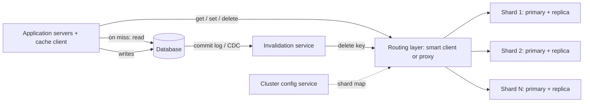
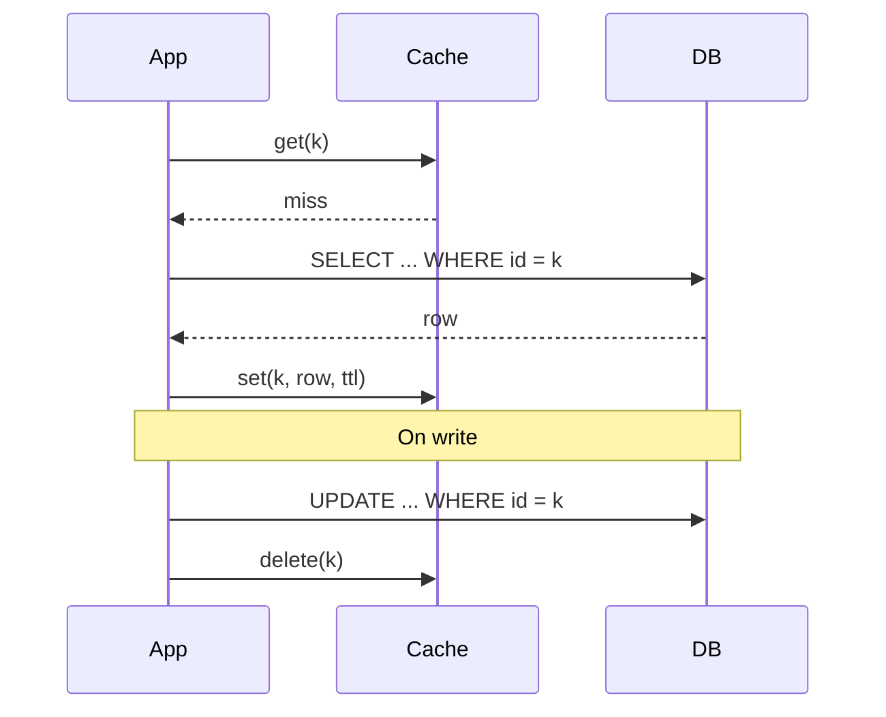
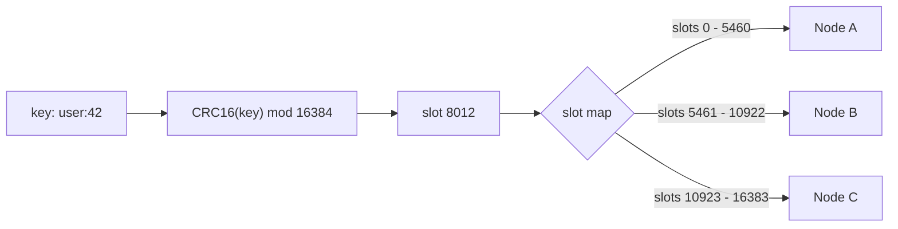
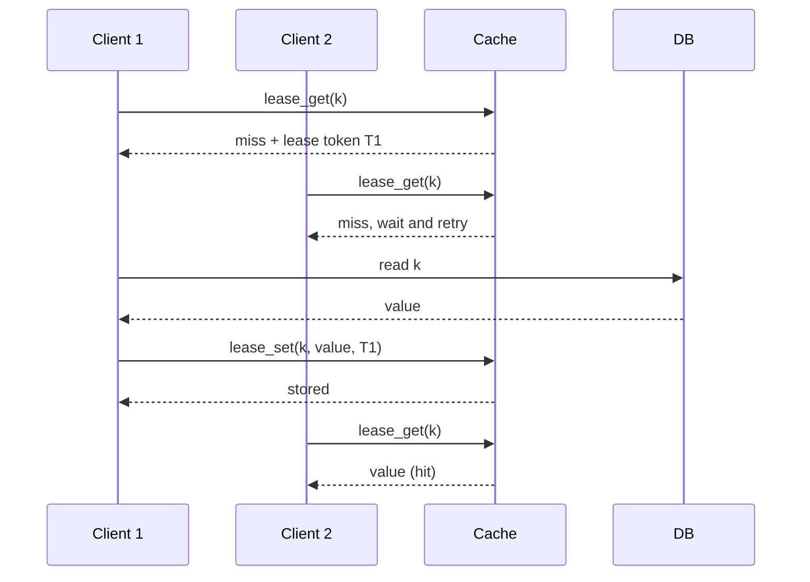
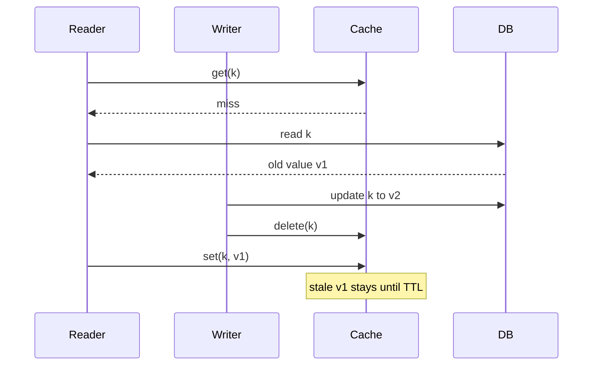

[Русский](./README.md) | **English**

# Chapter 38: Design a Distributed Cache

## Introduction

In this chapter we design a **distributed cache** - an in-memory key-value service similar to Memcached or Redis (in cache mode) that sits in front of slower storage (a relational database, a microservice, a search index) and serves hot data with sub-millisecond latency.

A distributed cache is a close relative of the key-value store from [Chapter 6](../06.%20Key-Value%20Store/Readme.en.md), but the priorities are different:
 * Data lives **in RAM** and the cache is **not the source of truth**. Losing an entry is acceptable - it can be re-read from the database.
 * Latency and throughput matter more than durability.
 * The hard problems are not storage engines but **what to keep in memory** (eviction, TTL), **how to keep the cache in sync with the database** (invalidation) and **how to protect the database** when the cache misses (stampedes, hot keys, failures).

We'll reuse [consistent hashing](../05.%20Consistent%20Hashing/Readme.en.md) from Chapter 5 and replication ideas from Chapter 6 rather than re-deriving them.

---

## Step 1: Understand the Problem and Establish Design Scope

Possible dialogue between Candidate and Interviewer:
 * C: What is the cache used for? Is it a general-purpose cache in front of a database?
 * I: Yes. Many services use it to cache database query results and computed objects.
 * C: What does the API look like? Plain key-value or rich data structures?
 * I: Key-value with get/set/delete, TTL and a few atomic operations like increment. Values are opaque byte arrays.
 * C: What is the typical key and value size?
 * I: Keys are under 250 bytes, values are usually around 1 KB, max 1 MB.
 * C: What is the read/write ratio and the traffic volume?
 * I: Read-heavy. Assume about 1 million reads per second at peak and roughly 10x fewer writes.
 * C: Is it acceptable to serve slightly stale data?
 * I: Yes, for a short, bounded time. But stale data must not stay in the cache indefinitely.
 * C: Do we need persistence?
 * I: No. The database is the source of truth. After a restart the cache can be refilled.
 * C: Do we need to support multiple data centers?
 * I: Yes, the product is served from several regions. Let's discuss it at the end.

### **Functional requirements**

 * `get(key)`, `set(key, value, ttl)`, `delete(key)`, batch `mget`
 * Per-key TTL (time-to-live) and automatic eviction when memory is full
 * Atomic operations: `add` (set if not exists), `incr`, compare-and-set
 * Invalidation of cached entries when the underlying data changes

### **Non-functional requirements**

- **Low latency**: p99 of a few milliseconds end-to-end, sub-millisecond on the server side
- **High throughput**: millions of operations per second, scaling horizontally by adding nodes
- **High availability**: a node failure must not cause a cascade of misses that overloads the database
- **Bounded staleness**: stale data is tolerated for a short time, then must be invalidated or expire
- **Durability is not required**

### **Back-of-the-envelope estimation**

All numbers below are **assumptions** for this exercise, not measurements of a real system:
 * Peak reads: 1M QPS; writes (sets + deletes): 100k QPS
 * Working set: 1 billion keys
 * Average entry: 1 KB value + ~200 bytes of key and per-entry metadata ≈ 1.2 KB
 * **Memory for one copy** = 1B × 1.2 KB = **1.2 TB**
 * With one replica per shard: 1.2 TB × 2 = **2.4 TB**
 * Assume each node has 128 GB RAM, but we set the cache limit to 64 GB to leave headroom for fragmentation, connection and replication buffers
 * **Primary nodes needed for memory** = 1.2 TB / 64 GB ≈ 19 → round up to **20 primaries** (+20 replicas = 40 nodes)
 * Assume one node conservatively handles ~100k ops/s. **Nodes needed for throughput** = 1.1M / 100k = 11. So memory, not CPU, is the binding constraint; each of the 20 primaries serves ~1.1M / 20 = 55k ops/s.
 * **Network**: 1M reads/s × 1 KB = 1 GB/s ≈ 8 Gbps across the cluster, ~50 MB/s per primary
 * **Why hit ratio matters**: with a 95% hit ratio the database receives 1M × 5% = 50k reads/s; at 90% it receives 100k reads/s. A 5-point drop in hit ratio **doubles** the database load. This is the single most important metric of a cache.

---

## Step 2: Propose High-Level Design and Get Buy-In

### **High-level design**



 * **Cache client** - a library inside each application server. It hashes keys, picks a shard, pools connections, batches requests and implements retries and timeouts.
 * **Routing layer** - either the client itself ("smart client") or a separate proxy tier.
 * **Cache shards** - each shard is a primary node with one or more replicas. Nodes hold data only in RAM.
 * **Cluster config service** - stores the shard map (which key ranges or slots live on which nodes) and node health. Could be ZooKeeper/etcd or a gossip protocol inside the cluster.
 * **Invalidation service** - tails the database commit log and deletes affected keys (discussed in the deep dive).

### **Caching patterns**

How the application, cache and database interact is the first design decision.

**Cache-aside (lazy loading, look-aside)** - the most common pattern and the default for our design:



 * The application checks the cache first; on a miss it reads the database and populates the cache.
 * On a write it updates the database and **deletes** the key rather than updating it. Deletes are idempotent and avoid races where two concurrent writers set values in the wrong order. This is exactly the approach described in "Scaling Memcache at Facebook".
 * Only requested data is cached; the cache is simple and can fail without data loss.

Other patterns:

| Pattern | How it works | Pros | Cons |
|---|---|---|---|
| **Read-through** | The cache itself loads missing data from the DB via a loader | App code is simpler | Cache must know how to talk to the DB |
| **Write-through** | Writes go to the cache, which synchronously writes to the DB | Cache always has fresh data for written keys | Higher write latency; caches data that may never be read |
| **Write-behind (write-back)** | Writes go to the cache and are flushed to the DB asynchronously in batches | Very fast writes, write coalescing | Risk of data loss if a cache node dies before flushing; hard consistency |
| **Write-around** | Writes go directly to the DB; the cache is filled only on read | Avoids polluting the cache with write-once data | First read after a write is a miss |

Since the database is our source of truth and the cache may lose data, we choose **cache-aside + delete on write**, with TTLs as a safety net.

### **API design**

```
get(key) -> value | miss
mget(keys[]) -> map<key, value>
set(key, value, ttl_seconds)
add(key, value, ttl_seconds) -> ok | exists      // set only if absent
delete(key)
incr(key, delta) -> new_value
cas(key, value, cas_token) -> ok | conflict      // compare-and-set
lease_get(key) -> value | lease_token | stale_value
lease_set(key, value, lease_token, ttl_seconds)
```

`lease_get`/`lease_set` are optional operations used to fight stale sets and thundering herds (see deep dive).

### **Data model**

Inside a node, the core structure is a hash table:

```
key -> entry {
    value:        bytes
    expire_at:    timestamp (ms) or none
    access_info:  last access time (for LRU) or frequency counter (for LFU)
    cas_version:  uint64
    flags:        uint32
}
```

Plus auxiliary structures for eviction (LRU lists or sampling metadata) and for expiration (a set of keys that have a TTL).

---

## Step 3: Design Deep Dive

### **Partitioning**

With 20+ nodes we must split the keyspace. Simple `hash(key) % N` is a bad idea: changing N remaps almost every key and turns the entire cache cold at once - an instant spike of misses to the database.

Two approaches work well:

**1. Consistent hashing** ([Chapter 5](../05.%20Consistent%20Hashing/Readme.en.md)). Nodes and keys are placed on a hash ring; each key goes to the next node clockwise. Virtual nodes smooth out the distribution. Adding or removing a node remaps only ~1/N of keys. This is the classic approach of Memcached client libraries and proxies.

**2. Hash slots (Redis Cluster).** The keyspace is split into a fixed number of **16384 slots**: `HASH_SLOT = CRC16(key) mod 16384`. Each primary owns a subset of slots, and the slot map is shared by all nodes.



(Slot number and ranges above are illustrative.)

 * **Rebalancing** means moving whole slots between nodes, which is explicit and easy to reason about, unlike implicit ranges on a ring.
 * **Hash tags**: if a key contains `{...}`, only the substring inside braces is hashed, e.g. `{user:1000}.profile` and `{user:1000}.settings` land in the same slot. This enables multi-key operations on related keys.
 * **Redirections**: if a client sends a command to the wrong node, the node replies `-MOVED <slot> <host:port>` and the client updates its slot map. During a slot migration a node may reply `-ASK`, meaning "try the other node for this one request only" without updating the map.

### **Request routing: client-side vs proxy**

| | Smart client | Proxy tier (e.g. mcrouter, Twemproxy, Envoy) |
|---|---|---|
| Latency | One network hop | Extra hop |
| Client complexity | Each language needs a full-featured client | Clients are thin; any Memcached/Redis client works |
| Topology changes | Every client must learn the new map (config service or MOVED redirects) | Only proxies need to be updated |
| Connections | Every app server connects to every cache node - O(apps × nodes) | Proxies multiplex connections |
| Extra features | Limited | Central place for routing rules, replication of writes, failover, metrics |

A common compromise: smart clients for latency-critical services, a proxy (possibly as a sidecar on the same host) for everything else. Facebook's memcache deployment, for example, routes requests through **mcrouter**, a memcache-protocol proxy.

### **Replication and failover**

Each shard has a primary and one or more replicas:
 * **Replication is asynchronous**: the primary acknowledges the write and streams it to replicas. Redis Cluster explicitly documents that acknowledged writes can be lost during failover or partitions. For a cache this is acceptable - a lost write only means a future miss or, worse, a stale value, which TTL and invalidation bound.
 * **Failure detection**: nodes exchange heartbeats (Redis Cluster uses a gossip-based cluster bus). A node is marked as failed when the majority of primaries cannot reach it for longer than a configured timeout.
 * **Failover**: a replica of the failed primary is elected and promoted; the slot map is updated and clients are redirected.
 * **Read scaling**: replicas can serve reads for hot shards, at the cost of slightly more staleness.

An alternative (or complement) described for Facebook's memcache is a **gutter pool**: a small set of spare servers (about 1% of the cluster in the paper). If a client gets no response from a server, it retries against the gutter pool, and on a miss fills the gutter server from the database. Gutter entries expire quickly. This prevents a single dead node from sending all of its traffic straight to the database while automated remediation replaces it.

Whatever we choose, the key principle is: **a cache node failure must degrade into a bounded amount of extra database load, not an avalanche**.

### **Eviction policies**

When memory is full, something must be removed.

 * **LRU (least recently used)**: classically a hash map plus a doubly linked list; every access moves the entry to the head, eviction takes the tail. O(1), but costs two pointers per entry and every read mutates shared state, which hurts multi-threaded performance.
 * **Approximated LRU (Redis)**: instead of a global list, Redis samples a few random keys (`maxmemory-samples`, default 5) and evicts the one with the oldest access time; since Redis 3.0 it also keeps a pool of good eviction candidates. With 10 samples the result is very close to true LRU, with much lower memory overhead.
 * **LFU (least frequently used)**: better when a stable set of keys is popular, and resistant to one-off scans that would flush an LRU cache. Redis implements approximated LFU with a probabilistic **Morris counter** (a logarithmic counter in a few bits) that **decays** over time so formerly popular keys can age out (`lfu-log-factor`, `lfu-decay-time`).
 * **Random** and **TTL-based** (evict the key closest to expiration) are cheap alternatives.
 * Redis offers these policies both for all keys (`allkeys-lru`, `allkeys-lfu`, ...) and only for keys with a TTL (`volatile-lru`, `volatile-ttl`, ...), plus `noeviction`, which rejects writes when memory is full. For a pure cache, `allkeys-lru` or `allkeys-lfu` is the usual choice.

### **TTL and expiration**

 * Store `expire_at` as an absolute timestamp.
 * **Lazy (passive) expiration**: when a key is accessed, check `expire_at`; if expired, delete it and return a miss.
 * **Active expiration**: keys that are never accessed again would leak memory, so a background task periodically samples keys with a TTL and deletes expired ones. Redis uses both ways.
 * With replication, only the primary expires keys and sends explicit deletes to replicas, so replicas never diverge.
 * **Add jitter**: if a million keys are written with the same TTL at the same time (e.g. after a deploy or warmup), they all expire together and cause a synchronized wave of misses. Use `ttl = base + random(0, 10% of base)`.

### **Memory management**

 * **Fragmentation**: allocating and freeing variable-sized values fragments the heap. Memcached uses a **slab allocator**: memory is split into slab classes with fixed chunk sizes, and each item is stored in the smallest chunk that fits (with a per-class LRU). This eliminates external fragmentation at the cost of some internal waste. Redis relies on a general-purpose allocator (jemalloc) and can defragment actively.
 * **Headroom**: never set the memory limit equal to physical RAM. Replication buffers, client output buffers and fork-based snapshots (if enabled) need extra memory. This is why the estimation used 64 GB of 128 GB.
 * **Big keys**: a single 1 MB value blocks the network and the event loop while being served. Limit value size, or split large objects into chunks.
 * **Compact encoding**: compress large values on the client; keep keys short.

### **Hot keys**

Even with perfect hashing, a single key (a celebrity's profile, a viral post) can receive more traffic than one node can serve.

Detection: sample requests on the client or proxy and count per-key frequency (e.g. with a count-min sketch), or monitor per-node QPS skew.

Mitigations:
 * **Local (L1) cache in the application**: keep the hottest keys in process memory with a very short TTL (e.g. a few seconds). Redis 6+ supports **server-assisted client-side caching** (`CLIENT TRACKING`): the server remembers which keys a client read and pushes invalidation messages when they change, or in broadcasting mode notifies clients subscribed to key prefixes.
 * **Key replication**: store N copies under different keys, `hot_key#1 ... hot_key#N`, which hash to different nodes. Readers pick a random suffix; writers must delete/update all N copies.
 * **Read from replicas** of the shard that owns the hot key.

### **Cache stampede (thundering herd)**

When a popular key expires or is deleted, thousands of concurrent requests miss at the same moment and all hit the database to recompute the same value. Techniques:

**1. Request coalescing ("single flight")**: within one application server, concurrent misses for the same key wait on one in-flight database call. Cheap and effective, but only per process.

**2. Distributed lock**: the first client that misses acquires a short-lived lock (`add lock:k` / `SET lock:k NX PX 5000`), recomputes and fills the cache; others wait briefly and retry, or serve a stale value.

**3. Leases (Facebook memcache)**: on a miss, the cache server returns a 64-bit **lease token** bound to the key. By default the server hands out a token only once every 10 seconds per key; other clients are told to wait briefly and retry, by which time the value is usually there. The same token also prevents **stale sets** - see the next section.



**4. Probabilistic early expiration (XFetch)**: each reader independently decides to refresh a value *before* it expires, with probability growing as expiry approaches. The paper "Optimal Probabilistic Cache Stampede Prevention" proposes the check:

```
if now - delta * beta * log(random()) >= expiry:
    recompute and reset the value
```

where `delta` is how long the recomputation takes (stored with the value), `beta` ≥ 1 tunes eagerness (default 1) and `random()` is uniform in (0, 1], so `-log(random())` is exponentially distributed. Expensive values are refreshed earlier; usually exactly one request recomputes the value while others keep hitting the old one.

**5. Serve stale while revalidating**: keep the old value around after logical expiry and return it while one worker refreshes it. Facebook's memcache does something similar: deleted items are kept briefly in a separate structure, and a lease request may return a value marked stale.

### **Consistency between cache and database**

Cache-aside with delete-on-write still has a classic race:



The reader's `set` arrives after the writer's `delete`, so the cache holds stale data. Ways to address it:
 * **TTL as a safety net** - bounds how long staleness lasts. Always set one.
 * **Leases**: the writer's `delete` invalidates the lease token issued to the reader, so the reader's late `lease_set` is rejected. This works like load-link/store-conditional.
 * **Versioning / CAS**: store a version (e.g. the DB row version) with the value, and only allow sets with a newer version.
 * **`add` instead of `set`** for fills, combined with a delete **hold-off** (a period after a delete during which `add` fails). Facebook uses a two-second hold-off when warming a cold cluster from a warm one.

**Who sends invalidations?** Deleting from the application after each write is simple but unreliable: if the app crashes between the DB commit and the delete, or the delete is lost, the cache stays stale. A more robust approach is **CDC-based invalidation**: an invalidation service tails the database commit log (binlog/WAL) and issues deletes for affected keys. Facebook's `mcsqueal` daemons do exactly this: SQL statements are annotated with the memcache keys to invalidate, daemons extract them from the committed log, batch them, and broadcast deletes. Because the log is durable, lost invalidations can simply be **replayed**.

### **Multi-region**

 * Each region has its own cache clusters; reads are served locally.
 * Typically one region hosts the primary database, others hold asynchronously replicated database replicas.
 * **Invalidate from each region's own database replica**: if a web server in the primary region deleted keys in a remote region immediately after the write, a reader there might refill the cache from a replica that hasn't received the change yet. Driving invalidations from each replica's commit log guarantees that the delete arrives after the data.
 * **Writes from a non-primary region**: to avoid reading one's own stale data during replication lag, Facebook uses **remote markers**: before writing, set a marker `r:k` in the regional cache; on a miss for `k`, if the marker exists, read from the primary region's database instead of the local replica. The marker is removed by the invalidation flowing through replication.

### **Cold start and warmup**

A new or restarted cluster has a 0% hit ratio and would push all traffic to the database. Options: warm it by letting clients read misses from a warm cluster (and `add` them locally), shift traffic gradually, or pre-load known hot keys.

### **Monitoring**

 * **Hit ratio** = hits / (hits + misses) - overall and per key prefix. Redis exposes `keyspace_hits` and `keyspace_misses` in `INFO stats`.
 * **Evictions** vs **expirations**: many evictions mean the cache is too small or the policy is wrong; many expirations with a low hit ratio mean TTLs are too short.
 * **Memory**: used memory, fragmentation ratio, big keys.
 * **Latency**: p50/p99 per command, server and client side; timeouts and retries.
 * **Hot keys and per-node QPS skew**.
 * **Replication lag** and **invalidation lag** (time from DB commit to cache delete) - the latter directly measures staleness.
 * **Database load from misses** - the metric the cache exists to reduce.

---

## Step 4: Wrap Up

We designed a distributed cache built around cache-aside with delete-on-write, partitioned with consistent hashing or hash slots, replicated asynchronously, bounded by eviction and TTLs, and protected against stampedes and hot keys.

Additional talking points:
- **Negative caching**: cache "not found" results with a short TTL to protect the DB from repeated lookups of nonexistent keys.
- **Multi-tenancy**: separate pools for workloads with different access patterns, so a large low-value dataset doesn't evict small high-value keys.
- **Security**: authentication, TLS, network isolation - caches often hold personal data.
- **Protocol choices**: Facebook's memcache clients used UDP for gets to reduce latency and TCP for sets/deletes.
- **Persistence**: if restart warmup is too costly, snapshot to disk (Redis RDB/AOF), keeping in mind that the database remains the source of truth.

---

## References

 * [Scaling Memcache at Facebook (NSDI 2013)](https://www.usenix.org/system/files/conference/nsdi13/nsdi13-final170_update.pdf)
 * [Redis cluster specification](https://redis.io/docs/latest/operate/oss_and_stack/reference/cluster-spec/)
 * [Redis: Key eviction](https://redis.io/docs/latest/develop/reference/eviction/)
 * [Redis: EXPIRE (Appendix: Redis expires)](https://redis.io/docs/latest/commands/expire/)
 * [Redis: Client-side caching reference](https://redis.io/docs/latest/develop/reference/client-side-caching/)
 * [Optimal Probabilistic Cache Stampede Prevention (VLDB 2015)](https://cseweb.ucsd.edu/~avattani/papers/cache_stampede.pdf)
 * [Chapter 5: Consistent Hashing](../05.%20Consistent%20Hashing/Readme.en.md)
 * [Chapter 6: Key-Value Store](../06.%20Key-Value%20Store/Readme.en.md)
