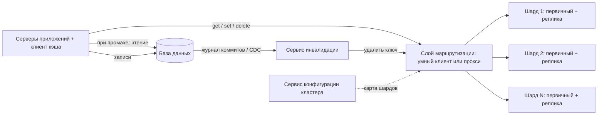
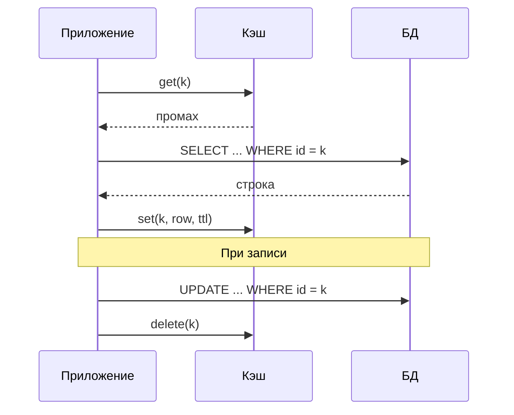
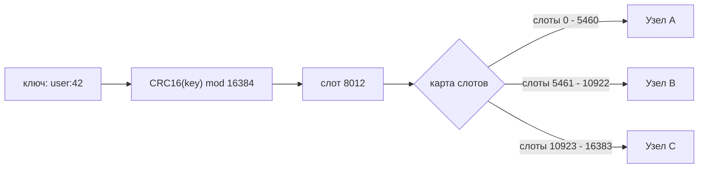
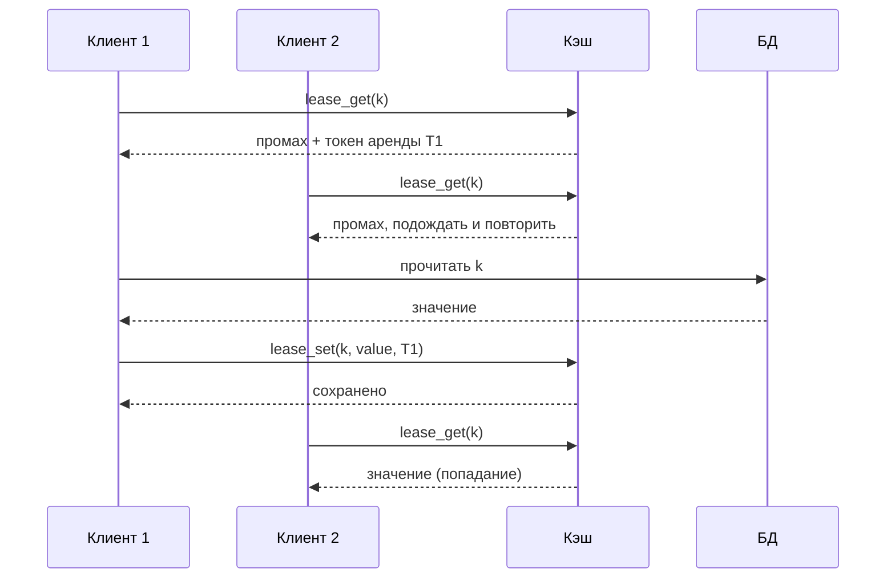
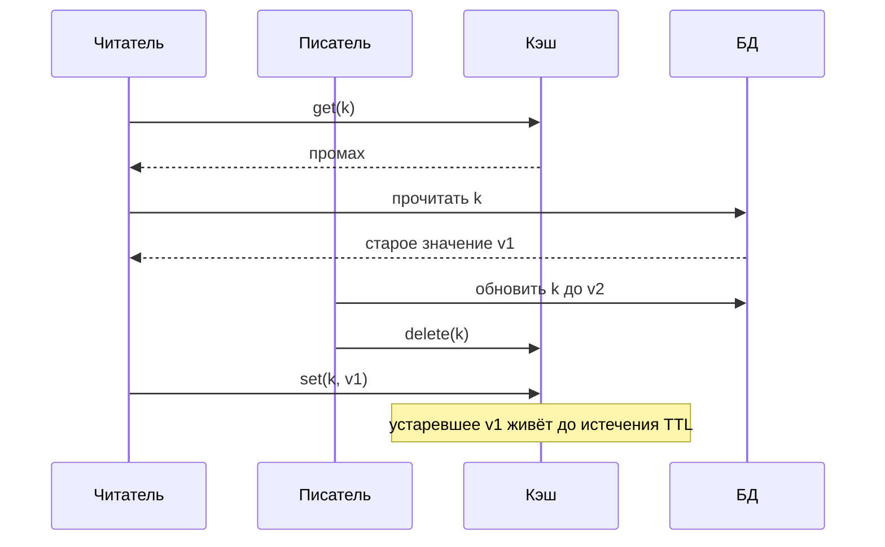

**Русский** | [English](./README.en.md)

# Глава 38: Проектирование распределённого кэша

## Введение

В этой главе мы спроектируем **распределённый кэш (distributed cache)** — сервис «ключ-значение» в оперативной памяти, похожий на Memcached или Redis (в режиме кэша). Он стоит перед более медленным хранилищем (реляционной базой данных, микросервисом, поисковым индексом) и отдаёт горячие данные с задержкой меньше миллисекунды.

Распределённый кэш — близкий родственник хранилища «ключ-значение» из [главы 6](../06.%20Key-Value%20Store/Readme.md), но приоритеты у него другие:
 * Данные живут **в RAM (Random Access Memory — оперативная память)**, и кэш **не является источником истины (source of truth)**. Потеря записи допустима — её можно заново прочитать из базы данных.
 * Задержка и пропускная способность важнее долговечности.
 * Сложные задачи здесь связаны не с движком хранения, а с тем, **что держать в памяти** (вытеснение, время жизни ключей), **как синхронизировать кэш с базой данных** (инвалидация) и **как защитить базу данных** при промахах кэша (лавинообразные запросы, горячие ключи, отказы).

Мы переиспользуем [консистентное хеширование](../05.%20Consistent%20Hashing/Readme.md) из главы 5 и идеи репликации из главы 6, а не будем выводить их заново.

---

## Шаг 1: Понять задачу и определить рамки проектирования

Возможный диалог между кандидатом (К) и интервьюером (И):
 * К: Для чего используется кэш? Это кэш общего назначения перед базой данных?
 * И: Да. Многие сервисы кэшируют в нём результаты запросов к базе данных и вычисленные объекты.
 * К: Как выглядит API (Application Programming Interface — программный интерфейс)? Простой «ключ-значение» или сложные структуры данных?
 * И: «Ключ-значение» с get/set/delete, TTL (time-to-live — время жизни записи) и несколькими атомарными операциями вроде инкремента. Значения — непрозрачные массивы байтов.
 * К: Каков типичный размер ключа и значения?
 * И: Ключи — до 250 байт, значения — обычно около 1 КБ, максимум 1 МБ.
 * К: Каково соотношение чтений и записей и объём трафика?
 * И: Преобладают чтения. Предположим около 1 миллиона чтений в секунду в пике и примерно в 10 раз меньше записей.
 * К: Допустимо ли отдавать слегка устаревшие данные?
 * И: Да, в течение короткого ограниченного времени. Но устаревшие данные не должны оставаться в кэше бесконечно.
 * К: Нужна ли персистентность?
 * И: Нет. Источник истины — база данных. После перезапуска кэш можно заполнить заново.
 * К: Нужно ли поддерживать несколько дата-центров?
 * И: Да, продукт обслуживается из нескольких регионов. Обсудим это в конце.

### **Функциональные требования**

 * `get(key)`, `set(key, value, ttl)`, `delete(key)`, пакетный `mget`
 * TTL для каждого ключа и автоматическое вытеснение при заполнении памяти
 * Атомарные операции: `add` (записать, если ключа нет), `incr`, compare-and-set
 * Инвалидация закэшированных записей при изменении исходных данных

### **Нефункциональные требования**

- **Низкая задержка**: p99 (99-й перцентиль — 99% запросов быстрее этого значения) — несколько миллисекунд от клиента до клиента, меньше миллисекунды на стороне сервера
- **Высокая пропускная способность**: миллионы операций в секунду с горизонтальным масштабированием за счёт добавления узлов
- **Высокая доступность**: отказ узла не должен вызывать каскад промахов, перегружающий базу данных
- **Ограниченная устарелость (bounded staleness)**: устаревшие данные допустимы короткое время, после чего должны быть инвалидированы или истечь
- **Долговечность не требуется**

### **Оценка «на салфетке» (back-of-the-envelope)**

Все числа ниже — **допущения** для этого упражнения, а не измерения реальной системы:
 * Пиковые чтения: 1 млн QPS (Queries Per Second — запросов в секунду); записи (set + delete): 100 тыс. QPS
 * Рабочий набор: 1 миллиард ключей
 * Средняя запись: значение 1 КБ + ~200 байт на ключ и метаданные ≈ 1,2 КБ
 * **Память на одну копию** = 1 млрд × 1,2 КБ = **1,2 ТБ**
 * С одной репликой на шард: 1,2 ТБ × 2 = **2,4 ТБ**
 * Предположим, у каждого узла 128 ГБ RAM, но лимит кэша мы ставим 64 ГБ, чтобы оставить запас на фрагментацию, буферы соединений и репликации
 * **Первичных узлов по памяти** = 1,2 ТБ / 64 ГБ ≈ 19 → округляем до **20 первичных** (+20 реплик = 40 узлов)
 * Предположим, что один узел консервативно обрабатывает ~100 тыс. оп/с. **Узлов по пропускной способности** = 1,1 млн / 100 тыс. = 11. Значит, ограничивает нас память, а не CPU (Central Processing Unit — центральный процессор); каждый из 20 первичных узлов обслуживает ~1,1 млн / 20 = 55 тыс. оп/с.
 * **Сеть**: 1 млн чтений/с × 1 КБ = 1 ГБ/с ≈ 8 Гбит/с на весь кластер, ~50 МБ/с на первичный узел
 * **Почему важен коэффициент попаданий (hit ratio)**: при 95% попаданий база данных получает 1 млн × 5% = 50 тыс. чтений/с; при 90% — 100 тыс. чтений/с. Падение коэффициента попаданий на 5 пунктов **удваивает** нагрузку на базу данных. Это самая важная метрика кэша.

---

## Шаг 2: Предложить высокоуровневый дизайн и получить одобрение

### **Высокоуровневый дизайн**



 * **Клиент кэша (cache client)** — библиотека внутри каждого сервера приложений. Она хеширует ключи, выбирает шард, держит пул соединений, объединяет запросы в пакеты и реализует повторы и тайм-ауты.
 * **Слой маршрутизации (routing layer)** — либо сам клиент («умный клиент», smart client), либо отдельный уровень прокси.
 * **Шарды кэша** — каждый шард состоит из первичного узла (primary) и одной или нескольких реплик (replicas). Узлы хранят данные только в RAM.
 * **Сервис конфигурации кластера** — хранит карту шардов (какие диапазоны ключей или слоты живут на каких узлах) и состояние узлов. Это может быть ZooKeeper/etcd или gossip-протокол внутри кластера.
 * **Сервис инвалидации** — читает журнал коммитов базы данных и удаляет затронутые ключи (подробно — в углублённом разборе).

### **Паттерны кэширования**

Первое проектное решение — как взаимодействуют приложение, кэш и база данных.

**Cache-aside (ленивая загрузка, lazy loading / look-aside)** — самый распространённый паттерн и вариант по умолчанию для нашего дизайна:



 * Приложение сначала проверяет кэш; при промахе читает базу данных и заполняет кэш.
 * При записи оно обновляет базу данных и **удаляет** ключ, а не обновляет его. Удаления идемпотентны и исключают гонки, когда два параллельных писателя записывают значения в неправильном порядке. Именно такой подход описан в «Scaling Memcache at Facebook».
 * Кэшируются только запрошенные данные; кэш прост и может отказать без потери данных.

Другие паттерны:

| Паттерн | Как работает | Плюсы | Минусы |
|---|---|---|---|
| **Read-through (сквозное чтение)** | Кэш сам загружает недостающие данные из БД (базы данных) через загрузчик | Код приложения проще | Кэш должен уметь работать с БД |
| **Write-through (сквозная запись)** | Записи идут в кэш, который синхронно пишет в БД | В кэше всегда свежие данные для записанных ключей | Выше задержка записи; кэшируются данные, которые могут никогда не читаться |
| **Write-behind / write-back (отложенная запись)** | Записи идут в кэш и асинхронно сбрасываются в БД пакетами | Очень быстрые записи, объединение записей | Риск потери данных, если узел кэша упадёт до сброса; сложная согласованность |
| **Write-around (запись в обход)** | Записи идут напрямую в БД; кэш заполняется только при чтении | Кэш не засоряется данными, которые записали и не читают | Первое чтение после записи — промах |

Поскольку источник истины — база данных, а кэш может терять данные, мы выбираем **cache-aside + удаление при записи**, а TTL служит страховкой.

### **Проектирование API**

```
get(key) -> value | miss
mget(keys[]) -> map<key, value>
set(key, value, ttl_seconds)
add(key, value, ttl_seconds) -> ok | exists      // set only if absent
delete(key)
incr(key, delta) -> new_value
cas(key, value, cas_token) -> ok | conflict      // compare-and-set
lease_get(key) -> value | lease_token | stale_value
lease_set(key, value, lease_token, ttl_seconds)
```

`lease_get`/`lease_set` — необязательные операции для борьбы с устаревшими записями (stale sets) и «громоподобным стадом» (thundering herd) (см. углублённый разбор).

### **Модель данных**

Основная структура внутри узла — хеш-таблица:

```
key -> entry {
    value:        bytes
    expire_at:    timestamp (ms) or none
    access_info:  last access time (for LRU) or frequency counter (for LFU)
    cas_version:  uint64
    flags:        uint32
}
```

Плюс вспомогательные структуры для вытеснения (списки для LRU (Least Recently Used — вытеснение давно не использовавшихся) или метаданные для выборки; для LFU (Least Frequently Used — вытеснение редко используемых) — счётчики частоты) и для истечения срока (множество ключей с TTL).

---

## Шаг 3: Углублённый разбор дизайна

### **Партиционирование**

При 20+ узлах пространство ключей нужно разделить. Простое `hash(key) % N` — плохая идея: изменение N переназначает почти все ключи, и весь кэш разом становится «холодным» — мгновенный всплеск промахов в базу данных.

Хорошо работают два подхода:

**1. Консистентное хеширование (consistent hashing)** ([глава 5](../05.%20Consistent%20Hashing/Readme.md)). Узлы и ключи размещаются на хеш-кольце; каждый ключ попадает на следующий узел по часовой стрелке. Виртуальные узлы сглаживают распределение. Добавление или удаление узла переназначает лишь ~1/N ключей. Это классический подход клиентских библиотек и прокси Memcached.

**2. Хеш-слоты (hash slots, Redis Cluster).** Пространство ключей делится на фиксированное число **16384 слотов**: `HASH_SLOT = CRC16(key) mod 16384`, где CRC16 (Cyclic Redundancy Check — 16-битная циклическая контрольная сумма) используется как хеш-функция. Каждый первичный узел владеет подмножеством слотов, а карта слотов известна всем узлам.



(Номер слота и диапазоны выше — условные.)

 * **Ребалансировка** — это перенос целых слотов между узлами: явная операция, о которой легко рассуждать, в отличие от неявных диапазонов на кольце.
 * **Хеш-теги (hash tags)**: если ключ содержит `{...}`, хешируется только подстрока внутри фигурных скобок; например, `{user:1000}.profile` и `{user:1000}.settings` попадают в один слот. Это позволяет выполнять операции над несколькими связанными ключами.
 * **Перенаправления (redirections)**: если клиент отправил команду не на тот узел, узел отвечает `-MOVED <slot> <host:port>`, и клиент обновляет свою карту слотов. Во время миграции слота узел может ответить `-ASK`, что означает «для этого одного запроса попробуй другой узел» без обновления карты.

### **Маршрутизация запросов: на клиенте или через прокси**

| | Умный клиент | Уровень прокси (например, mcrouter, Twemproxy, Envoy) |
|---|---|---|
| Задержка | Один сетевой переход | Дополнительный переход |
| Сложность клиента | Для каждого языка нужен полнофункциональный клиент | Клиенты тонкие; подходит любой клиент Memcached/Redis |
| Изменения топологии | Каждый клиент должен узнать новую карту (через сервис конфигурации или редиректы MOVED) | Обновлять нужно только прокси |
| Соединения | Каждый сервер приложений подключается к каждому узлу кэша — O(приложения × узлы) | Прокси мультиплексируют соединения |
| Дополнительные возможности | Ограничены | Централизованное место для правил маршрутизации, репликации записей, failover, метрик |

Распространённый компромисс: умные клиенты для сервисов, критичных к задержке, и прокси (возможно, в виде sidecar на том же хосте) для всех остальных. Например, в развёртывании memcache в Facebook запросы идут через **mcrouter** — прокси, говорящий на протоколе memcache.

### **Репликация и переключение при отказе (failover)**

У каждого шарда есть первичный узел и одна или несколько реплик:
 * **Репликация асинхронная**: первичный узел подтверждает запись и передаёт её репликам потоком. Спецификация Redis Cluster прямо говорит, что подтверждённые записи могут быть потеряны при failover или сетевом разделении. Для кэша это приемлемо — потерянная запись означает лишь будущий промах или, в худшем случае, устаревшее значение, время жизни которого ограничено TTL и инвалидацией.
 * **Обнаружение отказов**: узлы обмениваются heartbeat-сообщениями (Redis Cluster использует шину кластера на основе gossip-протокола). Узел помечается отказавшим, когда большинство первичных узлов не может до него достучаться дольше настроенного тайм-аута.
 * **Failover**: одна из реплик отказавшего первичного узла избирается и повышается до первичной; карта слотов обновляется, а клиенты перенаправляются.
 * **Масштабирование чтений**: реплики могут обслуживать чтения для горячих шардов ценой чуть большей устарелости.

Альтернатива (или дополнение), описанная для memcache в Facebook, — **gutter-пул (gutter pool)**: небольшой набор резервных серверов (в статье — около 1% кластера). Если клиент не получил ответа от сервера, он повторяет запрос к gutter-пулу, а при промахе заполняет gutter-сервер данными из базы. Записи в gutter-пуле быстро истекают. Это не даёт одному упавшему узлу направить весь свой трафик прямо в базу данных, пока автоматическое восстановление его заменяет.

Что бы мы ни выбрали, ключевой принцип такой: **отказ узла кэша должен превращаться в ограниченную дополнительную нагрузку на базу данных, а не в лавину**.

### **Политики вытеснения (eviction policies)**

Когда память заполнена, что-то нужно удалить.

 * **LRU**: классически это хеш-таблица плюс двусвязный список; каждое обращение перемещает запись в голову, вытесняется хвост. O(1), но стоит двух указателей на запись, и каждое чтение изменяет общее состояние, что вредит многопоточной производительности.
 * **Приближённый LRU (approximated LRU, Redis)**: вместо глобального списка Redis выбирает несколько случайных ключей (`maxmemory-samples`, по умолчанию 5) и вытесняет тот, к которому обращались раньше всех; начиная с Redis 3.0 он также держит пул хороших кандидатов на вытеснение. При 10 выборках результат очень близок к настоящему LRU при гораздо меньших затратах памяти.
 * **LFU**: лучше подходит, когда популярен стабильный набор ключей, и устойчив к разовым сканированиям, которые вымыли бы LRU-кэш. Redis реализует приближённый LFU с вероятностным **счётчиком Морриса (Morris counter)** — логарифмическим счётчиком в нескольких битах, который со временем **затухает (decay)**, чтобы бывшие популярные ключи могли «состариться» (`lfu-log-factor`, `lfu-decay-time`).
 * **Случайное (random)** вытеснение и вытеснение **по TTL** (удалить ключ, ближайший к истечению) — дешёвые альтернативы.
 * Redis предлагает эти политики как для всех ключей (`allkeys-lru`, `allkeys-lfu`, ...), так и только для ключей с TTL (`volatile-lru`, `volatile-ttl`, ...), а также `noeviction`, при которой записи отклоняются, когда память заполнена. Для чистого кэша обычно выбирают `allkeys-lru` или `allkeys-lfu`.

### **TTL и истечение срока**

 * Храним `expire_at` как абсолютную метку времени.
 * **Ленивое (пассивное) истечение (lazy expiration)**: при обращении к ключу проверяем `expire_at`; если срок истёк — удаляем ключ и возвращаем промах.
 * **Активное истечение (active expiration)**: ключи, к которым больше никогда не обратятся, приводили бы к утечке памяти, поэтому фоновая задача периодически выбирает ключи с TTL и удаляет истёкшие. Redis использует оба способа.
 * При репликации ключи истекают только на первичном узле, который отправляет репликам явные удаления, поэтому реплики не расходятся с ним.
 * **Добавляйте джиттер (jitter)**: если миллион ключей записан с одинаковым TTL в один момент (например, после деплоя или прогрева), все они истекут одновременно и вызовут синхронную волну промахов. Используйте `ttl = base + random(0, 10% of base)`.

### **Управление памятью**

 * **Фрагментация**: выделение и освобождение значений разного размера фрагментирует кучу. Memcached использует **slab-аллокатор (slab allocator)**: память разбита на slab-классы с фиксированными размерами блоков, и каждый элемент хранится в наименьшем подходящем блоке (с отдельным LRU на каждый класс). Это устраняет внешнюю фрагментацию ценой некоторых внутренних потерь. Redis полагается на аллокатор общего назначения (jemalloc) и умеет активно дефрагментировать память.
 * **Запас памяти**: никогда не выставляйте лимит памяти равным физической RAM. Буферам репликации, выходным буферам клиентов и снапшотам через fork (если они включены) нужна дополнительная память. Поэтому в оценке мы использовали 64 ГБ из 128 ГБ.
 * **Большие ключи (big keys)**: одно значение размером 1 МБ блокирует сеть и цикл событий, пока его отдают. Ограничивайте размер значений или разбивайте большие объекты на части.
 * **Компактное кодирование**: сжимайте большие значения на клиенте; делайте ключи короткими.

### **Горячие ключи (hot keys)**

Даже при идеальном хешировании один ключ (профиль знаменитости, вирусный пост) может получать больше трафика, чем способен обслужить один узел.

Обнаружение: выборочно собирать запросы на клиенте или прокси и считать частоту по ключам (например, с помощью count-min sketch) или отслеживать перекос QPS между узлами.

Способы смягчения:
 * **Локальный кэш (L1, кэш первого уровня) в приложении**: держать самые горячие ключи в памяти процесса с очень коротким TTL (например, несколько секунд). Redis 6+ поддерживает **клиентское кэширование с помощью сервера (server-assisted client-side caching)** (`CLIENT TRACKING`): сервер запоминает, какие ключи читал клиент, и присылает сообщения об инвалидации при их изменении, а в режиме broadcasting уведомляет клиентов, подписанных на префиксы ключей.
 * **Репликация ключа (key replication)**: хранить N копий под разными ключами, `hot_key#1 ... hot_key#N`, которые хешируются на разные узлы. Читатели выбирают случайный суффикс; писатели должны удалять/обновлять все N копий.
 * **Чтение с реплик** шарда, которому принадлежит горячий ключ.

### **Лавина промахов (cache stampede, thundering herd)**

Когда популярный ключ истекает или удаляется, тысячи параллельных запросов одновременно получают промах, и все идут в базу данных вычислять одно и то же значение. Приёмы борьбы:

**1. Объединение запросов (request coalescing, «single flight»)**: внутри одного сервера приложений параллельные промахи по одному ключу ждут единственного выполняющегося запроса к базе данных. Дёшево и эффективно, но только в пределах процесса.

**2. Распределённая блокировка (distributed lock)**: первый клиент, получивший промах, захватывает короткоживущую блокировку (`add lock:k` / `SET lock:k NX PX 5000`), вычисляет значение и заполняет кэш; остальные недолго ждут и повторяют запрос или отдают устаревшее значение.

**3. Аренды (leases, memcache в Facebook)**: при промахе сервер кэша возвращает 64-битный **токен аренды (lease token)**, привязанный к ключу. По умолчанию сервер выдаёт токен не чаще одного раза в 10 секунд на ключ; остальным клиентам предлагается немного подождать и повторить запрос — к этому моменту значение обычно уже в кэше. Тот же токен предотвращает и **устаревшие записи (stale sets)** — см. следующий раздел.



**4. Вероятностное раннее истечение (probabilistic early expiration, XFetch)**: каждый читатель независимо решает обновить значение *до* его истечения, причём вероятность растёт по мере приближения срока. Статья «Optimal Probabilistic Cache Stampede Prevention» предлагает такую проверку:

```
if now - delta * beta * log(random()) >= expiry:
    recompute and reset the value
```

где `delta` — сколько длится пересчёт (хранится вместе со значением), `beta` ≥ 1 регулирует «рвение» (по умолчанию 1), а `random()` равномерно распределено на (0, 1], поэтому `-log(random())` распределено экспоненциально. Дорогие значения обновляются раньше; обычно ровно один запрос пересчитывает значение, пока остальные продолжают получать старое.

**5. Отдавать устаревшее во время обновления (serve stale while revalidating)**: хранить старое значение после логического истечения и возвращать его, пока один обработчик его обновляет. Memcache в Facebook делает нечто похожее: удалённые элементы недолго хранятся в отдельной структуре, и запрос аренды может вернуть значение, помеченное как устаревшее.

### **Согласованность кэша и базы данных**

У cache-aside с удалением при записи всё равно есть классическая гонка:



`set` читателя приходит после `delete` писателя, и в кэше оказываются устаревшие данные. Способы решения:
 * **TTL как страховка** — ограничивает длительность устарелости. Задавайте его всегда.
 * **Аренды**: `delete` писателя аннулирует токен аренды, выданный читателю, поэтому запоздавший `lease_set` читателя отклоняется. Это работает аналогично load-link/store-conditional.
 * **Версионирование / CAS (Compare-And-Swap — сравнение с обменом)**: хранить вместе со значением версию (например, версию строки в БД) и разрешать запись только с более новой версией.
 * **`add` вместо `set`** при заполнении в сочетании с **периодом удержания (hold-off)** после удаления, в течение которого `add` не проходит. Facebook использует двухсекундный hold-off при прогреве холодного кластера от тёплого.

**Кто отправляет инвалидации?** Удалять ключи из приложения после каждой записи просто, но ненадёжно: если приложение упадёт между коммитом в БД и удалением или удаление потеряется, кэш останется устаревшим. Более надёжный подход — **инвалидация на основе CDC (Change Data Capture — захват изменений данных из журнала БД)**: сервис инвалидации читает журнал коммитов базы данных (binlog/WAL — Write-Ahead Log, журнал упреждающей записи) и удаляет затронутые ключи. Именно так работают демоны `mcsqueal` в Facebook: SQL-запросы (Structured Query Language — язык структурированных запросов) снабжаются ключами memcache, которые нужно инвалидировать, демоны извлекают их из закоммиченного журнала, объединяют в пакеты и рассылают удаления. Поскольку журнал долговечен, потерянные инвалидации можно просто **воспроизвести заново (replay)**.

### **Несколько регионов (multi-region)**

 * В каждом регионе свои кластеры кэша; чтения обслуживаются локально.
 * Обычно в одном регионе находится первичная база данных, а в остальных — асинхронно реплицируемые реплики.
 * **Инвалидировать из собственной реплики БД каждого региона**: если веб-сервер в первичном регионе удалит ключи в удалённом регионе сразу после записи, читатель там может заполнить кэш из реплики, которая ещё не получила изменение. Когда инвалидации идут из журнала коммитов каждой реплики, удаление гарантированно приходит после данных.
 * **Записи из непервичного региона**: чтобы пользователь не прочитал собственные устаревшие данные во время задержки репликации, Facebook использует **удалённые маркеры (remote markers)**: перед записью в региональный кэш ставится маркер `r:k`; при промахе по `k`, если маркер существует, чтение идёт в базу данных первичного региона, а не в локальную реплику. Маркер удаляется инвалидацией, которая приходит вместе с репликацией.

### **Холодный старт и прогрев**

Новый или перезапущенный кластер имеет коэффициент попаданий 0% и отправил бы весь трафик в базу данных. Варианты: прогревать его, позволяя клиентам при промахе читать из тёплого кластера (и записывать через `add` локально), постепенно переключать трафик или заранее загружать известные горячие ключи.

### **Мониторинг**

 * **Коэффициент попаданий** = попадания / (попадания + промахи) — общий и по префиксам ключей. Redis отдаёт `keyspace_hits` и `keyspace_misses` в `INFO stats`.
 * **Вытеснения** против **истечений**: много вытеснений означает, что кэш слишком мал или политика выбрана неверно; много истечений при низком коэффициенте попаданий — что TTL слишком короткие.
 * **Память**: используемая память, коэффициент фрагментации, большие ключи.
 * **Задержка**: p50/p99 по командам на стороне сервера и клиента; тайм-ауты и повторы.
 * **Горячие ключи и перекос QPS по узлам**.
 * **Задержка репликации** и **задержка инвалидации** (время от коммита в БД до удаления из кэша) — последняя напрямую измеряет устарелость.
 * **Нагрузка на базу данных от промахов** — именно ту метрику, ради снижения которой кэш и существует.

---

## Шаг 4: Подведение итогов

Мы спроектировали распределённый кэш на основе cache-aside с удалением при записи, партиционированный консистентным хешированием или хеш-слотами, с асинхронной репликацией, ограниченный политиками вытеснения и TTL и защищённый от лавин промахов и горячих ключей.

Дополнительные темы для обсуждения:
- **Негативное кэширование (negative caching)**: кэшировать результаты «не найдено» с коротким TTL, чтобы защитить БД от повторных поисков несуществующих ключей.
- **Мультиарендность (multi-tenancy)**: отдельные пулы для нагрузок с разными паттернами доступа, чтобы большой, но малоценный набор данных не вытеснял небольшие ценные ключи.
- **Безопасность**: аутентификация, TLS (Transport Layer Security — протокол защиты транспортного уровня), сетевая изоляция — в кэшах часто лежат персональные данные.
- **Выбор протокола**: клиенты memcache в Facebook использовали UDP (User Datagram Protocol — протокол без установления соединения) для get, чтобы снизить задержку, и TCP (Transmission Control Protocol — протокол с гарантированной доставкой) для set/delete.
- **Персистентность**: если прогрев после перезапуска слишком дорог, можно делать снапшоты на диск средствами Redis — RDB (Redis Database — периодические снимки данных) и AOF (Append Only File — журнал всех команд записи), помня, что источником истины остаётся база данных.

---

## Источники

 * [Scaling Memcache at Facebook (NSDI 2013)](https://www.usenix.org/system/files/conference/nsdi13/nsdi13-final170_update.pdf)
 * [Redis cluster specification](https://redis.io/docs/latest/operate/oss_and_stack/reference/cluster-spec/)
 * [Redis: Key eviction](https://redis.io/docs/latest/develop/reference/eviction/)
 * [Redis: EXPIRE (Appendix: Redis expires)](https://redis.io/docs/latest/commands/expire/)
 * [Redis: Client-side caching reference](https://redis.io/docs/latest/develop/reference/client-side-caching/)
 * [Optimal Probabilistic Cache Stampede Prevention (VLDB 2015)](https://cseweb.ucsd.edu/~avattani/papers/cache_stampede.pdf)
 * [Chapter 5: Consistent Hashing](../05.%20Consistent%20Hashing/Readme.md)
 * [Chapter 6: Key-Value Store](../06.%20Key-Value%20Store/Readme.md)
