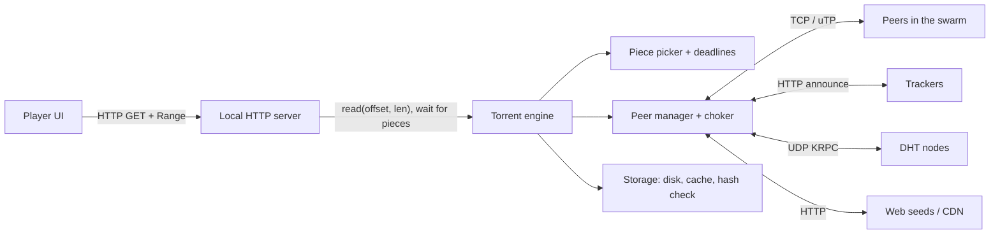
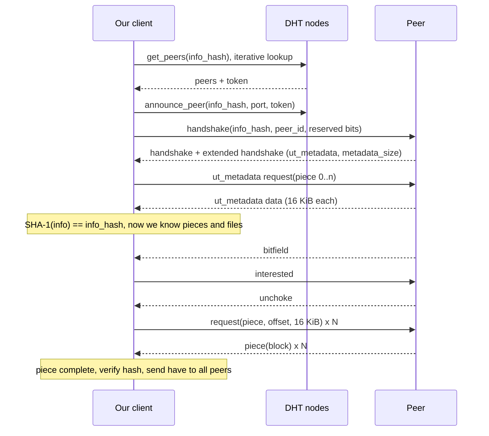
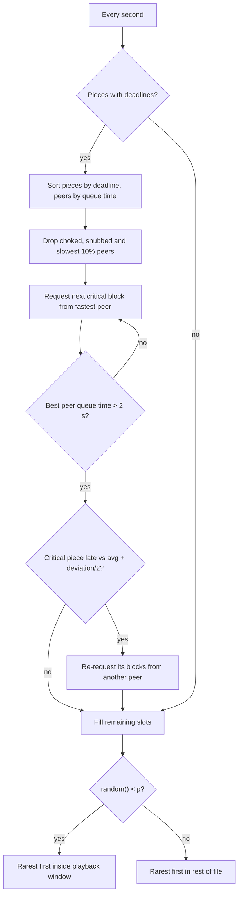
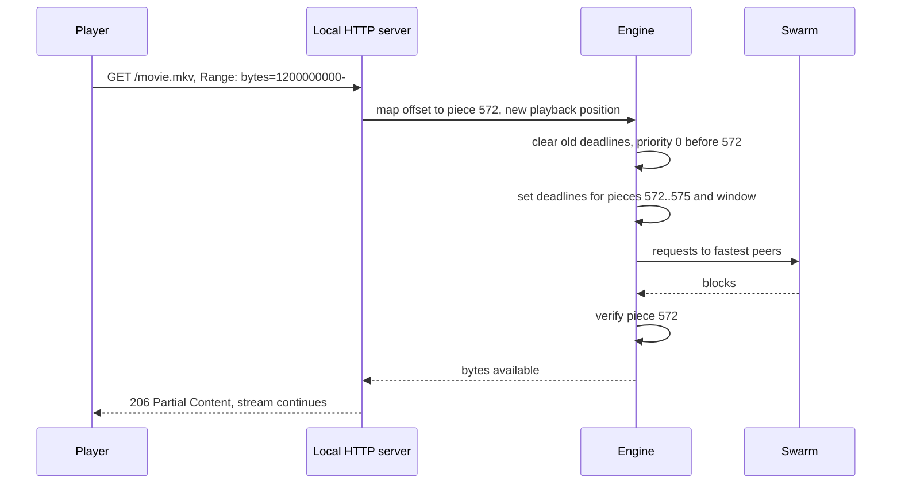
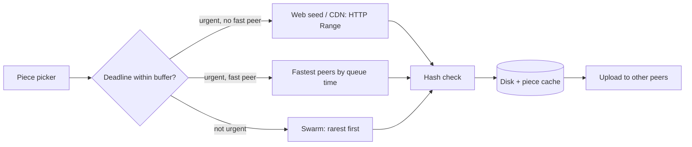

[Русский](./README.md) | **English**

# Chapter 39: Design BitTorrent and a Torrent Streaming Player

## Introduction

In this chapter we design a **BitTorrent client** (the download engine) and a **torrent streaming player** on top of it - an application that starts playing a movie a few seconds after the user opens a magnet link, while the rest of the file is still downloading from other peers.

There are no servers to scale here. The "backend" is a swarm of untrusted peers that come and go, and the design lives inside the client: **discovery** (trackers, DHT, PEX), **integrity** (piece hashes, Merkle trees), **incentives** (choking, tit-for-tat) and **streaming** - the central conflict of the chapter. BitTorrent downloads *whole files* efficiently and deliberately ignores order; a player needs bytes *in playback order* and *before a deadline*.

Compared to [Chapter 14 (YouTube)](../14.%20Youtube/Readme.en.md), the "CDN" is made of viewers. The DHT is a relative of [consistent hashing from Chapter 5](../05.%20Consistent%20Hashing/Readme.en.md): keys and nodes share one ID space, and a key belongs to the "closest" nodes.

---

## Step 1: Understand the Problem and Establish Design Scope

Possible dialogue between Candidate and Interviewer:
 * C: Are we designing the protocol or a client?
 * I: A client compatible with the existing BitTorrent network, plus a player that can watch video while it downloads.
 * C: What is the input - a `.torrent` file or a magnet link?
 * I: Both. Magnet links are more common.
 * C: What content do we optimize for?
 * I: Movies and TV episodes: a single large video file, often inside a multi-file torrent with subtitles and extras.
 * C: Must the player support seeking?
 * I: Yes, the user can jump anywhere, and playback should resume within a few seconds.
 * C: Do we control the swarm? Can we add servers?
 * I: Mostly no - it's a public swarm. But let's discuss what changes if the content owner can provide an HTTP server.
 * C: Which platforms? And may the client be less "fair" to the swarm than a normal one?
 * I: Desktop first, then a browser version. And no - stay a good citizen: keep uploading.

### **Functional requirements**

 * Add a torrent by `.torrent` file or magnet link; fetch metadata from peers when needed
 * Find peers via trackers, DHT and peer exchange; download and upload pieces
 * Verify every piece before using or sharing it
 * Select which files to download (e.g. only the video file)
 * Stream: start playback before the download completes, support seeking
 * Pause/resume across application restarts; rate limits for upload and download

### **Non-functional requirements**

- **Time to first frame**: a few seconds on a healthy swarm
- **Low rebuffering**: stalls during playback should be rare
- **Integrity**: corrupted or malicious data must never reach the player or other peers
- **Good swarm citizenship**: keep contributing upload; don't starve rare pieces
- **Network friendliness**: don't make the user's other traffic (calls, games, browsing) laggy
- **Resource limits**: bounded memory and disk I/O on a laptop

### **Back-of-the-envelope estimation**

All numbers below are **assumptions** for this exercise, not measurements:
 * Movie: 2 GiB file, 90 minutes long
 * **Average bitrate** = 2 GiB × 8 / 5,400 s ≈ 2.15 × 10^9 × 8 / 5,400 ≈ 3.2 Mbit/s ≈ **400 KB/s**
 * Piece size: 2 MiB → **pieces** = 2 GiB / 2 MiB = **1,024**
 * **v1 hash list** = 1,024 × 20 bytes = 20 KB inside the metadata
 * Blocks per piece = 2 MiB / 16 KiB = **128 requests** per piece
 * **Playback time per piece** = 2 MiB / 400 KB/s ≈ 2,100 KB / 400 KB/s ≈ **5.2 s**
 * User's download bandwidth: 20 Mbit/s = 2.5 MB/s → download is 2.5 / 0.4 ≈ **6x faster than playback**. The headroom is what lets us both stream and help the swarm.
 * **Initial buffer**: 10 s of video ≈ 4 MB ≈ 2 pieces, plus 1 piece from the end of the file (container metadata, see deep dive) = 3 pieces ≈ 6 MiB. At 2.5 MB/s that is ≈ **2.5 s** of transfer, plus time to find peers and fetch metadata.
 * **Requests in flight**: to keep a 2.5 MB/s pipe full with a 100 ms RTT we need 2.5 MB/s × 0.1 s = 250 KB outstanding ≈ 250 / 16 ≈ **16 blocks** spread across peers.
 * **Per-peer state**: a bitfield of 1,024 bits = 128 bytes. With 50 connected peers, availability tracking is tiny; memory is dominated by socket and disk buffers.
 * **Upload**: assume 5 Mbit/s ≈ 625 KB/s uplink. Spending it all on BitTorrent would saturate the uplink and hurt other applications - hence delay-based congestion control (uTP/LEDBAT).

---

## Step 2: Propose High-Level Design and Get Buy-In

### **High-level design**



 * **Torrent engine** (e.g. built on libtorrent) - connections, piece selection, choking, storage, verification.
 * **Local HTTP server** - exposes the file as `http://127.0.0.1:<port>/<torrent>/<file>`. A read of a range that isn't downloaded yet **blocks** until the engine gets those pieces.
 * **Player** - any media player; it knows nothing about BitTorrent and just issues HTTP Range requests. Ivan Zderadicka's write-up describes exactly this: a libtorrent-based client plus an HTTP server streaming to mplayer or VLC.

### **Protocol basics**

**Metainfo and info-hash.** The `info` dictionary holds file names, lengths, `piece length` and `pieces` - concatenated 20-byte SHA-1 hashes, one per piece. The **info-hash** is "the 20 byte sha1 hash of the bencoded form of the info value" (BEP 3); it identifies the swarm in trackers, the DHT and handshakes. Since piece hashes are inside `info`, the info-hash alone lets us verify the whole file.

**Pieces and blocks.** Pieces have a fixed size (Cohen: "typically a quarter megabyte"; BEP 3: usually a power of two) and are transferred as 16 KiB **blocks** ("All current implementations use 2^14 (16 kiB)"). A piece is announced (`have`) only after its hash is checked.

**Peer wire protocol** (BEP 3). Handshake (`19`, `"BitTorrent protocol"`, 8 reserved bytes, info-hash, peer ID), then messages:

| ID | Message | Purpose |
|---|---|---|
| 0 / 1 | choke / unchoke | Stop / allow uploading to this peer |
| 2 / 3 | interested / not interested | "You have something I want" |
| 4 | have | I just completed piece *i* |
| 5 | bitfield | Everything I have, sent after the handshake |
| 6 | request | Give me block (piece, offset, length) |
| 7 | piece | Block data |
| 8 | cancel | Never mind that request |
| 20 | extended | BEP 10 extension messages (metadata, PEX, ...) |

**Peer discovery:**
 * **Trackers** - HTTP: announce info-hash, port and `event` (`started`, `completed`, `stopped` or empty), get peers back. The standard tracker returns "a random list of peers", because random graphs are robust (Cohen).
 * **DHT** (BEP 5) - a Kademlia-based "distributed sloppy hash table" over UDP: 160-bit node IDs, distance `A XOR B`, `get_peers` / `announce_peer` at the nodes closest to the info-hash.
 * **PEX** (BEP 11) - connected peers tell each other whom they are connected to.

**Magnet links** carry only the info-hash: `magnet:?xt=urn:btih:<info-hash>&dn=<name>&tr=<tracker>` (only `xt` is required). The client finds peers, downloads the `info` dictionary **from them** via the metadata extension (BEP 9) over the extension protocol (BEP 10), and checks its SHA-1 against the info-hash.



### **Engine API**

The player-facing API is intentionally small:

```
add_torrent(magnet | torrent_file, save_path) -> torrent_id
list_files(torrent_id) -> [ {index, path, size} ]
set_file_priority(torrent_id, file_index, priority)     // 0 = skip
open_stream(torrent_id, file_index) -> http_url
read(torrent_id, file_index, offset, length) -> bytes    // blocks until available
set_piece_deadline(torrent_id, piece, deadline_ms)
status(torrent_id) -> {progress, rates, peers, buffered_ranges}
save_resume_data(torrent_id)
```

`read` and `set_piece_deadline` are what make streaming possible; the rest is a normal client.

### **Data model**

```
Torrent {
    info_hash:        20 bytes (v1) / 32 bytes (v2)
    piece_length:     int
    files:            [ {path, length, offset_in_torrent, priority} ]
    piece_hashes:     [20-byte SHA-1]              // or Merkle roots in v2
    have:             bitfield[num_pieces]
    piece_state:      [ none | downloading{blocks_bitmap} | have ]
    availability:     int[num_pieces]              // how many peers have each piece
    deadlines:        min-heap of (deadline, piece)
}
Peer {
    endpoint, peer_id, client_version
    bitfield, am_choking, am_interested, peer_choking, peer_interested
    download_rate, upload_rate, outstanding_requests, last_piece_time
    hashfails, source (tracker | dht | pex | incoming)
}
ResumeData { info_hash, have bitfield, partial pieces, file priorities, peers }
```

---

## Step 3: Design Deep Dive

### **DHT in more detail**

 * Routing table buckets cover 0..2^160 and hold up to **K = 8** nodes each; a node is "good" if it responded within 15 minutes.
 * Lookups are iterative - ask the closest known nodes, get closer ones back - so they take O(log N) steps.
 * `get_peers` returns peers or closer nodes plus a **token** that `announce_peer` must present. BEP 5 suggests SHA-1 of the requester's IP and a secret rotated every 5 minutes, accepting tokens up to 10 minutes old, so nobody can announce someone else's IP.
 * Compact encoding: a peer is 6 bytes (IPv4 + port), a node 26 bytes (ID + peer).

**PEX** sends `added` / `dropped` lists at most once a minute, with at most 50 added entries after the first message. BEP 11 says PEX data "should be considered untrusted and potentially malicious", so mix peer sources.

### **Piece selection and incentives**

Cohen's 2003 paper describes the classic algorithm:
 * **Strict priority** - once a block of a piece is requested, finish that piece first, so it can be verified and shared.
 * **Rarest first** - download the piece the fewest of your peers have. Rare pieces survive the seed leaving, and you stay useful to others.
 * **Random first piece** - a newcomer has nothing to trade, so it grabs a random (likely well-replicated) piece first.
 * **Endgame mode** - when all remaining blocks are requested, request them from *all* peers and `cancel` duplicates, so one slow peer can't delay completion.
 * **Pipelining** - keep several requests queued per connection ("typically five").

**Choking** decides whom we upload to - a variant of **tit-for-tat**:
 * Unchoke a fixed number of peers (default **four**) that give us the best download rate, as a rolling **20-second** average; recalculate every **10 seconds**.
 * One **optimistic unchoke**, rotated every **30 seconds**, bootstraps newcomers and discovers better partners.
 * **Anti-snubbing**: a peer that sent us nothing for over a minute gets uploads only as an optimistic unchoke.
 * **Seeding**: with no download rate to reciprocate, prefer peers we can upload to fastest.

**Critique.** The incentives are weaker than they look:
 * **BitTyrant** (Piatek et al., NSDI 2007) found "significant altruism" in real swarms: high-capacity peers give low-capacity peers an unfair share. A client that picks peers and rates "to maximize download per unit of upload bandwidth" got a **median 70% performance gain** for a 1 Mbit/s client, with no protocol change.
 * **"BitTorrent is an Auction"** (Levin et al., SIGCOMM 2008) argues that unchoking is an auction rather than tit-for-tat, that peers have an incentive to under-report their pieces, and proposes **PropShare** - proportional shares of bandwidth.

Lesson for our player: the swarm relies on some altruism, and a streaming client that only takes is a free rider. We keep a normal choker and keep seeding.

### **Transport: TCP and uTP**

Many parallel TCP connections fill the home router's buffer with seconds of queued data (bufferbloat), ruining latency for everything else.
 * **uTP** (BEP 29) runs over UDP with **delay-based congestion control** (LEDBAT). Packets carry microsecond timestamps, the receiver reports one-way delay, and the sender adjusts its window to keep extra queuing delay near a **100 ms target**: full speed on an idle link, backing off as soon as other traffic builds a queue.
 * We support both TCP and uTP, prefer uTP, and still apply user **rate limits** (token buckets).

**NAT traversal.** Most home users are behind NAT, so incoming connections fail by default:
 * **UPnP / NAT-PMP** port mapping on the router, when available.
 * **Holepunch** (BEP 55): peer A sends a `rendezvous` to relay R, which is connected to target B; R sends `connect` messages to both, and both open a uTP connection to each other. Errors: `NoSuchPeer`, `NotConnected`, `NoSupport`, `NoSelf`.

### **BitTorrent v2 and Merkle trees**

v1 hashes whole pieces with SHA-1. BEP 52 (v2) changes this:
 * **SHA-256** Merkle tree **per file** with **16 KiB leaves**; each file has a `pieces root`. Pieces are aligned to file boundaries, and piece length must be a power of two, at least 16 KiB.
 * The metadata stores only "piece layers" of the trees; peers exchange missing hashes via new messages `hash request` (21), `hashes` (22) and `hash reject` (23).
 * The v2 info-hash is 32 bytes (SHA-256), truncated to 20 bytes for trackers and DHT. **Hybrid torrents** carry both v1 and v2 metadata.

Why it matters for streaming: with v1, a 2 MiB piece is useless until all 128 blocks arrive and are hashed. A Merkle tree lets the client verify **individual 16 KiB blocks**, identify the peer that sent a bad block, and serve verified data sooner.

### **Streaming: the central conflict**

Rarest first is good for the swarm. A player needs **piece *k* before piece *k+1***, before a deadline. Pure sequential download makes all streaming peers want the same pieces at once, reduces piece diversity and leaves the peer with little to trade. Design options:

**1. BiToS (Vlavianos, Iliofotou, Faloutsos, 2006).** Split the pieces the peer still needs into:
 * **High Priority Set** - pieces not yet downloaded, not missed, close to the playback point; a fixed-size window.
 * **Remaining Pieces Set** - everything else not downloaded and not missed.
 * Pieces that can no longer meet their playback deadline are marked **Missed**.

With probability **p** pick from the High Priority Set, with **1 − p** from the rest; inside each set use rarest first. When a high-priority piece completes, the next piece in sequence joins the set. The simulation (4 seeders, 400 peers in a flash crowd, a 10-minute 500 Kbit/s video) compared sequential-in-window with p = 1, rarest-first with p = 1 and rarest-first with p = 0.8. Conclusions: sliding windows work, the best window is **5-10% of the file size**, and rarest first inside the window beats sequential "by a wide margin". p < 1 gives the peer less common pieces to trade later.

Erman's work on streaming BitTorrent makes the same point: piece selection must weigh both a piece's availability and its usefulness for playback. It also proposes protocol additions: `nohave` for devices with limited storage (e.g. set-top boxes) that evict pieces, and `range have` / `range request` to cut signaling overhead.

**2. Deadlines - libtorrent `set_piece_deadline`.** libtorrent contrasts **sequential download** (request pieces in order, keep queues full - simple, but a slow peer holding the next piece stalls playback) with **time-critical pieces**: "active management of peer request queues, such that the most time-critical pieces occupy the 'best' queue slots". It asks "which peer can deliver this piece fastest?" instead of "which block should this peer give me?":
 * Deadline pieces are sorted by deadline, earliest first.
 * Peers are sorted by **estimated download queue time** = outstanding bytes / download rate. Choked, uninteresting, snubbed, disconnecting and "on parole" peers are excluded, and **the 10% slowest peers are ignored**.
 * Blocks go to the top peers; the loop stops when the best peer's queue time exceeds **2 seconds**. It runs once per second.
 * **Timeouts**: a critical piece slower than the average piece download time plus half the average deviation gets its blocks **double-requested** from other peers, more aggressively on repeated timeouts.



Our player combines both: **deadlines** for the next seconds (hard), a **BiToS-style window** with rarest first for the next minutes (soft), and plain rarest first with leftover bandwidth. With ~6x headroom, most bandwidth goes to the swarm-friendly part.

**Deadline assignment**: `deadline(i) = now + (offset(i) − playback_offset) / bitrate`, with bitrate ≈ size / duration and the position taken from the HTTP server's read offset. Pieces behind the position and unselected files get priority 0.

### **Startup and container metadata**

 * **Initial buffer.** Zderadicka's player starts after about **1% of the file** is cached: 1% of 2 GiB ≈ 21 MB ≈ 50 s of video. Our 10 s buffer starts faster but stalls more on a weak swarm, so the threshold can adapt to the measured rate.
 * **Tail of the file.** Players may need metadata at the end - e.g. an MP4 index (`moov` atom) - before the first frame. Zderadicka's client "get[s] tail of the file at beginning", so we set deadlines for the first **and** last pieces.
 * There, the current position plus the next **5 pieces** get the highest priority (libtorrent priorities are 0-7) and deadlines.

### **Seeking**



 * A seek is an HTTP **Range** request answered with `206 Partial Content`; piece = `(file_offset_in_torrent + offset) / piece_length`.
 * The engine **recomputes deadlines** and may cancel outstanding requests far from the new position. Pieces already on disk stay, so seeking back is free.
 * Reads block but are bounded: after, say, 30 s (assumption) return an error instead of hanging the player.

**Why an HTTP server** rather than a custom demuxer? Every player supports HTTP Range requests, so seeking, codecs and subtitles come for free, and the player (VLC, mpv, a browser `<video>`, a TV) can be swapped without touching the engine. The price is an extra copy through localhost.

### **WebTorrent: streaming in the browser**

Browsers cannot open raw TCP or UDP sockets. WebTorrent keeps the BitTorrent wire protocol but uses **WebRTC data channels** as the transport. WebRTC needs signaling, so "we made a few changes to the tracker protocol": browser clients use **WebSocket** trackers (`wss://...`).
 * Browser peers can connect only to WebRTC-capable peers, not to ordinary TCP/uTP seeders.
 * **Hybrid clients** (`webtorrent-hybrid`, WebTorrent Desktop) speak both and bridge the networks.
 * Browser streaming uses the `MediaSource` API; `.mp4`, `.m4v` and `.m4a` get full seeking support.

### **Hybrid P2P + CDN**

If the content owner can run servers, mixing HTTP with the swarm gives the best of both.

**BASS** (Dana, Li, Harrison, Chuah, MMSP 2005): the client downloads pieces **sequentially from a media server**, skipping pieces BitTorrent already has, while standard BitTorrent fetches the part **after the playback position**. In trace-driven simulations (Fedora Core 3 traces), average server bandwidth dropped by up to **34%** vs a pure server, and average client waiting time by **27%** vs a pure server and **10%** vs pure BitTorrent (as summarized by Erman).

**Web seeds** (BEP 19): the metainfo has a `url-list`, and "the HTTP or FTP server acts as a permanently unchoked seed". BEP 19 advises picking pieces that keep large contiguous gaps for HTTP, and discarding a URL whose data fails the hash check.



Policy: urgent pieces go to fast peers, falling back to the CDN when the swarm can't meet the deadline; the rest comes from the swarm. The CDN absorbs start-up and seek bursts; the swarm carries the steady state, where most bytes are.

### **Storage and reliability**

 * **Disk layout.** A torrent is one byte space mapped onto files; a piece may span two files. Pre-allocating (or sparse) files avoid fragmentation and "disk full" in the middle of a movie.
 * **Piece cache.** Out-of-order blocks are buffered in memory until the piece completes, hashed on a worker pool, then written at once. Recently played or uploaded pieces stay in a read cache.
 * **Resume data.** Periodically and on shutdown save the `have` bitfield, partial pieces, priorities and peers, so a restart doesn't re-hash 2 GiB; fall back to a full recheck if files changed.
 * **Poisoned pieces.** With v1 a hash failure only says that *some* block is bad. Track which peers contributed, count their `hashfails`, re-download the piece (preferably from one peer) and ban repeat offenders. With v2 the Merkle tree pinpoints the bad block and peer.
 * **Never serve unverified data** to the player or to other peers.

### **Security and privacy**

 * **IP addresses are public.** A client must connect to peers and announce itself to trackers and the DHT, so every participant can see its IP and which info-hashes it is in. This is inherent to the design.
 * **Protocol encryption (MSE/PE)** uses a Diffie-Hellman key exchange and RC4. It is **obfuscation** against traffic shaping, not privacy: it doesn't hide IPs, and traffic analysis can still identify it.
 * **Untrusted input**: parse bencoded metadata, DHT and PEX messages defensively with size limits.
 * **Local HTTP server**: bind to `127.0.0.1` with unguessable URLs so other devices and web pages can't read files through it.

---

## Step 4: Wrap Up

We designed a BitTorrent engine and a streaming player: magnet link → DHT/tracker discovery → metadata from peers → hash-verified pieces, with choking for incentives and uTP for network friendliness. Streaming uses a **three-tier piece picker** - hard deadlines for the next seconds, a BiToS-style window for the next minutes, rarest first for the rest - exposed to any player through a **local HTTP server** with Range requests.

Additional talking points:
- **Live streaming**: pieces don't exist in advance, so their hashes can't be in the metainfo.
- **Mobile**: battery and metered networks - no seeding on cellular.
- **Metrics**: time to first frame, rebuffering, CDN vs swarm bytes, hash failures, upload ratio.
- **Piece size**: larger pieces mean smaller metadata but longer waits before a piece is verified; v2 Merkle trees ease this.

---

## References

 * [Bram Cohen, "Incentives Build Robustness in BitTorrent" (2003)](https://bittorrent.org/bittorrentecon.pdf)
 * [BEP 0: Index of BitTorrent Enhancement Proposals](https://www.bittorrent.org/beps/bep_0000.html)
 * [BEP 3: The BitTorrent Protocol Specification](https://www.bittorrent.org/beps/bep_0003.html)
 * [BEP 5: DHT Protocol](https://www.bittorrent.org/beps/bep_0005.html)
 * [BEP 9: Extension for Peers to Send Metadata Files](https://www.bittorrent.org/beps/bep_0009.html)
 * [BEP 10: Extension Protocol](https://www.bittorrent.org/beps/bep_0010.html)
 * [BEP 11: Peer Exchange (PEX)](https://www.bittorrent.org/beps/bep_0011.html)
 * [BEP 19: WebSeed - HTTP/FTP Seeding (GetRight style)](https://www.bittorrent.org/beps/bep_0019.html)
 * [BEP 29: uTorrent transport protocol](https://www.bittorrent.org/beps/bep_0029.html)
 * [BEP 52: The BitTorrent Protocol Specification v2](https://www.bittorrent.org/beps/bep_0052.html)
 * [BEP 55: Holepunch extension](https://www.bittorrent.org/beps/bep_0055.html)
 * [libtorrent: Streaming implementation](http://libtorrent.org/streaming.html)
 * [Ivan Zderadicka, "Streaming video file from BitTorrent P2P network"](https://zderadicka.eu/streaming-video-file-from-bittorrent-p2p-network/)
 * [WebTorrent FAQ](https://webtorrent.io/faq)
 * [Vlavianos, Iliofotou, Faloutsos, "BiToS: Enhancing BitTorrent for Supporting Streaming Applications" (slides)](https://www2.cs.uh.edu/~paris/7360/PowerPoint/BiToS.ppt)
 * [David Erman, "Extending BitTorrent for Streaming Applications" (extended abstract)](https://www.diva-portal.org/smash/get/diva2:837027/FULLTEXT01.pdf)
 * [Dana, Li, Harrison, Chuah, "BASS: BitTorrent Assisted Streaming System for Video-on-Demand" (MMSP 2005)](https://www.researchgate.net/publication/224672019_BASS_BitTorrent_Assisted_Streaming_System_for_Video-on-Demand)
 * [Piatek et al., "Do Incentives Build Robustness in BitTorrent?" (BitTyrant, NSDI 2007)](https://cs.brown.edu/courses/csci2950-g/papers/bittyrant.pdf)
 * [Levin, LaCurts, Spring, Bhattacharjee, "BitTorrent is an Auction" (SIGCOMM 2008)](http://www.cs.umd.edu/projects/propshare/)
 * [Wikipedia: BitTorrent protocol encryption](https://en.wikipedia.org/wiki/BitTorrent_protocol_encryption)
 * [Chapter 5: Consistent Hashing](../05.%20Consistent%20Hashing/Readme.en.md)
 * [Chapter 14: Design YouTube](../14.%20Youtube/Readme.en.md)
