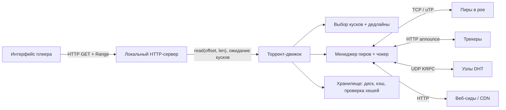
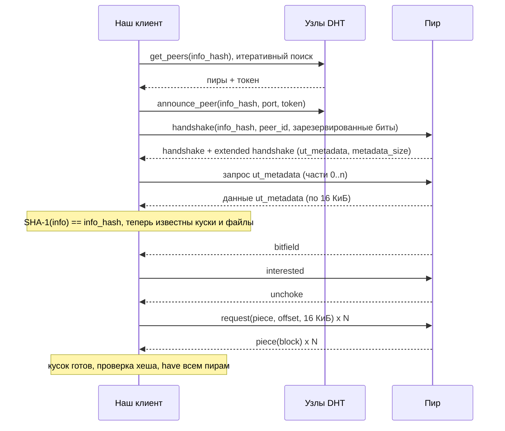
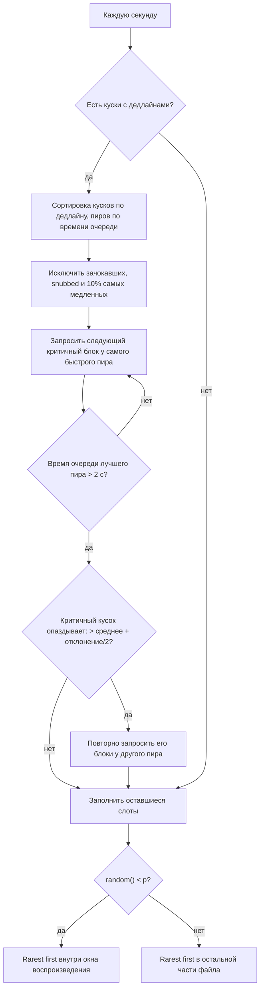
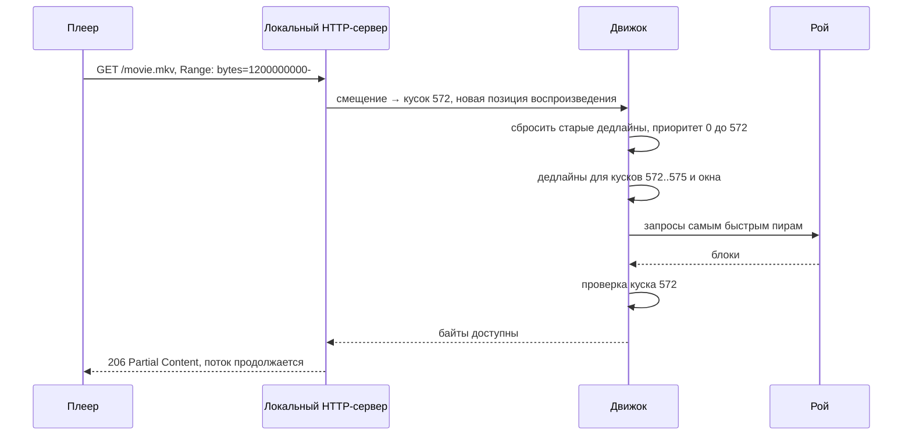
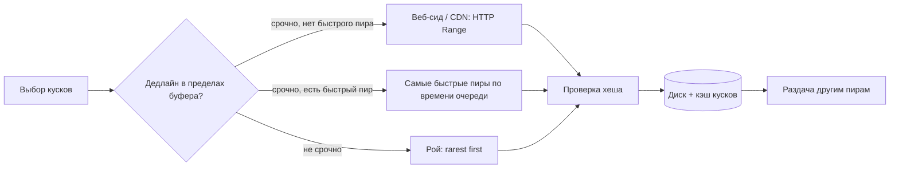

**Русский** | [English](./README.en.md)

# Глава 39: Проектирование BitTorrent и торрент-плеера

## Введение

В этой главе мы спроектируем **BitTorrent-клиент** (движок загрузки) и **торрент-плеер (torrent streaming player)** поверх него — приложение, которое начинает показывать фильм через несколько секунд после открытия magnet-ссылки, пока остальная часть файла ещё скачивается у других пиров (peers).

Масштабировать здесь нечего: серверов нет. «Бэкенд» — это рой (swarm) недоверенных пиров, которые приходят и уходят, а весь дизайн живёт внутри клиента: **обнаружение пиров (discovery)** — трекеры, DHT (Distributed Hash Table — распределённая хеш-таблица), PEX (Peer Exchange — обмен пирами); **целостность (integrity)** — хеши кусков, деревья Меркла; **стимулы (incentives)** — чокинг (choking), «око за око» (tit-for-tat); и **стриминг** — главный конфликт главы. BitTorrent эффективно скачивает *файлы целиком* и намеренно игнорирует порядок, а плееру нужны байты *в порядке воспроизведения* и *до дедлайна*.

По сравнению с [главой 14 (YouTube)](../14.%20Youtube/Readme.md) здесь «CDN» (Content Delivery Network — сеть доставки контента) состоит из самих зрителей. DHT — родственник [консистентного хеширования из главы 5](../05.%20Consistent%20Hashing/Readme.md): ключи и узлы живут в одном пространстве идентификаторов, и ключ принадлежит «ближайшим» узлам.

---

## Шаг 1: Понять задачу и определить рамки проектирования

Возможный диалог между кандидатом (К) и интервьюером (И):
 * К: Мы проектируем протокол или клиент?
 * И: Клиент, совместимый с существующей сетью BitTorrent, плюс плеер, который позволяет смотреть видео во время загрузки.
 * К: Что на входе — файл `.torrent` или magnet-ссылка?
 * И: И то и другое. Magnet-ссылки встречаются чаще.
 * К: Под какой контент оптимизируем?
 * И: Фильмы и серии: один большой видеофайл, часто внутри многофайлового торрента с субтитрами и дополнительными материалами.
 * К: Должен ли плеер поддерживать перемотку?
 * И: Да, пользователь может перейти в любое место, и воспроизведение должно продолжиться через несколько секунд.
 * К: Контролируем ли мы рой? Можно ли добавить серверы?
 * И: В основном нет — это публичный рой. Но давайте обсудим, что изменится, если правообладатель может предоставить HTTP-сервер (HyperText Transfer Protocol — протокол передачи гипертекста).
 * К: Какие платформы? И может ли клиент быть менее «честным» по отношению к рою, чем обычный?
 * И: Сначала десктоп, потом версия для браузера. И нет — нужно оставаться добросовестным участником и продолжать раздавать.

### **Функциональные требования**

 * Добавление торрента по файлу `.torrent` или magnet-ссылке; получение метаданных у пиров, когда нужно
 * Поиск пиров через трекеры, DHT и обмен пирами; загрузка и раздача кусков
 * Проверка каждого куска перед использованием или раздачей
 * Выбор файлов для загрузки (например, только видеофайл)
 * Стриминг: начать воспроизведение до окончания загрузки, поддержка перемотки
 * Пауза и возобновление после перезапуска приложения; ограничение скорости загрузки и раздачи

### **Нефункциональные требования**

- **Время до первого кадра (time to first frame)**: несколько секунд на здоровом рое
- **Редкая буферизация**: остановки во время просмотра должны быть редкими
- **Целостность**: повреждённые или вредоносные данные никогда не должны попасть в плеер или к другим пирам
- **Добросовестность в рое**: продолжать раздавать; не «морить голодом» редкие куски
- **Бережное отношение к сети**: не делать остальной трафик пользователя (звонки, игры, браузер) медленным
- **Ограниченные ресурсы**: разумное потребление памяти и дискового ввода-вывода на ноутбуке

### **Оценка «на салфетке» (back-of-the-envelope)**

Все числа ниже — **допущения** для этого упражнения, а не измерения:
 * Фильм: файл 2 ГиБ, длительность 90 минут
 * **Средний битрейт** = 2 ГиБ × 8 / 5 400 с ≈ 2,15 × 10^9 × 8 / 5 400 ≈ 3,2 Мбит/с ≈ **400 КБ/с**
 * Размер куска: 2 МиБ → **кусков** = 2 ГиБ / 2 МиБ = **1 024**
 * **Список хешей v1** = 1 024 × 20 байт = 20 КБ в метаданных
 * Блоков на кусок = 2 МиБ / 16 КиБ = **128 запросов** на кусок
 * **Время воспроизведения одного куска** = 2 МиБ / 400 КБ/с ≈ 2 100 КБ / 400 КБ/с ≈ **5,2 с**
 * Входящий канал пользователя: 20 Мбит/с = 2,5 МБ/с → загрузка в 2,5 / 0,4 ≈ **6 раз быстрее воспроизведения**. Этот запас позволяет и смотреть, и помогать рою.
 * **Начальный буфер**: 10 с видео ≈ 4 МБ ≈ 2 куска, плюс 1 кусок из конца файла (метаданные контейнера, см. подробный разбор) = 3 куска ≈ 6 МиБ. При 2,5 МБ/с это ≈ **2,5 с** передачи плюс время на поиск пиров и получение метаданных.
 * **Запросов «в полёте»**: чтобы держать канал 2,5 МБ/с заполненным при RTT (Round-Trip Time — время приёма-передачи) 100 мс, нужно 2,5 МБ/с × 0,1 с = 250 КБ неподтверждённых запросов ≈ 250 / 16 ≈ **16 блоков**, распределённых между пирами.
 * **Состояние на пира**: битовое поле (bitfield) из 1 024 бит = 128 байт. При 50 подключённых пирах учёт доступности кусков почти ничего не стоит; память уходит в основном на буферы сокетов и диска.
 * **Раздача**: допустим, исходящий канал 5 Мбит/с ≈ 625 КБ/с. Если отдать его целиком BitTorrent, канал забьётся и остальные приложения начнут тормозить — отсюда управление перегрузкой на основе задержки (uTP/LEDBAT).

---

## Шаг 2: Предложить высокоуровневый дизайн и получить одобрение

### **Высокоуровневый дизайн**



 * **Торрент-движок** (например, на базе libtorrent) — соединения, выбор кусков, чокинг, хранилище, проверка.
 * **Локальный HTTP-сервер** — отдаёт файл по адресу `http://127.0.0.1:<port>/<torrent>/<file>`. Чтение диапазона, который ещё не скачан, **блокируется**, пока движок не получит нужные куски.
 * **Плеер** — любой медиаплеер; он ничего не знает о BitTorrent и просто отправляет HTTP-запросы с заголовком Range. Именно такую схему описывает Иван Здерадичка (Ivan Zderadicka): клиент на libtorrent плюс HTTP-сервер, который стримит в mplayer или VLC.

### **Основы протокола**

**Метаинформация и info-hash.** Словарь `info` содержит имена и размеры файлов, `piece length` и `pieces` — склеенные 20-байтовые хеши SHA-1 (Secure Hash Algorithm 1), по одному на кусок. **Info-hash** — это «20-байтовый хеш SHA-1 от bencode-представления значения info» (BEP 3; BEP — BitTorrent Enhancement Proposal, предложение по улучшению BitTorrent). Он идентифицирует рой в трекерах, DHT и рукопожатиях. Поскольку хеши кусков лежат внутри `info`, одного info-hash достаточно, чтобы проверить весь файл.

**Куски и блоки.** Куски (pieces) имеют фиксированный размер (Коэн: «обычно четверть мегабайта»; BEP 3: обычно степень двойки) и передаются **блоками (blocks)** по 16 КиБ («все текущие реализации используют 2^14 (16 КиБ)»). О куске сообщают (`have`) только после проверки его хеша.

**Протокол обмена между пирами (peer wire protocol)** (BEP 3). Рукопожатие (`19`, `"BitTorrent protocol"`, 8 зарезервированных байт, info-hash, ID пира), затем сообщения:

| ID | Сообщение | Назначение |
|---|---|---|
| 0 / 1 | choke / unchoke | Прекратить / разрешить раздачу этому пиру |
| 2 / 3 | interested / not interested | «У тебя есть то, что мне нужно» |
| 4 | have | Я только что докачал кусок *i* |
| 5 | bitfield | Всё, что у меня есть; отправляется после рукопожатия |
| 6 | request | Дай мне блок (кусок, смещение, длина) |
| 7 | piece | Данные блока |
| 8 | cancel | Отменить запрос |
| 20 | extended | Сообщения расширений BEP 10 (метаданные, PEX, ...) |

**Обнаружение пиров:**
 * **Трекеры** — HTTP: клиент сообщает (announce) info-hash, порт и `event` (`started`, `completed`, `stopped` или пусто) и получает список пиров. Стандартный трекер возвращает «случайный список пиров», потому что случайные графы устойчивы (Коэн).
 * **DHT** (BEP 5) — «распределённая нестрогая хеш-таблица» (distributed sloppy hash table) на основе Kademlia поверх UDP (User Datagram Protocol — протокол пользовательских датаграмм): 160-битные ID узлов, расстояние `A XOR B`, операции `get_peers` / `announce_peer` на узлах, ближайших к info-hash.
 * **PEX** (BEP 11) — подключённые пиры сообщают друг другу, с кем они соединены.

**Magnet-ссылки** содержат только info-hash: `magnet:?xt=urn:btih:<info-hash>&dn=<name>&tr=<tracker>` (обязателен только `xt`). Клиент находит пиров, скачивает у **них** словарь `info` через расширение метаданных (BEP 9) поверх протокола расширений (BEP 10) и сверяет его SHA-1 с info-hash.



### **API движка**

API (Application Programming Interface — программный интерфейс) для плеера намеренно маленький:

```
add_torrent(magnet | torrent_file, save_path) -> torrent_id
list_files(torrent_id) -> [ {index, path, size} ]
set_file_priority(torrent_id, file_index, priority)     // 0 = пропустить
open_stream(torrent_id, file_index) -> http_url
read(torrent_id, file_index, offset, length) -> bytes    // блокируется до появления данных
set_piece_deadline(torrent_id, piece, deadline_ms)
status(torrent_id) -> {progress, rates, peers, buffered_ranges}
save_resume_data(torrent_id)
```

Стриминг возможен благодаря `read` и `set_piece_deadline`; остальное — обычный клиент.

### **Модель данных**

```
Torrent {
    info_hash:        20 байт (v1) / 32 байта (v2)
    piece_length:     int
    files:            [ {path, length, offset_in_torrent, priority} ]
    piece_hashes:     [20-байтовый SHA-1]          // или корни Меркла в v2
    have:             bitfield[num_pieces]
    piece_state:      [ none | downloading{blocks_bitmap} | have ]
    availability:     int[num_pieces]              // у скольких пиров есть кусок
    deadlines:        min-куча из (deadline, piece)
}
Peer {
    endpoint, peer_id, client_version
    bitfield, am_choking, am_interested, peer_choking, peer_interested
    download_rate, upload_rate, outstanding_requests, last_piece_time
    hashfails, source (tracker | dht | pex | incoming)
}
ResumeData { info_hash, have bitfield, partial pieces, file priorities, peers }
```

---

## Шаг 3: Углублённый разбор дизайна

### **DHT подробнее**

 * Корзины (buckets) таблицы маршрутизации покрывают диапазон 0..2^160 и хранят до **K = 8** узлов каждая; узел считается «хорошим», если отвечал в последние 15 минут.
 * Поиск итеративный — спрашиваем ближайшие известные узлы, получаем ещё более близкие — поэтому он занимает O(log N) шагов.
 * `get_peers` возвращает пиров или более близкие узлы плюс **токен**, который нужно предъявить в `announce_peer`. BEP 5 предлагает считать его как SHA-1 от IP-адреса (Internet Protocol — межсетевой протокол) запрашивающего и секрета, который меняется каждые 5 минут, принимая токены возрастом до 10 минут, — так никто не сможет зарегистрировать чужой IP-адрес.
 * Компактное кодирование: пир — 6 байт (IPv4 + порт), узел — 26 байт (ID + пир).

**PEX** отправляет списки `added` / `dropped` не чаще раза в минуту, не более 50 добавленных записей (после первого сообщения). BEP 11 предупреждает, что данные PEX «следует считать недоверенными и потенциально вредоносными», поэтому источники пиров нужно смешивать.

### **Выбор кусков и стимулы**

Статья Коэна 2003 года описывает классический алгоритм:
 * **Строгий приоритет (strict priority)** — если запрошен блок куска, сначала докачиваем этот кусок, чтобы его можно было проверить и раздавать.
 * **Сначала редкие (rarest first)** — качаем кусок, который есть у наименьшего числа наших пиров. Редкие куски переживут уход сида, а мы остаёмся полезными другим.
 * **Первый кусок — случайный (random first piece)** — новичку нечем торговать, поэтому он берёт случайный (скорее всего, хорошо реплицированный) кусок.
 * **Режим эндшпиля (endgame mode)** — когда все оставшиеся блоки уже запрошены, запрашиваем их у *всех* пиров и отменяем (`cancel`) дубликаты, чтобы один медленный пир не задержал завершение.
 * **Конвейеризация (pipelining)** — держим несколько запросов в очереди на каждое соединение («обычно пять»).

**Чокинг (choking)** решает, кому мы раздаём, — это вариант стратегии **«око за око» (tit-for-tat)**:
 * Разрешаем раздачу (unchoke) фиксированному числу пиров (по умолчанию **четырём**), которые дают нам лучшую скорость загрузки по скользящему среднему за **20 секунд**; пересчёт — каждые **10 секунд**.
 * Один **оптимистичный unchoke (optimistic unchoke)**, который меняется каждые **30 секунд**, помогает новичкам войти в обмен и находит лучших партнёров.
 * **Защита от игнорирования (anti-snubbing)**: пир, который ничего не присылал больше минуты, получает раздачу только как оптимистичный unchoke.
 * **Раздача после загрузки (seeding)**: отвечать взаимностью уже не на что, поэтому предпочитаем пиров, которым можем отдавать быстрее всего.

**Критика.** Стимулы слабее, чем кажется:
 * **BitTyrant** (Piatek и др., NSDI 2007 — USENIX Symposium on Networked Systems Design and Implementation) обнаружил в реальных роях «значительный альтруизм»: пиры с широким каналом отдают пирам с узким каналом несправедливо большую долю. Клиент, который выбирает пиров и скорости так, чтобы «максимизировать загрузку на единицу пропускной способности раздачи», получил **медианный прирост производительности 70%** для клиента с каналом 1 Мбит/с — без изменения протокола.
 * **«BitTorrent is an Auction»** (Levin и др., SIGCOMM 2008 — конференция ACM Special Interest Group on Data Communication) утверждает, что unchoke — это аукцион, а не «око за око», что у пиров есть стимул занижать число своих кусков, и предлагает **PropShare** — пропорциональные доли пропускной способности.

Вывод для нашего плеера: рой держится в том числе на альтруизме, и стриминговый клиент, который только берёт, — нахлебник (free rider). Мы оставляем обычный чокер и продолжаем раздавать.

### **Транспорт: TCP и uTP**

Много параллельных соединений TCP (Transmission Control Protocol — протокол управления передачей) заполняют буфер домашнего роутера секундами данных в очереди (bufferbloat), и задержка для всего остального резко растёт.
 * **uTP** (uTorrent Transport Protocol, BEP 29) работает поверх UDP с **управлением перегрузкой на основе задержки** — LEDBAT (Low Extra Delay Background Transport — фоновый транспорт с низкой дополнительной задержкой). Пакеты несут временные метки в микросекундах, получатель сообщает одностороннюю задержку, а отправитель подстраивает окно так, чтобы дополнительная задержка в очереди держалась около **целевых 100 мс**: полная скорость на свободном канале и отступление, как только другой трафик создаёт очередь.
 * Поддерживаем и TCP, и uTP, предпочитаем uTP и всё равно применяем пользовательские **ограничения скорости** (token bucket).

**Обход NAT (NAT traversal).** Большинство домашних пользователей находятся за NAT (Network Address Translation — трансляция сетевых адресов), поэтому входящие соединения по умолчанию не проходят:
 * **UPnP / NAT-PMP** (Universal Plug and Play / NAT Port Mapping Protocol) — проброс порта на роутере, если он это поддерживает.
 * **Holepunch** (BEP 55): пир A отправляет `rendezvous` посреднику R, который подключён к целевому пиру B; R отправляет обоим сообщения `connect`, и оба открывают uTP-соединение друг к другу. Ошибки: `NoSuchPeer`, `NotConnected`, `NoSupport`, `NoSelf`.

### **BitTorrent v2 и деревья Меркла**

v1 хеширует куски целиком через SHA-1. BEP 52 (v2) это меняет:
 * **Дерево Меркла (Merkle tree)** на SHA-256 **для каждого файла** с **листьями по 16 КиБ**; у каждого файла есть `pieces root`. Куски выровнены по границам файлов, длина куска — степень двойки, не меньше 16 КиБ.
 * В метаданных хранятся только «слои кусков» (piece layers) деревьев; недостающие хеши пиры передают новыми сообщениями `hash request` (21), `hashes` (22) и `hash reject` (23).
 * Info-hash v2 — 32 байта (SHA-256), для трекеров и DHT он усекается до 20 байт. **Гибридные торренты (hybrid torrents)** несут метаданные и v1, и v2.

Почему это важно для стриминга: в v1 кусок в 2 МиБ бесполезен, пока не пришли все 128 блоков и не проверен хеш. Дерево Меркла позволяет проверять **отдельные блоки по 16 КиБ**, находить пира, приславшего плохой блок, и раньше отдавать проверенные данные.

### **Стриминг: главный конфликт**

Rarest first хорош для роя. Плееру нужен **кусок *k* раньше куска *k+1*** и до дедлайна. Чисто последовательная загрузка (sequential download) заставляет всех смотрящих хотеть одни и те же куски одновременно, снижает разнообразие кусков и оставляет пиру мало чем торговать. Варианты дизайна:

**1. BiToS (Vlavianos, Iliofotou, Faloutsos, 2006).** Куски, которые ещё нужны пиру, делятся на:
 * **Набор высокого приоритета (High Priority Set)** — ещё не скачанные, не пропущенные куски рядом с точкой воспроизведения; окно фиксированного размера.
 * **Набор остальных кусков (Remaining Pieces Set)** — всё остальное, что не скачано и не пропущено.
 * Куски, которые уже не успевают к своему дедлайну воспроизведения, помечаются как **пропущенные (Missed)**.

С вероятностью **p** выбираем из набора высокого приоритета, с вероятностью **1 − p** — из остальных; внутри каждого набора — rarest first. Когда кусок высокого приоритета скачан, в набор входит следующий по порядку. В симуляции (4 сида, 400 пиров, пришедших лавиной (flash crowd), 10-минутное видео 500 Кбит/с) сравнивались последовательный порядок в окне при p = 1, rarest first при p = 1 и rarest first при p = 0,8. Выводы: скользящие окна работают, лучший размер окна — **5–10% размера файла**, а rarest first внутри окна превосходит последовательный порядок «с большим отрывом». p < 1 даёт пиру менее распространённые куски, которыми потом можно торговать.

Работа Эрмана (Erman) о стриминговом BitTorrent говорит о том же: выбор куска должен учитывать и его доступность, и его полезность для воспроизведения. Там же предлагаются дополнения протокола: `nohave` для устройств с ограниченной памятью (например, ТВ-приставок), которые выбрасывают куски, и `range have` / `range request`, чтобы сократить служебный трафик.

**2. Дедлайны — `set_piece_deadline` в libtorrent.** libtorrent противопоставляет **последовательную загрузку** (запрашивать куски по порядку и держать очереди заполненными — просто, но медленный пир со следующим куском останавливает воспроизведение) и **критичные по времени куски (time-critical pieces)**: «активное управление очередями запросов к пирам, чтобы самые критичные по времени куски занимали „лучшие“ места в очередях». Вопрос ставится как «какой пир быстрее всех доставит этот кусок?», а не «какой блок попросить у этого пира?»:
 * Куски с дедлайнами сортируются по дедлайну, ранние первыми.
 * Пиры сортируются по **оценке времени очереди загрузки** = неполученные байты / скорость загрузки. Исключаются пиры, которые нас «зачокали», неинтересные, игнорирующие нас (snubbed), отключающиеся и находящиеся «на испытательном сроке» (on parole), а **10% самых медленных пиров игнорируются**.
 * Блоки отправляются лучшим пирам; цикл останавливается, когда время очереди лучшего пира превышает **2 секунды**. Функция запускается раз в секунду.
 * **Таймауты**: если критичный кусок качается дольше, чем среднее время загрузки куска плюс половина среднего отклонения, его блоки **запрашиваются повторно** у других пиров, а при повторных таймаутах — ещё агрессивнее.



Наш плеер сочетает оба подхода: **дедлайны** для ближайших секунд (жёстко), **окно в стиле BiToS** с rarest first для ближайших минут (мягко) и обычный rarest first на оставшуюся пропускную способность. При шестикратном запасе большая часть канала уходит на полезную для роя часть.

**Назначение дедлайнов**: `deadline(i) = now + (offset(i) − playback_offset) / bitrate`, где bitrate ≈ размер / длительность, а позиция берётся из смещения чтения в HTTP-сервере. Куски позади текущей позиции и невыбранные файлы получают приоритет 0.

### **Запуск и метаданные контейнера**

 * **Начальный буфер.** Плеер Здерадички начинает воспроизведение, когда закэширован примерно **1% файла**: 1% от 2 ГиБ ≈ 21 МБ ≈ 50 с видео. Наш буфер в 10 с стартует быстрее, но чаще останавливается на слабом рое, поэтому порог можно подстраивать под измеренную скорость.
 * **Конец файла.** Плееру могут понадобиться метаданные в конце файла — например, индекс MP4 (MPEG-4 Part 14, контейнерный формат) — атом `moov` — ещё до первого кадра. Клиент Здерадички «получает конец файла в самом начале», поэтому мы ставим дедлайны и на первые, **и** на последние куски.
 * Там же текущая позиция и следующие **5 кусков** получают наивысший приоритет (приоритеты libtorrent — от 0 до 7) и дедлайны.

### **Перемотка**



 * Перемотка — это HTTP-запрос с заголовком **Range**, на который сервер отвечает `206 Partial Content`; кусок = `(file_offset_in_torrent + offset) / piece_length`.
 * Движок **пересчитывает дедлайны** и может отменить запросы к кускам, далёким от новой позиции. Уже скачанные куски остаются на диске, так что перемотка назад бесплатна.
 * Чтение блокируется, но с ограничением: например, через 30 с (допущение) вернуть ошибку, а не подвешивать плеер.

**Почему HTTP-сервер**, а не собственный демультиплексор? Любой плеер умеет HTTP-запросы с Range, поэтому перемотка, кодеки и субтитры достаются бесплатно, а плеер (VLC, mpv, `<video>` в браузере, телевизор) можно заменить, не трогая движок. Цена — лишнее копирование через localhost.

### **WebTorrent: стриминг в браузере**

Браузер не может открывать «сырые» TCP- или UDP-сокеты. WebTorrent сохраняет протокол обмена BitTorrent, но использует в качестве транспорта **каналы данных WebRTC (WebRTC data channels)**; WebRTC — Web Real-Time Communication, веб-коммуникации в реальном времени. WebRTC нужна сигнализация, поэтому «мы внесли несколько изменений в протокол трекера»: браузерные клиенты используют трекеры по **WebSocket** (`wss://...`).
 * Браузерные пиры могут подключаться только к пирам с поддержкой WebRTC, но не к обычным TCP/uTP-сидам.
 * **Гибридные клиенты** (`webtorrent-hybrid`, WebTorrent Desktop) поддерживают оба транспорта и связывают две сети.
 * Стриминг в браузере использует API `MediaSource`; полная поддержка перемотки есть для `.mp4`, `.m4v` и `.m4a`.

### **Гибрид P2P и CDN**

Если правообладатель может держать серверы, сочетание HTTP с роем P2P (peer-to-peer — одноранговая сеть) даёт лучшее из обоих миров.

**BASS** (Dana, Li, Harrison, Chuah, MMSP 2005 — IEEE Workshop on Multimedia Signal Processing) — гибридная система VoD (Video on Demand — видео по запросу): клиент скачивает куски **последовательно с медиасервера**, пропуская те, что уже есть благодаря BitTorrent, а обычный BitTorrent качает часть **после позиции воспроизведения**. В симуляциях на трассах (трассы торрента Fedora Core 3) средняя нагрузка на канал сервера снизилась на величину до **34%** по сравнению с чисто серверной схемой, а среднее время ожидания клиента — на **27%** по сравнению с чистым сервером и на **10%** по сравнению с чистым BitTorrent (в изложении Эрмана).

**Веб-сиды (web seeds)** (BEP 19): в метаинформации есть `url-list`, и «HTTP- или FTP-сервер (File Transfer Protocol — протокол передачи файлов) выступает как сид, который никогда не чокает (permanently unchoked seed)». BEP 19 советует выбирать куски так, чтобы для HTTP оставались большие непрерывные промежутки, и отбрасывать URL (Uniform Resource Locator — адрес ресурса), данные с которого не прошли проверку хеша.



Политика: срочные куски идут к быстрым пирам с откатом на CDN, если рой не успевает к дедлайну; остальное — из роя. CDN поглощает всплески при старте и перемотке, а рой обслуживает установившийся режим, на который приходится большая часть байтов.

### **Хранилище и надёжность**

 * **Раскладка на диске.** Торрент — одно пространство байтов, отображённое на файлы; кусок может лежать в двух файлах сразу. Предварительное выделение места (или разреженные файлы) защищает от фрагментации и ошибки «диск заполнен» посреди фильма.
 * **Кэш кусков.** Блоки, пришедшие не по порядку, буферизуются в памяти, пока кусок не соберётся, хешируются в пуле рабочих потоков и записываются за один раз. Недавно воспроизведённые или розданные куски остаются в кэше чтения.
 * **Данные для возобновления (resume data).** Периодически и при выходе сохраняем битовое поле `have`, частично скачанные куски, приоритеты и пиров, чтобы при перезапуске не перехешировать 2 ГиБ; если файлы изменились — полная перепроверка.
 * **«Отравленные» куски (poisoned pieces).** В v1 ошибка хеша говорит лишь о том, что *какой-то* блок плохой. Запоминаем, какие пиры присылали блоки, увеличиваем их счётчик `hashfails`, перекачиваем кусок (лучше у одного пира) и баним повторных нарушителей. В v2 дерево Меркла сразу указывает на плохой блок и пира.
 * **Никогда не отдавать непроверенные данные** ни плееру, ни другим пирам.

### **Безопасность и приватность**

 * **IP-адреса публичны.** Клиент обязан подключаться к пирам и сообщать о себе трекерам и DHT, поэтому любой участник видит его IP-адрес и info-hash, в роях которых он состоит. Это свойство самой архитектуры.
 * **Шифрование протокола — MSE/PE** (Message Stream Encryption / Protocol Encryption) использует обмен ключами Диффи — Хеллмана и потоковый шифр RC4 (Rivest Cipher 4). Это **обфускация** против шейпинга трафика, а не приватность: IP-адреса оно не скрывает, а анализ трафика всё равно может его распознать.
 * **Недоверенные входные данные**: bencode-метаданные, сообщения DHT и PEX разбираются аккуратно, с ограничениями размера.
 * **Локальный HTTP-сервер**: слушать только `127.0.0.1` и использовать неугадываемые URL, чтобы другие устройства и веб-страницы не могли через него читать файлы.

---

## Шаг 4: Подведение итогов

Мы спроектировали BitTorrent-движок и стриминговый плеер: magnet-ссылка → поиск пиров через DHT и трекеры → метаданные от пиров → куски, проверенные хешами; чокинг обеспечивает стимулы, а uTP — бережное отношение к сети. Стриминг построен на **трёхуровневом выборе кусков** — жёсткие дедлайны на ближайшие секунды, окно в стиле BiToS на ближайшие минуты, rarest first для остального — и доступен любому плееру через **локальный HTTP-сервер** с запросами Range.

Дополнительные темы для обсуждения:
- **Прямые трансляции (live streaming)**: кусков заранее не существует, поэтому их хеши не могут быть в метаинформации.
- **Мобильные устройства**: батарея и тарифицируемый трафик — не раздавать через сотовую сеть.
- **Метрики**: время до первого кадра, буферизация, доля байтов из CDN и из роя, ошибки хешей, коэффициент раздачи.
- **Размер куска**: большие куски уменьшают метаданные, но дольше ждут проверки; деревья Меркла в v2 сглаживают это противоречие.

---

## Источники

 * [Bram Cohen, "Incentives Build Robustness in BitTorrent" (2003)](https://bittorrent.org/bittorrentecon.pdf)
 * [BEP 0: Index of BitTorrent Enhancement Proposals](https://www.bittorrent.org/beps/bep_0000.html)
 * [BEP 3: The BitTorrent Protocol Specification](https://www.bittorrent.org/beps/bep_0003.html)
 * [BEP 5: DHT Protocol](https://www.bittorrent.org/beps/bep_0005.html)
 * [BEP 9: Extension for Peers to Send Metadata Files](https://www.bittorrent.org/beps/bep_0009.html)
 * [BEP 10: Extension Protocol](https://www.bittorrent.org/beps/bep_0010.html)
 * [BEP 11: Peer Exchange (PEX)](https://www.bittorrent.org/beps/bep_0011.html)
 * [BEP 19: WebSeed - HTTP/FTP Seeding (GetRight style)](https://www.bittorrent.org/beps/bep_0019.html)
 * [BEP 29: uTorrent transport protocol](https://www.bittorrent.org/beps/bep_0029.html)
 * [BEP 52: The BitTorrent Protocol Specification v2](https://www.bittorrent.org/beps/bep_0052.html)
 * [BEP 55: Holepunch extension](https://www.bittorrent.org/beps/bep_0055.html)
 * [libtorrent: Streaming implementation](http://libtorrent.org/streaming.html)
 * [Ivan Zderadicka, "Streaming video file from BitTorrent P2P network"](https://zderadicka.eu/streaming-video-file-from-bittorrent-p2p-network/)
 * [WebTorrent FAQ](https://webtorrent.io/faq)
 * [Vlavianos, Iliofotou, Faloutsos, "BiToS: Enhancing BitTorrent for Supporting Streaming Applications" (слайды)](https://www2.cs.uh.edu/~paris/7360/PowerPoint/BiToS.ppt)
 * [David Erman, "Extending BitTorrent for Streaming Applications" (расширенный тезис)](https://www.diva-portal.org/smash/get/diva2:837027/FULLTEXT01.pdf)
 * [Dana, Li, Harrison, Chuah, "BASS: BitTorrent Assisted Streaming System for Video-on-Demand" (MMSP 2005)](https://www.researchgate.net/publication/224672019_BASS_BitTorrent_Assisted_Streaming_System_for_Video-on-Demand)
 * [Piatek et al., "Do Incentives Build Robustness in BitTorrent?" (BitTyrant, NSDI 2007)](https://cs.brown.edu/courses/csci2950-g/papers/bittyrant.pdf)
 * [Levin, LaCurts, Spring, Bhattacharjee, "BitTorrent is an Auction" (SIGCOMM 2008)](http://www.cs.umd.edu/projects/propshare/)
 * [Википедия: BitTorrent protocol encryption](https://en.wikipedia.org/wiki/BitTorrent_protocol_encryption)
 * [Глава 5: Консистентное хеширование](../05.%20Consistent%20Hashing/Readme.md)
 * [Глава 14: Проектирование YouTube](../14.%20Youtube/Readme.md)
