[Русский](./README.md) | **English**

# Chapter 40: Design a Multi-Agent System (Agent Swarm)

## Introduction

A **multi-agent system** is an LLM application in which several agents, each with its own instructions, tools and context window, cooperate on one task. A lead agent may split a research question among parallel subagents, or a triage agent may hand a customer to a refunds agent.

[Chapter 31](../31.%20AI%20Agent%20Platform/README.en.md) designed a platform for **one** agent: the agent loop, durable execution, sandboxes, guardrails, prompt injection and multi-tenancy. We reuse all of that here and focus on what changes when there are many agents: **topology** (who talks to whom and who is in control), **context** (what each agent sees), **budgets**, **failure handling** across a tree of agents, and **protocols** between agents.

Two influential positions frame the chapter:
 * **Anthropic** built its Research feature as an orchestrator with parallel subagents. A system with a Claude Opus 4 lead and Claude Sonnet 4 subagents outperformed single-agent Claude Opus 4 by 90.2% on their internal research eval. The price: agents use about 4x more tokens than chat, and multi-agent systems about 15x more. Anthropic's later guidance recommends starting with a single agent and names three cases where multiple agents pay off: **context protection**, **parallelization** and **specialization** (for example, an agent struggling with 20+ tools). Multi-agent setups typically use 3-10x more tokens than a single agent for the same task.
 * **Cognition** (Walden Yan, "Don't Build Multi-Agents") argues the opposite for most tasks. Two principles: *share context, and share full agent traces, not just individual messages*; and *actions carry implicit decisions, and conflicting decisions carry bad results*. Their example: split "build a Flappy Bird clone" between two subagents, and one draws a Super Mario-style background while the other draws a bird that doesn't fit. Their default is a single-threaded linear agent, with an LLM that compresses history for very long tasks.

The positions are less contradictory than they seem. Anthropic itself says that domains where all agents must share the same context, or with many dependencies between agents, are a poor fit, and that most coding tasks have fewer truly parallelizable parts than research. **Read-heavy, breadth-first work parallelizes; write-heavy, tightly coupled work doesn't.**

---

## Step 1: Understand the Problem and Establish Design Scope

Possible dialogue between Candidate and Interviewer:
 * C: What kind of tasks will the system solve?
 * I: Deep research reports first: the user asks a broad question, the system searches the web and internal documents and writes a cited report. Later, customer support with specialized agents and some coding tasks.
 * C: Can we reuse the single-agent platform from Chapter 31?
 * I: Yes: its durable workflow engine, tool gateway, sandboxes and guardrails already exist.
 * C: What latency is acceptable?
 * I: Research tasks may take minutes. Support conversations must answer within seconds per turn.
 * C: Must agents from other vendors participate?
 * I: Yes, some partners expose their own agents over a standard protocol.
 * C: How do we bound cost?
 * I: Every task has a budget in tokens, money and time, and it must hold for the whole tree of agents, not per agent.

### **Functional requirements**

 * Define agents (model, instructions, tools, permissions) and compose them into topologies: pipeline, orchestrator-workers, hierarchy, handoffs, mesh, shared blackboard, evaluator loops
 * Start a task, stream progress, cancel it; the result includes citations or artifacts
 * Agents spawn subagents dynamically, within limits on count, depth, tokens and time
 * Shared state and memory for a task (plans, decisions, intermediate artifacts)
 * Call external agents via A2A and tools via MCP
 * A trace of the whole agent tree for debugging, audit and evaluation

### **Non-functional requirements**

- **Cost control**: budgets inherited down the agent tree; no runaway spawning
- **Durability**: a crashed subagent is retried or resumed, not the whole task
- **Latency**: parallel fan-out for research; few hops for interactive handoffs
- **Isolation**: each subagent gets only the tools and data it needs
- **Observability**: every LLM call, tool call and message between agents is attributable to a task and an agent

### **Back-of-the-envelope estimation**

All numbers below are **assumptions** for the exercise, not measurements. The one anchor from Anthropic: a multi-agent system spends **about 15x** the tokens of a chat interaction.
 * 1mil research tasks per day, peak = 3x average
 * A chat interaction costs ~20k tokens → a multi-agent task costs 15 × 20k = **300k tokens**
 * Tree shape per task: 1 lead agent + 4 subagents on average + 1 citation pass. Split: lead 40k, subagents 4 × 60k = 240k, citation 20k → 300k total
 * LLM calls per task: lead 8, each subagent 10, citation 2 → 8 + 40 + 2 = **50 calls**
 * Task duration: 5 minutes (300 s); subagents are active about half of it

Derived numbers:
 * **Task QPS** = 1mil / 86,400 ≈ 11.6/s average, ≈ 35/s peak
 * **LLM calls/s** = 11.6 × 50 ≈ 580/s average, ≈ 1,740/s peak
 * **Tokens/day** = 1mil × 300k = 3 × 10^11 → 3 × 10^11 / 86,400 ≈ **3.5mil tokens/s** average
 * **Concurrent tasks** (Little's law) = 11.6 × 300 s ≈ 3.5k average, ≈ 10.4k peak
 * **Concurrent agents** = 3.5k × (1 lead + 4 × 0.5 subagents) = 3.5k × 3 ≈ 10.4k average, ≈ 31k peak
 * **Cost per task** - assume a blended price of $3 per 1mil input tokens and $15 per 1mil output tokens, 95% of tokens are input: 285k × $3/1mil + 15k × $15/1mil ≈ $0.855 + $0.225 ≈ **$1.08**, versus ≈ 20k × ~$3.6/1mil ≈ $0.07 for a chat. That's ≈ **$1.1mil/day** before prompt caching - the task must be worth it.
 * **Traces** - 50 LLM spans + 150 tool spans = 200 spans/task → 1mil × 200 / 86,400 ≈ 2.3k spans/s (≈ 7k/s peak). Metadata 200 × 500 B = 100 KB/task → 100 GB/day. Payloads (prompts, tool outputs) ≈ 2 MB/task → 2 TB/day, ≈ 60 TB for 30 days, kept in object storage.

Takeaway: tokens, not CPU, are the scarce resource, and fan-out multiplies them.

---

## Step 2: Topologies Overview

### **Catalog of topologies**

 1. **Single agent** - one LLM in a tool loop; the baseline
 2. **Sequential pipeline (prompt chaining)** - a fixed chain of steps, each consuming the previous output; routing and parallel sectioning are close relatives
 3. **Orchestrator-workers (supervisor)** - a lead agent decomposes the task at runtime, delegates to workers and synthesizes results
 4. **Hierarchical** - supervisors of supervisors; teams are nested subgraphs
 5. **Swarm / handoffs** - no central controller; the active agent passes the conversation to another agent
 6. **Network (mesh)** - any agent may call any other agent
 7. **Blackboard (shared state)** - agents read and write a common store; a controller picks who acts next
 8. **Evaluator-optimizer / debate** - a generator and a critic loop, or several agents argue until they converge

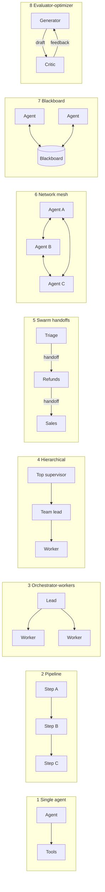

### **Comparison**

| Topology | Control | Latency | Token cost | Fault tolerance | Debugging | Scaling | Typical tasks |
|---|---|---|---|---|---|---|---|
| Single agent | Full, one loop | Low-medium | 1x (baseline) | Retry one loop | Easiest | Context window is the limit | Most tasks, coding |
| Pipeline | Full, in code | Sum of steps | Low | Retry the failed step | Easy | Per step | Extraction, translate-then-check |
| Orchestrator-workers | Central, dynamic | Parallel fan-out, lead waits | High | Retry a worker; lead is a single point of failure | Medium (tree) | Width of fan-out | Research, broad search |
| Hierarchical | Central per level | Adds a hop per level | Highest | Retry a subtree | Hard (deep tree) | Many teams | Large multi-domain projects |
| Swarm / handoffs | Decentralized, one active agent | Low (one hop per domain) | Low-medium | Resume from last active agent | Medium (chain) | Number of specialists | Support, triage |
| Network (mesh) | None | Unpredictable | Unbounded without limits | Poor (cycles, lost messages) | Hardest | Poor, O(n²) links | Cross-organization agents, simulations |
| Blackboard | Controller over shared state | Medium | Medium | Good: state is durable | Medium (state history) | Many contributors | Open-ended problems without a fixed workflow |
| Evaluator / debate | Loop with a judge | Multiplied by rounds | Multiplied by rounds × agents | Retry a round | Easy per round | Rounds, not width | Translation, code review, reasoning |

### **How to choose a topology**

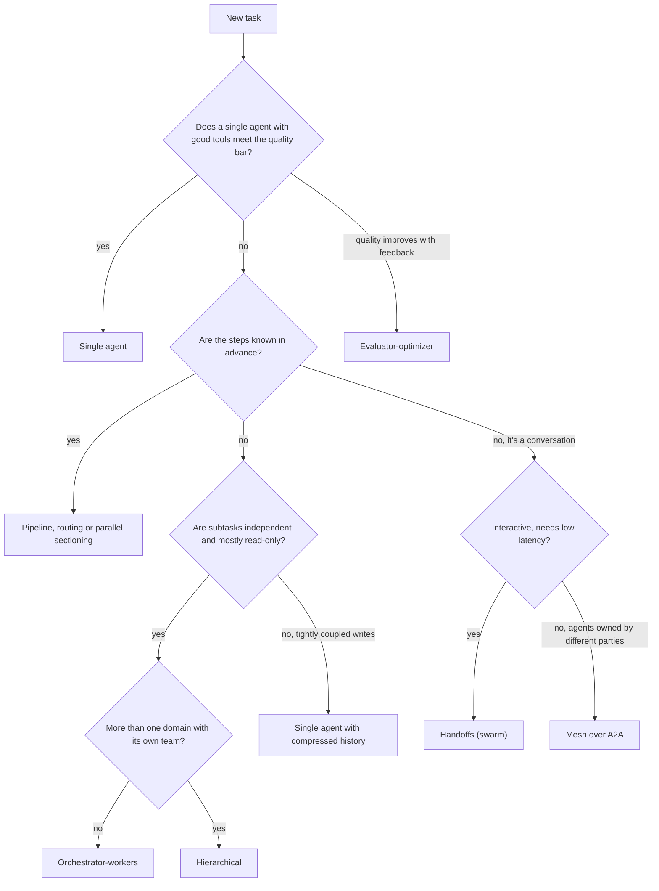

The questions, in order:
 * **Independence** - can subtasks be done without knowing each other's decisions? Parallel search yes; two halves of one program no.
 * **Read vs write** - reading and summarizing parallelizes safely; concurrent writes to a shared artifact create conflicting implicit decisions (Cognition's point).
 * **Latency** - every extra level or supervisor round trip is at least one more LLM call.
 * **Coupling** - if agents need each other's full context, give them one context (single agent) instead of simulating it with messages.

### **Platform architecture shared by all topologies**

Topologies are configurations; the platform underneath is the same.

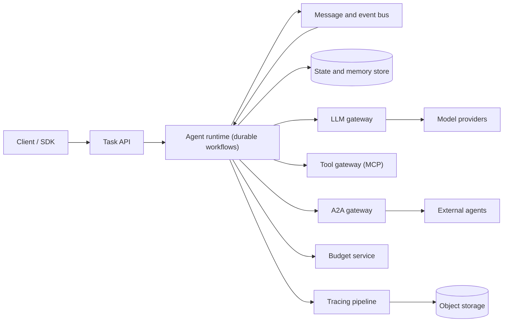

 * **Agent runtime** - every agent run is a durable workflow (Chapter 31); a subagent is a **child workflow** with its own history, timeouts and retries
 * **Message and event bus** - delivers handoffs, results and progress events between agents and to the client stream; partitioned by `task_id` so events of one task stay ordered
 * **State and memory store** - task plan, decisions, blackboard entries, artifacts (large ones by reference in object storage)
 * **LLM gateway** - model routing (a large model for the lead, cheaper ones for workers), quotas, prompt caching, metering per agent
 * **Budget service** - atomic counters per task tree; checked before each LLM call and each spawn
 * **Tool gateway / A2A gateway** - MCP tools on one side, remote agents on the other
 * **Tracing pipeline** - spans form a tree mirroring the agent tree

A minimal data model:

| Table | Key fields |
|---|---|
| task | task_id, tenant_id, topology, status, budget (tokens, usd, deadline, max_depth, max_agents), usage |
| agent_run | agent_run_id, task_id, parent_id, depth, agent_def, status, tokens_used, result_ref |
| message | task_id, seq, from_agent, to_agent, type (delegate / result / handoff / critique), payload_ref |
| shared_state | task_id, key, version, value_ref, written_by |

---

## Step 3: Topologies Deep Dive

### **1. Single agent (baseline)**

**How it works.** One model, one context window, a loop of reasoning and tool calls (Chapter 31). Specialization comes from tools and, if needed, on-demand instructions (LangChain calls this the "skills" pattern: one agent stays in control).

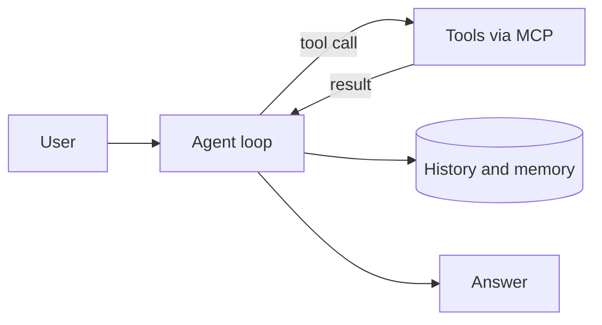

 * **Control and data flow** - linear: every decision is made with the full history in view
 * **State and context** - one message history plus long-term memory; compaction when it grows
 * **Pros** - cheapest, simplest to debug, no conflicting decisions
 * **Cons** - one context window; sequential tool use; too many tools confuse the model
 * **Failure modes** - context overflow, "context rot", loops without progress
 * **When to use** - by default. Anthropic: "add multi-step agentic systems only when simpler solutions fall short". Cognition: a single-threaded linear agent is the reliable choice for coupled tasks
 * **Examples** - coding agents; Cognition's recommended architecture, with a history-compressing LLM for long tasks

### **2. Sequential pipeline (prompt chaining)**

**How it works.** Anthropic's first workflow pattern: the task decomposes into fixed subtasks, each LLM call processes the previous output, and programmatic **gates** check intermediate results. Close relatives: **routing** (classify, then send to a specialized path) and **parallelization** (sectioning into independent parts, or **voting** by running the same task several times).

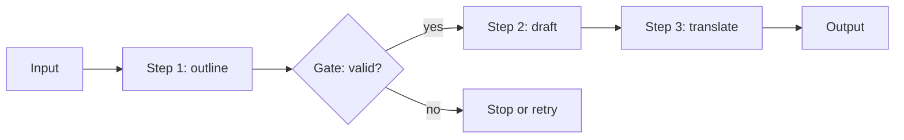

 * **Control and data flow** - defined in code; data flows one way; the LLM never chooses the next step
 * **State and context** - each step sees only its input and its own prompt; intermediate results are stored per step
 * **Pros** - predictable, testable per step, easy to retry, cheap
 * **Cons** - rigid; latency is the sum of steps; errors propagate downstream
 * **Failure modes** - a bad early output poisons everything after it (hence gates); schema drift between steps
 * **When to use** - the steps are known in advance and the task trades latency for accuracy
 * **Examples** - generate copy, then translate it; OpenAI Agents SDK "orchestrating via code"; LangGraph custom workflows

### **3. Orchestrator-workers (supervisor)**

**How it works.** A lead agent plans at runtime and delegates. Unlike parallelization, "subtasks aren't pre-defined, but determined by the orchestrator". Workers can be exposed as **tools**: the OpenAI Agents SDK calls this "agents as tools" (a manager keeps control), LangGraph calls it a tool-calling supervisor.

Anthropic's Research system is the reference implementation:

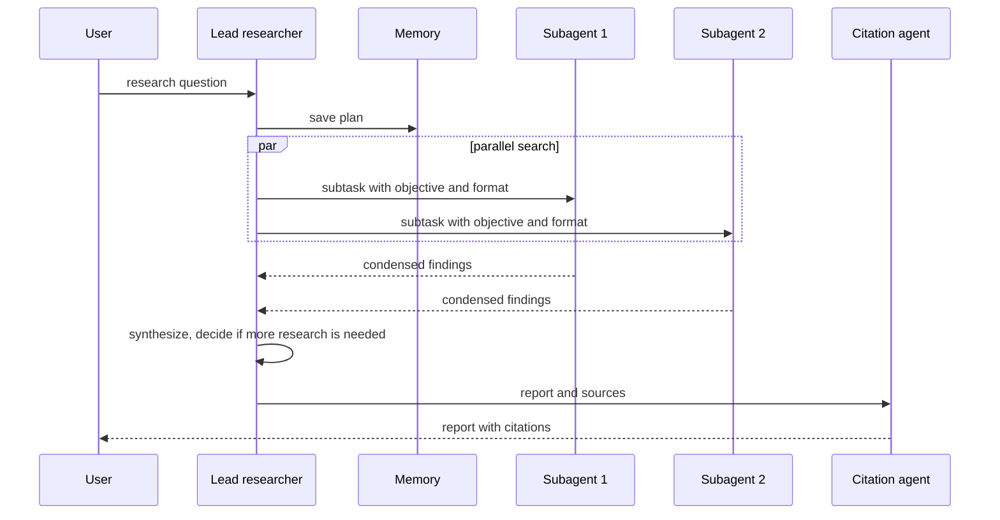

 * **Control and data flow** - the lead thinks through the approach and **saves its plan to Memory**, because a context over 200,000 tokens gets truncated. It spins up **3-5 subagents in parallel**; each uses 3+ tools in parallel. Anthropic says these two kinds of parallelism cut research time by up to 90% for complex queries. Subagents return condensed findings; a separate **CitationAgent** then maps claims to sources
 * **Effort scaling** - encoded in the prompt: simple fact-finding is 1 agent with 3-10 tool calls; comparisons are 2-4 subagents with 10-15 calls each; complex research uses more than 10 subagents
 * **State and context** - isolated: each worker has a fresh context and returns a summary. Large outputs can go to an artifact store and be passed by reference, avoiding a "game of telephone" through the lead
 * **Pros** - breadth: parallel exploration of a large information space; context protection for the lead
 * **Cons** - ~15x tokens; the lead is a bottleneck. Anthropic's lead runs subagents **synchronously**, waiting for each batch, so one slow subagent stalls the task
 * **Failure modes** - observed early on: spawning 50 subagents for simple queries, searching endlessly for nonexistent sources, subagents distracting each other with excessive updates, duplicated work and gaps when task descriptions were vague
 * **When to use** - breadth-first, read-heavy, high-value tasks; "the value of the task is high enough to pay for the increased performance"
 * **Examples** - Anthropic Research; LangGraph supervisor; OpenAI Agents SDK agents-as-tools; LangChain "subagents" pattern

### **4. Hierarchical (teams of supervisors)**

**How it works.** A supervisor's workers are themselves supervisors. In LangGraph, a team is a compiled subgraph used as a node: the `langgraph-supervisor` README builds `research_team` and `writing_team` supervisors and a `top_level_supervisor` over them.

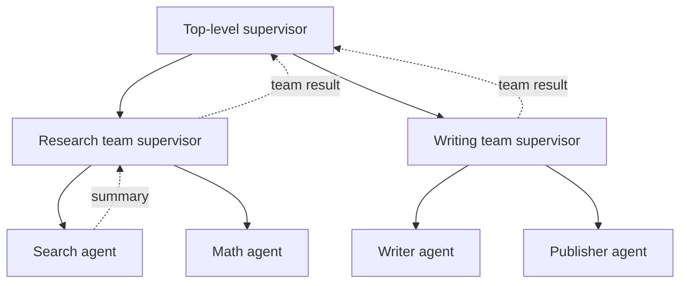

 * **Control and data flow** - delegation goes down, summaries go up. Each level decides what to pass on: LangGraph offers `output_mode="full_history"` or `"last_message"` (the default)
 * **State and context** - each subgraph has private state; only its result crosses the boundary. Budgets and permissions must be split at every level
 * **Pros** - scales to many domains; each supervisor chooses among few workers; teams are tested separately
 * **Cons** - each level adds at least one LLM round trip and one summarization; information loss compounds
 * **Failure modes** - "telephone game" distortion; misrouting at the top that no lower level can fix; runaway depth
 * **When to use** - genuinely separate domains with their own tools, where a flat supervisor would have too many workers to choose from
 * **Examples** - LangGraph hierarchical teams. LangChain now recommends building the supervisor pattern directly via tools rather than with the `langgraph-supervisor` library, for more control over context

### **5. Swarm / handoffs (decentralized)**

**How it works.** No agent sits above the others. The active agent can **hand off** the conversation to another agent, which then owns it. OpenAI's Swarm, an educational framework, reduced this to two primitives: an **Agent** (instructions + tools; the cookbook calls this a *routine*) and a **handoff**, implemented as a tool function that returns another Agent. The cookbook compares it to being transferred on a phone call, "except in this case, the agents have complete knowledge of your prior conversation". Swarm is now replaced by the **OpenAI Agents SDK**, which keeps handoffs as a first-class concept.

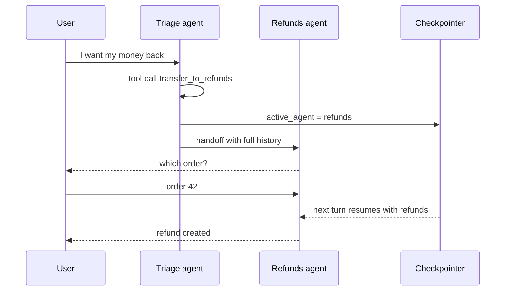

 * **Control and data flow** - one active agent at a time; control moves sideways. Swarm's loop: get a completion from the current agent, execute tool calls, switch agent if a tool returned one, update context variables, return when there are no more calls
 * **State and context** - shared conversation history plus `context_variables`. Swarm keeps no state between calls (like Chat Completions). `langgraph-swarm` remembers which agent was last active, which requires a checkpointer; without it the swarm "forgets" the active agent and the history
 * **Pros** - lower latency: the specialist answers the user directly, with no supervisor round trip after every step; focused prompts
 * **Cons** - no global view; hard to enforce a task-level plan; history grows with every agent
 * **Failure modes** - ping-pong handoffs between two agents; a handoff to the wrong specialist; lost active agent after a crash if not checkpointed
 * **When to use** - conversations where routing is part of the job. OpenAI's guidance: use handoffs when "you want the chosen specialist to own the remainder of the current turn"; use agents-as-tools when a specialist "should not take over the user-facing conversation"
 * **Examples** - Swarm (triage, sales, issues-and-repairs agents), OpenAI Agents SDK handoffs, `langgraph-swarm`, LangChain "handoffs" pattern

### **6. Network / peer-to-peer (mesh)**

**How it works.** LangGraph's definition: "each agent can communicate with every other agent" and "any agent can decide which other agent to call next". Inside one system it is a swarm without constraints. Across organizations it is the only option: nobody owns the whole graph, and agents call each other's services. This is where **A2A** (Agent2Agent) fits: agents publish an Agent Card, exchange messages and track tasks without sharing internal state (details in the Protocols section below).

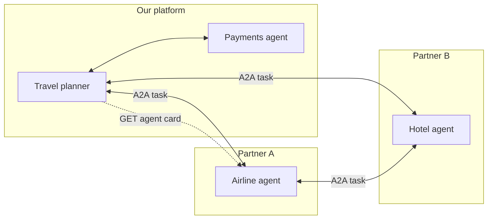

 * **Control and data flow** - arbitrary; each agent picks its next peer; messages, not shared memory
 * **State and context** - distributed: each agent owns its state; the shared "truth" lives only in the messages and task artifacts
 * **Pros** - maximum flexibility; no single point of failure; the natural model for independent vendors
 * **Cons** - no global budget or plan; n agents have up to n(n-1)/2 links; very hard to reason about
 * **Failure modes** - cycles (A asks B who asks A), message storms, deadlocks waiting for each other, conflicting decisions, loss of the original goal (task derailment)
 * **When to use** - rarely inside one system. Between organizations, call each remote agent as a bounded task (orchestrator-workers over A2A), not a free-form chat
 * **Examples** - LangGraph network architecture; A2A between vendors' agents

### **7. Blackboard / shared state**

**How it works.** A classic AI pattern that predates LLMs: specialists don't message each other; they read and write a shared **blackboard**, and a control component picks which agent acts next based on what is on it. Han and Zhang (2025) applied it to LLM agents: agents share all information on the blackboard, a control unit selects agents based on its content, and the cycle repeats until consensus. They report performance competitive with state-of-the-art multi-agent systems while spending fewer tokens. The 2024 LangGraph "multi-agent collaboration" example is a lightweight variant: agents work on a shared scratchpad of messages.

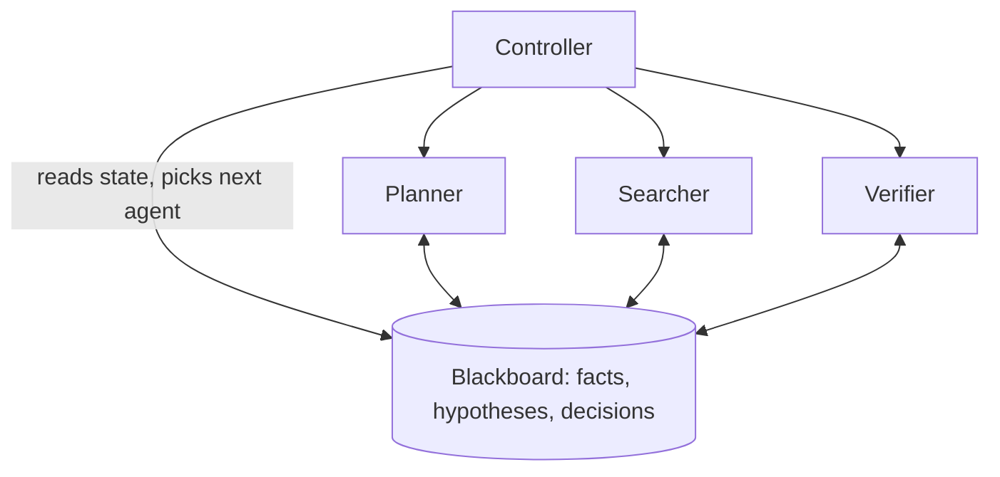

 * **Control and data flow** - the controller (code or an LLM) schedules; data flows only through the board
 * **State and context** - the board is the durable state: versioned entries with author and timestamp; agents load the relevant slice into context
 * **Pros** - decisions are explicit and visible to all (Cognition's "implicit decisions" concern); easy to checkpoint; agents are added without rewiring
 * **Cons** - contention on the board; context bloat if agents read everything; controller quality decides everything
 * **Failure modes** - lost updates from concurrent writes (use optimistic concurrency on a version field), stale reads, the board filling with noise, no termination
 * **When to use** - open-ended problems without a known workflow, where several specialists contribute pieces
 * **Examples** - Han & Zhang's blackboard MAS; shared-scratchpad collaboration in LangGraph

### **8. Evaluator-optimizer / debate**

**How it works.** In Anthropic's **evaluator-optimizer**, one LLM generates, another evaluates and gives feedback, in a loop. It works when responses demonstrably improve with feedback and a model can provide that feedback. **Debate** (Du et al., 2023) generalizes it: several model instances "propose and debate their individual responses and reasoning processes over multiple rounds to arrive at a common final answer", which improved mathematical and strategic reasoning and reduced hallucinations. Anthropic's newer guidance adds the **verification subagent**: a separate agent checks the main agent's work against clear criteria, often black-box, needing little context.

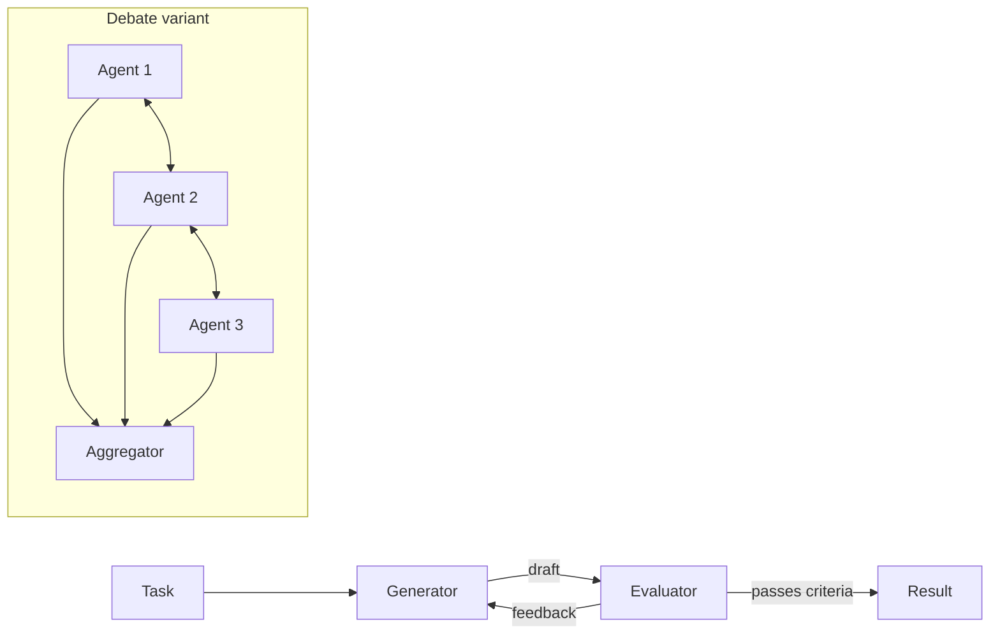

 * **Control and data flow** - a bounded loop: generate, evaluate, revise; or N agents × R rounds, then aggregation (vote or judge)
 * **State and context** - the current draft plus feedback history; debaters see each other's answers from the previous round
 * **Pros** - measurable quality gains on tasks with clear criteria; simple to implement
 * **Cons** - cost and latency multiply by rounds (and agents); an evaluator with the same blind spots adds little
 * **Failure modes** - the "early victory problem": the verifier declares success without thorough testing (Anthropic's fix: explicit instructions such as "You MUST run the complete test suite"); endless revise loops; debaters converging on a shared wrong answer
 * **When to use** - translation, writing, code with tests, reasoning where a critic can check
 * **Examples** - Anthropic evaluator-optimizer workflow; verification subagents; multiagent debate

---

## Step 3 (continued): Cross-cutting concerns

### **Context engineering**

The main decision in any topology is **what each agent sees**: LangGraph contrasts sharing the "full thought process" with sharing "final results only".
 * **Shared context** (single agent, swarm) - no lost decisions, but the window fills up
 * **Isolated context** (orchestrator-workers, hierarchy) - each worker starts clean with a precise brief: objective, output format, tools, boundaries
 * **Compressed results** - workers return summaries; bulky outputs go to an artifact store and are passed by reference
 * **Decompose by context, not by job title** - Anthropic's advice: group work that shares context, and split only where contexts separate cleanly
 * **Record decisions in shared state** - a practical reading of Cognition's "actions carry implicit decisions": every choice that constrains others (style, API shape, chosen library) is written to the task's shared state before workers start and is included in every brief

### **Budgets and termination**

Budgets belong to the **task tree**, not to individual agents:
 * **Tokens and money** - a child receives a slice of the parent's remaining budget; usage is charged atomically to the task counter, so a sibling can't overspend what the parent already committed
 * **Depth** - `max_depth` (e.g. 2) and `max_agents` per task stop "spawn 50 subagents" behavior in code, not in the prompt
 * **Time** - the child's deadline = min(own timeout, parent's deadline); a workflow timer cancels the subtree
 * **Loop guards** - handoff counters (A→B→A), max rounds for critics and debates, detection of repeated identical tool calls
 * When a budget is exhausted, the child returns a partial result with status `budget_exceeded`; the parent decides whether to synthesize anyway

### **Fault tolerance**

 * **Subagent = child workflow.** The durable engine from Chapter 31 records each child's history; a crash retries only that child. Anthropic built systems that "resume from where the agent was" instead of restarting, since restarts are expensive and frustrating for users
 * **Retries and idempotency** - each subagent gets a deterministic ID like `task_id:parent_id:n`; spawning is idempotent, so a replayed parent doesn't create a second copy. Tool side effects carry idempotency keys as before
 * **Tell the model** - Anthropic found that letting the agent know when a tool is failing and letting it adapt works surprisingly well; a failed worker becomes a message to the lead, not a task failure
 * **Partial results** - the lead can proceed with 4 of 5 workers, noting the gap
 * **Deploys** - Anthropic uses rainbow deployments: old and new versions run side by side while traffic shifts gradually, so running agents aren't disrupted

### **Least privilege for child agents**

A child's permissions are the **intersection** of what the parent holds and what the subtask needs. A search worker gets read-only web tools; only a designated agent can write or send. Credentials are scoped to the task and expire with it. This limits the damage of prompt injection (Chapter 31): a worker reading an untrusted page can't exfiltrate data if it has no outbound tools.

### **Protocols: MCP and A2A**

A2A's own summary: "A2A connects the agents to each other; MCP connects each agent to its own tools."
 * **MCP** (Model Context Protocol) - agent ↔ tools and data, covered in Chapter 31
 * **A2A** (Agent2Agent) - agent ↔ agent, now under the Linux Foundation; version 1.0.0 of the spec defines bindings for JSON-RPC 2.0 over HTTP, gRPC and HTTP+JSON/REST, streaming over SSE (Server-Sent Events) and push notifications. Agents collaborate "without needing to share their internal thoughts, plans, or tool implementations"

The **Agent Card** is published at `/.well-known/agent-card.json`: identity (name, description, URL), skills, optional capabilities (streaming, push notifications), security schemes and extensions. Cards can be signed.

A **Task** moves through 8 states (plus a sentinel `UNSPECIFIED`):
 * active: `SUBMITTED` → `WORKING`
 * interrupted: `INPUT_REQUIRED`, `AUTH_REQUIRED` - the remote agent waits for the caller
 * terminal: `COMPLETED`, `FAILED`, `CANCELED`, `REJECTED` (the agent declines the task)

For our runtime, an outgoing A2A task is simply another child workflow: the budget and deadline apply, `INPUT_REQUIRED` maps to a wait for a signal, outputs arrive as **Artifacts** made of **Parts** (text, files, structured data).

### **Observability**

A trace is a tree: root span = task; child spans = agent runs; their children = LLM calls, tool calls, handoffs and A2A calls. Each span carries `task_id`, `agent_run_id`, `parent_id`, depth, tokens and cost, so we can answer "which subagent spent 60% of the budget?". Anthropic notes agents are non-deterministic between runs even with identical prompts, so full production tracing is required; they monitor decision patterns and interaction structures without monitoring conversation contents, for privacy. With ~2.3k spans/s, store metadata in a columnar store and payloads in object storage; always keep failed and over-budget traces.

### **Failure taxonomy (MAST)**

Cemri et al., "Why Do Multi-Agent LLM Systems Fail?", built **MAST** (Multi-Agent System Failure Taxonomy): **14 failure modes in 3 categories**. The first versions of the paper (150+ tasks, 5 frameworks including MetaGPT, ChatDev and AG2) report the category shares; the later version expands the dataset to 1,600+ annotated traces across 7 frameworks with inter-annotator agreement κ = 0.88, and its per-mode shares differ.

| Category (share in v1/v2) | Failure modes | Architectural countermeasures |
|---|---|---|
| **Specification and system design** (41.8%) | disobey task specification; disobey role specification; step repetition; loss of conversation history; unaware of termination conditions | explicit briefs with output schemas; a plan and decisions in shared state; loop guards; hard budgets and stop conditions in code; durable history |
| **Inter-agent misalignment** (36.9%) | conversation reset; fail to ask for clarification; task derailment; information withholding; ignored other agent's input; reasoning-action mismatch | fewer agents and hops; typed messages instead of free chat; decisions recorded centrally; `INPUT_REQUIRED` state to ask for clarification; supervisor re-checks the goal |
| **Task verification and termination** (21.3%) | premature termination; no or incomplete verification; incorrect verification | a separate verifier with objective checks (tests, citation pass); explicit completion criteria; evals on final outcomes |

The authors separate **tactical** fixes (prompts, reorganizing agents), which help inconsistently, from **structural** ones (verification, standardized communication, memory management), which remain open research - an argument for putting control into the architecture, not prompts.

### **Evaluation**

 * **Start small** - Anthropic began with about 20 queries representing real usage; early changes have large effects, so small samples show them
 * **LLM-as-judge** - a single LLM call with a rubric, outputting a score from 0.0 to 1.0 and a pass/fail grade, was the most consistent and best aligned with human judgement in Anthropic's experience
 * **Judge the end state, not the path** - agents reach the same goal by different routes
 * **Humans** still find what automated evals miss: Anthropic's testers noticed early agents preferring SEO content farms over authoritative sources
 * **Metrics** - cost per successful task, agents spawned, handoffs per conversation, verifier false-pass rate, share of tasks hitting budgets
 * **Classify failures** with MAST (the paper provides an LLM-as-judge pipeline) to see whether a regression is a specification, alignment or verification problem

---

## Step 4: Wrap Up

 * A multi-agent system trades tokens (≈15x a chat by Anthropic's measurement) for breadth, context isolation and specialization. Start with a single agent and add agents only where one of those three is the bottleneck
 * Choose a topology by independence, read vs write, latency and coupling: pipelines for known steps, orchestrator-workers for parallel research, handoffs for conversations, evaluator loops for quality, blackboard for open-ended shared work, hierarchies and meshes only when the organization demands them
 * All topologies run on one platform: durable workflows (subagent = child workflow), a message bus, shared state, an LLM gateway, a budget service, MCP and A2A gateways, tree-shaped traces
 * Enforce budgets, depth, permissions and termination in code; record decisions in shared state; verify with a separate agent or deterministic checks. These cover most of the MAST failure categories

Additional talking points:
 * **Asynchronous orchestration** - the lead reacts to subagents as they finish instead of waiting for the whole batch
 * **Model routing** - a strong model for the lead, cheaper ones for workers
 * **Cross-organization A2A** - trust, authentication and billing for external agents

---

## References

 * [Anthropic: How we built our multi-agent research system](https://www.anthropic.com/engineering/built-multi-agent-research-system)
 * [Anthropic: Building effective agents](https://www.anthropic.com/engineering/building-effective-agents)
 * [Anthropic: Building multi-agent systems: when and how to use them](https://claude.com/blog/building-multi-agent-systems-when-and-how-to-use-them)
 * [Cognition, Walden Yan: Don't Build Multi-Agents](https://cognition.com/blog/dont-build-multi-agents)
 * [OpenAI Swarm (GitHub)](https://github.com/openai/swarm)
 * [OpenAI Cookbook: Orchestrating Agents: Routines and Handoffs](https://developers.openai.com/cookbook/examples/orchestrating_agents)
 * [OpenAI Agents SDK: Agent orchestration](https://openai.github.io/openai-agents-python/multi_agent/)
 * [LangGraph: Multi-agent systems (concepts, v0.4.8 docs)](https://github.com/langchain-ai/langgraph/blob/0.4.8/docs/docs/concepts/multi_agent.md)
 * [LangChain: Multi-agent](https://docs.langchain.com/oss/python/langchain/multi-agent)
 * [LangChain blog: LangGraph: Multi-Agent Workflows](https://www.langchain.com/blog/langgraph-multi-agent-workflows)
 * [langgraph-supervisor (GitHub)](https://github.com/langchain-ai/langgraph-supervisor-py)
 * [langgraph-swarm (GitHub)](https://github.com/langchain-ai/langgraph-swarm-py)
 * [Cemri et al.: Why Do Multi-Agent LLM Systems Fail? (arXiv:2503.13657)](https://arxiv.org/abs/2503.13657)
 * [A2A Protocol specification](https://a2a-protocol.org/latest/specification/)
 * [A2A and MCP](https://a2a-protocol.org/latest/topics/a2a-and-mcp/)
 * [Du et al.: Improving Factuality and Reasoning in Language Models through Multiagent Debate (arXiv:2305.14325)](https://arxiv.org/abs/2305.14325)
 * [Han, Zhang: Exploring Advanced LLM Multi-Agent Systems Based on Blackboard Architecture (arXiv:2507.01701)](https://arxiv.org/abs/2507.01701)
 * [Chapter 31: Design an AI Agent Platform](../31.%20AI%20Agent%20Platform/README.en.md)
