**Русский** | [English](./README.en.md)

# Глава 40: Мультиагентная система (рой агентов)

## Введение

**Мультиагентная система (multi-agent system)** — это приложение на основе LLM (Large Language Model — большая языковая модель), в котором несколько агентов, у каждого из которых свои инструкции, инструменты (tools) и контекстное окно (context window), совместно решают одну задачу. Ведущий агент может разделить исследовательский вопрос между параллельными субагентами (subagents), а агент сортировки (triage) — передать клиента агенту по возвратам.

В [главе 31](../31.%20AI%20Agent%20Platform/README.md) мы спроектировали платформу для **одного** агента: цикл агента, надёжное выполнение (durable execution), песочницы, защитные механизмы (guardrails), промпт-инъекции и мультиарендность. Здесь мы используем всё это повторно и сосредоточимся на том, что меняется, когда агентов много: **топология (topology)** — кто с кем общается и кто управляет; **контекст** — что видит каждый агент; **бюджеты**; **обработка сбоев** в дереве агентов; **протоколы** между агентами.

Главу обрамляют две влиятельные позиции:
 * **Anthropic** построила функцию Research как оркестратор с параллельными субагентами. Система с ведущим агентом на Claude Opus 4 и субагентами на Claude Sonnet 4 превзошла одиночного агента Claude Opus 4 на 90,2% во внутреннем исследовательском тесте (eval). Цена: агенты тратят примерно в 4 раза больше токенов, чем чат, а мультиагентные системы — примерно в 15 раз больше. В более поздних рекомендациях Anthropic советует начинать с одного агента и называет три случая, когда несколько агентов окупаются: **защита контекста (context protection)**, **распараллеливание (parallelization)** и **специализация (specialization)** — например, когда агент путается в 20+ инструментах. Мультиагентные реализации обычно тратят в 3–10 раз больше токенов, чем один агент на ту же задачу.
 * **Cognition** (Walden Yan, «Don't Build Multi-Agents») для большинства задач утверждает обратное. Два принципа: *делитесь контекстом, причём полными трассами агентов, а не отдельными сообщениями*; *действия несут неявные решения, а противоречащие решения дают плохой результат*. Пример: задачу «сделать клон Flappy Bird» делят между двумя субагентами, один рисует фон в стиле Super Mario, а другой — птицу, которая к нему не подходит. Их выбор по умолчанию — однопоточный линейный агент, а для очень длинных задач — LLM, которая сжимает историю.

Позиции противоречат друг другу меньше, чем кажется. Сама Anthropic пишет, что области, где всем агентам нужен один и тот же контекст или где между агентами много зависимостей, подходят плохо, а в большинстве задач программирования по-настоящему параллельных частей меньше, чем в исследовании. **Работа «вширь» с преобладанием чтения распараллеливается; сильно связанная работа с преобладанием записи — нет.**

---

## Шаг 1: Понять задачу и определить рамки проектирования

Возможный диалог кандидата (К) и интервьюера (И):
 * К: Какие задачи будет решать система?
 * И: Сначала глубокие исследовательские отчёты: пользователь задаёт широкий вопрос, система ищет в вебе и во внутренних документах и пишет отчёт со ссылками на источники. Позже — поддержка клиентов со специализированными агентами и часть задач программирования.
 * К: Можно ли переиспользовать платформу одного агента из главы 31?
 * И: Да: движок надёжных рабочих процессов (durable workflows), шлюз инструментов, песочницы и защитные механизмы уже есть.
 * К: Какая задержка допустима?
 * И: Исследование может длиться минуты. В диалоге поддержки каждый ответ должен приходить за секунды.
 * К: Должны ли участвовать агенты других компаний?
 * И: Да, некоторые партнёры предоставляют своих агентов по стандартному протоколу.
 * К: Как ограничиваем стоимость?
 * И: У каждой задачи есть бюджет в токенах, деньгах и времени, и он действует на всё дерево агентов, а не на каждого агента отдельно.

### **Функциональные требования**

 * Описывать агентов (модель, инструкции, инструменты, права) и собирать из них топологии: конвейер, оркестратор и исполнители, иерархия, передачи управления, сеть, общая доска, циклы с оценщиком
 * Запускать задачу, получать поток прогресса, отменять её; результат содержит ссылки на источники или артефакты
 * Агенты динамически порождают субагентов в пределах лимитов на число, глубину, токены и время
 * Общее состояние и память задачи (планы, решения, промежуточные артефакты)
 * Вызов внешних агентов через A2A (Agent2Agent — протокол взаимодействия агентов) и инструментов через MCP (Model Context Protocol — открытый протокол подключения инструментов и данных к моделям)
 * Трасса всего дерева агентов для отладки, аудита и оценки качества

### **Нефункциональные требования**

- **Контроль стоимости**: бюджеты наследуются вниз по дереву агентов; никакого неуправляемого порождения
- **Надёжность**: упавший субагент повторяется или возобновляется, а не вся задача целиком
- **Задержка**: параллельное ветвление (fan-out) для исследований; мало переходов для интерактивных передач управления
- **Изоляция**: каждый субагент получает только нужные ему инструменты и данные
- **Наблюдаемость**: каждый вызов LLM, вызов инструмента и сообщение между агентами привязаны к задаче и агенту

### **Оценка «на салфетке» (back-of-the-envelope)**

Все числа ниже — **допущения** для упражнения, а не измерения. Единственная опора из Anthropic: мультиагентная система тратит **примерно в 15 раз** больше токенов, чем взаимодействие в чате.
 * 1 млн исследовательских задач в день, пик = 3 × среднее
 * Взаимодействие в чате ≈ 20 тыс. токенов → мультиагентная задача ≈ 15 × 20 тыс. = **300 тыс. токенов**
 * Форма дерева на задачу: 1 ведущий агент + в среднем 4 субагента + 1 проход расстановки цитат. Разбивка: ведущий 40 тыс., субагенты 4 × 60 тыс. = 240 тыс., цитаты 20 тыс. → всего 300 тыс.
 * Вызовов LLM на задачу: ведущий 8, каждый субагент 10, цитаты 2 → 8 + 40 + 2 = **50 вызовов**
 * Длительность задачи: 5 минут (300 с); субагенты активны примерно половину этого времени

Производные величины:
 * **QPS задач** (Queries Per Second — запросов в секунду) = 1 млн / 86 400 ≈ 11,6/с в среднем, ≈ 35/с в пике
 * **Вызовов LLM в секунду** = 11,6 × 50 ≈ 580/с в среднем, ≈ 1 740/с в пике
 * **Токенов в день** = 1 млн × 300 тыс. = 3 × 10^11 → 3 × 10^11 / 86 400 ≈ **3,5 млн токенов/с** в среднем
 * **Одновременных задач** (закон Литтла) = 11,6 × 300 с ≈ 3,5 тыс. в среднем, ≈ 10,4 тыс. в пике
 * **Одновременных агентов** = 3,5 тыс. × (1 ведущий + 4 × 0,5 субагента) = 3,5 тыс. × 3 ≈ 10,4 тыс. в среднем, ≈ 31 тыс. в пике
 * **Стоимость задачи** — примем усреднённую цену $3 за 1 млн входных токенов и $15 за 1 млн выходных, 95% токенов входные: 285 тыс. × $3/1 млн + 15 тыс. × $15/1 млн ≈ $0,855 + $0,225 ≈ **$1,08** против ≈ 20 тыс. × ~$3,6/1 млн ≈ $0,07 за чат. Это ≈ **$1,1 млн в день** до кэширования промптов — задача должна того стоить.
 * **Трассы** — 50 спанов LLM + 150 спанов инструментов = 200 спанов на задачу → 1 млн × 200 / 86 400 ≈ 2,3 тыс. спанов/с (≈ 7 тыс./с в пике). Метаданные 200 × 500 Б = 100 КБ на задачу → 100 ГБ в день. Полезная нагрузка (промпты, выводы инструментов) ≈ 2 МБ на задачу → 2 ТБ в день, ≈ 60 ТБ за 30 дней, хранится в объектном хранилище.

Вывод: дефицитный ресурс — токены, а не CPU (Central Processing Unit — центральный процессор), и ветвление их умножает.

---

## Шаг 2: Обзор топологий

### **Каталог топологий**

 1. **Один агент (single agent)** — одна LLM в цикле с инструментами; точка отсчёта
 2. **Последовательный конвейер (sequential pipeline, prompt chaining)** — фиксированная цепочка шагов, каждый обрабатывает вывод предыдущего; близкие родственники — маршрутизация (routing) и параллельное разбиение (sectioning)
 3. **Оркестратор и исполнители (orchestrator-workers, supervisor)** — ведущий агент во время выполнения разбивает задачу, делегирует исполнителям и сводит результаты
 4. **Иерархия (hierarchical)** — супервизоры над супервизорами; команды — вложенные подграфы
 5. **Рой / передачи управления (swarm / handoffs)** — центрального контроллера нет; активный агент передаёт разговор другому агенту
 6. **Сеть (network, mesh)** — любой агент может вызвать любого другого
 7. **Доска объявлений (blackboard, shared state)** — агенты читают и пишут в общее хранилище; контроллер выбирает, кто действует следующим
 8. **Оценщик — оптимизатор / дебаты (evaluator-optimizer / debate)** — цикл генератора и критика, или несколько агентов спорят, пока не сойдутся

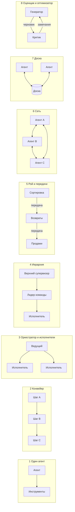

### **Сравнение**

| Топология | Управление | Задержка | Стоимость в токенах | Отказоустойчивость | Отладка | Масштабирование | Типичные задачи |
|---|---|---|---|---|---|---|---|
| Один агент | Полное, один цикл | Низкая–средняя | 1x (база) | Повтор одного цикла | Проще всего | Предел — контекстное окно | Большинство задач, программирование |
| Конвейер | Полное, в коде | Сумма шагов | Низкая | Повтор упавшего шага | Просто | По шагам | Извлечение данных, перевод с проверкой |
| Оркестратор и исполнители | Центральное, динамическое | Параллельное ветвление, ведущий ждёт | Высокая | Повтор исполнителя; ведущий — единая точка отказа | Средне (дерево) | Ширина ветвления | Исследования, широкий поиск |
| Иерархия | Центральное на каждом уровне | +1 переход на уровень | Самая высокая | Повтор поддерева | Сложно (глубокое дерево) | Много команд | Большие проекты из нескольких областей |
| Рой / передачи | Децентрализованное, один активный агент | Низкая (один переход на область) | Низкая–средняя | Продолжение с последнего активного агента | Средне (цепочка) | Число специалистов | Поддержка, сортировка обращений |
| Сеть | Нет | Непредсказуемая | Неограниченная без лимитов | Плохая (циклы, потерянные сообщения) | Сложнее всего | Плохое, O(n²) связей | Агенты разных организаций, симуляции |
| Доска | Контроллер над общим состоянием | Средняя | Средняя | Хорошая: состояние надёжно хранится | Средне (история состояния) | Много участников | Открытые задачи без фиксированного процесса |
| Оценщик / дебаты | Цикл с судьёй | Умножается на число раундов | Умножается на раунды × агентов | Повтор раунда | Просто в пределах раунда | Раунды, а не ширина | Перевод, ревью кода, рассуждения |

### **Как выбрать топологию**

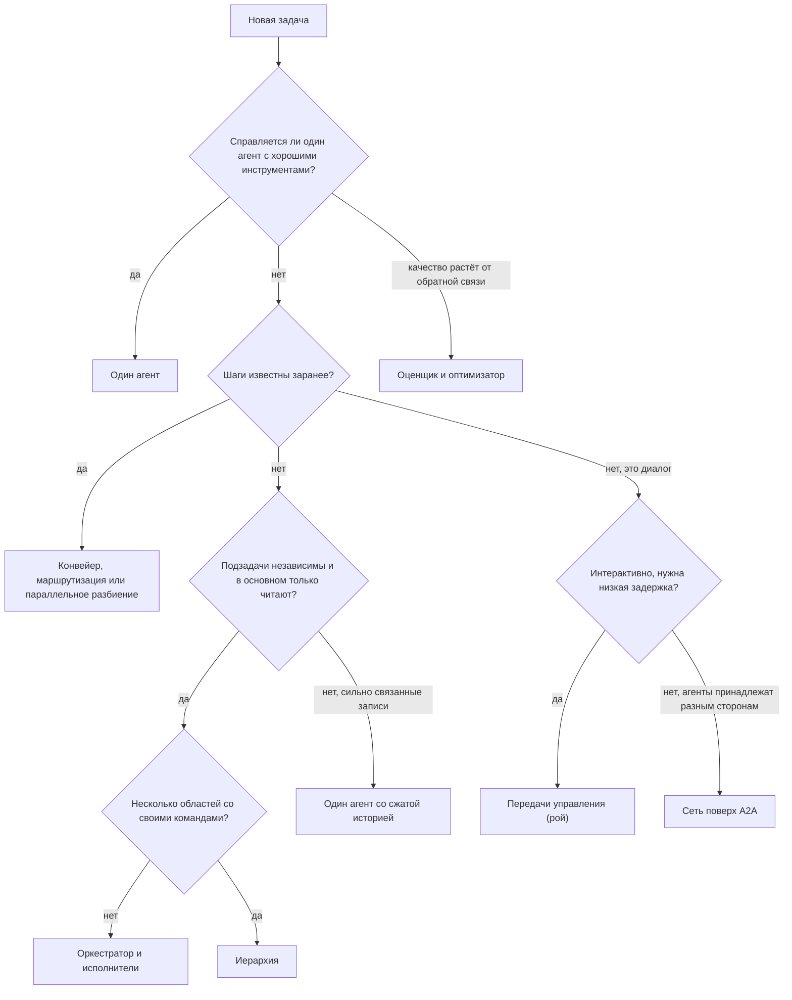

Вопросы по порядку:
 * **Независимость** — можно ли решать подзадачи, не зная решений друг друга? Параллельный поиск — да; две половины одной программы — нет.
 * **Чтение или запись** — чтение и реферирование безопасно распараллеливаются; параллельная запись в общий артефакт порождает противоречащие неявные решения (довод Cognition).
 * **Задержка** — каждый дополнительный уровень или круг через супервизор — это как минимум ещё один вызов LLM.
 * **Связанность** — если агентам нужен полный контекст друг друга, дайте им один контекст (один агент), а не имитируйте его сообщениями.

### **Общая архитектура платформы для всех топологий**

Топологии — это конфигурации; платформа под ними одна и та же.

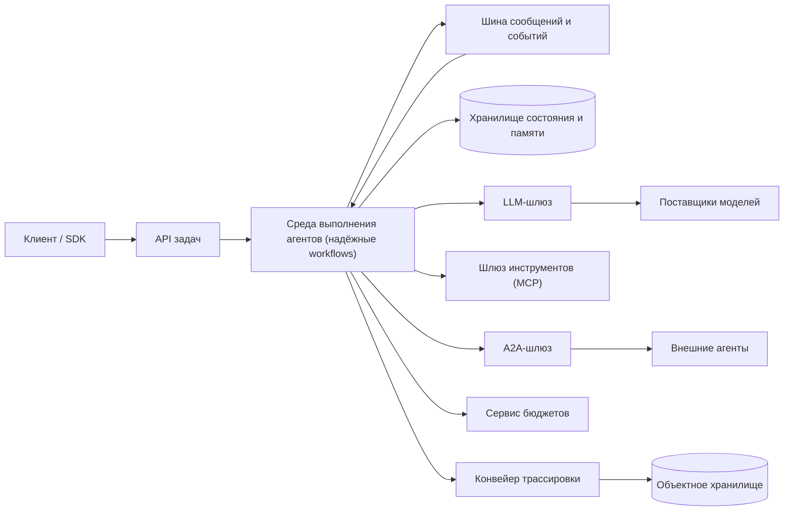

Здесь SDK (Software Development Kit) — клиентская библиотека, API (Application Programming Interface) — программный интерфейс.
 * **Среда выполнения агентов (agent runtime)** — каждый запуск агента — надёжный рабочий процесс (глава 31); субагент — **дочерний рабочий процесс (child workflow)** со своей историей, тайм-аутами и повторами
 * **Шина сообщений и событий** — доставляет передачи управления, результаты и события прогресса между агентами и в поток клиента; разбита на партиции по `task_id`, поэтому события одной задачи остаются упорядоченными
 * **Хранилище состояния и памяти** — план задачи, решения, записи доски, артефакты (крупные — по ссылке в объектном хранилище)
 * **LLM-шлюз (LLM gateway)** — маршрутизация по моделям (большая модель для ведущего, дешевле — для исполнителей), квоты, кэширование промптов, учёт расхода по агентам
 * **Сервис бюджетов** — атомарные счётчики на дерево задачи; проверяются перед каждым вызовом LLM и каждым порождением агента
 * **Шлюз инструментов / A2A-шлюз** — с одной стороны инструменты MCP, с другой — удалённые агенты
 * **Конвейер трассировки** — спаны (spans) образуют дерево, повторяющее дерево агентов

Минимальная модель данных:

| Таблица | Ключевые поля |
|---|---|
| task | task_id, tenant_id, topology, status, budget (tokens, usd, deadline, max_depth, max_agents), usage |
| agent_run | agent_run_id, task_id, parent_id, depth, agent_def, status, tokens_used, result_ref |
| message | task_id, seq, from_agent, to_agent, type (delegate / result / handoff / critique), payload_ref |
| shared_state | task_id, key, version, value_ref, written_by |

---

## Шаг 3: Топологии подробно

### **1. Один агент (точка отсчёта)**

**Как устроен.** Одна модель, одно контекстное окно, цикл рассуждений и вызовов инструментов (глава 31). Специализация достигается инструментами и, при необходимости, инструкциями, подгружаемыми по требованию (в LangChain это паттерн «навыки» (skills): управление остаётся у одного агента).

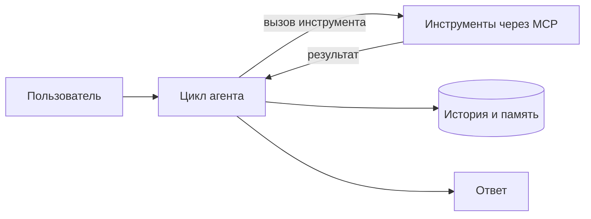

 * **Поток управления и данных** — линейный: каждое решение принимается с полной историей перед глазами
 * **Состояние и контекст** — одна история сообщений плюс долговременная память; сжатие (compaction) при росте
 * **Плюсы** — дешевле всего, проще всего отлаживать, нет противоречащих решений
 * **Минусы** — одно контекстное окно; инструменты вызываются последовательно; слишком много инструментов путает модель
 * **Режимы отказа** — переполнение контекста, «гниение контекста» (context rot), циклы без прогресса
 * **Когда использовать** — по умолчанию. Anthropic: «добавляйте многошаговые агентные системы, только когда более простые решения не справляются». Cognition: для связанных задач надёжный выбор — однопоточный линейный агент
 * **Примеры** — агенты для программирования; рекомендуемая Cognition архитектура с LLM, сжимающей историю в длинных задачах

### **2. Последовательный конвейер (prompt chaining)**

**Как устроен.** Первый паттерн рабочих процессов у Anthropic: задача раскладывается на фиксированные подзадачи, каждый вызов LLM обрабатывает вывод предыдущего, а программные **проверки (gates)** контролируют промежуточные результаты. Близкие родственники: **маршрутизация (routing)** — классифицировать и отправить по специализированному пути — и **распараллеливание (parallelization)** — разбиение на независимые части (sectioning) или **голосование (voting)**, когда одна и та же задача выполняется несколько раз.

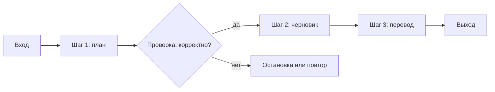

 * **Поток управления и данных** — задан в коде; данные текут в одну сторону; LLM никогда не выбирает следующий шаг
 * **Состояние и контекст** — каждый шаг видит только свой вход и свой промпт; промежуточные результаты хранятся по шагам
 * **Плюсы** — предсказуемость, тестирование по шагам, простые повторы, дешевизна
 * **Минусы** — жёсткость; задержка равна сумме шагов; ошибки распространяются вниз по цепочке
 * **Режимы отказа** — плохой ранний вывод отравляет всё последующее (отсюда проверки); расхождение схем между шагами
 * **Когда использовать** — шаги известны заранее, и задача разменивает задержку на точность
 * **Примеры** — сгенерировать текст, затем перевести его; «оркестрация кодом» в OpenAI Agents SDK; пользовательские рабочие процессы в LangGraph

### **3. Оркестратор и исполнители (supervisor)**

**Как устроен.** Ведущий агент планирует во время выполнения и делегирует. В отличие от распараллеливания, «подзадачи не заданы заранее, их определяет оркестратор». Исполнителей можно представить как **инструменты**: в OpenAI Agents SDK это «агенты как инструменты» (agents as tools) — управление остаётся у менеджера, в LangGraph — супервизор с вызовом инструментов (tool-calling supervisor).

Эталонная реализация — исследовательская система Anthropic:

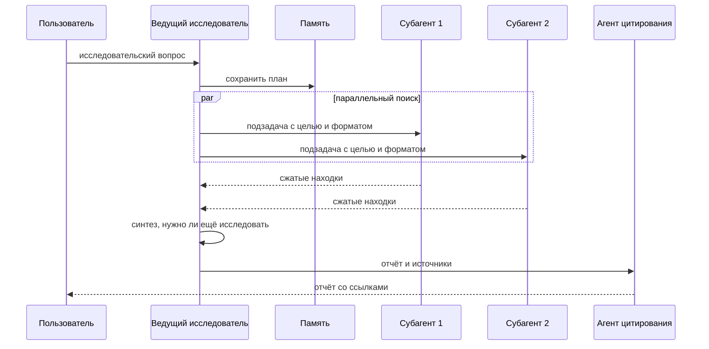

 * **Поток управления и данных** — ведущий продумывает подход и **сохраняет план в память (Memory)**, потому что контекст длиннее 200 000 токенов обрезается. Он запускает **3–5 субагентов параллельно**; каждый использует 3+ инструмента параллельно. По словам Anthropic, эти два вида параллелизма сокращают время исследования сложных запросов до 90%. Субагенты возвращают сжатые находки; затем отдельный **агент цитирования (CitationAgent)** сопоставляет утверждения с источниками
 * **Масштабирование усилий** — зашито в промпт: простой поиск факта — 1 агент и 3–10 вызовов инструментов; сравнения — 2–4 субагента по 10–15 вызовов; сложное исследование — больше 10 субагентов
 * **Состояние и контекст** — изолированы: каждый исполнитель начинает с чистого контекста и возвращает резюме. Крупные результаты можно класть в хранилище артефактов и передавать по ссылке, избегая «испорченного телефона» (game of telephone) через ведущего
 * **Плюсы** — охват: параллельное исследование большого информационного пространства; защита контекста ведущего
 * **Минусы** — ~15x токенов; ведущий — узкое место. У Anthropic ведущий запускает субагентов **синхронно** и ждёт каждую группу, поэтому один медленный субагент тормозит всю задачу
 * **Режимы отказа** — замеченные на раннем этапе: порождение 50 субагентов на простые запросы, бесконечный поиск несуществующих источников, субагенты, отвлекающие друг друга избыточными обновлениями, дублирование работы и пробелы при расплывчатых описаниях задач
 * **Когда использовать** — задачи «вширь», с преобладанием чтения и высокой ценностью; «ценность задачи должна быть достаточно высокой, чтобы оплатить прирост качества»
 * **Примеры** — Anthropic Research; супервизор в LangGraph; agents-as-tools в OpenAI Agents SDK; паттерн «субагенты» (subagents) в LangChain

### **4. Иерархия (команды супервизоров)**

**Как устроена.** Исполнители супервизора сами являются супервизорами. В LangGraph команда — это скомпилированный подграф, используемый как узел: в README `langgraph-supervisor` строятся супервизоры `research_team` и `writing_team` и над ними `top_level_supervisor`.

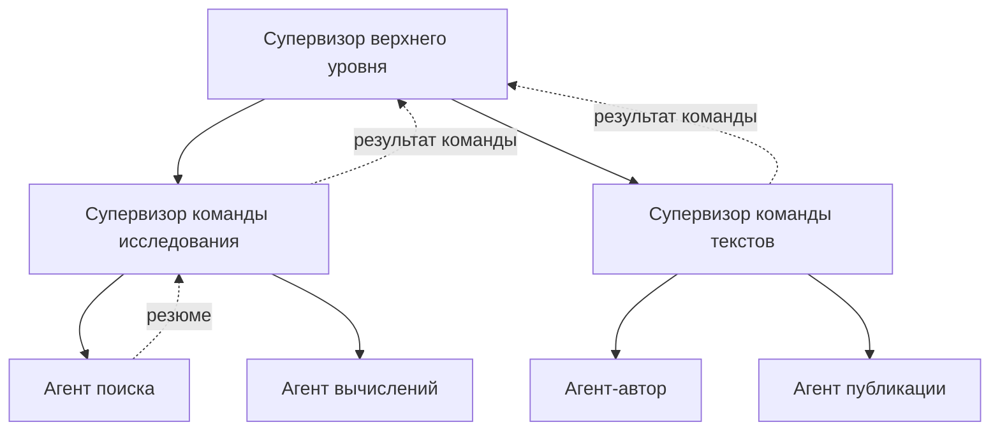

 * **Поток управления и данных** — делегирование идёт вниз, резюме — вверх. Каждый уровень решает, что передать дальше: LangGraph предлагает `output_mode="full_history"` или `"last_message"` (по умолчанию)
 * **Состояние и контекст** — у каждого подграфа своё приватное состояние; через границу проходит только результат. Бюджеты и права нужно делить на каждом уровне
 * **Плюсы** — масштабируется на много областей; каждый супервизор выбирает из немногих исполнителей; команды тестируются по отдельности
 * **Минусы** — каждый уровень добавляет минимум один круг вызова LLM и одно реферирование; потери информации накапливаются
 * **Режимы отказа** — искажения «испорченного телефона»; ошибка маршрутизации наверху, которую нижние уровни не исправят; неконтролируемая глубина
 * **Когда использовать** — действительно разные области со своими инструментами, где у плоского супервизора было бы слишком много исполнителей на выбор
 * **Примеры** — иерархические команды в LangGraph. LangChain теперь рекомендует строить паттерн супервизора напрямую через инструменты, а не библиотекой `langgraph-supervisor`, — так больше контроля над контекстом

### **5. Рой / передачи управления (децентрализованно)**

**Как устроен.** Ни один агент не стоит над остальными. Активный агент может **передать (hand off)** разговор другому агенту, и тот становится его владельцем. Учебный фреймворк OpenAI Swarm свёл это к двум примитивам: **агент (Agent)** — инструкции и инструменты (в cookbook это называется *рутиной* (routine)) — и **передача управления (handoff)**, реализованная как функция-инструмент, возвращающая другого агента. Cookbook сравнивает это с переводом звонка на другого сотрудника, «только здесь агенты полностью знают ваш предыдущий разговор». Swarm заменён на **OpenAI Agents SDK**, где передачи управления остались полноценным понятием.

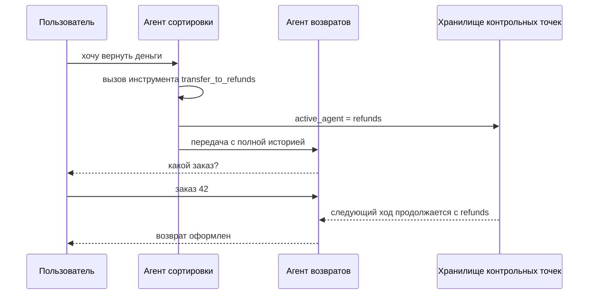

 * **Поток управления и данных** — в каждый момент активен один агент; управление передаётся «вбок». Цикл Swarm: получить ответ текущего агента, выполнить вызовы инструментов, сменить агента, если инструмент вернул нового, обновить контекстные переменные, завершить, когда вызовов больше нет
 * **Состояние и контекст** — общая история разговора плюс `context_variables`. Swarm не хранит состояние между вызовами (как Chat Completions). `langgraph-swarm` запоминает последнего активного агента, для чего нужно хранилище контрольных точек (checkpointer); без него рой «забывает» активного агента и историю
 * **Плюсы** — меньшая задержка: специалист отвечает пользователю напрямую, без круга через супервизор после каждого шага; сфокусированные промпты
 * **Минусы** — нет глобального обзора; трудно удержать план на уровне задачи; история растёт с каждым агентом
 * **Режимы отказа** — «пинг-понг» передач между двумя агентами; передача не тому специалисту; потеря активного агента после сбоя без контрольных точек
 * **Когда использовать** — диалоги, где маршрутизация — часть работы. Рекомендация OpenAI: передачи — когда «выбранный специалист должен владеть оставшейся частью текущего хода»; агенты как инструменты — когда специалист «не должен перехватывать разговор с пользователем»
 * **Примеры** — Swarm (агенты сортировки, продаж, проблем и ремонта), передачи в OpenAI Agents SDK, `langgraph-swarm`, паттерн «передачи» (handoffs) в LangChain

### **6. Сеть / одноранговое взаимодействие (mesh)**

**Как устроена.** Определение LangGraph: «каждый агент может общаться с любым другим» и «любой агент может решить, кого вызвать следующим». Внутри одной системы это рой без ограничений. Между организациями — единственный вариант: целым графом никто не владеет, и агенты вызывают сервисы друг друга. Здесь уместен **A2A**: агенты публикуют карточку агента (Agent Card), обмениваются сообщениями и отслеживают задачи, не раскрывая внутреннее состояние (подробности — в разделе о протоколах ниже).

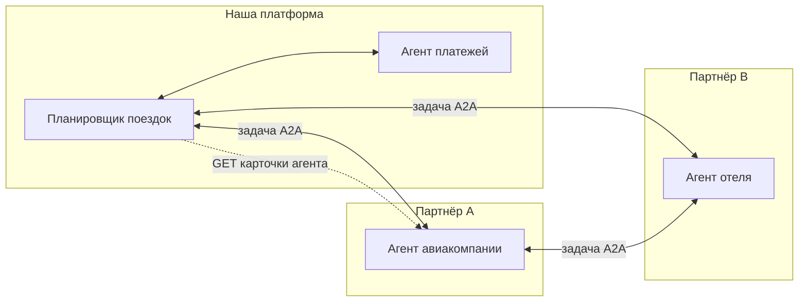

 * **Поток управления и данных** — произвольный; каждый агент сам выбирает следующего; сообщения, а не общая память
 * **Состояние и контекст** — распределены: каждый агент владеет своим состоянием; общая «истина» живёт только в сообщениях и артефактах задач
 * **Плюсы** — максимальная гибкость; нет единой точки отказа; естественная модель для независимых поставщиков
 * **Минусы** — нет глобального бюджета и плана; у n агентов до n(n−1)/2 связей; очень трудно рассуждать о поведении
 * **Режимы отказа** — циклы (A спрашивает B, который спрашивает A), лавины сообщений, взаимные блокировки, противоречащие решения, потеря исходной цели (уход от задачи, task derailment)
 * **Когда использовать** — редко внутри одной системы. Между организациями вызывайте удалённого агента как ограниченную задачу (оркестратор и исполнители поверх A2A), а не как свободный чат
 * **Примеры** — сетевая архитектура в LangGraph; A2A между агентами разных поставщиков

### **7. Доска объявлений / общее состояние**

**Как устроена.** Классический паттерн AI (Artificial Intelligence — искусственный интеллект), появившийся задолго до LLM: специалисты не пишут друг другу, а читают и пишут общую **доску (blackboard)**, и управляющий компонент по её содержимому выбирает, кто действует следующим. Han и Zhang (2025) применили его к LLM-агентам: агенты делятся всей информацией на доске, управляющий блок выбирает агентов по её содержимому, и цикл повторяется до консенсуса. Авторы сообщают о качестве на уровне лучших мультиагентных систем при меньшем расходе токенов. Пример «совместной работы агентов» (multi-agent collaboration) из LangGraph 2024 года — облегчённый вариант: агенты работают над общим черновиком (scratchpad) сообщений.

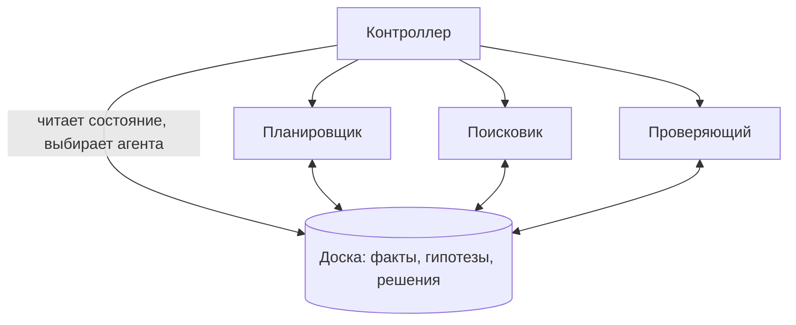

 * **Поток управления и данных** — планирует контроллер (код или LLM); данные идут только через доску
 * **Состояние и контекст** — доска и есть надёжное состояние: версионированные записи с автором и временем; агенты загружают в контекст нужный срез
 * **Плюсы** — решения явные и видны всем (ответ на беспокойство Cognition о «неявных решениях»); легко делать контрольные точки; агенты добавляются без перестройки связей
 * **Минусы** — конкуренция за доску; раздувание контекста, если агенты читают всё; всё решает качество контроллера
 * **Режимы отказа** — потерянные обновления при параллельной записи (используйте оптимистичную блокировку по полю версии), устаревшие чтения, доска зарастает шумом, отсутствие завершения
 * **Когда использовать** — открытые задачи без известного процесса, куда несколько специалистов вносят свои части
 * **Примеры** — мультиагентная система на доске Han и Zhang; совместная работа с общим черновиком в LangGraph

### **8. Оценщик — оптимизатор / дебаты**

**Как устроен.** В паттерне Anthropic **оценщик — оптимизатор (evaluator-optimizer)** одна LLM генерирует, другая оценивает и даёт обратную связь, в цикле. Он работает, когда ответы заметно улучшаются от обратной связи и модель способна такую обратную связь дать. **Дебаты (debate)** (Du et al., 2023) обобщают его: несколько экземпляров модели «предлагают и обсуждают свои ответы и рассуждения в течение нескольких раундов, чтобы прийти к общему итоговому ответу», что улучшило математические и стратегические рассуждения и уменьшило галлюцинации. Новые рекомендации Anthropic добавляют **проверяющего субагента (verification subagent)**: отдельный агент проверяет работу основного по чётким критериям, часто как «чёрный ящик», и ему нужно мало контекста.

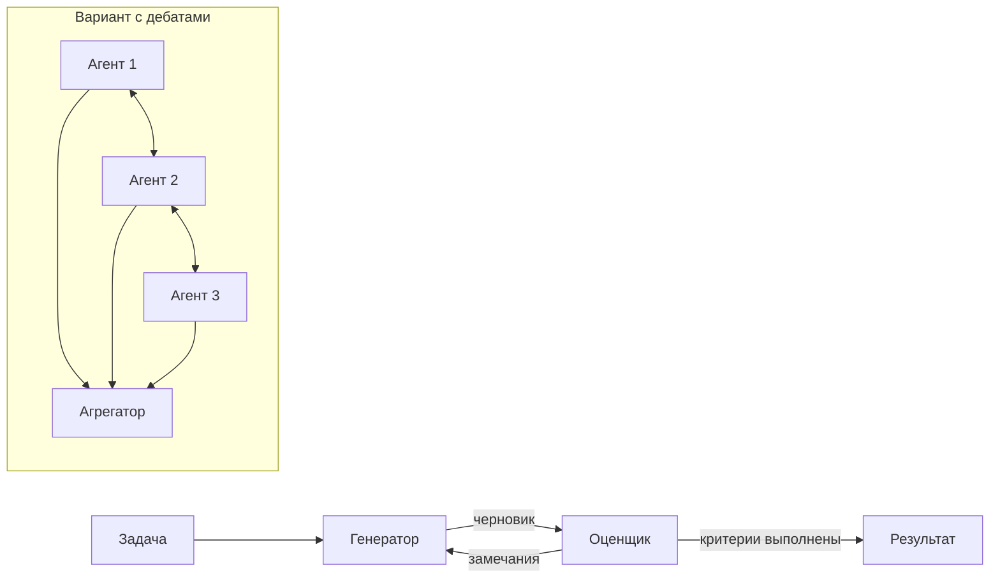

 * **Поток управления и данных** — ограниченный цикл: сгенерировать, оценить, исправить; или N агентов × R раундов, затем агрегация (голосование или судья)
 * **Состояние и контекст** — текущий черновик плюс история замечаний; участники дебатов видят ответы друг друга с предыдущего раунда
 * **Плюсы** — измеримый прирост качества на задачах с чёткими критериями; простая реализация
 * **Минусы** — стоимость и задержка умножаются на число раундов (и агентов); оценщик с теми же слепыми пятнами мало что добавляет
 * **Режимы отказа** — «проблема ранней победы» (early victory problem): проверяющий объявляет успех без тщательной проверки (решение Anthropic — явные инструкции вроде «You MUST run the complete test suite», «Ты ОБЯЗАН запустить полный набор тестов»); бесконечные циклы исправлений; участники дебатов сходятся на общем неверном ответе
 * **Когда использовать** — перевод, тексты, код с тестами, рассуждения, где критик может проверить результат
 * **Примеры** — рабочий процесс evaluator-optimizer от Anthropic; проверяющие субагенты; мультиагентные дебаты

---

## Шаг 3 (продолжение): Сквозные вопросы

### **Инженерия контекста**

Главное решение в любой топологии — **что видит каждый агент**: LangGraph противопоставляет передачу «всего хода рассуждений» (full thought process) и передачу «только итоговых результатов» (final results only).
 * **Общий контекст** (один агент, рой) — решения не теряются, но окно заполняется
 * **Изолированный контекст** (оркестратор и исполнители, иерархия) — каждый исполнитель начинает с чистого листа и получает точное задание: цель, формат вывода, инструменты, границы
 * **Сжатые результаты** — исполнители возвращают резюме; объёмные выводы кладутся в хранилище артефактов и передаются по ссылке
 * **Делите по контексту, а не по должностям** — совет Anthropic: объединяйте работу с общим контекстом и разделяйте только там, где контексты чисто разделяются
 * **Фиксируйте решения в общем состоянии** — практическое прочтение тезиса Cognition «действия несут неявные решения»: любой выбор, ограничивающий других (стиль, форма API, выбранная библиотека), записывается в общее состояние задачи до старта исполнителей и включается в каждое задание

### **Бюджеты и остановка**

Бюджеты принадлежат **дереву задачи**, а не отдельным агентам:
 * **Токены и деньги** — дочерний агент получает долю оставшегося бюджета родителя; расход атомарно списывается со счётчика задачи, поэтому соседний агент не может потратить то, что родитель уже зарезервировал
 * **Глубина** — `max_depth` (например, 2) и `max_agents` на задачу останавливают поведение «породить 50 субагентов» в коде, а не в промпте
 * **Время** — дедлайн дочернего агента = min(собственный тайм-аут, дедлайн родителя); таймер рабочего процесса отменяет всё поддерево
 * **Защита от циклов** — счётчики передач (A→B→A), максимум раундов для критиков и дебатов, обнаружение повторяющихся одинаковых вызовов инструментов
 * Когда бюджет исчерпан, дочерний агент возвращает частичный результат со статусом `budget_exceeded`; родитель решает, делать ли синтез всё равно

### **Отказоустойчивость**

 * **Субагент = дочерний рабочий процесс.** Движок надёжного выполнения из главы 31 записывает историю каждого дочернего процесса; при сбое повторяется только он. Anthropic построила системы, которые «продолжают с того места, где был агент», вместо перезапуска, потому что перезапуски дороги и раздражают пользователей
 * **Повторы и идемпотентность** — каждый субагент получает детерминированный ID (идентификатор) вида `task_id:parent_id:n`; порождение идемпотентно, поэтому родитель при повторном воспроизведении (replay) не создаёт вторую копию. Побочные эффекты инструментов, как и раньше, несут ключи идемпотентности
 * **Сообщайте модели** — Anthropic обнаружила, что сообщить агенту о сбое инструмента и дать ему адаптироваться работает на удивление хорошо; упавший исполнитель становится сообщением для ведущего, а не провалом задачи
 * **Частичные результаты** — ведущий может продолжить с 4 из 5 исполнителей, отметив пробел
 * **Развёртывания** — Anthropic применяет «радужные» развёртывания (rainbow deployments): старая и новая версии работают одновременно, а трафик переключается постепенно, поэтому работающие агенты не прерываются

### **Минимальные привилегии для дочерних агентов**

Права дочернего агента — это **пересечение** прав родителя и того, что нужно подзадаче. Исполнитель поиска получает веб-инструменты только для чтения; писать или отправлять может только назначенный агент. Учётные данные ограничены задачей и истекают вместе с ней. Это снижает ущерб от промпт-инъекций (глава 31): исполнитель, читающий недоверенную страницу, не сможет вывести данные наружу, если у него нет исходящих инструментов.

### **Протоколы: MCP и A2A**

Формулировка самого A2A: «A2A соединяет агентов друг с другом; MCP соединяет каждого агента с его инструментами».
 * **MCP** — агент ↔ инструменты и данные, разобран в главе 31
 * **A2A** — агент ↔ агент, сейчас под эгидой Linux Foundation; версия спецификации 1.0.0 определяет привязки к JSON-RPC 2.0 (JSON Remote Procedure Call — удалённый вызов процедур в формате JSON, JavaScript Object Notation) поверх HTTP (HyperText Transfer Protocol), gRPC (Google Remote Procedure Call) и HTTP+JSON/REST (Representational State Transfer), потоковую передачу через SSE (Server-Sent Events — события, отправляемые сервером) и push-уведомления. Агенты взаимодействуют, «не раскрывая свои внутренние мысли, планы или реализацию инструментов»

**Карточка агента (Agent Card)** публикуется по адресу `/.well-known/agent-card.json`: идентичность (имя, описание, URL — Uniform Resource Locator, адрес ресурса), навыки (skills), необязательные возможности (потоковая передача, push-уведомления), схемы безопасности и расширения. Карточки можно подписывать.

**Задача (Task)** проходит через 8 состояний (плюс служебное `UNSPECIFIED`):
 * активные: `SUBMITTED` → `WORKING`
 * прерванные: `INPUT_REQUIRED`, `AUTH_REQUIRED` — удалённый агент ждёт вызывающую сторону
 * конечные: `COMPLETED`, `FAILED`, `CANCELED`, `REJECTED` (агент отказывается от задачи)

Для нашей среды выполнения исходящая задача A2A — просто ещё один дочерний рабочий процесс: на неё действуют бюджет и дедлайн, `INPUT_REQUIRED` превращается в ожидание сигнала, а результаты приходят как **артефакты (Artifacts)**, состоящие из **частей (Parts)**: текст, файлы, структурированные данные.

### **Наблюдаемость**

Трасса — это дерево: корневой спан — задача; дочерние спаны — запуски агентов; их дети — вызовы LLM, вызовы инструментов, передачи управления и вызовы A2A. Каждый спан несёт `task_id`, `agent_run_id`, `parent_id`, глубину, токены и стоимость, поэтому можно ответить на вопрос «какой субагент потратил 60% бюджета?». Anthropic отмечает, что агенты недетерминированы между запусками даже при одинаковых промптах, поэтому нужна полная трассировка в продакшене; они отслеживают паттерны решений и структуру взаимодействий, не просматривая содержимое разговоров, ради приватности. При ~2,3 тыс. спанов/с метаданные храним в колоночном хранилище, полезную нагрузку — в объектном; трассы неудачных задач и задач с превышением бюджета сохраняем всегда.

### **Таксономия сбоев (MAST)**

Cemri et al. в работе «Why Do Multi-Agent LLM Systems Fail?» построили **MAST** (Multi-Agent System Failure Taxonomy — таксономия сбоев мультиагентных систем): **14 видов сбоев в 3 категориях**. Первые версии статьи (150+ задач, 5 фреймворков, среди них MetaGPT, ChatDev и AG2) приводят доли категорий; поздняя версия расширяет набор данных до 1 600+ размеченных трасс из 7 фреймворков с согласованностью разметчиков κ = 0,88, и доли отдельных видов сбоев в ней другие.

| Категория (доля в v1/v2) | Виды сбоев | Архитектурные контрмеры |
|---|---|---|
| **Спецификация и дизайн системы** (41,8%) | нарушение спецификации задачи; нарушение спецификации роли; повторение шагов; потеря истории разговора; незнание условий завершения | явные задания со схемами вывода; план и решения в общем состоянии; защита от циклов; жёсткие бюджеты и условия остановки в коде; надёжная история |
| **Рассогласование между агентами** (36,9%) | сброс разговора; не запрошено уточнение; уход от задачи; утаивание информации; игнорирование вывода другого агента; расхождение рассуждений и действий | меньше агентов и переходов; типизированные сообщения вместо свободного чата; решения фиксируются централизованно; состояние `INPUT_REQUIRED` для уточнений; супервизор перепроверяет цель |
| **Проверка и завершение задачи** (21,3%) | преждевременное завершение; отсутствующая или неполная проверка; неверная проверка | отдельный проверяющий с объективными проверками (тесты, проход цитирования); явные критерии готовности; оценка по итоговому результату |

Авторы отделяют **тактические** исправления (промпты, перестановка агентов), которые помогают непостоянно, от **структурных** (проверка, стандартизированные протоколы общения, управление памятью), которые остаются открытой областью исследований, — довод в пользу того, чтобы закладывать управление в архитектуру, а не в промпты.

### **Оценка качества**

 * **Начинайте с малого** — Anthropic начинала примерно с 20 запросов, отражающих реальное использование; ранние изменения дают большой эффект, поэтому небольшие выборки его показывают
 * **LLM в роли судьи (LLM-as-judge)** — один вызов LLM с рубрикой, выдающий оценку от 0,0 до 1,0 и вердикт «прошёл / не прошёл», по опыту Anthropic оказался самым стабильным и лучше всего совпадал с оценками людей
 * **Оценивайте конечное состояние, а не путь** — агенты приходят к одной цели разными маршрутами
 * **Люди** по-прежнему находят то, что пропускают автоматические оценки: тестировщики Anthropic заметили, что ранние агенты предпочитали SEO-фермы контента (SEO — Search Engine Optimization, поисковая оптимизация) авторитетным источникам
 * **Метрики** — стоимость успешной задачи, число порождённых агентов, передачи на разговор, доля ложных «прошёл» у проверяющего, доля задач, упёршихся в бюджет
 * **Классифицируйте сбои** по MAST (в статье есть конвейер LLM-as-judge), чтобы понять, связана ли регрессия со спецификацией, согласованием или проверкой

---

## Шаг 4: Подведение итогов

 * Мультиагентная система меняет токены (≈15x от чата по измерениям Anthropic) на охват, изоляцию контекста и специализацию. Начинайте с одного агента и добавляйте агентов только там, где узкое место — одно из этих трёх
 * Выбирайте топологию по независимости, соотношению чтения и записи, задержке и связанности: конвейер — для известных шагов, оркестратор и исполнители — для параллельных исследований, передачи управления — для диалогов, циклы с оценщиком — для качества, доска — для открытой совместной работы, иерархия и сеть — только когда этого требует устройство организации
 * Все топологии работают на одной платформе: надёжные рабочие процессы (субагент = дочерний процесс), шина сообщений, общее состояние, LLM-шлюз, сервис бюджетов, шлюзы MCP и A2A, трассы в форме дерева
 * Бюджеты, глубину, права и завершение обеспечивайте в коде; фиксируйте решения в общем состоянии; проверяйте отдельным агентом или детерминированными проверками. Это закрывает большую часть категорий сбоев MAST

Дополнительные темы для обсуждения:
 * **Асинхронная оркестрация** — ведущий реагирует на субагентов по мере их завершения, а не ждёт всю группу
 * **Маршрутизация по моделям** — сильная модель для ведущего, дешевле — для исполнителей
 * **A2A между организациями** — доверие, аутентификация и биллинг внешних агентов

---

## Источники

 * [Anthropic: How we built our multi-agent research system](https://www.anthropic.com/engineering/built-multi-agent-research-system)
 * [Anthropic: Building effective agents](https://www.anthropic.com/engineering/building-effective-agents)
 * [Anthropic: Building multi-agent systems: when and how to use them](https://claude.com/blog/building-multi-agent-systems-when-and-how-to-use-them)
 * [Cognition, Walden Yan: Don't Build Multi-Agents](https://cognition.com/blog/dont-build-multi-agents)
 * [OpenAI Swarm (GitHub)](https://github.com/openai/swarm)
 * [OpenAI Cookbook: Orchestrating Agents: Routines and Handoffs](https://developers.openai.com/cookbook/examples/orchestrating_agents)
 * [OpenAI Agents SDK: Agent orchestration](https://openai.github.io/openai-agents-python/multi_agent/)
 * [LangGraph: Multi-agent systems (концепции, документация v0.4.8)](https://github.com/langchain-ai/langgraph/blob/0.4.8/docs/docs/concepts/multi_agent.md)
 * [LangChain: Multi-agent](https://docs.langchain.com/oss/python/langchain/multi-agent)
 * [Блог LangChain: LangGraph: Multi-Agent Workflows](https://www.langchain.com/blog/langgraph-multi-agent-workflows)
 * [langgraph-supervisor (GitHub)](https://github.com/langchain-ai/langgraph-supervisor-py)
 * [langgraph-swarm (GitHub)](https://github.com/langchain-ai/langgraph-swarm-py)
 * [Cemri et al.: Why Do Multi-Agent LLM Systems Fail? (arXiv:2503.13657)](https://arxiv.org/abs/2503.13657)
 * [Спецификация протокола A2A](https://a2a-protocol.org/latest/specification/)
 * [A2A и MCP](https://a2a-protocol.org/latest/topics/a2a-and-mcp/)
 * [Du et al.: Improving Factuality and Reasoning in Language Models through Multiagent Debate (arXiv:2305.14325)](https://arxiv.org/abs/2305.14325)
 * [Han, Zhang: Exploring Advanced LLM Multi-Agent Systems Based on Blackboard Architecture (arXiv:2507.01701)](https://arxiv.org/abs/2507.01701)
 * [Глава 31: Платформа для AI-агентов](../31.%20AI%20Agent%20Platform/README.md)
