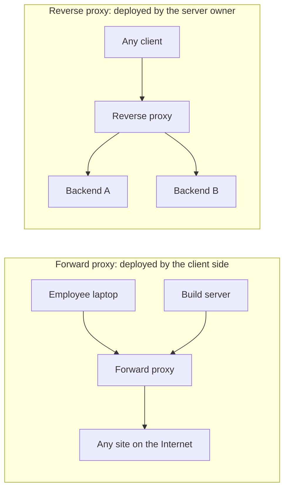
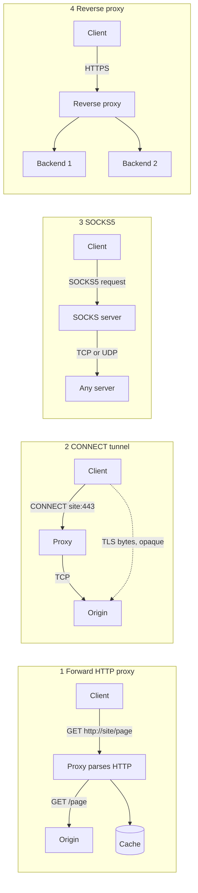
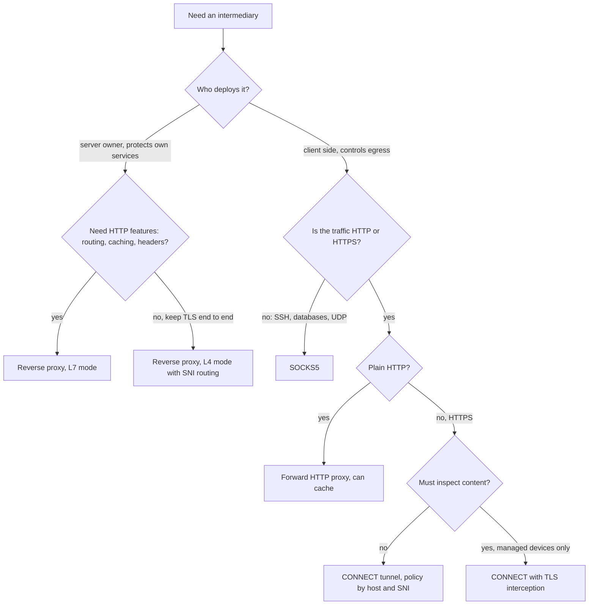
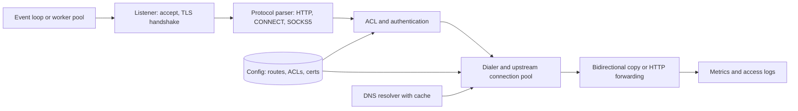
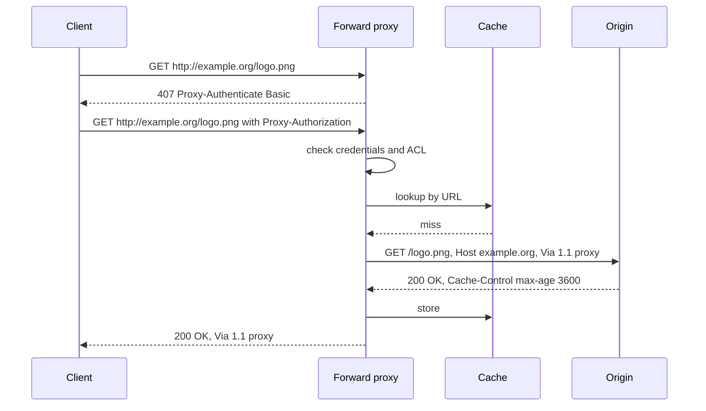
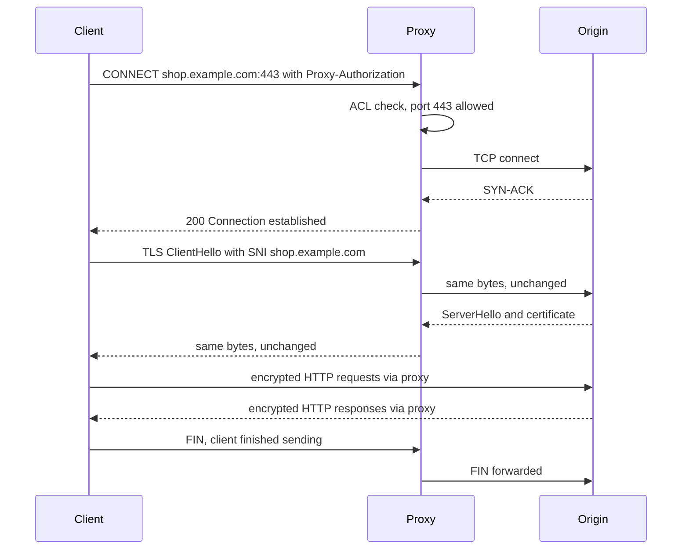
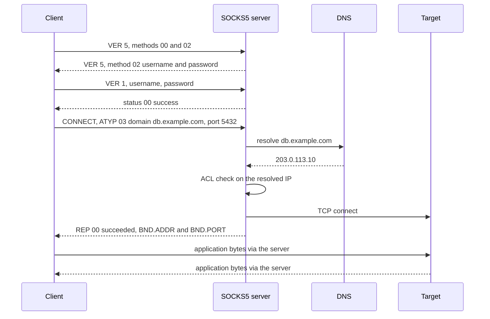
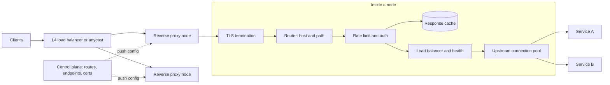
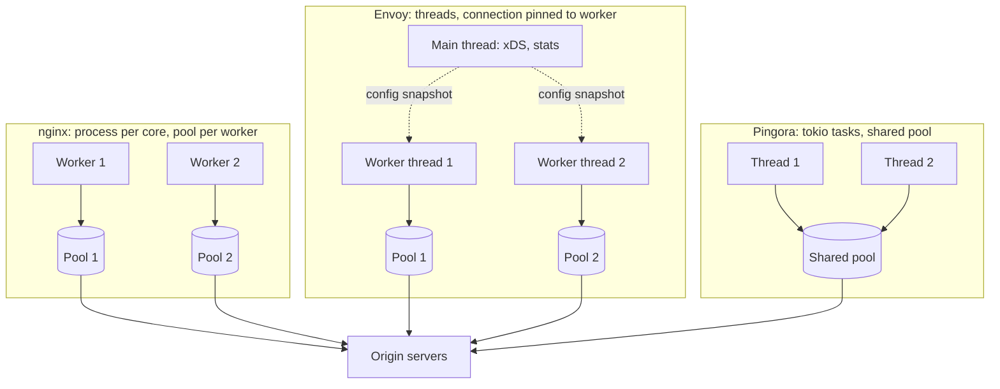
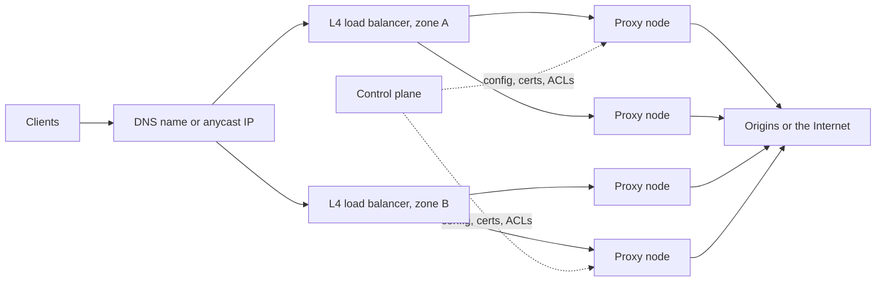

[Русский](./README.md) | **English**

# Chapter 41: Design a Proxy Server

## Introduction

A **proxy server** is an intermediary that accepts a connection or request from a client, opens its own connection to a server and relays data between them. Each side sees the proxy as its peer, and everything a proxy does (caching, filtering, authentication, load balancing, logging) follows from that position.

RFC 9110 (HTTP Semantics) distinguishes the two main roles by **who chooses the intermediary**:
 * A **forward proxy** ("proxy" in the RFC) is "chosen by the client, usually via local configuration rules". It is deployed by the client side (a company, an ISP) and **represents clients**: servers see the proxy's address. Goals: egress control, shared caching, audit.
 * A **reverse proxy** ("gateway" in the RFC) "acts as an origin server for the outbound connection but translates received requests and forwards them inbound to another server or servers". It is deployed by the server owner and **represents servers**; clients usually don't know it exists. Goals: TLS termination, load balancing, caching, protection of backends.
 * The RFC also defines a **tunnel**: "a blind relay between two connections without changing the messages". HTTP CONNECT and SOCKS create tunnels.

The same software often plays both roles; what differs is the trust model, the protocol at the front door and what the proxy may see.

---

## Step 1: Understand the Problem and Establish Design Scope

Possible dialogue between Candidate and Interviewer:
 * C: Are we designing a forward proxy for our employees, or a reverse proxy in front of our services?
 * I: Both: one platform for egress (employees and internal services) and ingress (our web APIs).
 * C: Which protocols must the egress side support?
 * I: HTTP, HTTPS through CONNECT, and SOCKS5 for non-HTTP tools such as database clients.
 * C: Do we decrypt HTTPS on the egress side?
 * I: Not by default; some departments may need inspection later.
 * C: What does the ingress side do?
 * I: TLS termination, routing, load balancing, health checks, caching, compression, rate limiting.
 * C: Authentication?
 * I: Egress users authenticate with corporate credentials. Ingress is public, with per-client rate limits.
 * C: Scale?
 * I: Up to a million concurrent connections and 500k requests per second at peak.

### **Functional requirements**

 * Forward HTTP proxying of absolute-form requests, with header hygiene, authentication (407) and optional caching
 * HTTPS tunneling via CONNECT with a port and destination allow-list
 * SOCKS5 with username/password authentication, CONNECT and (optionally) UDP ASSOCIATE
 * Reverse proxying: TLS termination, L7 routing, load balancing, health checks, caching, compression, rate limiting
 * Access control lists (ACLs) per user, group, source network and destination
 * Access logs and metrics for every connection and request

### **Non-functional requirements**

- **Low added latency**: a few milliseconds at p99 on top of the network
- **High concurrency**: hundreds of thousands of mostly idle connections per node
- **Availability**: no single point of failure; config changes and upgrades don't drop connections
- **Security**: the proxy must not become an open relay, an SSRF gadget or a way into internal networks
- **Observability**: every request attributable to a user, a destination and an outcome

### **Back-of-the-envelope estimation**

All numbers below are **assumptions** for the exercise.

Load:
 * Peak concurrent client connections: **1M** across the fleet (90% idle keep-alive or idle tunnels, 10% active)
 * Peak request rate: **500k RPS** (requests per second); average 200k RPS
 * Average response size: **20 KB**
 * Average client connection lifetime: **60 s**

Derived numbers:
 * **Throughput** = 500k × 20 KB = 10 GB/s ≈ **80 Gbps** at peak, in and out of the proxy
 * **New client connections/s** (Little's law) = 1M / 60 s ≈ **16.7k/s**
 * **File descriptors** - each proxied connection uses **2** (client side + server side): 1M × 2 = **2M FDs** fleet-wide in the worst case without upstream pooling. With 12 nodes (below): 2M / 12 ≈ 167k FDs per node, so the per-process limit (`ulimit -n`) must be well above that, say 512k
 * **Memory per connection** - assume 2 user-space buffers of 16 KB (one per direction) = 32 KB, plus about 40 KB of TLS state for an active TLS connection (an assumption; it depends on the library and record buffers) → ≈ **72 KB per active connection**. Idle connections must release buffers: nginx spends "just 550 bytes" on an idle keep-alive connection (AOSA book); assume 5 KB for an idle TLS connection
 * **Memory total** = 100k active × 72 KB + 900k idle × 5 KB = 7.2 GB + 4.5 GB ≈ **12 GB** fleet-wide in user space, plus kernel socket buffers: not the bottleneck
 * **TLS handshakes** - assume half of new connections resume a session. Full handshakes = 16.7k / 2 ≈ 8.3k/s. Assume, conservatively, one core does **2,000 full handshakes/s** → 8.3k / 2,000 ≈ **4.2 cores**
 * **Upstream TLS without pooling** - if every one of the 500k RPS opened a new TLS connection to a backend: 500k / 2,000 = **250 cores** just for handshakes. With 99% connection reuse: 5k/s → 2.5 cores. **Pooling is the biggest single optimization**
 * **Request processing** - assume one core proxies 10k RPS of L7 traffic including bulk TLS encryption → 500k / 10k = 50 cores. Total ≈ 50 + 4.2 + 2.5 ≈ **57 cores**
 * **Nodes** - assume 16-core nodes with a 25 Gbps NIC, kept at 50% utilization for headroom:
   * by CPU: 57 / (16 × 0.5) ≈ 7.1 → 8 nodes
   * by bandwidth: 80 Gbps / (25 × 0.5) = 6.4 → 7 nodes
   * spread over 3 availability zones with N+1 per zone: 3 × 4 = **12 nodes**, ≈ 83k connections per node

Takeaway: a proxy is bound by connections, handshakes and bandwidth, not by storage. Keep idle connections cheap and reuse upstream connections.

---

## Step 2: Proxy Types Overview

### **Catalog of proxy types**

 1. **Forward HTTP proxy** - the client sends the full URL (`GET http://host/path`); the proxy parses it, applies policy, may serve it from cache, and sends its own request to the origin
 2. **HTTPS tunneling via CONNECT** - the client asks the HTTP proxy to open a TCP connection (`CONNECT host:443`); after `200` the proxy relays encrypted bytes blindly
 3. **SOCKS5** - a separate binary protocol (RFC 1928) that relays any TCP connection, and UDP datagrams, on behalf of the client
 4. **Reverse proxy** - stands in front of servers, terminates client TLS, routes to backends, balances load, caches and protects

### **Comparison**

| Type | OSI layer | Sees content? | Deployed by | Protocols | Caching | Typical tasks | Software |
|---|---|---|---|---|---|---|---|
| Forward HTTP proxy | L7 | Yes, full HTTP request and response | Client side (company, ISP) | HTTP | Yes | Egress control, shared cache, content filtering, audit | Squid, Apache Traffic Server, Envoy |
| CONNECT tunnel | L7 setup, then L4 relay | Only host, port and TLS SNI (unless MITM) | Client side | Any TCP, in practice TLS | No | HTTPS egress, policy by destination | Squid, Envoy, nginx (with modules) |
| SOCKS5 | Between L4 and L7 (session) | Only destination address and port | Client side | Any TCP, UDP | No | Non-HTTP tools, SSH, databases, UDP apps | Dante, microsocks, OpenSSH `-D` |
| Reverse proxy | L7 (or L4 in TCP/SNI mode) | Yes after TLS termination | Server owner | HTTP/1.1, HTTP/2, HTTP/3, gRPC, WebSocket, TCP | Yes | TLS termination, routing, load balancing, caching, rate limiting | nginx, Envoy, HAProxy, Pingora |

### **Overview diagram**

### **How to choose a proxy type**

The key questions: whom the proxy represents, which protocols it must carry, and whether it must see the content. A tunnel keeps end-to-end encryption and costs less CPU; only an L7 proxy that sees plain HTTP (or terminates TLS) can cache.

### **Proxy core shared by all types**

All four types are front-ends on one engine; they differ in the protocol parser and in whether the proxy relays raw bytes or parsed HTTP messages.

 * **Event loop or worker pool** - one thread per core with non-blocking I/O (epoll or kqueue), never a thread per connection
 * **Listener** - accepts connections, enforces connection limits, does the TLS handshake
 * **Protocol parser** - finds the destination: absolute URL, CONNECT authority, SOCKS5 DST.ADDR or a reverse proxy route
 * **ACL and authentication** - checked before any upstream connection is opened
 * **Dialer and pool** - resolves DNS, checks the resolved IP against deny-lists, reuses or opens an upstream connection
 * **Copy or forwarding** - two copy loops with bounded buffers for tunnels; a filter pipeline for HTTP

A minimal data model for the control plane:

| Table | Key fields |
|---|---|
| listener | address, port, mode (forward / connect / socks5 / reverse), cert_ref |
| acl_rule | priority, principal (user, group, CIDR), destination (host, CIDR, ports), action |
| route | host, path_prefix, cluster_id, timeouts, retries, cache_policy |
| cluster | endpoints, lb_policy, health_check, pool_settings |

---

## Step 3: Proxy Types Deep Dive

### **1. Forward HTTP proxy**

**How it works.** The client is configured to use the proxy (system settings, PAC file or `HTTP_PROXY`). RFC 9112: "when making a request to a proxy, other than a CONNECT or server-wide OPTIONS request, a client MUST send the target URI in absolute-form": `GET http://www.example.org/page HTTP/1.1` instead of `GET /page`, otherwise the proxy wouldn't know where to go. The proxy ignores the received `Host` and generates a new one from the request target.

Before forwarding, the proxy rewrites headers:
 * **Hop-by-hop headers** describe only the current connection. RFC 9110: intermediaries MUST remove `Connection` and every field it lists, and SHOULD remove `Proxy-Connection`, `Keep-Alive`, `TE`, `Transfer-Encoding`, `Upgrade`. `Proxy-Authorization` is consumed by the first proxy that expects it
 * **Via** - "A proxy MUST send an appropriate Via header field ... in each message that it forwards", e.g. `Via: 1.1 proxy1.corp`; it records the chain and helps detect loops
 * **X-Forwarded-For** - a de facto header with the client IP; a corporate proxy may add it for internal audit

**Authentication** is a challenge: `407 Proxy Authentication Required` with `Proxy-Authenticate`, then the client repeats the request with `Proxy-Authorization`.

**Caching.** Squid is the classic example: "a high-performance proxy caching server for web clients" that stores objects "on a system closer to the requesting site than to the source", reducing "access time as well as bandwidth consumption". It keeps hot objects and DNS entries in RAM, caches failed requests negatively, and builds cache hierarchies with the Internet Cache Protocol (ICP). Freshness follows HTTP caching rules (`Cache-Control`, `Expires`, validators); the cache trade-offs are those of [Chapter 38](../38.%20Distributed%20Cache/README.en.md). With most traffic now HTTPS, a forward proxy caches little unless it intercepts TLS.

**Content filtering.** Seeing the full URL, method and headers, the proxy can block site categories, file types or methods and log every URL.

 * **What the proxy sees and where state lives** - the whole HTTP exchange. State: client connections, pooled origin connections, the cache (RAM and disk), an authentication cache
 * **Pros** - full visibility, caching, fine-grained URL policy
 * **Cons** - plain HTTP only; for HTTPS it needs CONNECT or interception
 * **Failure modes and threats** - forwarded hop-by-hop headers (broken keep-alive, request smuggling if `Transfer-Encoding` and `Content-Length` are parsed inconsistently); leaked `Proxy-Authorization`; cache poisoning through unkeyed headers; request loops (caught by `Via` and `Max-Forwards`)
 * **When to use** - corporate egress with audit, shared caches on slow links, debugging proxies
 * **Software** - Squid, Apache Traffic Server, Envoy (forward proxy configuration)

### **2. HTTPS tunneling via CONNECT**

**How it works.** For `https://` URLs the client can't send the request to the proxy in clear text. Instead it sends `CONNECT server.example.com:443 HTTP/1.1` in **authority-form** (host and port only; RFC 9110: "There is no default port"). The proxy checks the ACL, opens a TCP connection to the destination and answers with any 2xx, conventionally `200 Connection established`. RFC 9110: after a 2xx, the proxy "will switch to tunnel mode immediately after the response header section". From then on the proxy copies bytes in both directions and the client performs the TLS handshake with the origin through the tunnel.

**What the proxy sees and where state lives.** The host and port from the CONNECT line and, by peeking at the ClientHello, the **SNI** (Server Name Indication) - the hostname in the TLS handshake; a mismatch with the CONNECT host is suspicious. No URLs, headers or bodies. State: two sockets, two buffers, byte counters.

**Restricting ports.** RFC 9110 warns that "a CONNECT to 'example.com:25' ... could trick the proxy into relaying spam email" and says proxies "SHOULD restrict its use to a limited set of known ports or a configurable list of safe request targets". A typical policy allows 443 plus specific host:port pairs.

**Half-close.** TCP lets one side finish sending (FIN) while still reading. If the proxy closes both sockets on the first FIN, the tail of the other direction may be lost. RFC 9110's minimum rule: when either side closes, the intermediary "MUST attempt to send any outstanding data that came from the closed side to the other side, close both connections". Many implementations instead forward the FIN with `shutdown(SHUT_WR)` and close fully when both directions are done or an idle timeout fires.

**TLS interception (MITM) in corporate networks.** For data loss prevention or malware scanning, the proxy terminates the client's TLS with a certificate generated on the fly and signed by a corporate CA installed on managed devices, and opens its own TLS connection to the origin. Consequences: the proxy holds a key that can impersonate any site and becomes a prime target; it must validate origin certificates at least as strictly as a browser; certificate pinning and mutual TLS break, so banks, health sites and OS updates go on a bypass list; users must be informed; CPU cost doubles.

 * **Pros** - any TLS protocol, end-to-end encryption, cheap for the proxy
 * **Cons** - policy only by host, port and SNI; no caching; no URL logs
 * **Failure modes and threats** - CONNECT to arbitrary ports (spam relay, internal services); idle tunnels holding FDs (need idle timeouts); CONNECT to internal IPs (SSRF, see below)
 * **When to use** - default way to proxy HTTPS egress
 * **Software** - Squid, Envoy (CONNECT support in the HTTP connection manager), Apache Traffic Server

### **3. SOCKS5**

**How it works.** SOCKS5 (RFC 1928, 1996) is a binary protocol, "conventionally located on TCP port 1080". It relays any TCP connection and UDP datagrams. A session has three phases:
 1. **Method selection** - the client sends `VER=5`, `NMETHODS` and a list of methods: `X'00'` no authentication, `X'01'` GSSAPI, `X'02'` username/password. The server picks one, or `X'FF'` (no acceptable methods)
 2. **Authentication** - for username/password, RFC 1929: `VER=1, ULEN, UNAME, PLEN, PASSWD`; status `0x00` means success, anything else closes the connection. The RFC warns that "the request carries the password in cleartext"
 3. **Request** - `VER CMD RSV ATYP DST.ADDR DST.PORT` with three commands: **CONNECT** (`X'01'`, outgoing TCP), **BIND** (`X'02'`, accept one incoming connection, e.g. for FTP; two replies: the listening address, then the peer) and **UDP ASSOCIATE** (`X'03'`). The reply carries a code from `X'00'` succeeded to `X'08'` address type not supported

**Address types.** `ATYP` is `X'01'` IPv4 (4 bytes), `X'04'` IPv6 (16 bytes) or `X'03'` domain name (1 length byte + name).

**Where DNS is resolved.** If the client resolves the name and sends an IP, the proxy never sees the hostname. With `ATYP=03` the proxy resolves it. curl calls these modes `socks5://` (curl resolves locally) and `socks5h://` (the hostname goes to the proxy). For an egress platform, proxy-side resolution is better: ACLs can match hostnames and the proxy applies its own DNS policy.

**UDP relay.** After `UDP ASSOCIATE` the server returns the address and port where the client sends datagrams, each with a header `RSV FRAG ATYP DST.ADDR DST.PORT DATA`. Fragmentation is optional; without it, fragments are dropped. "A UDP association terminates when the TCP connection that the UDP ASSOCIATE request arrived on terminates", so the TCP connection acts as a lease. Many open-source servers, such as microsocks and go-socks5, skip UDP entirely.

 * **What the proxy sees and where state lives** - destination address and port, the user, byte counts. State: the control TCP connection, the relayed connection, UDP associations keyed by client address
 * **Pros** - any TCP protocol and UDP; simple and fast; supported by curl, browsers, SSH and Go's `golang.org/x/net/proxy`
 * **Cons** - no encryption; cleartext passwords; no content visibility; uneven UDP support
 * **Failure modes and threats** - an unauthenticated server reachable from the Internet becomes an open relay; BIND and UDP open ports on the proxy, so disable them unless needed; ACLs on hostnames but not on resolved IPs can be bypassed via DNS
 * **When to use** - non-HTTP egress inside a trusted network, reachable only over a VPN or TLS
 * **Software** - Dante, microsocks, OpenSSH dynamic port forwarding (`ssh -D`)

### **4. Reverse proxy**

**How it works.** Clients connect to the reverse proxy as if it were the origin. The proxy:
 * **terminates TLS** - holds certificates, speaks HTTP/2 or HTTP/3 to clients and uses pooled connections to backends
 * **routes at L7** - by host, path, headers or method to a cluster of backends
 * **balances load** - round robin, least requests, or consistent hashing ([Chapter 5](../05.%20Consistent%20Hashing/Readme.en.md)) for cache affinity
 * **checks health** - active probes and passive outlier detection
 * **caches and compresses** - cacheable responses, gzip or brotli
 * **limits rate** - per client, API key or route ([Chapter 4](../04.%20Rate%20Limiter/Readme.en.md))
 * **adds headers** - `X-Forwarded-For`, `X-Forwarded-Proto` or `Forwarded`, and a request ID

**Concurrency models in three real proxies.**

**nginx** - a master process "performs the privileged operations such as reading configuration and binding to ports" and runs worker processes (one per CPU core recommended), plus a cache loader and a cache manager. Each worker is "single-threaded" with a "highly efficient run-loop" over epoll or kqueue. On `SIGHUP` the master "reloads the configuration and forks a new set of worker processes"; old workers finish their requests and exit. The catch, in Cloudflare's words: "the NGINX connection pool is per worker", so a request reuses only its own worker's connections, and more workers mean "more isolated pools".

**Envoy** - "single process, multiple threads". A main thread handles xDS configuration updates, stats and the admin interface; worker threads do "the actual listening, filtering, and forwarding". "When a connection is accepted by a listener, it is bound to a single worker thread for its entire lifetime", so the hot path needs almost no locks; each worker keeps its own upstream pools. A request passes listener filters (the TLS inspector reads SNI to pick a filter chain), TLS decryption, network filters ending in the HTTP connection manager, the codec, HTTP filters and the router, which picks a cluster, an endpoint and a pooled connection. Configuration arrives over **xDS** (discovery service APIs for listeners, routes, clusters, endpoints and secrets).

**Cloudflare Pingora** - Rust on the Tokio runtime, multithreaded with work stealing so a CPU-heavy or blocking request doesn't stall others. Threads **share one connection pool**. For one major customer this raised connection reuse "from 87.1% to 99.92%, which reduced new connections to their origins by 160x"; overall Pingora "makes only a third as many new connections per second" and uses 70% less CPU and 67% less memory than the NGINX-based service it replaced. The original article says Pingora serves "over 1 trillion requests a day"; a 2024 Cloudflare post gives the rate leaving pingora-origin as "35 million requests per second". Business logic plugs into phases: `request_filter`, `upstream_peer` (required: choose the backend), `upstream_request_filter`, `response_filter`, `logging` and others.

 * **What the proxy sees and where state lives** - everything after TLS termination. State: client connections and streams, upstream pools, health status, rate limit counters, cache, keys
 * **Pros** - one place for TLS, routing, protection and observability
 * **Cons** - an extra hop; holds private keys; a misconfiguration affects every service behind it
 * **Failure modes and threats** - retry storms on a struggling backend (use retry budgets and circuit breakers); a slow backend exhausting the pool; a bad config push breaking every node (canary it); HTTP desync between proxy and backend parsers
 * **When to use** - in front of any public service; L4 mode with SNI passthrough when backends must terminate TLS themselves
 * **Software** - nginx, Envoy, HAProxy, Pingora, Apache Traffic Server

---

## Step 3 (continued): Cross-cutting concerns

### **Concurrency models**

 * **Processes** (nginx) - isolation and simplicity; a crash takes down one worker, but pools, caches and counters can't be shared without shared memory
 * **Threads with connections pinned to a worker** (Envoy) - a lock-free hot path; pools are per thread, and a few busy long-lived connections can overload one worker. Envoy lets the kernel balance accepts by default and offers explicit connection balancing for skewed workloads
 * **Threads with a shared pool and work stealing** (Pingora) - the best connection reuse and core balance, at the price of careful concurrent code

In all three, each connection is a non-blocking state machine; a thread per connection is out of the question at 80k connections per node.

### **Connection pooling and keep-alive**

 * **Pool key** - a pooled connection may serve a request only if everything that shapes the connection matches. Pingora's key: IP:port, scheme, SNI, client cert, certificate and hostname verification settings, proxy settings. With SNI in the key, tenant A's request never travels over a TLS session negotiated for tenant B
 * **Idle limits** - cap idle connections per host and keep the idle timeout shorter than the backend's keep-alive timeout, so the proxy never writes to a connection the backend is closing
 * **HTTP/2 multiplexing** - many streams over one connection cut connections and handshakes, but the streams share one TCP connection's fate (TCP head-of-line blocking)
 * **Errors** - Pingora: "A connection is considered not reusable if errors happen during the request"

### **TLS: termination or SNI passthrough**

 * **Termination** - the proxy decrypts, can route by path and cache; it holds the keys and pays for handshakes
 * **Passthrough** - the proxy peeks at the ClientHello, routes by SNI at L4 and relays bytes; backends keep the keys; no L7 features
 * **Session resumption** - session tickets or a session cache let returning clients skip the full handshake (in our estimate, 50% resumption halves handshake CPU). Across a fleet, ticket keys must be shared and rotated, or a client landing on another node does a full handshake

### **Timeouts and slow clients**

A **slowloris** attack opens many connections and sends headers a byte at a time. Defenses: a deadline for the whole request header, not just an idle timeout; a minimum body transfer rate; per-IP and per-node connection caps; cheap idle connections. Use separate timeouts for connect, TLS handshake, first upstream byte, idle and total tunnel lifetime.

### **Backpressure and buffers**

A proxy joins a fast side and a slow side. Reading from a fast origin into unbounded memory while a mobile client drains slowly ends in out-of-memory. Use bounded buffers per direction and stop reading from one side while the other side's buffer is full; TCP flow control then pushes back on the sender. For HTTP, buffering whole responses frees backend connections sooner but costs memory or disk; streaming keeps memory flat but holds the backend connection as long as the client is slow.

### **Hot configuration reload without dropping connections**

 * **nginx** - new workers with the new config, old workers drain; a binary upgrade works the same way, with old and new masters sharing listening sockets
 * **Envoy** - most changes arrive over xDS without restart; hot restart hands listening sockets to a new process over a Unix domain socket while the old one drains (`--drain-time-s`)
 * **Pingora** - lists graceful reload among its features
 * **Rollout** - validate, canary, watch error rates, keep the previous version for rollback

### **Security**

 * **Open proxy** - a forward proxy or SOCKS server open to the Internet gets abused for spam, scraping and attacks attributed to your IPs. Bind egress listeners to internal networks, require authentication, restrict CONNECT ports, alert on unexpected sources
 * **SSRF** (Server-Side Request Forgery) - a proxy fetches arbitrary URLs by design. Deny by default loopback (`127.0.0.0/8`, `::1`), private ranges (`10.0.0.0/8`, `172.16.0.0/12`, `192.168.0.0/16`, `fc00::/7`), link-local (`169.254.0.0/16`, where cloud metadata endpoints live, and `fe80::/10`) and the proxy's own admin ports. Check the **resolved IP**, not the hostname
 * **DNS rebinding** - a domain resolves to a public IP during the ACL check and to an internal IP at connect time. Resolve once, check that IP and connect to exactly that IP
 * **Authentication** - Basic `Proxy-Authorization` and SOCKS5 passwords are cleartext: use them only over TLS or trusted networks, or use Kerberos/Negotiate or mutual TLS. On a reverse proxy, strip client-supplied identity headers and set them only from verified data; trust `X-Forwarded-For` only from known downstream proxies

### **Observability**

 * **Access logs** per request or tunnel: user, client IP, destination host and resolved IP, status, bytes each way, duration, matched ACL rule, termination reason
 * **Metrics** - active and new connections, handshakes/s and resumption rate, pool reuse ratio, upstream errors by type, added latency p50/p99, cache hit ratio, 407 and ACL deny rates
 * **Tracing** - the reverse proxy starts or propagates the trace; it is the first span of every request
 * **Off the hot path** - Envoy writes access logs from a dedicated file flusher thread so disk I/O never blocks workers

### **Horizontal scaling**

 * Proxy nodes hold no durable state, so they scale out behind an **L4 load balancer** that hashes each TCP connection to one node ([Chapter 1](../01.%20Scaling/Readme.en.md))
 * **Anycast** - one IP announced from several sites; clients reach the nearest, and a site is drained by withdrawing the route
 * **Draining** - stop accepting, let connections finish, cap tunnel lifetime
 * **Egress IPs** - for a forward proxy, the public egress IPs are part of the design: partners allow-list them and abuse reports point at them
 * **Shared state** - global rate limit counters go to a shared store; caches can be per node or sharded by consistent hashing

---

## Step 4: Wrap Up

 * A proxy is an intermediary with two connections. Forward proxies are deployed by the client side and represent clients; reverse proxies are deployed by the server owner and represent servers
 * Four types: forward HTTP (sees everything, can cache), CONNECT (blind TLS tunnel, policy by host, port and SNI), SOCKS5 (any TCP and UDP), reverse proxy (TLS termination, routing, load balancing, caching, rate limiting)
 * They share one core: event-driven workers, listener, protocol parser, ACLs, dialer with a connection pool, bidirectional copy, logs and metrics
 * Capacity is set by connections, file descriptors (2 per proxied connection), handshakes and bandwidth. Upstream connection reuse is the biggest lever: Pingora's shared pool cut new connections 160x for one customer
 * The proxy must protect itself and the network: no open relay, CONNECT port limits, SSRF deny-lists on resolved IPs, DNS pinning, strict timeouts, bounded buffers

Additional talking points:
 * **HTTP/3 and MASQUE** - proxying over QUIC, including UDP through an HTTP proxy
 * **Service mesh** - an Envoy sidecar next to every service, managed through xDS
 * **PAC files and WPAD** - how clients discover the forward proxy, and the risks of automatic discovery

---

## References

 * [RFC 9110: HTTP Semantics](https://www.rfc-editor.org/rfc/rfc9110) - sections 3.7 (intermediaries), 7.6 (Connection, Via), 9.3.6 (CONNECT), 11.7 (proxy authentication), 15.5.8 (407)
 * [RFC 9112: HTTP/1.1](https://www.rfc-editor.org/rfc/rfc9112) - section 3.2 (request-target forms), 9.6 (tear-down)
 * [RFC 1928: SOCKS Protocol Version 5](https://www.rfc-editor.org/rfc/rfc1928)
 * [RFC 1929: Username/Password Authentication for SOCKS V5](https://www.rfc-editor.org/rfc/rfc1929)
 * [Eli Bendersky: Go and Proxy Servers, Part 1 - HTTP Proxies](https://eli.thegreenplace.net/2022/go-and-proxy-servers-part-1-http-proxies/)
 * [Eli Bendersky: Go and Proxy Servers, Part 2 - HTTPS Proxies](https://eli.thegreenplace.net/2022/go-and-proxy-servers-part-2-https-proxies/)
 * [Eli Bendersky: Go and Proxy Servers, Part 3 - SOCKS proxies](https://eli.thegreenplace.net/2022/go-and-proxy-servers-part-3-socks-proxies/)
 * [Everything curl: SOCKS proxy](https://everything.curl.dev/usingcurl/proxies/socks.html)
 * [Envoy: Threading model](https://www.envoyproxy.io/docs/envoy/latest/intro/arch_overview/intro/threading_model)
 * [Envoy: Life of a Request](https://www.envoyproxy.io/docs/envoy/latest/intro/life_of_a_request)
 * [Envoy: Hot restart](https://www.envoyproxy.io/docs/envoy/latest/intro/arch_overview/operations/hot_restart)
 * [Cloudflare: How we built Pingora, the proxy that connects Cloudflare to the Internet](https://blog.cloudflare.com/how-we-built-pingora-the-proxy-that-connects-cloudflare-to-the-internet/)
 * [Cloudflare: A good day to trie-hard: saving compute 1% at a time](https://blog.cloudflare.com/pingora-saving-compute-1-percent-at-a-time/)
 * [Pingora (GitHub)](https://github.com/cloudflare/pingora), [Life of a request: phases](https://github.com/cloudflare/pingora/blob/main/docs/user_guide/phase.md), [Connection pooling](https://github.com/cloudflare/pingora/blob/main/docs/user_guide/pooling.md)
 * [The Architecture of Open Source Applications, Volume II: nginx](https://aosabook.org/en/v2/nginx.html)
 * [NGINX blog: Inside NGINX: How We Designed for Performance & Scale](https://blog.nginx.org/blog/inside-nginx-how-we-designed-for-performance-scale)
 * [Squid FAQ: About Squid](https://wiki.squid-cache.org/SquidFaq/AboutSquid)
 * [Chapter 4: Design a Rate Limiter](../04.%20Rate%20Limiter/Readme.en.md)
 * [Chapter 38: Design a Distributed Cache](../38.%20Distributed%20Cache/README.en.md)
