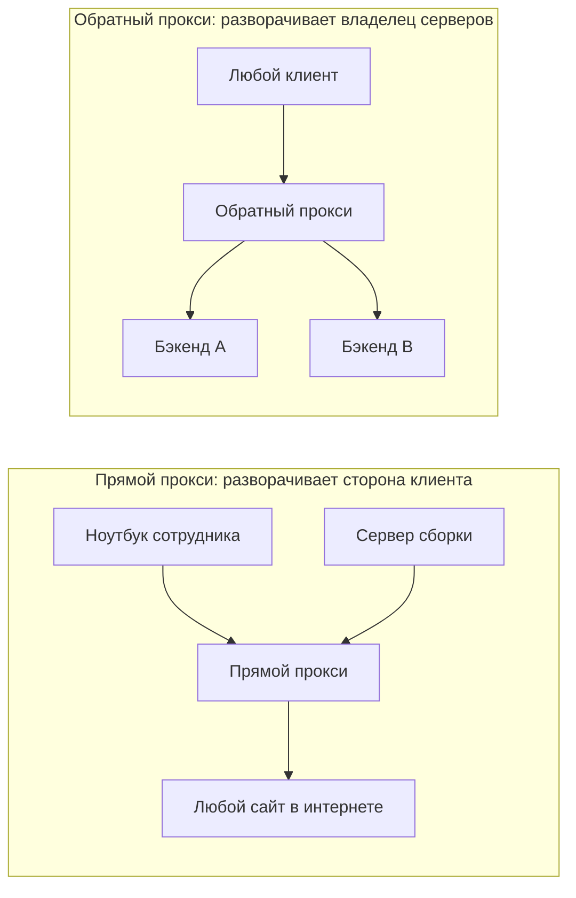
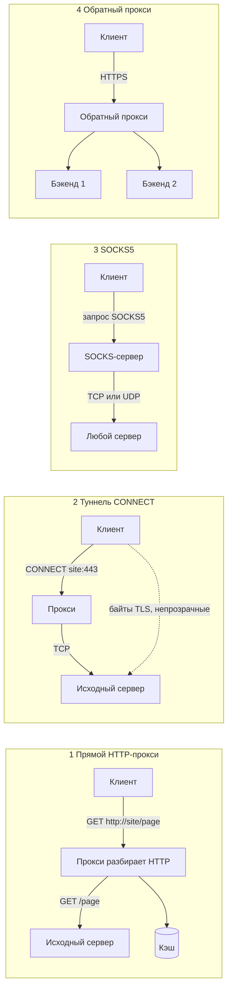
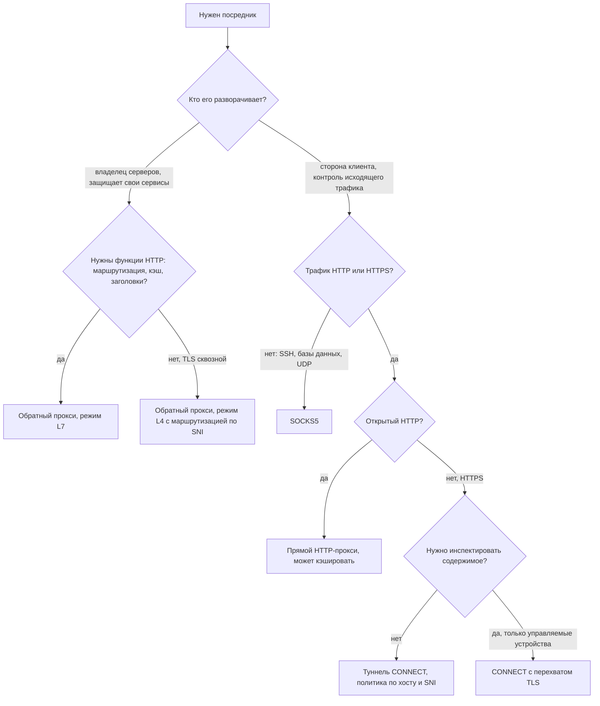
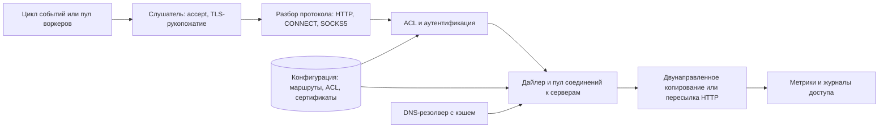
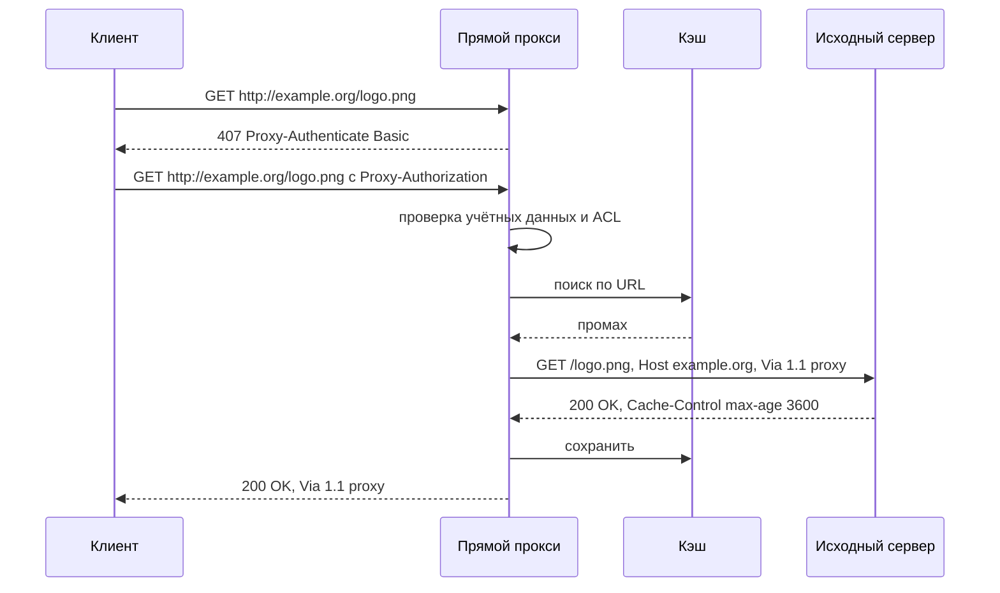
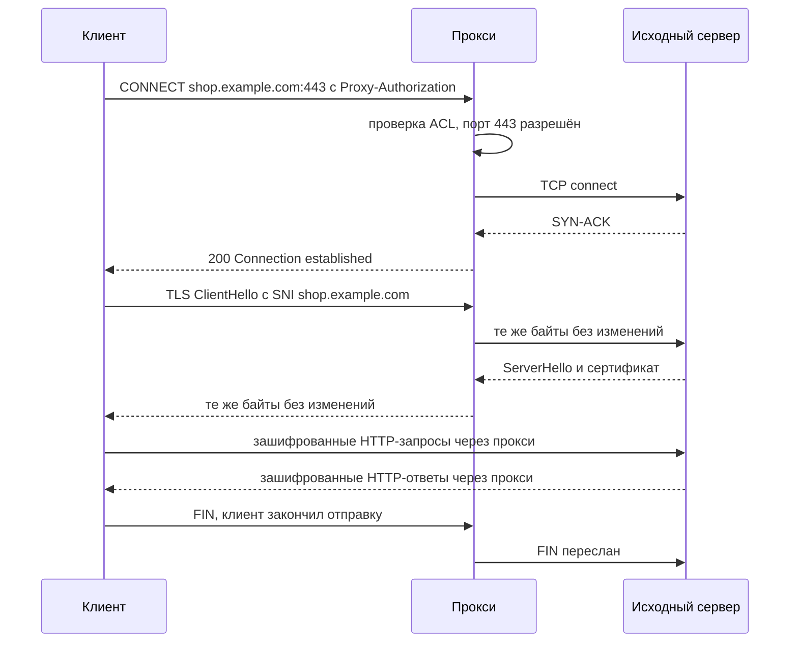
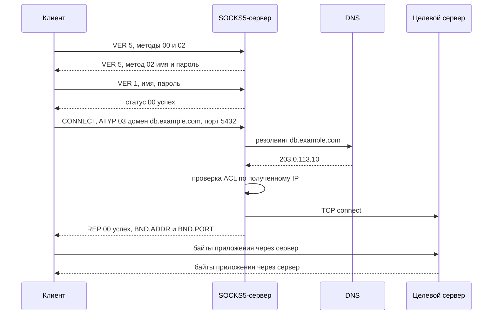
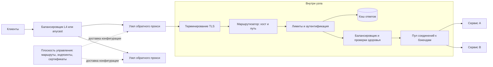
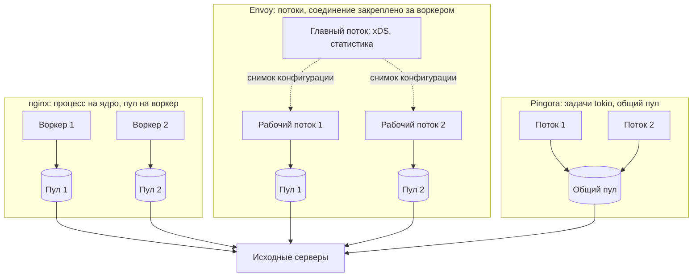
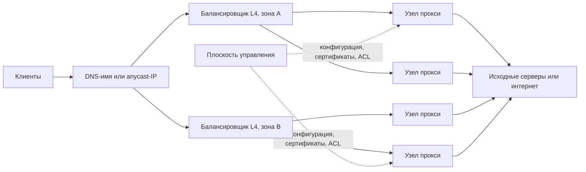

**Русский** | [English](./README.en.md)

# Глава 41: Прокси-сервер

## Введение

**Прокси-сервер (proxy server)** — это посредник, который принимает соединение или запрос от клиента, открывает собственное соединение с сервером и передаёт данные между ними. Каждая сторона видит прокси как своего собеседника, и всё, что умеет прокси (кэширование, фильтрация, аутентификация, балансировка нагрузки, журналирование), следует из этого положения посередине.

RFC 9110 (Request for Comments — серия документов-стандартов интернета; этот описывает семантику HTTP, HyperText Transfer Protocol — протокол передачи гипертекста) различает две главные роли по тому, **кто выбирает посредника**:
 * **Прямой прокси (forward proxy)** («proxy» в терминах RFC) «выбирается клиентом, обычно через локальные правила конфигурации». Его разворачивает сторона клиента (компания, ISP — Internet Service Provider, интернет-провайдер), и он **представляет клиентов**: серверы видят адрес прокси. Задачи: контроль исходящего трафика (egress), общий кэш, аудит.
 * **Обратный прокси (reverse proxy)** («gateway», шлюз, в терминах RFC) «выступает как исходный сервер (origin server) для внешнего соединения, но транслирует полученные запросы и пересылает их внутрь, другому серверу или серверам». Его разворачивает владелец серверов, и он **представляет серверы**; клиенты обычно не знают о его существовании. Задачи: терминирование TLS (Transport Layer Security — протокол защиты транспортного уровня), балансировка нагрузки, кэширование, защита бэкендов.
 * RFC также определяет **туннель (tunnel)**: «слепой ретранслятор между двумя соединениями, не изменяющий сообщения». Туннели создают HTTP CONNECT и SOCKS (SOCKet Secure — протокол проксирования сокетов).

Одно и то же ПО часто играет обе роли; различаются модель доверия, протокол «на входе» и то, что прокси разрешено видеть.

---

## Шаг 1: Понять задачу и определить рамки проектирования

Возможный диалог кандидата (К) и интервьюера (И):
 * К: Мы проектируем прямой прокси для сотрудников или обратный прокси перед нашими сервисами?
 * И: Оба: одна платформа для исходящего трафика (сотрудники и внутренние сервисы) и входящего (ingress — наши веб-API, Application Programming Interface — программный интерфейс).
 * К: Какие протоколы нужны для исходящего трафика?
 * И: HTTP, HTTPS (HTTP Secure — HTTP поверх TLS) через CONNECT и SOCKS5 для не-HTTP-инструментов, например клиентов баз данных.
 * К: Расшифровываем ли HTTPS на выходе?
 * И: По умолчанию нет; некоторым отделам позже может понадобиться инспекция.
 * К: Что делает входящая сторона?
 * И: Терминирование TLS, маршрутизацию, балансировку нагрузки, проверки здоровья, кэширование, сжатие, ограничение скорости.
 * К: Аутентификация?
 * И: Пользователи исходящего прокси входят с корпоративными учётными данными. Входящая сторона публичная, с лимитами на клиента.
 * К: Масштаб?
 * И: До миллиона одновременных соединений и 500 тыс. запросов в секунду в пике.

### **Функциональные требования**

 * Прямое HTTP-проксирование запросов в абсолютной форме (absolute-form) с очисткой заголовков, аутентификацией (407) и опциональным кэшированием
 * HTTPS-туннели через CONNECT со списком разрешённых портов и адресатов
 * SOCKS5 с аутентификацией по имени и паролю, командами CONNECT и (опционально) UDP ASSOCIATE
 * Обратное проксирование: терминирование TLS, маршрутизация L7, балансировка нагрузки, проверки здоровья, кэширование, сжатие, ограничение скорости
 * Списки контроля доступа, ACL (Access Control List), по пользователю, группе, исходной сети и адресату
 * Журналы доступа и метрики для каждого соединения и запроса

### **Нефункциональные требования**

- **Низкая добавленная задержка**: несколько миллисекунд на p99 (99-й перцентиль) сверх сети
- **Высокая конкурентность**: сотни тысяч в основном простаивающих соединений на узел
- **Доступность**: нет единой точки отказа; изменения конфигурации и обновления не обрывают соединения
- **Безопасность**: прокси не должен стать открытым ретранслятором, инструментом SSRF или входом во внутренние сети
- **Наблюдаемость**: каждый запрос привязан к пользователю, адресату и результату

### **Оценка «на салфетке» (back-of-the-envelope)**

Все числа ниже — **допущения** для упражнения.

Нагрузка:
 * Одновременных клиентских соединений в пике: **1 млн** на весь парк (90% — простаивающие keep-alive-соединения или туннели, 10% — активные)
 * Пиковая частота запросов: **500 тыс. RPS** (Requests Per Second — запросов в секунду); в среднем 200 тыс. RPS
 * Средний размер ответа: **20 КБ**
 * Среднее время жизни клиентского соединения: **60 с**

Производные величины:
 * **Пропускная способность** = 500 тыс. × 20 КБ = 10 ГБ/с ≈ **80 Гбит/с** в пике на вход и на выход прокси
 * **Новых клиентских соединений в секунду** (закон Литтла) = 1 млн / 60 с ≈ **16,7 тыс./с**
 * **Файловые дескрипторы (file descriptors, FD)** — каждое проксируемое соединение занимает **2** (сторона клиента + сторона сервера): 1 млн × 2 = **2 млн FD** на парк в худшем случае, без пула соединений к серверам. При 12 узлах (ниже): 2 млн / 12 ≈ 167 тыс. FD на узел, поэтому лимит процесса (`ulimit -n`) должен быть заметно выше, скажем 512 тыс.
 * **Память на соединение** — примем 2 буфера в пространстве пользователя по 16 КБ (по одному на направление) = 32 КБ плюс около 40 КБ состояния TLS для активного TLS-соединения (допущение; зависит от библиотеки и буферов записей) → ≈ **72 КБ на активное соединение**. Простаивающие соединения должны освобождать буферы: nginx тратит «всего 550 байт» на простаивающее keep-alive-соединение (книга AOSA, The Architecture of Open Source Applications); примем 5 КБ на простаивающее TLS-соединение
 * **Память всего** = 100 тыс. активных × 72 КБ + 900 тыс. простаивающих × 5 КБ = 7,2 ГБ + 4,5 ГБ ≈ **12 ГБ** на парк в пространстве пользователя плюс буферы сокетов ядра: не узкое место
 * **TLS-рукопожатия (handshakes)** — примем, что половина новых соединений возобновляет сессию. Полных рукопожатий = 16,7 тыс. / 2 ≈ 8,3 тыс./с. Примем с запасом, что одно ядро делает **2 000 полных рукопожатий/с** → 8,3 тыс. / 2 000 ≈ **4,2 ядра**
 * **TLS к бэкендам без пула** — если бы каждый из 500 тыс. RPS открывал новое TLS-соединение к бэкенду: 500 тыс. / 2 000 = **250 ядер** только на рукопожатия. При 99% переиспользования соединений: 5 тыс./с → 2,5 ядра. **Пулинг — самая крупная отдельная оптимизация**
 * **Обработка запросов** — примем, что одно ядро проксирует 10 тыс. RPS трафика L7 (Layer 7, прикладной уровень модели OSI — Open Systems Interconnection, модель взаимодействия открытых систем) вместе с шифрованием TLS → 500 тыс. / 10 тыс. = 50 ядер. Всего ≈ 50 + 4,2 + 2,5 ≈ **57 ядер**
 * **Узлы** — примем 16-ядерные узлы с сетевой картой (NIC, Network Interface Card) 25 Гбит/с при загрузке 50% для запаса:
   * по CPU (Central Processing Unit — центральный процессор): 57 / (16 × 0,5) ≈ 7,1 → 8 узлов
   * по пропускной способности: 80 Гбит/с / (25 × 0,5) = 6,4 → 7 узлов
   * с распределением по 3 зонам доступности и N+1 в каждой зоне: 3 × 4 = **12 узлов**, ≈ 83 тыс. соединений на узел

Вывод: прокси ограничен соединениями, рукопожатиями и пропускной способностью, а не хранилищем. Простаивающие соединения должны быть дешёвыми, а соединения к серверам — переиспользоваться.

---

## Шаг 2: Обзор типов прокси

### **Каталог типов прокси**

 1. **Прямой HTTP-прокси (forward HTTP proxy)** — клиент отправляет полный URL (Uniform Resource Locator — унифицированный указатель ресурса), `GET http://host/path`; прокси разбирает запрос, применяет политику, может ответить из кэша и отправляет собственный запрос исходному серверу
 2. **HTTPS-туннелирование через CONNECT (HTTPS tunneling)** — клиент просит HTTP-прокси открыть TCP-соединение (TCP, Transmission Control Protocol — протокол управления передачей), `CONNECT host:443`; после ответа `200` прокси вслепую передаёт зашифрованные байты
 3. **SOCKS5** — отдельный двоичный протокол (RFC 1928), который ретранслирует любое TCP-соединение и UDP-датаграммы (UDP, User Datagram Protocol — протокол пользовательских датаграмм) от имени клиента
 4. **Обратный прокси (reverse proxy)** — стоит перед серверами, терминирует клиентский TLS, маршрутизирует к бэкендам, балансирует нагрузку, кэширует и защищает

### **Сравнение**

| Тип | Уровень OSI | Видит содержимое? | Кто разворачивает | Протоколы | Кэширование | Типичные задачи | ПО |
|---|---|---|---|---|---|---|---|
| Прямой HTTP-прокси | L7 | Да, весь HTTP-запрос и ответ | Сторона клиента (компания, ISP) | HTTP | Да | Контроль исходящего трафика, общий кэш, фильтрация контента, аудит | Squid, Apache Traffic Server, Envoy |
| Туннель CONNECT | Установка на L7, затем ретрансляция на L4 | Только хост, порт и TLS SNI (без MITM) | Сторона клиента | Любой TCP, на практике TLS | Нет | Исходящий HTTPS, политика по адресату | Squid, Envoy, nginx (с модулями) |
| SOCKS5 | Между L4 и L7 (сеансовый) | Только адрес и порт назначения | Сторона клиента | Любой TCP, UDP | Нет | Не-HTTP-инструменты, SSH, базы данных, UDP-приложения | Dante, microsocks, OpenSSH `-D` |
| Обратный прокси | L7 (или L4 в режиме TCP/SNI) | Да, после терминирования TLS | Владелец серверов | HTTP/1.1, HTTP/2, HTTP/3, gRPC, WebSocket, TCP | Да | Терминирование TLS, маршрутизация, балансировка, кэширование, ограничение скорости | nginx, Envoy, HAProxy, Pingora |

Здесь L4 (Layer 4) — транспортный уровень модели OSI, SNI (Server Name Indication) — имя сервера в TLS-рукопожатии, MITM (Man-in-the-Middle) — перехват «человек посередине», SSH (Secure Shell) — протокол защищённого удалённого доступа, gRPC — фреймворк удалённого вызова процедур от Google.

### **Обзорная диаграмма**

### **Как выбрать тип прокси**

Ключевые вопросы: кого представляет прокси, какие протоколы он должен передавать и должен ли он видеть содержимое. Туннель сохраняет сквозное шифрование и дешевле по CPU; кэшировать может только прокси L7, который видит открытый HTTP (или терминирует TLS).

### **Ядро прокси, общее для всех типов**

Все четыре типа — разные «входы» в один движок; они различаются разборщиком протокола и тем, передаёт ли прокси сырые байты или разобранные HTTP-сообщения.

 * **Цикл событий (event loop) или пул воркеров** — один поток на ядро с неблокирующим вводом-выводом (I/O, Input/Output) через epoll или kqueue, никогда не поток на соединение
 * **Слушатель (listener)** — принимает соединения, применяет лимиты соединений, выполняет TLS-рукопожатие
 * **Разбор протокола** — находит адресата: абсолютный URL, адрес из CONNECT, SOCKS5 DST.ADDR или маршрут обратного прокси
 * **ACL и аутентификация** — проверяются до открытия любого соединения к серверу
 * **Дайлер (dialer) и пул** — резолвит DNS (Domain Name System — система доменных имён), проверяет полученный IP-адрес (IP, Internet Protocol — межсетевой протокол) по запретным спискам, переиспользует или открывает соединение к серверу
 * **Копирование или пересылка** — два цикла копирования с ограниченными буферами для туннелей; конвейер фильтров для HTTP

Минимальная модель данных плоскости управления (control plane):

| Таблица | Ключевые поля |
|---|---|
| listener | address, port, mode (forward / connect / socks5 / reverse), cert_ref |
| acl_rule | priority, principal (пользователь, группа, CIDR), destination (хост, CIDR, порты), action |
| route | host, path_prefix, cluster_id, timeouts, retries, cache_policy |
| cluster | endpoints, lb_policy, health_check, pool_settings |

CIDR (Classless Inter-Domain Routing) — запись диапазона адресов вида `10.0.0.0/8`.

---

## Шаг 3: Типы прокси подробно

### **1. Прямой HTTP-прокси**

**Как работает.** Клиент настроен на использование прокси (системные настройки, PAC-файл — Proxy Auto-Config, или `HTTP_PROXY`). RFC 9112: «при запросе к прокси, кроме CONNECT и OPTIONS ко всему серверу, клиент ДОЛЖЕН (MUST) отправить целевой URI (Uniform Resource Identifier — унифицированный идентификатор ресурса) в абсолютной форме»: `GET http://www.example.org/page HTTP/1.1` вместо `GET /page`, иначе прокси не знал бы, куда идти. Прокси игнорирует полученный `Host` и формирует новый по цели запроса.

Перед пересылкой прокси переписывает заголовки:
 * **Пошаговые заголовки (hop-by-hop headers)** описывают только текущее соединение. RFC 9110: посредники ДОЛЖНЫ удалить `Connection` и все перечисленные в нём поля и СЛЕДУЕТ (SHOULD) удалить `Proxy-Connection`, `Keep-Alive`, `TE`, `Transfer-Encoding`, `Upgrade`. `Proxy-Authorization` потребляется первым прокси, который его ожидает
 * **Via** — «прокси ДОЛЖЕН отправлять соответствующее поле Via ... в каждом пересылаемом сообщении», например `Via: 1.1 proxy1.corp`; оно фиксирует цепочку и помогает обнаруживать петли
 * **X-Forwarded-For** — заголовок-стандарт де-факто с IP клиента; корпоративный прокси может добавлять его для внутреннего аудита

**Аутентификация** — это вызов (challenge): `407 Proxy Authentication Required` с `Proxy-Authenticate`, затем клиент повторяет запрос с `Proxy-Authorization`.

**Кэширование.** Классический пример — Squid: «высокопроизводительный кэширующий прокси-сервер для веб-клиентов», который хранит объекты «в системе, расположенной ближе к запрашивающей стороне, чем к источнику», сокращая «время доступа и расход полосы». Он держит горячие объекты и DNS-записи в RAM (Random Access Memory — оперативная память), негативно кэширует неудачные запросы и строит иерархии кэшей по протоколу ICP (Internet Cache Protocol). Свежесть определяется правилами HTTP-кэширования (`Cache-Control`, `Expires`, валидаторы); компромиссы самого кэша — как в [главе 38](../38.%20Distributed%20Cache/README.md). Поскольку большая часть трафика теперь HTTPS, прямой прокси без перехвата TLS кэширует немного.

**Фильтрация контента.** Видя полный URL, метод и заголовки, прокси может блокировать категории сайтов, типы файлов или методы и журналировать каждый URL.

 * **Что видит прокси и где хранится состояние** — весь HTTP-обмен. Состояние: клиентские соединения, пул соединений к исходным серверам, кэш (RAM и диск), кэш аутентификации
 * **Плюсы** — полная видимость, кэширование, детальная политика по URL
 * **Минусы** — только открытый HTTP; для HTTPS нужен CONNECT или перехват
 * **Режимы отказа и угрозы** — пересланные пошаговые заголовки (сломанный keep-alive, контрабанда запросов (request smuggling), если `Transfer-Encoding` и `Content-Length` разбираются по-разному); утечка `Proxy-Authorization`; отравление кэша через заголовки, не входящие в ключ; петли запросов (ловятся по `Via` и `Max-Forwards`)
 * **Когда использовать** — корпоративный выход в интернет с аудитом, общие кэши на медленных каналах, отладочные прокси
 * **Реальное ПО** — Squid, Apache Traffic Server, Envoy (конфигурация прямого прокси)

### **2. HTTPS-туннелирование через CONNECT**

**Как работает.** Для `https://` URL клиент не может отправить запрос прокси открытым текстом. Вместо этого он отправляет `CONNECT server.example.com:443 HTTP/1.1` в **форме authority (authority-form)** — только хост и порт; RFC 9110: «порта по умолчанию нет». Прокси проверяет ACL, открывает TCP-соединение с адресатом и отвечает любым 2xx, обычно `200 Connection established`. RFC 9110: после 2xx прокси «переключается в режим туннеля сразу после секции заголовков ответа». Дальше прокси копирует байты в обе стороны, а клиент выполняет TLS-рукопожатие с исходным сервером через туннель.

**Что видит прокси и где хранится состояние.** Хост и порт из строки CONNECT и, если заглянуть в ClientHello, **SNI** — имя хоста в TLS-рукопожатии; несовпадение с хостом из CONNECT подозрительно. URL, заголовки и тела не видны. Состояние: два сокета, два буфера, счётчики байтов.

**Ограничение портов.** RFC 9110 предупреждает, что «CONNECT на 'example.com:25' ... может заставить прокси ретранслировать спам» (порт 25 — SMTP, Simple Mail Transfer Protocol, протокол передачи почты), и говорит, что прокси «СЛЕДУЕТ ограничивать его использование небольшим набором известных портов или настраиваемым списком безопасных целей». Типичная политика разрешает 443 и отдельные пары хост:порт.

**Полузакрытие соединения (half-close).** TCP позволяет одной стороне закончить отправку (FIN — флаг завершения передачи в TCP), продолжая читать. Если прокси закроет оба сокета при первом FIN, хвост данных в другом направлении может потеряться. Минимальное правило RFC 9110: когда любая сторона закрывается, посредник «ДОЛЖЕН попытаться отправить все оставшиеся данные, пришедшие от закрытой стороны, другой стороне, закрыть оба соединения». Многие реализации вместо этого пересылают FIN через `shutdown(SHUT_WR)` и закрывают соединение полностью, когда завершены оба направления или сработал таймаут простоя.

**Перехват TLS (MITM) в корпоративных сетях.** Для предотвращения утечек данных или проверки на вредоносное ПО прокси терминирует клиентский TLS сертификатом, сгенерированным на лету и подписанным корпоративным удостоверяющим центром (CA, Certificate Authority), установленным на управляемых устройствах, и открывает собственное TLS-соединение с исходным сервером. Последствия: прокси хранит ключ, которым можно выдать себя за любой сайт, и становится главной мишенью; он должен проверять сертификаты исходных серверов не менее строго, чем браузер; закрепление сертификатов (certificate pinning) и взаимный TLS (mutual TLS) ломаются, поэтому банки, медицинские сайты и обновления ОС вносятся в список исключений; пользователей нужно информировать; затраты CPU удваиваются.

 * **Плюсы** — любой протокол поверх TLS, сквозное шифрование, дёшево для прокси
 * **Минусы** — политика только по хосту, порту и SNI; нет кэширования; нет журналов URL
 * **Режимы отказа и угрозы** — CONNECT на произвольные порты (ретрансляция спама, внутренние сервисы); простаивающие туннели, удерживающие FD (нужны таймауты простоя); CONNECT на внутренние IP (SSRF, см. ниже)
 * **Когда использовать** — стандартный способ проксировать исходящий HTTPS
 * **Реальное ПО** — Squid, Envoy (поддержка CONNECT в HTTP connection manager), Apache Traffic Server

### **3. SOCKS5**

**Как работает.** SOCKS5 (RFC 1928, 1996) — двоичный протокол, «по соглашению работающий на TCP-порту 1080». Он ретранслирует любое TCP-соединение и UDP-датаграммы. Сеанс состоит из трёх фаз:
 1. **Выбор метода** — клиент отправляет `VER=5`, `NMETHODS` и список методов: `X'00'` без аутентификации, `X'01'` GSSAPI (Generic Security Service API — общий интерфейс служб безопасности), `X'02'` имя и пароль. Сервер выбирает один или отвечает `X'FF'` (нет приемлемых методов)
 2. **Аутентификация** — для имени и пароля, RFC 1929: `VER=1, ULEN, UNAME, PLEN, PASSWD`; статус `0x00` означает успех, любой другой закрывает соединение. RFC предупреждает, что «запрос передаёт пароль открытым текстом»
 3. **Запрос** — `VER CMD RSV ATYP DST.ADDR DST.PORT` с тремя командами: **CONNECT** (`X'01'`, исходящий TCP), **BIND** (`X'02'`, принять одно входящее соединение, например для FTP — File Transfer Protocol; два ответа: адрес прослушивания, затем адрес подключившегося) и **UDP ASSOCIATE** (`X'03'`). Ответ содержит код от `X'00'` (успех) до `X'08'` (тип адреса не поддерживается)

**Типы адресов.** `ATYP` — это `X'01'` IPv4 (4 байта), `X'04'` IPv6 (16 байт) или `X'03'` доменное имя (1 байт длины + имя).

**Где выполняется DNS-резолвинг.** Если клиент сам резолвит имя и отправляет IP, прокси никогда не видит имя хоста. С `ATYP=03` резолвит прокси. В curl эти режимы называются `socks5://` (curl резолвит локально) и `socks5h://` (имя хоста уходит прокси). Для платформы исходящего трафика лучше резолвинг на стороне прокси: ACL могут сопоставлять имена хостов, а прокси применяет свою DNS-политику.

**UDP-ретрансляция.** После `UDP ASSOCIATE` сервер возвращает адрес и порт, куда клиент отправляет датаграммы, каждая с заголовком `RSV FRAG ATYP DST.ADDR DST.PORT DATA`. Фрагментация необязательна; без её поддержки фрагменты отбрасываются. «UDP-ассоциация завершается, когда завершается TCP-соединение, по которому пришёл запрос UDP ASSOCIATE», так что TCP-соединение служит арендой (lease). Многие открытые серверы, например microsocks и go-socks5, UDP вообще не реализуют.

 * **Что видит прокси и где хранится состояние** — адрес и порт назначения, пользователя, счётчики байтов. Состояние: управляющее TCP-соединение, ретранслируемое соединение, UDP-ассоциации по адресу клиента
 * **Плюсы** — любой TCP-протокол и UDP; просто и быстро; поддерживается curl, браузерами, SSH и Go-пакетом `golang.org/x/net/proxy`
 * **Минусы** — нет шифрования; пароли открытым текстом; нет видимости содержимого; неравномерная поддержка UDP
 * **Режимы отказа и угрозы** — сервер без аутентификации, доступный из интернета, становится открытым ретранслятором; BIND и UDP открывают порты на прокси, поэтому их отключают, если не нужны; ACL по именам хостов, но не по полученным IP можно обойти через DNS
 * **Когда использовать** — не-HTTP-трафик наружу внутри доверенной сети, доступ только через VPN (Virtual Private Network — виртуальная частная сеть) или TLS
 * **Реальное ПО** — Dante, microsocks, динамический проброс портов OpenSSH (`ssh -D`)

### **4. Обратный прокси**

**Как работает.** Клиенты подключаются к обратному прокси так, будто это исходный сервер. Прокси:
 * **терминирует TLS** — хранит сертификаты, говорит с клиентами по HTTP/2 или HTTP/3 и использует пул соединений к бэкендам
 * **маршрутизирует на L7** — по хосту, пути, заголовкам или методу к кластеру бэкендов
 * **балансирует нагрузку** — round robin, наименьшее число запросов или консистентное хеширование ([глава 5](../05.%20Consistent%20Hashing/Readme.md)) для привязки к кэшу
 * **проверяет здоровье (health checks)** — активные пробы и пассивное обнаружение выбросов (outlier detection)
 * **кэширует и сжимает** — кэшируемые ответы, gzip или brotli
 * **ограничивает скорость (rate limiting)** — по клиенту, API-ключу или маршруту ([глава 4](../04.%20Rate%20Limiter/Readme.md))
 * **добавляет заголовки** — `X-Forwarded-For`, `X-Forwarded-Proto` или `Forwarded` и идентификатор запроса

**Модели конкурентности в трёх реальных прокси.**

**nginx** — мастер-процесс «выполняет привилегированные операции, такие как чтение конфигурации и привязка к портам», и запускает рабочие процессы (воркеры; рекомендуется по одному на ядро CPU), а также загрузчик кэша (cache loader) и менеджер кэша (cache manager). Каждый воркер «однопоточный» с «очень эффективным циклом выполнения (run-loop)» поверх epoll или kqueue. По `SIGHUP` мастер «перечитывает конфигурацию и запускает новый набор рабочих процессов»; старые воркеры завершают свои запросы и выходят. Подвох, по словам Cloudflare: «пул соединений NGINX — свой у каждого воркера», поэтому запрос переиспользует только соединения своего воркера, а больше воркеров означает «больше изолированных пулов».

**Envoy** — «один процесс, несколько потоков». Главный поток обрабатывает обновления конфигурации через xDS, статистику и административный интерфейс; рабочие потоки выполняют «собственно прослушивание, фильтрацию и пересылку». «Когда слушатель принимает соединение, оно закрепляется за одним рабочим потоком на всё время жизни», поэтому горячему пути почти не нужны блокировки; у каждого воркера свои пулы соединений к серверам. Запрос проходит фильтры слушателя (TLS inspector читает SNI, чтобы выбрать цепочку фильтров), расшифровку TLS, сетевые фильтры, последний из которых — HTTP connection manager, кодек, HTTP-фильтры и маршрутизатор (router), который выбирает кластер, эндпоинт и соединение из пула. Конфигурация приходит через **xDS** (x Discovery Service — семейство API обнаружения для слушателей, маршрутов, кластеров, эндпоинтов и секретов).

**Cloudflare Pingora** — Rust на рантайме Tokio, многопоточный с перехватом работы (work stealing), чтобы тяжёлый по CPU или блокирующий запрос не тормозил остальные. Потоки **разделяют один пул соединений**. Для одного крупного клиента это подняло долю переиспользуемых соединений «с 87,1% до 99,92%, что сократило число новых соединений к его исходным серверам в 160 раз»; в целом Pingora «создаёт лишь треть новых соединений в секунду» и тратит на 70% меньше CPU и на 67% меньше памяти, чем заменённый им сервис на базе NGINX. В исходной статье сказано, что Pingora обслуживает «более 1 триллиона запросов в день»; в посте Cloudflare 2024 года поток запросов, выходящих из pingora-origin, оценён в «35 миллионов запросов в секунду». Бизнес-логика подключается к фазам: `request_filter`, `upstream_peer` (обязательная: выбрать бэкенд), `upstream_request_filter`, `response_filter`, `logging` и другим.

 * **Что видит прокси и где хранится состояние** — всё после терминирования TLS. Состояние: клиентские соединения и потоки, пулы к серверам, статус здоровья, счётчики лимитов, кэш, ключи
 * **Плюсы** — одно место для TLS, маршрутизации, защиты и наблюдаемости
 * **Минусы** — лишний сетевой переход; хранит приватные ключи; ошибка конфигурации затрагивает все сервисы за ним
 * **Режимы отказа и угрозы** — шторм повторов (retry storm) на перегруженный бэкенд (нужны бюджеты повторов и автоматические выключатели, circuit breakers); медленный бэкенд исчерпывает пул; неудачная выкладка конфигурации ломает все узлы (выкладывать канарейкой); рассинхронизация HTTP (HTTP desync) между парсерами прокси и бэкенда
 * **Когда использовать** — перед любым публичным сервисом; режим L4 с пропуском TLS насквозь по SNI, когда бэкенды должны сами терминировать TLS
 * **Реальное ПО** — nginx, Envoy, HAProxy, Pingora, Apache Traffic Server

---

## Шаг 3 (продолжение): Сквозные вопросы

### **Модели конкурентности**

 * **Процессы** (nginx) — изоляция и простота; падение затрагивает один воркер, но пулы, кэши и счётчики нельзя разделить без общей памяти
 * **Потоки с соединениями, закреплёнными за воркером** (Envoy) — горячий путь без блокировок; пулы свои у каждого потока, и несколько загруженных долгоживущих соединений могут перегрузить один воркер. По умолчанию Envoy доверяет балансировку accept ядру ОС и предлагает явную балансировку соединений для неравномерных нагрузок
 * **Потоки с общим пулом и перехватом работы** (Pingora) — лучшее переиспользование соединений и баланс ядер ценой аккуратного конкурентного кода

Во всех трёх каждое соединение — неблокирующий конечный автомат; поток на соединение исключён при 80 тыс. соединений на узел.

### **Пулинг соединений и keep-alive**

 * **Ключ пула** — соединение из пула можно отдать запросу, только если совпадает всё, что определяет соединение. Ключ Pingora: IP:порт, схема, SNI, клиентский сертификат, настройки проверки сертификата и имени хоста, настройки прокси. Благодаря SNI в ключе запрос арендатора A никогда не пойдёт по TLS-сессии, согласованной для арендатора B
 * **Лимиты простоя** — ограничить число простаивающих соединений на хост и держать таймаут простоя короче, чем keep-alive-таймаут бэкенда, чтобы прокси не писал в соединение, которое бэкенд как раз закрывает
 * **Мультиплексирование HTTP/2** — много потоков (streams) в одном соединении сокращают число соединений и рукопожатий, но потоки разделяют судьбу одного TCP-соединения (блокировка начала очереди, head-of-line blocking, на уровне TCP)
 * **Ошибки** — Pingora: «соединение считается непригодным для повторного использования, если во время запроса произошли ошибки»

### **TLS: терминирование или пропуск насквозь по SNI**

 * **Терминирование (termination)** — прокси расшифровывает, может маршрутизировать по пути и кэшировать; он хранит ключи и платит за рукопожатия
 * **Пропуск насквозь (passthrough)** — прокси заглядывает в ClientHello, маршрутизирует по SNI на L4 и передаёт байты; ключи остаются у бэкендов; функций L7 нет
 * **Возобновление сессий (session resumption)** — сессионные билеты (session tickets) или кэш сессий позволяют вернувшимся клиентам пропустить полное рукопожатие (в нашей оценке 50% возобновлений вдвое снижают затраты CPU на рукопожатия). В парке узлов ключи билетов должны быть общими и регулярно меняться, иначе клиент, попавший на другой узел, выполнит полное рукопожатие

### **Таймауты и медленные клиенты**

Атака **slowloris** открывает много соединений и отправляет заголовки по байту. Защита: крайний срок на весь заголовок запроса, а не только таймаут простоя; минимальная скорость передачи тела; лимиты соединений на IP и на узел; дешёвые простаивающие соединения. Нужны отдельные таймауты на подключение, TLS-рукопожатие, первый байт от сервера, простой и общее время жизни туннеля.

### **Обратное давление (backpressure) и буферы**

Прокси соединяет быструю сторону с медленной. Чтение из быстрого исходного сервера в неограниченную память, пока мобильный клиент медленно забирает данные, заканчивается нехваткой памяти. Нужны ограниченные буферы на каждое направление: прокси перестаёт читать с одной стороны, пока буфер другой стороны полон, и тогда управление потоком TCP притормаживает отправителя. Для HTTP буферизация ответа целиком быстрее освобождает соединения к бэкенду, но стоит памяти или диска; потоковая передача держит память ровной, но занимает соединение к бэкенду, пока клиент медленный.

### **Горячая перезагрузка конфигурации без обрыва соединений**

 * **nginx** — новые воркеры с новой конфигурацией, старые дорабатывают; обновление бинарного файла устроено так же, старый и новый мастер разделяют слушающие сокеты
 * **Envoy** — большинство изменений приходит через xDS без перезапуска; горячий перезапуск (hot restart) передаёт слушающие сокеты новому процессу через Unix domain socket, пока старый дорабатывает (`--drain-time-s`)
 * **Pingora** — заявляет плавную перезагрузку (graceful reload) среди своих возможностей
 * **Выкладка** — валидация, канарейка, наблюдение за долей ошибок, хранение предыдущей версии для отката

### **Безопасность**

 * **Открытый прокси (open proxy)** — прямой прокси или SOCKS-сервер, открытый для интернета, используют для спама, скрейпинга и атак, которые затем приписывают вашим IP. Привязывайте слушатели исходящего прокси к внутренним сетям, требуйте аутентификацию, ограничивайте порты CONNECT, поднимайте тревогу при трафике из неожиданных источников
 * **SSRF (Server-Side Request Forgery — подделка запросов на стороне сервера)** — прокси по своему назначению загружает произвольные URL. По умолчанию запрещайте loopback (`127.0.0.0/8`, `::1`), частные диапазоны (`10.0.0.0/8`, `172.16.0.0/12`, `192.168.0.0/16`, `fc00::/7`), link-local (`169.254.0.0/16`, где живут эндпоинты метаданных облаков, и `fe80::/10`) и собственные административные порты прокси. Проверяйте **полученный IP**, а не имя хоста
 * **DNS rebinding (перепривязка DNS)** — домен резолвится в публичный IP во время проверки ACL и во внутренний IP в момент подключения. Резолвьте один раз, проверяйте этот IP и подключайтесь именно к нему
 * **Аутентификация** — Basic `Proxy-Authorization` и пароли SOCKS5 передаются открытым текстом: используйте их только поверх TLS или в доверенных сетях, либо Kerberos/Negotiate или взаимный TLS. На обратном прокси удаляйте присланные клиентом заголовки идентичности и выставляйте их только по проверенным данным; доверяйте `X-Forwarded-For` только от известных нижестоящих прокси

### **Наблюдаемость**

 * **Журналы доступа** на запрос или туннель: пользователь, IP клиента, хост назначения и полученный IP, статус, байты в каждую сторону, длительность, сработавшее правило ACL, причина завершения
 * **Метрики** — активные и новые соединения, рукопожатия в секунду и доля возобновлений, доля переиспользования соединений из пула, ошибки к серверам по типам, добавленная задержка p50/p99, доля попаданий в кэш, частота 407 и отказов ACL
 * **Трассировка** — обратный прокси начинает или продолжает трассу; это первый спан каждого запроса
 * **Вне горячего пути** — Envoy пишет журналы доступа из отдельного потока сброса файлов (file flusher), чтобы дисковый ввод-вывод никогда не блокировал воркеры

### **Горизонтальное масштабирование**

 * Узлы прокси не хранят долговременного состояния, поэтому масштабируются горизонтально за **балансировщиком L4**, который хеширует каждое TCP-соединение на один узел ([глава 1](../01.%20Scaling/Readme.md))
 * **Anycast** — один IP анонсируется из нескольких площадок; клиенты попадают на ближайшую, а площадку выводят из работы, отзывая маршрут
 * **Дренирование (draining)** — перестать принимать соединения, дать текущим завершиться, ограничить время жизни туннелей
 * **Исходящие IP** — для прямого прокси набор публичных исходящих IP — часть дизайна: партнёры вносят их в белые списки, а жалобы на злоупотребления указывают на них
 * **Общее состояние** — глобальные счётчики лимитов хранятся в общем хранилище; кэши могут быть свои на узле или шардироваться консистентным хешированием

---

## Шаг 4: Подведение итогов

 * Прокси — посредник с двумя соединениями. Прямые прокси разворачивает сторона клиента, и они представляют клиентов; обратные разворачивает владелец серверов, и они представляют серверы
 * Четыре типа: прямой HTTP (видит всё, может кэшировать), CONNECT (слепой TLS-туннель, политика по хосту, порту и SNI), SOCKS5 (любой TCP и UDP), обратный прокси (терминирование TLS, маршрутизация, балансировка, кэширование, ограничение скорости)
 * У них общее ядро: событийные воркеры, слушатель, разбор протокола, ACL, дайлер с пулом соединений, двунаправленное копирование, журналы и метрики
 * Ёмкость определяют соединения, файловые дескрипторы (2 на проксируемое соединение), рукопожатия и пропускная способность. Самый сильный рычаг — переиспользование соединений к серверам: общий пул Pingora сократил число новых соединений в 160 раз для одного клиента
 * Прокси должен защищать себя и сеть: никакого открытого ретранслятора, ограничение портов CONNECT, запрет SSRF-диапазонов по полученным IP, закрепление результата DNS, строгие таймауты, ограниченные буферы

Дополнительные темы для обсуждения:
 * **HTTP/3 и MASQUE** — проксирование поверх QUIC (транспортный протокол поверх UDP), включая UDP через HTTP-прокси
 * **Сервисная сетка (service mesh)** — sidecar-прокси Envoy рядом с каждым сервисом, управляемый через xDS
 * **PAC-файлы и WPAD (Web Proxy Auto-Discovery)** — как клиенты находят прямой прокси и чем опасно автоматическое обнаружение

---

## Источники

 * [RFC 9110: HTTP Semantics](https://www.rfc-editor.org/rfc/rfc9110) — разделы 3.7 (посредники), 7.6 (Connection, Via), 9.3.6 (CONNECT), 11.7 (аутентификация на прокси), 15.5.8 (407)
 * [RFC 9112: HTTP/1.1](https://www.rfc-editor.org/rfc/rfc9112) — раздел 3.2 (формы цели запроса), 9.6 (закрытие соединения)
 * [RFC 1928: SOCKS Protocol Version 5](https://www.rfc-editor.org/rfc/rfc1928)
 * [RFC 1929: Username/Password Authentication for SOCKS V5](https://www.rfc-editor.org/rfc/rfc1929)
 * [Eli Bendersky: Go and Proxy Servers, Part 1 - HTTP Proxies](https://eli.thegreenplace.net/2022/go-and-proxy-servers-part-1-http-proxies/)
 * [Eli Bendersky: Go and Proxy Servers, Part 2 - HTTPS Proxies](https://eli.thegreenplace.net/2022/go-and-proxy-servers-part-2-https-proxies/)
 * [Eli Bendersky: Go and Proxy Servers, Part 3 - SOCKS proxies](https://eli.thegreenplace.net/2022/go-and-proxy-servers-part-3-socks-proxies/)
 * [Everything curl: SOCKS proxy](https://everything.curl.dev/usingcurl/proxies/socks.html)
 * [Envoy: Threading model](https://www.envoyproxy.io/docs/envoy/latest/intro/arch_overview/intro/threading_model)
 * [Envoy: Life of a Request](https://www.envoyproxy.io/docs/envoy/latest/intro/life_of_a_request)
 * [Envoy: Hot restart](https://www.envoyproxy.io/docs/envoy/latest/intro/arch_overview/operations/hot_restart)
 * [Cloudflare: How we built Pingora, the proxy that connects Cloudflare to the Internet](https://blog.cloudflare.com/how-we-built-pingora-the-proxy-that-connects-cloudflare-to-the-internet/)
 * [Cloudflare: A good day to trie-hard: saving compute 1% at a time](https://blog.cloudflare.com/pingora-saving-compute-1-percent-at-a-time/)
 * [Pingora (GitHub)](https://github.com/cloudflare/pingora), [Life of a request: phases](https://github.com/cloudflare/pingora/blob/main/docs/user_guide/phase.md), [Connection pooling](https://github.com/cloudflare/pingora/blob/main/docs/user_guide/pooling.md)
 * [The Architecture of Open Source Applications, Volume II: nginx](https://aosabook.org/en/v2/nginx.html)
 * [Блог NGINX: Inside NGINX: How We Designed for Performance & Scale](https://blog.nginx.org/blog/inside-nginx-how-we-designed-for-performance-scale)
 * [Squid FAQ: About Squid](https://wiki.squid-cache.org/SquidFaq/AboutSquid)
 * [Глава 4: Ограничитель запросов (Rate Limiter)](../04.%20Rate%20Limiter/Readme.md)
 * [Глава 38: Распределённый кэш](../38.%20Distributed%20Cache/README.md)
